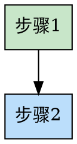

# 贡献指南

感谢你对方法论工具箱的兴趣！本文档将指导你如何贡献。

---

## 🎯 贡献方式

### 1. 贡献新的方法论

#### 步骤 1：检查是否已存在

在 [Issues](https://github.com/konglong87/methodology-skills/issues) 中查看是否有人已提议该方法论。

如果没有，创建一个 Issue 讨论：
- 方法论名称
- 核心概念简介
- 适用场景
- 为什么值得加入

#### 步骤 2：使用模板创建 Skill

复制 `docs/templates/skill-template.md` 到 `skills/你的方法论名称/SKILL.md`

#### 步骤 3：必填内容

每个 SKILL.md 必须包含：

- **YAML frontmatter**:
  ```yaml
  ---
  name: your-methodology-name
  description: "Use when [触发条件]. Triggered by [关键词]."
  ---
  ```

- **Overview**: 核心概念说明（1-2 段）

- **When to Use**: 适用场景清单（列表形式）

- **The Process**: 流程图（graphviz dot）+ 步骤详解

#### 步骤 4：可选定制化内容

根据方法论特点，可增加：

- **思维框架**：表格形式（参考 first-principles）
- **检查清单**：列表形式（参考 goal-oriented, pdca-cycle）
- **工具表格**：帮助用户系统化思考
- **实战案例**：1-2 个真实场景示例

#### 步骤 5：质量要求

- [ ] 内容准确，符合方法论原理
- [ ] 流程图清晰，使用 graphviz dot 语法
- [ ] 至少 1 个实战案例
- [ ] 语言简洁，避免过度理论化
- [ ] Markdown 格式规范

#### 步骤 6：提交 PR

- 标题格式：`Add [方法论名称] skill`
- 描述包含：
  - 方法论简介
  - 适用场景
  - 为什么值得加入
  - 已测试的场景（如有）

---

### 2. 改进现有方法论

#### 小改进（错别字、格式）

直接提交 PR，无需提前讨论。

#### 内容改进

- 在 Issues 中讨论改进方向
- 达成共识后提交 PR

#### 新增功能

- 创建 Issue 提案
- 说明价值和使用场景
- 讨论通过后实施

---

## 📝 代码规范

### Markdown 格式

- 使用标准 Markdown 语法
- 标题层级清晰（# ## ### ####）
- 列表使用 `-` 或数字
- 代码块指定语言（\`\`\`python）

### 流程图规范

- 使用 graphviz dot 语法
- 节点名称简洁
- 使用颜色区分阶段
- 从上到下（rankdir=TB）或从左到右（rankdir=LR）

**示例**：


### 语言风格

- 简洁明了，避免冗长
- 使用主动语态
- 提供具体示例
- 避免过度理论化

---

## ✅ PR Checklist

提交 PR 前确保：

- [ ] 内容准确无误
- [ ] Markdown 格式正确
- [ ] 流程图可正常渲染
- [ ] 无敏感信息
- [ ] 已测试（如在 Claude Code 中验证触发）

---

## 🤝 行为准则

- 尊重所有贡献者
- 建设性讨论
- 欢迎不同观点
- 专注于内容本身

---

## 📬 联系方式

如有疑问，通过以下方式联系：
- Issues: [GitHub Issues](https://github.com/konglong87/methodology-skills/issues)
- Discussions: [GitHub Discussions](https://github.com/konglong87/methodology-skills/discussions)

---

感谢你的贡献！🙏