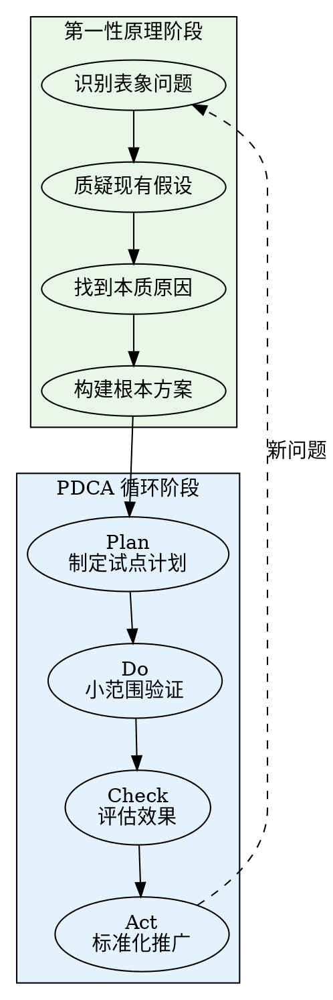
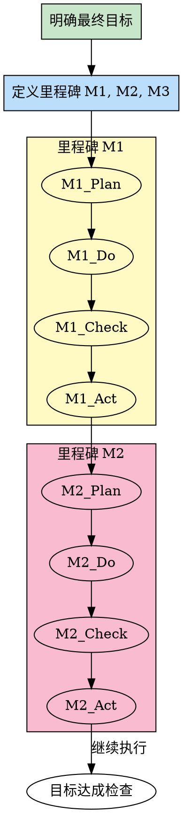
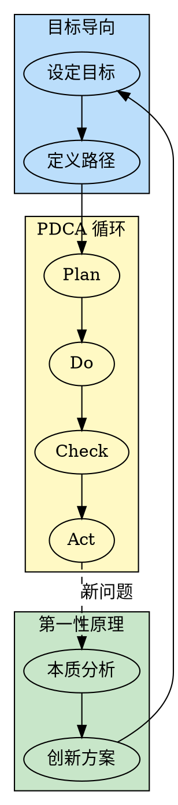

# 方法论组合使用指南

## 概述

单个方法论各有侧重，但在实际工作中，复杂问题往往需要综合运用多种方法论。本文档介绍如何组合使用第一性原理、目标导向、PDCA 循环三种方法论，发挥它们的协同效应。

---

## 为什么要组合使用

### 单个方法论的局限

| 方法论 | 擅长领域 | 潜在局限 |
|--------|----------|----------|
| 第一性原理 | 创新突破、根本性优化 | 可能陷入过度拆解，缺乏执行路径 |
| 目标导向 | 保持方向、避免偏离 | 可能忽视执行过程中的迭代优化 |
| PDCA 循环 | 持续改进、质量保障 | 可能陷入局部优化，缺乏根本突破 |

### 组合使用的价值

- **互补优势**：一个方法论的局限，由另一个方法论弥补
- **系统思维**：从不同维度审视问题，避免片面
- **提升效率**：方法论组合使用，减少试错成本
- **增强适应性**：应对不同复杂度和类型的问题

---

## 常见组合模式

### 组合 1：第一性原理 + PDCA

**适用场景**：需要从根本上优化现有流程

**组合逻辑**：
1. **第一性原理阶段**：找到问题的根本原因和本质解决方案
2. **PDCA 阶段**：通过迭代验证和优化方案

**实施流程**：



**实战案例**：CI/CD 构建速度优化

```
背景：构建时间 20 分钟，团队抱怨影响开发效率

[第一性原理阶段]
表象：构建太慢
假设：需要更好的硬件、代码量大
本质：磁盘 I/O 占用 70% 时间（依赖下载、文件读写）
重建：引入缓存层 + 并行化处理

[PDCA 阶段]
Plan:
- 目标：构建时间 < 10 分钟
- 方案：引入依赖缓存、并行测试
- 试点：在 feature 分支实施

Do:
- 实施 2 周
- 收集构建数据

Check:
- 构建时间降至 8 分钟
- 缓存命中率 85%
- 但部分测试仍串行

Act:
- 标准化缓存配置
- 下一轮优化：测试并行化

结果：构建时间从 20 分钟降至 8 分钟
```

---

### 组合 2：目标导向 + PDCA

**适用场景**：长期项目执行，需要持续交付和改进

**组合逻辑**：
1. **目标导向**：设定清晰的最终目标和关键里程碑
2. **PDCA 循环**：在每个里程碑内迭代优化

**实施流程**：



**实战案例**：产品 MVP 开发（3 个月）

```
[目标导向阶段]
目标：3 个月内上线 MVP，验证市场

成功标准：
- 核心功能完整
- 用户测试满意度 > 4.0/5.0
- DAU > 1000

里程碑：
- M1（Week 1-4）：需求确认和原型设计
- M2（Week 5-8）：核心功能开发
- M3（Week 9-12）：测试、优化、上线

[里程碑 M1 - PDCA]
Plan:
- 完成用户调研
- 确定核心功能清单
- 设计原型

Do:
- 访谈 20 位目标用户
- 绘制功能优先级矩阵
- 制作交互原型

Check:
- 功能清单调整 3 次
- 原型反馈良好
- 但调研时间超期 3 天

Act:
- 标准化调研流程
- 下个里程碑预留缓冲时间

[里程碑 M2 - PDCA]
Plan:
- 开发 Top 5 核心功能
- 目标：功能完整度 100%

Do:
- 敏捷开发 4 周
- 每周演示进展

Check:
- 功能完成 100%
- 但性能未达标
- Week 6 发现团队在优化非核心功能

Act:
- 立即调整：移除非核心优化
- 聚焦性能优化
- 记录教训：定期检查是否偏离目标

结果：按时上线，满意度 4.2，DAU 1200
```

---

### 组合 3：第一性原理 + 目标导向

**适用场景**：创新项目设计，需要从零构建

**组合逻辑**：
1. **第一性原理**：重新定义问题本质和创新方案
2. **目标导向**：设定清晰目标，确保执行不偏离

**实施流程**：

```
[第一性原理阶段]
1. 拆解问题到本质
2. 质疑所有假设
3. 构建创新方案

[目标导向阶段]
1. 设定 SMART 目标
2. 定义成功标准
3. 识别关键路径
4. 持续监控偏差
```

**实战案例**：设计新型缓存系统

```
[第一性原理阶段]
问题：现有缓存系统性能不足

拆解：
- 表象：缓存命中率低、延迟高
- 假设：必须用 Redis、需要更多内存、需要分布式
- 本质：访问模式不匹配、数据结构不合理
- 重建：
  - 不用通用缓存，设计专用结构
  - 基于访问模式优化数据布局
  - 利用局部性原理预取

[目标导向阶段]
目标：设计并实现高性能专用缓存系统

成功标准：
- 缓存命中率 > 95%
- 平均延迟 < 1ms
- 内存占用 < 现有方案的 60%

关键里程碑：
- M1：完成架构设计（2 周）
- M2：实现核心算法（4 周）
- M3：性能测试和优化（2 周）

执行过程：
- Week 3：发现团队在优化非核心功能（可视化）
- 立即调整：回归核心目标，延后可视化

结果：
- 缓存命中率 97%
- 平均延迟 0.8ms
- 内存占用减少 55%
```

---

### 组合 4：三法合一

**适用场景**：复杂系统从零构建，需要创新、方向、迭代三重保障

**组合逻辑**：
1. **第一性原理**：重新定义问题和解决方案
2. **目标导向**：设定清晰目标和路径
3. **PDCA 循环**：在每个阶段迭代优化

**实施流程**：



**实战案例**：从零构建微服务架构

```
[第一性原理阶段]
问题：传统单体架构无法满足业务增长

本质分析：
- 表象：性能瓶颈、部署慢、耦合严重
- 假设：必须用 Spring Cloud、必须全量微服务化
- 本质：
  - 业务需要独立扩展
  - 团队需要独立开发部署
  - 不需要复杂的微服务框架
- 重建：
  - 采用简单微服务架构
  - 仅核心服务独立部署
  - 使用轻量级通信方案

[目标导向阶段]
目标：6 个月内完成微服务架构迁移

成功标准：
- 核心服务独立部署
- 部署时间 < 10 分钟
- 团队开发效率提升 30%

关键里程碑：
- M1：架构设计和验证（Week 1-4）
- M2：核心服务拆分（Week 5-16）
- M3：迁移完成和优化（Week 17-24）

[M1 阶段 - PDCA]
Plan:
- 设计微服务架构方案
- 选择技术栈
- 在非核心服务试点

Do:
- 设计服务边界
- 选择 gRPC + Consul
- 试点 1 个服务

Check:
- 试点服务性能良好
- 部署时间从 30 分钟降至 8 分钟
- 但服务发现问题需优化

Act:
- 标准化服务发现配置
- 优化服务间通信
- 准备全量拆分

[M2 阶段 - PDCA]
...（每个服务拆分都经过 PDCA）

结果：
- 部署时间降至 7 分钟
- 开发效率提升 35%
- 系统稳定性提升
```

---

## 如何选择组合

### 决策树

```
问题类型是什么？
├─ 需要根本优化现有系统？
│  ├─ 是 → 第一性原理 + PDCA
│  └─ 否 ↓
│
├─ 长期项目需要持续交付？
│  ├─ 是 → 目标导向 + PDCA
│  └─ 否 ↓
│
├─ 创新项目从零设计？
│  ├─ 是 → 第一性原理 + 目标导向
│  └─ 否 ↓
│
└─ 复杂系统从零构建？
   └─ 是 → 三法合一
```

### 快速选择表

| 场景 | 推荐组合 | 原因 |
|------|----------|------|
| 性能优化 | 第一性原理 + PDCA | 找到根本瓶颈，迭代验证 |
| 流程改进 | 第一性原理 + PDCA | 重新设计流程，小范围试点 |
| 产品开发 | 目标导向 + PDCA | 明确目标，分阶段迭代 |
| 技术重构 | 目标导向 + PDCA | 控制范围，逐步迁移 |
| 新系统设计 | 第一性原理 + 目标导向 | 创新设计，保持方向 |
| 新产品研发 | 第一性原理 + 目标导向 | 从本质出发，目标驱动 |
| 系统重构 | 三法合一 | 全面考虑，稳步推进 |
| 平台建设 | 三法合一 | 创新设计，长期执行，持续优化 |

---

## 最佳实践

### 1. 明确主导方法论

在组合使用时，明确哪个方法论为主导：

- **第一性原理主导**：适合需要根本突破的场景
- **目标导向主导**：适合需要严格控范围的场景
- **PDCA 主导**：适合需要快速试错的场景

### 2. 划分阶段边界

清晰划分各方法论的应用阶段，避免混乱：

```
[阶段 1：第一性原理]
- 聚焦本质分析
- 不受现有方案限制

[阶段 2：目标导向]
- 聚焦执行路径
- 避免过度发散

[阶段 3：PDCA]
- 聚焦迭代优化
- 小步快跑
```

### 3. 设置切换点

定义明确的方法论切换条件：

- 从第一性原理 → 目标导向：方案确定后
- 从目标导向 → PDCA：里程碑确定后
- 从 PDCA → 第一性原理：发现根本性问题后

### 4. 记录决策过程

记录为什么选择这个组合，如何应用：

```
决策记录：
- 问题类型：性能优化
- 选择组合：第一性原理 + PDCA
- 原因：需要找到根本瓶颈并验证方案
- 阶段划分：
  - Week 1：第一性原理分析
  - Week 2-4：PDCA 验证
```

---

## 常见误区

### 误区 1：同时使用多个方法论

**错误做法**：在同一个阶段同时应用多个方法论

**正确做法**：分阶段应用，每个阶段聚焦一个方法论

### 误区 2：频繁切换方法论

**错误做法**：几天就切换一次方法论

**正确做法**：每个方法论至少应用一个完整阶段（通常 1-2 周）

### 误区 3：忽视方法论的主次

**错误做法**：平均用力，没有主导方法论

**正确做法**：明确主导方法论，其他方法论辅助

---

## 总结

方法论组合使用的核心原则：

1. **问题驱动**：根据问题类型选择组合
2. **分阶段应用**：每个阶段聚焦一个方法论
3. **明确边界**：清晰定义各方法论的应用范围
4. **持续调整**：根据实际情况调整组合方式

通过合理组合方法论，可以发挥协同效应，更高效地解决复杂问题。

---

## 进一步阅读

- [第一性原理 SKILL.md](../skills/first-principles/SKILL.md)
- [目标导向 SKILL.md](../skills/goal-oriented/SKILL.md)
- [PDCA 循环 SKILL.md](../skills/pdca-cycle/SKILL.md)
- [贡献新的方法论组合](../CONTRIBUTING.md)