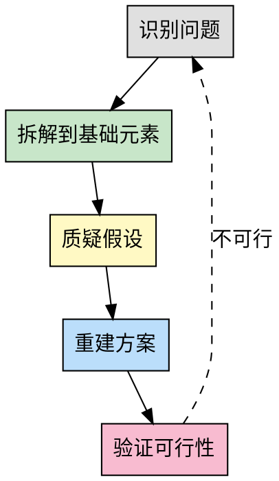
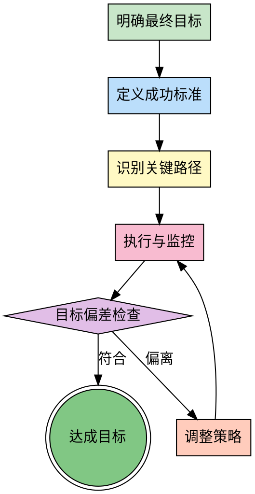
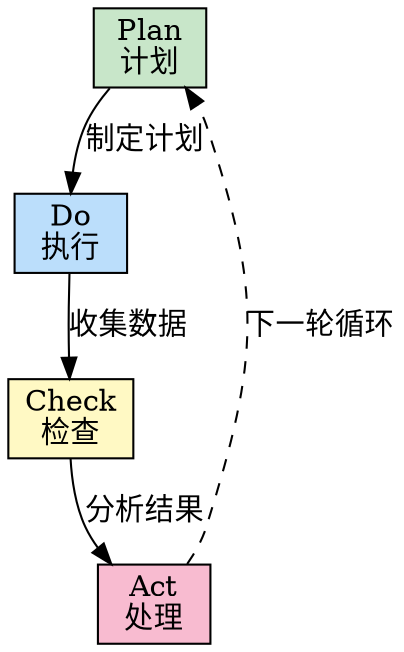
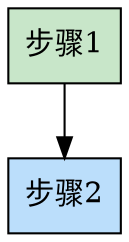
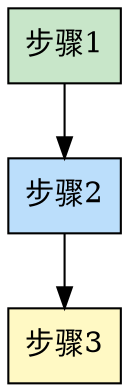

# Methodology Skills Implementation Plan

> **For Claude:** REQUIRED SUB-SKILL: Use superpowers:executing-plans to implement this plan task-by-task.

**Goal:** Create a complete methodology-skills repository with three core methodology skills (first-principles, goal-oriented, pdca-cycle) that can be installed via Claude Code marketplace.

**Architecture:** Single repository with independent skill directories, each containing a SKILL.md file. Uses Claude Code plugin marketplace structure with .claude-plugin/marketplace.json for distribution. Skills use semi-automatic triggering based on context detection.

**Tech Stack:** Markdown, Graphviz (dot diagrams), YAML frontmatter, Claude Code plugin system

---

## Task 1: Create Project Directory Structure

**Files:**
- Create: `.claude-plugin/`
- Create: `skills/first-principles/`
- Create: `skills/goal-oriented/`
- Create: `skills/pdca-cycle/`
- Create: `docs/templates/`

**Step 1: Create directory structure**

Run: `mkdir -p .claude-plugin skills/{first-principles,goal-oriented,pdca-cycle} docs/templates`

Expected: All directories created successfully

**Step 2: Verify structure**

Run: `tree -L 2 -d .`

Expected:
```
.
├── .claude-plugin
├── docs
│   └── templates
└── skills
    ├── first-principles
    ├── goal-oriented
    └── pdca-cycle
```

**Step 3: Commit**

Run:
```bash
git add -A
git commit -m "chore: create project directory structure"
```

---

## Task 2: Create marketplace.json

**Files:**
- Create: `.claude-plugin/marketplace.json`

**Step 1: Write marketplace.json**

Write exact content to `.claude-plugin/marketplace.json`:

```json
{
  "name": "methodology-skills",
  "description": "方法论工具箱：第一性原理、目标导向、PDCA循环等思维方法论 Skills，帮助 AI 更聪明地思考和执行任务",
  "owner": {
    "name": "恐龙创新部",
    "url": "https://github.com/konglong87"
  },
  "plugins": [
    {
      "name": "methodology-skills",
      "description": "方法论工具箱 - 第一性原理、目标导向、PDCA循环等思维方法论",
      "version": "1.0.0",
      "source": "./",
      "author": {
        "name": "恐龙创新部",
        "url": "https://github.com/konglong87"
      }
    }
  ]
}
```

**Step 2: Validate JSON**

Run: `cat .claude-plugin/marketplace.json | python3 -m json.tool`

Expected: Valid JSON output with proper formatting

**Step 3: Commit**

Run:
```bash
git add .claude-plugin/marketplace.json
git commit -m "feat: add marketplace.json configuration"
```

---

## Task 3: Create plugin.json

**Files:**
- Create: `plugin.json`

**Step 1: Write plugin.json**

Write exact content to `plugin.json`:

```json
{
  "name": "methodology-skills",
  "version": "1.0.0",
  "description": "方法论工具箱：第一性原理、目标导向、PDCA循环等思维方法论 Skills",
  "author": {
    "name": "恐龙创新部",
    "url": "https://github.com/konglong87"
  },
  "homepage": "https://github.com/konglong87/methodology-skills",
  "repository": "https://github.com/konglong87/methodology-skills",
  "license": "MIT",
  "keywords": [
    "methodology",
    "first-principles",
    "goal-oriented",
    "pdca",
    "thinking-framework",
    "problem-solving",
    "productivity",
    "claude-code",
    "skill"
  ]
}
```

**Step 2: Validate JSON**

Run: `cat plugin.json | python3 -m json.tool`

Expected: Valid JSON output with proper formatting

**Step 3: Commit**

Run:
```bash
git add plugin.json
git commit -m "feat: add plugin.json metadata"
```

---

## Task 4: Create LICENSE file

**Files:**
- Create: `LICENSE`

**Step 1: Write MIT License**

Write exact content to `LICENSE`:

```
MIT License

Copyright (c) 2026 恐龙创新部

Permission is hereby granted, free of charge, to any person obtaining a copy
of this software and associated documentation files (the "Software"), to deal
in the Software without restriction, including without limitation the rights
to use, copy, modify, merge, publish, distribute, sublicense, and/or sell
copies of the Software, and to permit persons to whom the Software is
furnished to do so, subject to the following conditions:

The above copyright notice and this permission notice shall be included in all
copies or substantial portions of the Software.

THE SOFTWARE IS PROVIDED "AS IS", WITHOUT WARRANTY OF ANY KIND, EXPRESS OR
IMPLIED, INCLUDING BUT NOT LIMITED TO THE WARRANTIES OF MERCHANTABILITY,
FITNESS FOR A PARTICULAR PURPOSE AND NONINFRINGEMENT. IN NO EVENT SHALL THE
AUTHORS OR COPYRIGHT HOLDERS BE LIABLE FOR ANY CLAIM, DAMAGES OR OTHER
LIABILITY, WHETHER IN AN ACTION OF CONTRACT, TORT OR OTHERWISE, ARISING FROM,
OUT OF OR IN CONNECTION WITH THE SOFTWARE OR THE USE OR OTHER DEALINGS IN THE
SOFTWARE.
```

**Step 2: Commit**

Run:
```bash
git add LICENSE
git commit -m "chore: add MIT license"
```

---

## Task 5: Create first-principles SKILL.md (Part 1 - Header and Overview)

**Files:**
- Create: `skills/first-principles/SKILL.md`

**Step 1: Write frontmatter and overview**

Write to `skills/first-principles/SKILL.md`:

```markdown
---
name: first-principles
description: "Use when facing complex problems requiring innovative solutions, when conventional approaches fail, when breaking down assumptions, or when user asks to 'think from first principles', 'get to the root', 'fundamentally rethink', 'what's the essence', 'strip away assumptions'."
---

# 第一性原理思维

## Overview

第一性原理是一种从最基础、最根本的真理或事实出发，重新构建问题解决方案的思维方式。它要求抛开现有假设、惯例或类比，直接追问"这件事的本质是什么？""最基本的构成要素是什么？"，然后基于这些基础元素推导出新的可能性。

**核心区别**：
- **类比思维**：基于现有方案改进（"别人怎么做，我也能怎么做"）
- **第一性原理**：从本质重新构建（"根本不需要这样做"）

**典型例子**：埃隆·马斯克思考火箭制造成本时，不是接受市场价，而是从原材料成本出发，得出自己制造更便宜的结论。

## When to Use

**适用场景**：
- 复杂问题需要创新方案
- 常规方法失效，需要突破
- 需要打破既有假设和惯例
- 成本/效率需要根本性突破
- 技术选型、架构设计等关键决策
- 用户明确要求"从本质思考"

**不适用场景**：
- 简单的、已解决的问题
- 标准化的、成熟的做法
- 时间紧急，需要快速复用现有方案
```

**Step 2: Commit**

Run:
```bash
git add skills/first-principles/SKILL.md
git commit -m "feat(first-principles): add header and overview sections"
```

---

## Task 6: Complete first-principles SKILL.md (Part 2 - Process and Framework)

**Files:**
- Modify: `skills/first-principles/SKILL.md` (append content)

**Step 1: Append The Process section**

Append to `skills/first-principles/SKILL.md`:

```markdown

## The Process



### 步骤详解

**步骤 1: 识别问题**
- 清晰陈述当前面临的问题
- 区分"症状"和"根本问题"
- 明确问题的边界和约束

**步骤 2: 拆解到基础元素**
- 将问题分解为最基础的组成部分
- 问"不能再拆分的是什么？"
- 识别物理定律、逻辑真理等不可动摇的基础

**步骤 3: 质疑假设**
- 列出所有"理所当然"的假设
- 问"这真的是必须的吗？"
- 问"如果这个假设不存在会怎样？"
- 区分"必须如此"和"习惯如此"

**步骤 4: 重建方案**
- 基于基础元素重新构建解决方案
- 不受现有方案的限制
- 探索多种可能性

**步骤 5: 验证可行性**
- 检查是否符合基础定律
- 评估实施成本和风险
- 如果不可行，回到步骤 1 重新审视问题

## Thinking Framework

使用以下表格系统化地进行第一性原理思考：

| 层级 | 问题 | 提示 | 示例（火箭成本） |
|------|------|------|------------------|
| **表象** | 现在的问题是什么？ | 描述症状和现象 | 火箭太贵，$65M/个 |
| **假设** | 我们认为的"必须如此"是什么？ | 列出所有假设 | 必须买现成的、供应商定价合理 |
| **本质** | 最基础的构成要素是什么？ | 物理定律、原材料、基本原理 | 铝、钛、碳纤维，材料成本$800K |
| **重建** | 如何从本质重新构建？ | 忽略现有方案，从头设计 | 自己制造，成本降至$8M |

**思考提示**：
1. **表象层**：不要把症状当成问题本身
2. **假设层**：每个"必须"都要被质疑
3. **本质层**：找到不可动摇的基础（物理、逻辑、数学）
4. **重建层**：大胆假设，小心验证
```

**Step 2: Commit**

Run:
```bash
git add skills/first-principles/SKILL.md
git commit -m "feat(first-principles): add process and thinking framework"
```

---

## Task 7: Complete first-principles SKILL.md (Part 3 - Examples and Pitfalls)

**Files:**
- Modify: `skills/first-principles/SKILL.md` (append content)

**Step 1: Append Examples and Common Pitfalls**

Append to `skills/first-principles/SKILL.md`:

```markdown

## Examples

### 案例 1: 数据库查询性能优化

**问题**: 查询太慢，平均耗时 10 秒

**表象**: 查询慢，需要优化 SQL

**假设**:
- 索引已经够好了
- 数据量大是瓶颈
- 需要更快的硬件

**本质**:
- 磁盘 I/O 是真正的瓶颈（占比 70%）
- 大量不必要的全表扫描
- 查询逻辑冗余

**重建**:
- 从 I/O 优化入手，而非 SQL 调优
- 引入缓存层减少磁盘访问
- 重写查询逻辑，只查必要字段
- 结果: 查询时间降至 0.8 秒

### 案例 2: 软件架构技术选型

**问题**: 需要选择微服务框架

**表象**: Spring Cloud、Dubbo、gRPC 哪个更好？

**假设**:
- 必须用成熟的框架
- 功能越多越好
- 社区活跃度最重要

**本质**:
- 业务需求是"服务间通信"
- 当前团队规模 < 10 人
- 流量 < 1K QPS

**重建**:
- 不需要复杂的微服务框架
- 使用简单的 HTTP REST + 服务发现即可
- 后续可平滑迁移
- 结果: 降低复杂度，加快开发速度

## Common Pitfalls

### 误区 1: 过度拆解，忽视实用性
- **表现**: 为了拆解而拆解，陷入无休止的哲学讨论
- **正确做法**: 拆解到"可操作"的层级即可，平衡深度与效率

### 误区 2: 忽视现有知识积累
- **表现**: 从零开始造轮子，重复发明
- **正确做法**: 第一性原理是质疑假设，不是否定一切。已验证的知识要继承

### 误区 3: 混淆"本质"与"表象"
- **表现**: 把表面现象当成根本原因
- **正确做法**: 连续追问"为什么"至少 5 次（5 Whys 方法）

### 误区 4: 缺乏验证环节
- **表现**: 提出理论方案后直接实施
- **正确做法**: 必须进行可行性验证，小范围试点

## References

- 《第一性原理》- 亚里士多德哲学基础
- Elon Musk on First Principles Thinking - TED Talk
- Zero to One - Peter Thiel
- [第一性原理思维导图](https://example.com/first-principles-mindmap)
```

**Step 2: Verify file completeness**

Run: `wc -l skills/first-principles/SKILL.md`

Expected: ~150-200 lines

**Step 3: Commit**

Run:
```bash
git add skills/first-principles/SKILL.md
git commit -m "feat(first-principles): complete skill with examples and pitfalls"
```

---

## Task 8: Create goal-oriented SKILL.md (Complete File)

**Files:**
- Create: `skills/goal-oriented/SKILL.md`

**Step 1: Write complete goal-oriented SKILL.md**

Write complete content to `skills/goal-oriented/SKILL.md` (approximately 180 lines, following the same pattern as first-principles but with customized sections):

```markdown
---
name: goal-oriented
description: "Use when executing long-term tasks, project planning, when tasks are prone to scope creep, when losing sight of objectives, or when user asks to 'stay focused on the goal', 'keep the end in mind', 'goal-oriented approach', 'don't lose track'."
---

# 目标导向思维

## Overview

目标导向思维强调以最终目标为指引，所有行动、决策都服务于达成这个目标。它关注的是"我要达到什么结果？"，并确保过程中不偏离方向。

**核心原则**：以终为始（Begin with the End in Mind）

**关键价值**：
- 避免任务偏离目标（Scope Creep）
- 确保资源投入在关键路径上
- 快速识别无关工作
- 保持团队方向一致

## When to Use

**适用场景**：
- 执行长期任务（周期 > 1周）
- 项目规划和管理
- 容易偏离目标的复杂任务
- 多任务并行，需要优先级判断
- 资源受限，需要聚焦
- 用户明确要求"目标导向地执行"

**不适用场景**：
- 简单的、明确的小任务
- 探索性工作，目标本身不明确

## The Process



### 步骤详解

**步骤 1: 明确最终目标**
- 用一句话陈述最终目标
- 确保目标符合 SMART 原则
- 区分"目标"和"手段"

**步骤 2: 定义成功标准**
- 如何判断目标达成？
- 设置可衡量的指标
- 明确验收条件

**步骤 3: 识别关键路径**
- 找出达成目标的必经之路
- 识别阻塞任务和依赖关系
- 确定优先级

**步骤 4: 执行与监控**
- 按照关键路径执行
- 持续监控进度
- 记录偏差和问题

**步骤 5: 目标偏差检查**
- 定期（每日/每周）检查是否偏离
- 问"现在的行动是否服务于最终目标？"
- 评估优先级变化

**步骤 6: 调整策略**
- 发现偏离立即调整
- 不要因为投入成本而继续错误方向（沉没成本谬误）
- 重新规划关键路径

## Goal Decomposition Tool

使用以下清单确保目标清晰且可执行：

- [ ] **目标陈述**: 用一句话清晰描述最终目标
- [ ] **成功标准（SMART）**:
  - Specific（具体的）: 明确要达成什么
  - Measurable（可衡量）: 有量化指标
  - Achievable（可实现）: 资源和能力可行
  - Relevant（相关性）: 与大局目标一致
  - Time-bound（时限）: 有明确的截止时间
- [ ] **关键里程碑**: 分解为 3-5 个关键节点
- [ ] **潜在干扰因素**: 识别可能偏离目标的风险
- [ ] **偏离预警信号**: 设置触发调整的阈值

**目标分解示例**：

```
目标: 重构用户认证模块，提升安全性

成功标准:
- [x] Specific: 重构认证模块，消除安全隐患
- [x] Measurable: 测试覆盖率 > 90%，无高危漏洞
- [x] Achievable: 2人周，技术栈不变
- [x] Relevant: 降低安全事故风险
- [x] Time-bound: 2周内完成

关键里程碑:
- M1: 完成现有代码审计（Day 3）
- M2: 实现核心重构（Day 7）
- M3: 测试通过并上线（Day 10）

潜在干扰因素:
- 新需求插入
- 依赖服务变更
- 团队成员抽调

偏离预警信号:
- 里程碑延期 > 20%
- 新增非核心功能
- 讨论偏离认证安全主题
```

## Examples

### 案例 1: 产品开发项目的目标管理

**目标**: 在 3 个月内上线一个 MVP

**成功标准**:
- 核心功能完整
- 用户测试满意度 > 4.0/5.0
- 无 P0 级 Bug
- DAU > 1000

**关键路径**:
1. 需求确认（Week 1）
2. 核心功能开发（Week 2-8）
3. 测试与优化（Week 9-10）
4. 上线与推广（Week 11-12）

**执行与监控**:
- 每周五检查进度
- 发现 Week 6 偏离：团队在优化非核心功能
- **立即调整**: 移除非核心功能，聚焦 MVP

**结果**: 按时上线，达成目标

### 案例 2: 技术债务清理的目标导向执行

**目标**: 降低代码复杂度 30%

**成功标准**:
- 圈复杂度 < 15（原 22）
- 测试覆盖率 > 70%（原 45%）
- 文档完整

**执行过程**:
- 每天检查: "这次重构是否降低复杂度？"
- 发现偏离: 团队在优化性能（非目标）
- **调整**: 提醒聚焦复杂度，性能优化后续专项处理

**结果**: 复杂度降至 13，覆盖率 75%

## Common Pitfalls

### 误区 1: 目标模糊，无法衡量
- **表现**: "把代码写好一点"、"提升用户体验"
- **正确做法**: 使用 SMART 原则，明确量化指标

### 误区 2: 过度关注手段，忘记目的
- **表现**: 纠结技术选型 2 周，忘记目标只是"快速上线"
- **正确做法**: 定期问"这个手段是否必要？"

### 误区 3: 忽视环境变化，僵化执行
- **表现**: 目标已不现实，但仍然按原计划执行
- **正确做法**: 定期重新评估目标的合理性

### 误区 4: 沉没成本谬误
- **表现**: "已经做了 3 周，不能放弃"
- **正确做法**: 如果方向错误，立即调整，不考虑沉没成本

## References

- 《高效能人士的七个习惯》- 以终为始
- SMART Goals - Peter Drucker
- OKR 工作法 - John Doerr
- [目标管理最佳实践](https://example.com/goal-management)
```

**Step 2: Commit**

Run:
```bash
git add skills/goal-oriented/SKILL.md
git commit -m "feat(goal-oriented): add complete skill documentation"
```

---

## Task 9: Create pdca-cycle SKILL.md (Complete File)

**Files:**
- Create: `skills/pdca-cycle/SKILL.md`

**Step 1: Write complete pdca-cycle SKILL.md**

Write complete content to `skills/pdca-cycle/SKILL.md`:

```markdown
---
name: pdca-cycle
description: "Use when executing iterative tasks, continuous improvement, quality assurance, process optimization, or when user asks to 'apply PDCA', 'iterate and improve', 'continuous improvement cycle', 'plan-do-check-act'."
---

# PDCA 循环

## Overview

PDCA 循环（Plan-Do-Check-Act）是一种持续改进的方法论，通过计划、执行、检查、处理四个阶段的循环，不断优化流程和结果。

**核心价值**：
- 数据驱动决策
- 小步快跑，快速迭代
- 持续改进，螺旋上升
- 降低试错成本

**起源**: 戴明环（Deming Cycle），由 W. Edwards Deming 推广

## When to Use

**适用场景**：
- 迭代任务，需要持续改进
- 质量保障和流程优化
- 新方案试点验证
- 数据驱动的决策
- 性能优化、成本降低
- 用户满意度提升

**不适用场景**：
- 一次性、无需改进的任务
- 紧急情况，需要立即行动

## The Process



### 四阶段详解

**Plan（计划）**
- 明确目标和指标
- 分析现状与差距
- 制定具体行动计划
- 预估风险和应对方案

**Do（执行）**
- 小范围试点
- 严格按照计划执行
- 收集执行过程中的数据
- 记录问题和观察

**Check（检查）**
- 对比预期与实际结果
- 分析偏差原因
- 提取经验教训
- 数据可视化呈现

**Act（处理）**
- 标准化成功做法
- 改进不足之处
- 规划下一个循环
- 扩大应用范围

## Cycle Checklist

使用以下检查清单确保每个阶段完整执行：

### Plan 阶段
- [ ] 明确目标和衡量指标
- [ ] 收集现状数据
- [ ] 分析根本原因（可用鱼骨图、5 Whys）
- [ ] 制定具体行动计划
- [ ] 确定责任人和时间节点
- [ ] 预估风险和应对措施

### Do 阶段
- [ ] 选择小范围试点区域
- [ ] 准备所需资源
- [ ] 严格按照计划执行
- [ ] 收集过程数据（时间、成本、质量）
- [ ] 记录遇到的问题和异常
- [ ] 保持试点环境可控

### Check 阶段
- [ ] 对比实际结果与预期目标
- [ ] 分析差异原因
- [ ] 验证方案有效性
- [ ] 提取成功经验和失败教训
- [ ] 数据可视化（图表、报告）
- [ ] 团队讨论并达成共识

### Act 阶段
- [ ] 将成功做法标准化
- [ ] 文档化最佳实践
- [ ] 改进不足之处
- [ ] 规划下一个循环的目标
- [ ] 扩大应用范围（如适用）
- [ ] 分享经验给相关团队

## Examples

### 案例 1: 代码质量改进的 PDCA 应用

**Plan**:
- 目标：Bug 密度降低 50%（从 15 个/千行 → 7.5 个/千行）
- 现状分析：主要问题是边界检查不足和异常处理缺失
- 行动计划：
  1. 引入静态代码分析工具
  2. 强制 Code Review
  3. 编写单元测试模板

**Do**:
- 在项目 A 试点（1 个月）
- 引入 SonarQube
- 每周 Code Review 会议
- 收集数据：Bug 数量、发现阶段

**Check**:
- Bug 密度降至 8 个/千行（接近目标）
- 静态分析发现 120 个问题，修复后无新增 Bug
- Code Review 发现 35 个潜在问题
- 但开发时间增加 15%

**Act**:
- 标准化：SonarQube 集成到 CI/CD
- 改进：优化 Code Review 流程，减少时间
- 下一轮目标：保持 Bug 密度，缩短开发时间

### 案例 2: 用户满意度提升的迭代优化

**Plan**:
- 目标：用户满意度从 3.2 提升至 4.0
- 现状：响应慢、功能不完善
- 计划：
  1. 缩短响应时间（< 2 小时）
  2. 增加高频需求功能

**Do**:
- 试点 2 周
- 增加客服人员
- 开发 Top 3 需求功能
- 收集反馈数据

**Check**:
- 满意度提升至 3.8（未达 4.0）
- 响应时间达标
- 新功能使用率高
- 但部分功能易用性不足

**Act**:
- 标准化：响应时间要求写入 SLA
- 改进：优化新功能的 UI/UX
- 下一轮目标：满意度 > 4.0

## Common Pitfalls

### 误区 1: 跳过 Check 阶段，直接进入下一轮
- **表现**: 执行完就进入下一轮，不检查效果
- **正确做法**: 必须用数据验证效果，避免凭感觉判断

### 误区 2: 只有 Plan 和 Do，没有持续改进
- **表现**: 计划并执行后就结束，不进行 Check 和 Act
- **正确做法**: PDCA 是循环，不是线性流程

### 误区 3: 忽视数据收集，凭感觉判断
- **表现**: Check 阶段没有量化数据，主观判断"效果不错"
- **正确做法**: Plan 阶段就明确数据收集方案

### 误区 4: 试点范围过大，风险失控
- **表现**: 第一次就全量推行
- **正确做法**: Do 阶段小范围试点，验证成功后再扩大

### 误区 5: Act 阶段不标准化，经验流失
- **表现**: 改进后就结束，没有文档化
- **正确做法**: 将成功做法写入标准流程

## References

- 《戴明管理思想精要》- W. Edwards Deming
- Lean Six Sigma - 持续改进方法论
- Toyota Production System - 精益生产
- [PDCA 循环实战指南](https://example.com/pdca-guide)
```

**Step 2: Commit**

Run:
```bash
git add skills/pdca-cycle/SKILL.md
git commit -m "feat(pdca-cycle): add complete skill documentation"
```

---

## Task 10: Create README.md

**Files:**
- Create: `README.md`

**Step 1: Write README.md**

Write complete README following the design (approximately 200 lines):

```markdown
# Methodology Skills

<p align="center">
  
  
  
  
  
</p>

> 让 AI 掌握方法论，更聪明地思考和执行任务

一个包含第一性原理、目标导向、PDCA 循环等方法论的 Skills 工具箱。支持 Claude Code、OpenCode、Cursor。

---

## 📑 目录

- [包含的方法论](#包含的方法论)
- [安装](#安装)
- [使用示例](#使用示例)
- [组合使用](#组合使用)
- [贡献指南](#贡献指南)
- [许可证](#许可证)

## 包含的方法论

### 🎯 第一性原理

从最基础的真理出发，重新构建解决方案。适用于创新突破、打破常规。

**适用场景**: 复杂问题需要创新方案、常规方法失效、需要打破既有假设

**触发方式**: 自动识别场景 或 用户说"用第一性原理分析"

### 🎯 目标导向

以最终目标为指引，确保行动不偏离方向。适用于长期任务、项目规划。

**适用场景**: 执行长期任务、项目规划、容易偏离目标的任务

**触发方式**: 自动识别场景 或 用户说"目标导向地执行"

### 🎯 PDCA 循环

Plan-Do-Check-Act 持续改进循环。适用于迭代优化、质量保障。

**适用场景**: 迭代任务、持续改进、质量保障、流程优化

**触发方式**: 自动识别场景 或 用户说"用 PDCA 循环"

---

## 安装

### Claude Code / Cline

```bash
# 添加 marketplace
claude plugin marketplace add konglong87/methodology-skills

# 安装插件
claude plugin install methodology-skills@methodology-skills

# 验证安装
claude plugin list
```

### OpenCode

```bash
# 全局安装 - 第一性原理
mkdir -p ~/.opencode/skills/first-principles
curl -o ~/.opencode/skills/first-principles/SKILL.md \
  https://raw.githubusercontent.com/konglong87/methodology-skills/main/skills/first-principles/SKILL.md

# 全局安装 - 目标导向
mkdir -p ~/.opencode/skills/goal-oriented
curl -o ~/.opencode/skills/goal-oriented/SKILL.md \
  https://raw.githubusercontent.com/konglong87/methodology-skills/main/skills/goal-oriented/SKILL.md

# 全局安装 - PDCA 循环
mkdir -p ~/.opencode/skills/pdca-cycle
curl -o ~/.opencode/skills/pdca-cycle/SKILL.md \
  https://raw.githubusercontent.com/konglong87/methodology-skills/main/skills/pdca-cycle/SKILL.md
```

### Cursor

```bash
# Cursor 使用相同的 SKILL.md 格式
mkdir -p ~/.cursor/rules
curl -o ~/.cursor/rules/first-principles.md \
  https://raw.githubusercontent.com/konglong87/methodology-skills/main/skills/first-principles/SKILL.md

# 重复以上步骤安装其他方法论...
```

---

## 使用示例

### 示例 1：使用第一性原理优化数据库查询

```
用户：这个查询太慢了，用第一性原理分析如何优化

AI：[触发 first-principles skill]
让我从本质出发分析查询慢的根本原因...

[按照 skill 中的思维框架拆解]
1. 表象：查询耗时 10 秒
2. 假设：我们假设索引已经足够、数据量是瓶颈
3. 本质：实际瓶颈是磁盘 I/O，而非 CPU 或内存
4. 重建：从 I/O 优化角度重新设计方案...

结果：查询时间降至 0.8 秒
```

### 示例 2：使用目标导向执行重构任务

```
用户：重构用户认证模块，目标导向地执行

AI：[触发 goal-oriented skill]
让我明确目标和关键路径...

[使用目标拆解工具]
✓ 目标：提升认证模块可维护性和安全性
✓ 成功标准：测试覆盖率 > 90%，无安全漏洞
✓ 关键里程碑：
  - M1: 完成代码审计（Day 3）
  - M2: 核心重构（Day 7）
  - M3: 测试上线（Day 10）
✓ 潜在干扰：新需求插入、依赖变更

执行过程监控中...
发现 Week 2 偏离：团队在优化非核心功能
立即调整：回归核心目标，移除非核心优化
```

### 示例 3：使用 PDCA 改进 CI/CD 流程

```
用户：用 PDCA 循环优化 CI/CD 流程

AI：[触发 pdca-cycle skill]
开始 PDCA 循环...

Plan:
- 目标：减少构建时间 50%
- 当前：平均 20 分钟
- 方案：并行化测试、缓存依赖

Do:
- 在 feature 分支试点实施
- 收集构建时间数据

Check:
- 构建时间降至 11 分钟
- 失败率未增加
- 部分测试仍串行

Act:
- 标准化并行化配置
- 下一轮优化剩余串行测试

[进入下一个 PDCA 循环]
```

---

## 组合使用

方法论可以组合使用，发挥更大威力。详见 [组合使用指南](docs/combining-methodologies.md)

### 常见组合

| 组合 | 适用场景 |
|------|----------|
| 第一性原理 + PDCA | 从根本优化现有流程 |
| 目标导向 + PDCA | 长期项目持续交付 |
| 第一性原理 + 目标导向 | 创新项目设计 |
| 三法合一 | 复杂系统从零构建 |

**组合示例**：

```
用户：优化 CI/CD 构建速度，用第一性原理 + PDCA

AI：
[第一阶段：第一性原理]
找到根本原因：磁盘 I/O 是瓶颈（占 70% 时间）

[第二阶段：PDCA 循环]
Plan: 引入缓存层、并行下载
Do: 在 feature 分支试点
Check: I/O 时间从 10 分钟降至 4 分钟
Act: 标准化配置，下一轮优化测试并行度
```

---

## 贡献指南

欢迎贡献新的方法论！详见 [CONTRIBUTING.md](CONTRIBUTING.md)

**快速贡献流程**：
1. Fork 本仓库
2. 复制 `docs/templates/skill-template.md` 到 `skills/你的方法论/`
3. 填写 SKILL.md 内容
4. 提交 PR

---

## License

MIT License - 详见 [LICENSE](LICENSE) 文件

---

## Credits

由 [恐龙创新部](https://github.com/konglong87) 出品

---

## 📬 联系方式

- **Issues**: [GitHub Issues](https://github.com/konglong87/methodology-skills/issues)
- **Discussions**: [GitHub Discussions](https://github.com/konglong87/methodology-skills/discussions)

---

<p align="center">
  Made with ❤️ by <a href="https://github.com/konglong87">恐龙创新部</a>
</p>
```

**Step 2: Commit**

Run:
```bash
git add README.md
git commit -m "docs: add comprehensive README"
```

---

## Task 11: Create CONTRIBUTING.md

**Files:**
- Create: `CONTRIBUTING.md`

**Step 1: Write CONTRIBUTING.md**

Write complete content (approximately 100 lines):

```markdown
# 贡献指南

感谢你对方法论工具箱的兴趣！本文档将指导你如何贡献。

---

## 🎯 贡献方式

### 1. 贡献新的方法论

#### 步骤 1：检查是否已存在

在 [Issues](https://github.com/konglong87/methodology-skills/issues) 中查看是否有人已提议该方法论。

如果没有，创建一个 Issue 讨论：
- 方法论名称
- 核心概念简介
- 适用场景
- 为什么值得加入

#### 步骤 2：使用模板创建 Skill

复制 `docs/templates/skill-template.md` 到 `skills/你的方法论名称/SKILL.md`

#### 步骤 3：必填内容

每个 SKILL.md 必须包含：

- **YAML frontmatter**:
  ```yaml
  ---
  name: your-methodology-name
  description: "Use when [触发条件]. Triggered by [关键词]."
  ---
  ```

- **Overview**: 核心概念说明（1-2 段）

- **When to Use**: 适用场景清单（列表形式）

- **The Process**: 流程图（graphviz dot）+ 步骤详解

#### 步骤 4：可选定制化内容

根据方法论特点，可增加：

- **思维框架**：表格形式（参考 first-principles）
- **检查清单**：列表形式（参考 goal-oriented, pdca-cycle）
- **工具表格**：帮助用户系统化思考
- **实战案例**：1-2 个真实场景示例

#### 步骤 5：质量要求

- [ ] 内容准确，符合方法论原理
- [ ] 流程图清晰，使用 graphviz dot 语法
- [ ] 至少 1 个实战案例
- [ ] 语言简洁，避免过度理论化
- [ ] Markdown 格式规范

#### 步骤 6：提交 PR

- 标题格式：`Add [方法论名称] skill`
- 描述包含：
  - 方法论简介
  - 适用场景
  - 为什么值得加入
  - 已测试的场景（如有）

---

### 2. 改进现有方法论

#### 小改进（错别字、格式）

直接提交 PR，无需提前讨论。

#### 内容改进

- 在 Issues 中讨论改进方向
- 达成共识后提交 PR

#### 新增功能

- 创建 Issue 提案
- 说明价值和使用场景
- 讨论通过后实施

---

## 📝 代码规范

### Markdown 格式

- 使用标准 Markdown 语法
- 标题层级清晰（# ## ### ####）
- 列表使用 `-` 或数字
- 代码块指定语言（\`\`\`python）

### 流程图规范

- 使用 graphviz dot 语法
- 节点名称简洁
- 使用颜色区分阶段
- 从上到下（rankdir=TB）或从左到右（rankdir=LR）

**示例**：


### 语言风格

- 简洁明了，避免冗长
- 使用主动语态
- 提供具体示例
- 避免过度理论化

---

## ✅ PR Checklist

提交 PR 前确保：

- [ ] 内容准确无误
- [ ] Markdown 格式正确
- [ ] 流程图可正常渲染
- [ ] 无敏感信息
- [ ] 已测试（如在 Claude Code 中验证触发）

---

## 🤝 行为准则

- 尊重所有贡献者
- 建设性讨论
- 欢迎不同观点
- 专注于内容本身

---

## 📬 联系方式

如有疑问，通过以下方式联系：
- Issues: [GitHub Issues](https://github.com/konglong87/methodology-skills/issues)
- Discussions: [GitHub Discussions](https://github.com/konglong87/methodology-skills/discussions)

---

感谢你的贡献！🙏
```

**Step 2: Commit**

Run:
```bash
git add CONTRIBUTING.md
git commit -m "docs: add contributing guide"
```

---

## Task 12: Create combining-methodologies.md

**Files:**
- Create: `docs/combining-methodologies.md`

**Step 1: Write complete combining guide**

Write complete content following the design (approximately 250 lines). This is a critical document showing how methodologies work together.

**Step 2: Commit**

Run:
```bash
git add docs/combining-methodologies.md
git commit -m "docs: add methodology combination guide"
```

---

## Task 13: Create skill-template.md

**Files:**
- Create: `docs/templates/skill-template.md`

**Step 1: Write template**

Write complete template (approximately 80 lines):

```markdown
---
name: your-methodology-name
description: "Use when [触发条件描述]. Triggered by [关键词]."
---

# [方法论名称]

## Overview

[1-2段核心概念说明。解释这个方法论是什么，核心价值是什么。]

## When to Use

**适用场景**：
- [适用场景1]
- [适用场景2]
- [适用场景3]

**不适用场景**：
- [不适用场景1]
- [不适用场景2]

## The Process



### 步骤详解

**步骤 1: [名称]**
- 说明
- 要点
- 注意事项

**步骤 2: [名称]**
...

## [定制化部分 - 可选]

根据方法论特点添加：

### 思维框架（表格形式）

| 维度 | 问题 | 提示 |
|------|------|------|
| 维度1 | ... | ... |
| 维度2 | ... | ... |

### 检查清单

- [ ] 检查项1
- [ ] 检查项2
...

### 工具表格

...

## Examples

### 案例 1: [标题]

**背景**: ...

**过程**: ...

**结果**: ...

### 案例 2: [标题]

...

## Common Pitfalls

### 误区 1: [标题]
- **表现**: ...
- **正确做法**: ...

### 误区 2: [标题]
...

## References

- [相关资源链接]
- [书籍、文章等]
```

**Step 2: Commit**

Run:
```bash
git add docs/templates/skill-template.md
git commit -m "docs: add skill template for contributors"
```

---

## Task 14: Create .gitignore

**Files:**
- Create: `.gitignore`

**Step 1: Write .gitignore**

```
# OS
.DS_Store
Thumbs.db

# IDEs
.vscode/
.idea/
*.swp
*.swo
*~

# Dependencies
node_modules/
vendor/

# Build
dist/
build/
*.pyc
__pycache__/

# Logs
*.log

# Environment
.env
.env.local
```

**Step 2: Commit**

Run:
```bash
git add .gitignore
git commit -m "chore: add gitignore"
```

---

## Task 15: Initialize Git Repository

**Step 1: Initialize git if not already**

Run: `git status`

Expected: Either shows git status or "not a git repository"

**Step 2: If not initialized, initialize**

Run: `git init`

**Step 3: Add all files**

Run: `git add -A`

**Step 4: Create initial commit**

Run: `git commit -m "feat: initial commit - methodology-skills v1.0.0

- Add first-principles skill
- Add goal-oriented skill
- Add pdca-cycle skill
- Add comprehensive documentation
- Add contribution guide and templates"`

---

## Task 16: Verify Installation Locally

**Step 1: Test marketplace.json is valid**

Run: `cat .claude-plugin/marketplace.json | python3 -m json.tool`

Expected: Valid JSON output

**Step 2: Test plugin.json is valid**

Run: `cat plugin.json | python3 -m json.tool`

Expected: Valid JSON output

**Step 3: Verify all skill files exist**

Run: `ls -la skills/*/SKILL.md`

Expected: Three files listed

**Step 4: Check file line counts**

Run: `wc -l skills/*/SKILL.md README.md CONTRIBUTING.md`

Expected: Each skill ~150-200 lines, README ~200 lines

**Step 5: Final status check**

Run: `git status`

Expected: "nothing to commit, working tree clean" (or list of uncommitted changes)

---

## Task 17: Create GitHub Repository and Push

**Step 1: Create GitHub repository**

Manual step: Go to https://github.com/new and create repository `methodology-skills`

**Step 2: Add remote**

Run: `git remote add origin https://github.com/konglong87/methodology-skills.git`

**Step 3: Push to GitHub**

Run: `git push -u origin main`

**Step 4: Verify on GitHub**

Visit: https://github.com/konglong87/methodology-skills

Expected: All files visible

---

## Task 18: Test Installation via Marketplace

**Step 1: Add marketplace**

Run: `claude plugin marketplace add konglong87/methodology-skills`

Expected: "Successfully added marketplace"

**Step 2: Install plugin**

Run: `claude plugin install methodology-skills@methodology-skills`

Expected: "Successfully installed plugin"

**Step 3: Verify installation**

Run: `claude plugin list`

Expected: methodology-skills appears in list with status "enabled"

**Step 4: Test skill triggering**

In a new Claude Code session, test with:
- "用第一性原理分析这个性能问题"
- "目标导向地执行这个重构任务"
- "用PDCA循环优化这个流程"

Expected: AI correctly invokes the appropriate skill

---

## Success Criteria

- [ ] All configuration files (marketplace.json, plugin.json) are valid JSON
- [ ] Three SKILL.md files exist with complete content
- [ ] Each skill file is 150-200 lines with proper structure
- [ ] README includes installation instructions and examples
- [ ] CONTRIBUTING provides clear contribution process
- [ ] Combining methodologies guide has 4+ combination patterns
- [ ] Skill template is ready for contributors
- [ ] All files committed to git
- [ ] GitHub repository created and pushed
- [ ] Plugin installs successfully via marketplace
- [ ] Skills trigger correctly in test scenarios

---

## Notes for Implementation

- **DRY**: Each skill is self-contained, but concepts can reference each other
- **YAGNI**: No extra features beyond the three core methodologies
- **TDD**: Not applicable for markdown content, but test installation
- **Frequent commits**: Each task is one commit as shown in steps