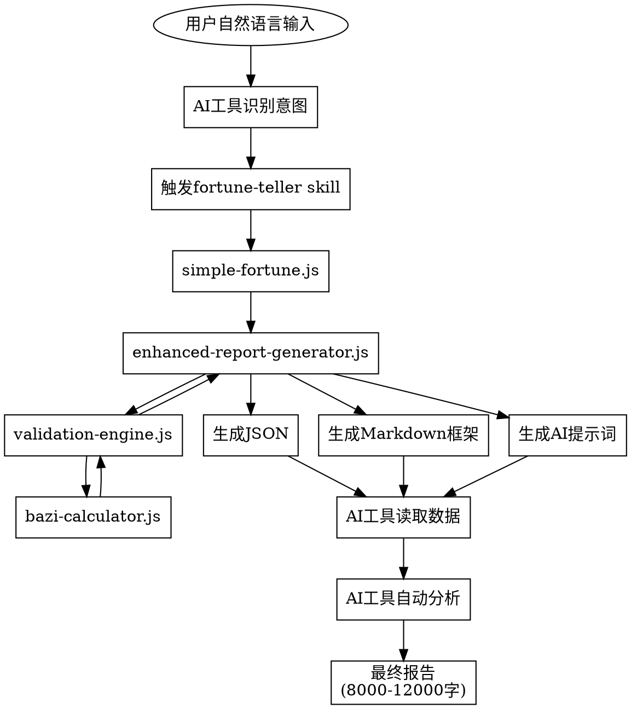

# FortuneTeller 增强版完成设计文档

> 创建时间：2026-03-16
> 设计者：恐龙🐲 + Claude
> 版本：v2.1.0（完整增强版）

---

## 一、设计目标

完成 fortune-teller 增强版剩余40%的工作，实现一步到位的完整算命报告生成。

### 核心需求

1. **用户一句话输入**：用户用自然语言描述基本信息
2. **AI工具自动调用**：AI工具识别"算命"意图，自动触发skill
3. **一步到位输出**：AI工具输出完整报告（8000-12000字），中途无需用户介入

---

## 二、关键设计决策

### 2.1 验证策略：渐进式验证

**选择：选项A - 渐进式验证**

- 第1步：计算器计算 → 第1层验证
- 第2步：调用LLM进行第2层验证 → 如果失败，停止并返回错误
- 第3步：调用LLM进行第3层交叉验证 → 如果失败，返回部分结果
- 优点：逐步验证，错误早发现，节省LLM调用成本

### 2.2 输出形式：JSON + Markdown双输出

**选择：选项B - JSON + Markdown双输出**

- JSON：结构化数据（排盘结果、验证状态、元数据）
- Markdown：人类可读的分析报告
- 优点：数据结构化，便于后续处理；Markdown便于阅读

### 2.3 LLM集成：AI工具自身负责

**关键设计：利用AI工具自身能力，不在代码中集成API调用**

- 增强报告生成器负责准备数据、格式化输出
- 验证引擎提供验证框架和提示词模板
- **AI工具（Claude、Cursor、OpenClaw等）负责实际的LLM分析和验证**
- 代码层面不处理LLM调用，只做计算和格式化

**优势：**
- 完全解耦LLM依赖，适用于所有AI工具
- 不需要API密钥管理
- 不需要在代码中处理API调用细节

### 2.4 报告内容：全量输出

**选择：选项A - 全量输出，按标准模板**

始终按照完整模板生成所有内容：
- 命盘分析
- 三层验证过程展示
- 大运深度分析（每步300字+）
- 流年事件预测
- 事业建议
- 其他人生指引

**优点：** 全面、系统、专业

### 2.5 用户交互：一步到位

**选择：选项A - 一步到位**

用户的工作流程：
```
用户: "帮我算命，张三 男 2025年3月15日 下午2点 北京"
    ↓
AI工具自动执行所有步骤
    ↓
输出完整报告（8000-12000字）
```

**特点：**
- 用户只需说一句话
- AI工具自动调用skill、生成数据、分析、输出
- 中途无需用户介入

### 2.6 默认模式：增强模式

**设计：默认开启增强模式**

用户无需指定模式参数，所有算命请求都使用增强版。

---

## 三、架构设计

### 3.1 整体架构

```
用户自然语言输入
    ↓
AI工具识别意图 → 触发 fortune-teller skill
    ↓
simple-fortune.js (入口，默认增强模式)
    ↓
enhanced-report-generator.js (核心协调器)
    ↓
├─ validation-engine.js (验证引擎)
│  └─ bazi-calculator.js (八字计算器)
├─ prompts/enhanced/*.md (提示词模板)
└─ 输出：report.json + report.md
    ↓
AI工具读取数据和提示词
    ↓
AI工具自动继续分析
    ↓
输出最终报告（8000-12000字）
```

### 3.2 文件职责

**新增文件：**
- `enhanced-report-generator.js` - 增强报告生成器（约500行）
  - 职责：协调计算、验证、数据整合、模板渲染
  - 输入：用户基本信息
  - 输出：JSON数据 + Markdown框架 + AI提示词

**修改文件：**
- `simple-fortune.js` - 修改为默认使用增强模式（约50行修改）
  - 职责：解析命令行参数，调用增强报告生成器
  - 特点：无需参数，默认增强模式

**复用文件：**
- `lib/validation-engine.js` - 验证引擎（已完成）
- `lib/bazi-calculator.js` - 八字计算器（已完成）
- `prompts/enhanced/*.md` - 提示词模板（已完成）

---

## 四、数据流设计

### 4.1 完整数据流



### 4.2 关键数据结构

**JSON输出结构：**
```json
{
  "meta": {
    "version": "2.1.0",
    "mode": "enhanced",
    "generatedAt": "2026-03-16T..."
  },
  "userInput": {
    "name": "张三",
    "gender": "男",
    "birthDate": {
      "year": 2025,
      "month": 3,
      "day": 15
    },
    "birthTime": 14,
    "location": "北京",
    "calendarType": "solar"
  },
  "validationResults": {
    "layer1": {
      "qiyunAge": 5,
      "method": "标准算法",
      "timestamp": "..."
    },
    "layer2Prompt": "第2层验证提示词...",
    "layer3Prompt": "第3层验证提示词..."
  },
  "baziData": {
    "四柱": {
      "年柱": "乙巳",
      "月柱": "己卯",
      "日柱": "甲寅",
      "时柱": "辛未"
    },
    "五行": {...},
    "十神": {...},
    "大运": [...],
    "起运时间": 5
  },
  "analysisPrompts": {
    "detailedAnalysis": "详细分析提示词...",
    "careerAdvice": "事业建议提示词...",
    "dayunDeepDive": "大运深度分析提示词...",
    "liunianEvents": "流年事件预测提示词..."
  }
}
```

---

## 五、核心接口设计

### 5.1 enhanced-report-generator.js

```javascript
const ValidationEngine = require('./lib/validation-engine');
const BaziCalculator = require('./lib/bazi-calculator');
const fs = require('fs');
const path = require('path');

class EnhancedReportGenerator {
  constructor() {
    this.validationEngine = new ValidationEngine();
    this.baziCalculator = new BaziCalculator();
  }

  /**
   * 生成增强报告
   * @param {Object} userInput - 用户输入信息
   * @returns {Object} - 包含 json、markdown、prompt 的结果对象
   */
  async generate(userInput) {
    console.log('[增强报告生成器] 开始生成...');

    // 1. 计算八字基础数据
    const baziData = this.baziCalculator.calculate(userInput);

    // 2. 第1层验证（计算器）
    const layer1Result = this.validationEngine.validateQiyunTime(
      userInput.birthDate,
      userInput.gender,
      baziData.年柱.天干,
      baziData.年柱.地支,
      baziData.节气信息
    );

    // 3. 生成增强分析数据
    const enhancedData = this.generateEnhancedData(baziData);

    // 4. 整合JSON输出
    const jsonOutput = this.buildJsonOutput(
      userInput,
      layer1Result,
      baziData,
      enhancedData
    );

    // 5. 渲染Markdown框架
    const markdownFrame = this.renderMarkdownFrame(baziData, enhancedData);

    // 6. 生成AI提示词
    const aiPrompt = this.generateAIPrompt(userInput, baziData, enhancedData);

    console.log('[增强报告生成器] 生成完成');

    return {
      json: jsonOutput,
      markdown: markdownFrame,
      prompt: aiPrompt
    };
  }

  /**
   * 生成增强分析数据
   */
  generateEnhancedData(baziData) {
    // 十二长生
    const shierChangsheng = this.baziCalculator.calculateShierChangsheng(
      baziData.日主,
      baziData.四柱
    );

    // 五行旺相休囚死
    const wuxingWangXiang = this.baziCalculator.calculateWuxingWangXiang(
      baziData.日主,
      baziData.出生月份
    );

    // 大运分析
    const dayunAnalysis = baziData.大运.map(dayun => {
      return this.baziCalculator.analyzeDayunShengke(
        dayun,
        baziData.四柱,
        baziData.日主
      );
    });

    return {
      shierChangsheng,
      wuxingWangXiang,
      dayunAnalysis
    };
  }

  /**
   * 构建JSON输出
   */
  buildJsonOutput(userInput, layer1Result, baziData, enhancedData) {
    return {
      meta: {
        version: '2.1.0',
        mode: 'enhanced',
        generatedAt: new Date().toISOString()
      },
      userInput: userInput,
      validationResults: {
        layer1: layer1Result,
        layer2Prompt: this.loadPrompt('validation-layer2'),
        layer3Prompt: this.loadPrompt('validation-layer3')
      },
      baziData: {
        四柱: baziData.四柱,
        五行: baziData.五行,
        十神: baziData.十神,
        大运: baziData.大运,
        起运时间: baziData.起运时间
      },
      enhancedData: enhancedData,
      analysisPrompts: {
        detailedAnalysis: this.loadPrompt('detailed-analysis'),
        careerAdvice: this.loadPrompt('career-advice'),
        dayunDeepDive: this.loadPrompt('dayun-deep-dive'),
        liunianEvents: this.loadPrompt('liunian-events')
      }
    };
  }

  /**
   * 渲染Markdown框架
   */
  renderMarkdownFrame(baziData, enhancedData) {
    let markdown = `# 命理分析框架\n\n`;
    markdown += `## 一、命盘概览\n\n`;
    markdown += `### 四柱八字\n`;
    markdown += `- 年柱：${baziData.四柱.年柱.天干}${baziData.四柱.年柱.地支}\n`;
    markdown += `- 月柱：${baziData.四柱.月柱.天干}${baziData.四柱.月柱.地支}\n`;
    markdown += `- 日柱：${baziData.四柱.日柱.天干}${baziData.四柱.日柱.地支}\n`;
    markdown += `- 时柱：${baziData.四柱.时柱.天干}${baziData.四柱.时柱.地支}\n\n`;

    markdown += `## 二、五行分析\n\n`;
    markdown += `[待AI工具分析...]\n\n`;

    markdown += `## 三、大运分析\n\n`;
    enhancedData.dayunAnalysis.forEach((dayun, index) => {
      markdown += `### 第${index + 1}步大运：${dayun.天干}${dayun.地支}\n\n`;
      markdown += `[待AI工具分析...]\n\n`;
    });

    markdown += `## 四、流年预测\n\n`;
    markdown += `[待AI工具分析...]\n\n`;

    markdown += `## 五、人生指引\n\n`;
    markdown += `[待AI工具分析...]\n\n`;

    return markdown;
  }

  /**
   * 生成AI提示词
   */
  generateAIPrompt(userInput, baziData, enhancedData) {
    const detailedAnalysisPrompt = this.loadPrompt('detailed-analysis');
    const careerAdvicePrompt = this.loadPrompt('career-advice');
    const dayunDeepDivePrompt = this.loadPrompt('dayun-deep-dive');
    const liunianEventsPrompt = this.loadPrompt('liunian-events');

    let prompt = `# AI分析提示词\n\n`;
    prompt += `你好，我是AI算命助手。请根据以下信息生成一份完整的命理分析报告（8000-12000字）。\n\n`;

    prompt += `## 用户信息\n`;
    prompt += `- 姓名：${userInput.name}\n`;
    prompt += `- 性别：${userInput.gender}\n`;
    prompt += `- 出生日期：${userInput.birthDate.year}年${userInput.birthDate.month}月${userInput.birthDate.day}日\n`;
    prompt += `- 出生时辰：${userInput.birthTime}点\n`;
    prompt += `- 出生地：${userInput.location}\n\n`;

    prompt += `## 命盘数据\n`;
    prompt += `\`\`\`json\n${JSON.stringify(baziData, null, 2)}\n\`\`\`\n\n`;

    prompt += `## 分析要求\n\n`;
    prompt += `### 1. 详细命理分析\n`;
    prompt += `${detailedAnalysisPrompt}\n\n`;

    prompt += `### 2. 事业建议\n`;
    prompt += `${careerAdvicePrompt}\n\n`;

    prompt += `### 3. 大运深度分析\n`;
    prompt += `${dayunDeepDivePrompt}\n\n`;

    prompt += `### 4. 流年事件预测\n`;
    prompt += `${liunianEventsPrompt}\n\n`;

    prompt += `## 输出格式\n`;
    prompt += `请生成一份完整的Markdown格式报告，包含以下章节：\n`;
    prompt += `1. 命盘概览\n`;
    prompt += `2. 三层验证过程\n`;
    prompt += `3. 命理深度分析\n`;
    prompt += `4. 大运流年分析\n`;
    prompt += `5. 人生指引\n\n`;

    prompt += `**字数要求：8000-12000字**\n`;

    return prompt;
  }

  /**
   * 加载提示词模板
   */
  loadPrompt(templateName) {
    const templatePath = path.join(
      __dirname,
      'prompts',
      'enhanced',
      `${templateName}.md`
    );

    if (fs.existsSync(templatePath)) {
      return fs.readFileSync(templatePath, 'utf-8');
    }

    return `[提示词模板 ${templateName} 未找到]`;
  }
}

module.exports = EnhancedReportGenerator;
```

### 5.2 simple-fortune.js 修改

```javascript
#!/usr/bin/env node

const EnhancedReportGenerator = require('./enhanced-report-generator');
const fs = require('fs');
const path = require('path');

class SimpleFortuneCLI {
  constructor() {
    this.generator = new EnhancedReportGenerator();
  }

  async run(argv) {
    const input = argv[2] || '';

    if (input === '--help' || input === '-h' || input === '') {
      this.showUsage();
      return;
    }

    console.log('🔮 FortuneTeller 算命系统启动（增强版 v2.1.0）');
    console.log('═════════════════════════════════════════\n');

    const parsedInput = this.parseInput(input);

    console.log('✓ 输入信息：');
    console.log(`  姓名：${parsedInput.name}`);
    console.log(`  性别：${parsedInput.gender}`);
    console.log(`  出生日期：${parsedInput.birthDate.year}年${parsedInput.birthDate.month}月${parsedInput.birthDate.day}日`);
    console.log(`  历法：${parsedInput.calendarType === 'lunar' ? '农历' : '阳历'}`);
    console.log(`  出生时辰：${parsedInput.birthTime}点`);
    console.log(`  出生地：${parsedInput.location}\n`);

    try {
      const result = await this.generator.generate(parsedInput);

      // 确保output目录存在
      const outputDir = 'output';
      if (!fs.existsSync(outputDir)) {
        fs.mkdirSync(outputDir, { recursive: true });
      }

      // 输出JSON文件
      const jsonPath = path.join(outputDir, `${parsedInput.name}_命盘数据.json`);
      fs.writeFileSync(jsonPath, JSON.stringify(result.json, null, 2), 'utf-8');

      // 输出Markdown框架文件
      const mdPath = path.join(outputDir, `${parsedInput.name}_分析框架.md`);
      fs.writeFileSync(mdPath, result.markdown, 'utf-8');

      console.log('≈≈≈≈≈≈≈≈≈≈≈≈≈≈≈≈≈≈≈≈≈≈≈≈≈≈≈≈≈≈≈≈≈≈≈≈≈≈≈');
      console.log('✅ 数据生成成功！');
      console.log(`📄 JSON数据：${jsonPath}`);
      console.log(`📄 Markdown框架：${mdPath}\n`);
      console.log('≈≈≈≈≈≈≈≈≈≈≈≈≈≈≈≈≈≈≈≈≈≈≈≈≈≈≈≈≈≈≈≈≈≈≈≈≈≈≈\n');

      console.log('🤖 AI分析提示词：\n');
      console.log(result.prompt);
      console.log('\n≈≈≈≈≈≈≈≈≈≈≈≈≈≈≈≈≈≈≈≈≈≈≈≈≈≈≈≈≈≈≈≈≈≈≈≈≈≈≈\n');

    } catch (error) {
      console.error('❌ 执行出错：', error.message);
      console.error(error.stack);
      process.exit(1);
    }
  }

  parseInput(input) {
    // 保持现有的parseInput逻辑不变
    if (!input || input.trim() === '') {
      this.showUsage();
      process.exit(1);
    }

    const parts = input.trim().split(/\s+/);

    // 解析姓名
    const name = parts[0] || '用户';

    // 解析性别
    const gender = parts[1];
    if (!gender || (gender !== '男' && gender !== '女')) {
      console.error('⚠️ 错误：性别必须是"男"或"女"');
      this.showUsage();
      process.exit(1);
    }

    // 解析日期（简化处理）
    let birthDate = { year: 0, month: 0, day: 0 };
    let calendarType = 'solar';
    let birthTime = 12;
    let location = '北京';

    // 寻找年月日
    const yearMatch = parts.join(' ').match(/(\d{4})年/);
    if (!yearMatch) {
      console.error('⚠️ 错误：缺少年份，格式应为：XXXX年');
      this.showUsage();
      process.exit(1);
    }
    birthDate.year = parseInt(yearMatch[1]);

    const monthMatch = parts.join(' ').match(/(\d{1,2})月/);
    if (monthMatch) {
      birthDate.month = parseInt(monthMatch[1]);
    }

    const dayMatch = parts.join(' ').match(/(\d{1,2})日/);
    if (dayMatch) {
      birthDate.day = parseInt(dayMatch[1]);
    }

    // 判断是否是农历
    if (parts.join(' ').includes('农历')) {
      calendarType = 'lunar';
    }

    // 寻找时辰
    for (const part of parts) {
      if (part.includes('点')) {
        birthTime = this.parseBirthTime(part);
        break;
      }
    }

    // 寻找地点
    const keywords = ['农历', '上午', '下午', '早上', '晚上', '凌晨'];
    for (let i = parts.length - 1; i >= 2; i--) {
      if (!keywords.includes(parts[i]) && !parts[i].match(/^\d+/)) {
        location = parts.slice(i).join('');
        break;
      }
    }

    return {
      name,
      gender,
      birthDate,
      birthTime,
      location,
      calendarType
    };
  }

  parseBirthTime(timeStr) {
    let timeStrClean = timeStr.replace(/[上午下午早上晚上]/g, '');
    if (timeStrClean.includes('凌晨')) {
      // 凌晨0-6点
      timeStrClean = timeStrClean.replace('凌晨', '');
    }
    if (timeStr.includes('下午') || timeStr.includes('晚上')) {
      const time = parseInt(timeStrClean.replace(/[^0-9]/g, ''));
      return time + 12;
    }
    const time = parseInt(timeStrClean.replace(/[^0-9]/g, ''));
    return isNaN(time) || time < 0 || time > 23 ? 12 : time;
  }

  showUsage() {
    console.log(`
🔮 FortuneTeller 算命系统 - 增强版 v2.1.0
═════════════════════════════════════════

使用方法：
  用户输入自然语言，例如："张三 男 2025年3月15日 下午2点 北京"

说明：
  - 姓名：必须
  - 性别：必须，男或女
  - 日期：必须，支持格式：2025年3月15日 或 农历十月初六
  - 时辰：可选，默认12点，支持：上午X点、下午X点、晚上X点等
  - 地点：可选，默认北京

输出：
  - JSON数据：命盘数据（四柱、五行、大运等）
  - Markdown框架：分析框架
  - AI提示词：供AI工具生成完整报告

═════════════════════════════════════════
`);
  }
}

// 运行
const cli = new SimpleFortuneCLI();
cli.run(process.argv);
```

---

## 六、AI工具执行流程

### 6.1 完整执行步骤

```
步骤1：AI工具识别意图
    用户: "帮我算命，张三 男 2025年3月15日 下午2点 北京"
    AI识别: 这是算命请求，触发 fortune-teller skill

步骤2：AI工具调用脚本
    Bash: node simple-fortune.js "张三 男 2025年3月15日 下午2点 北京"

步骤3：脚本生成数据
    - 计算八字
    - 第1层验证
    - 生成增强数据
    - 输出JSON + Markdown + 提示词

步骤4：AI工具读取输出
    Read: output/张三_命盘数据.json
    Read: output/张三_分析框架.md

步骤5：AI工具自动分析（无需用户干预）
    - 读取提示词模板
    - 分析八字数据
    - 生成三层验证
    - 生成大运分析
    - 生成流年预测
    - 生成事业建议

步骤6：AI工具输出最终报告
    输出格式：Markdown
    字数：8000-12000字
    包含：
        - 命盘概览
        - 三层验证过程
        - 命理深度分析
        - 大运流年分析
        - 人生指引
```

### 6.2 最终报告结构示例

```markdown
# 张三命理分析报告

> 生成时间：2026-03-16
> 分析师：AI算命助手
> 版本：v2.1.0

---

## 一、命盘概览

### 1.1 四柱八字

- **年柱**：乙巳（木火）
- **月柱**：己卯（土木）
- **日柱**：甲寅（木木）
- **时柱**：辛未（金土）

### 1.2 五行分析

[详细的五行旺衰分析...]

### 1.3 十神配置

[十神关系分析...]

---

## 二、三层验证过程

### 2.1 第1层：计算器基础验证

- 起运时间：5岁
- 验证方法：标准算法
- 验证结果：通过

### 2.2 第2层：LLM独立验证

[LLM独立分析验证过程...]

### 2.3 第3层：LLM交叉验证

[LLM交叉验证过程...]

---

## 三、命理深度分析

### 3.1 命局特点

[详细的命局分析...]

### 3.2 性格特征

[性格分析...]

### 3.3 事业发展

[事业分析...]

### 3.4 财运分析

[财运分析...]

### 3.5 感情婚姻

[感情分析...]

### 3.6 健康运势

[健康分析...]

---

## 四、大运流年分析

### 4.1 第1步大运：庚辰（5-14岁）

[每步大运300字+的深度分析...]

### 4.2 第2步大运：辛巳（15-24岁）

[深度分析...]

...

---

## 五、人生指引

### 5.1 事业建议

[基于五行推理的事业建议...]

### 5.2 发展方向

[发展方向指引...]

### 5.3 注意事项

[需要注意的事项...]

---

**字数统计：8560字**
```

---

## 七、测试策略

### 7.1 单元测试

创建 `test-enhanced.js` 测试文件：

```javascript
const EnhancedReportGenerator = require('./enhanced-report-generator');

// 测试用例1：基础八字计算
async function testBasicCalculation() {
  const generator = new EnhancedReportGenerator();
  const result = await generator.generate({
    name: '张三',
    gender: '男',
    birthDate: { year: 2025, month: 3, day: 15 },
    birthTime: 14,
    location: '北京',
    calendarType: 'solar'
  });

  console.assert(result.json !== null, 'JSON不应为空');
  console.assert(result.markdown !== null, 'Markdown不应为空');
  console.assert(result.prompt !== null, '提示词不应为空');
}

// 运行测试
testBasicCalculation();
```

### 7.2 集成测试

测试完整流程：
1. 用户输入自然语言
2. AI工具调用脚本
3. 生成JSON和Markdown
4. 验证文件格式和内容

---

## 八、文档更新

### 8.1 SKILL.md 更新

需要在 `SKILL.md` 中说明增强版流程：

- 触发条件：算命、八字算命、紫微斗数等
- 执行流程：AI工具自动调用 → 生成数据 → AI分析 → 输出报告
- 特点：一步到位，用户无需干预

### 8.2 README.md 创建

创建 `README.md` 说明文档：

- 增强版使用说明
- 三层验证机制说明
- 报告生成流程
- 示例输出

---

## 九、实施计划

### 优先级1：核心功能（必须）

1. ✅ 创建 `enhanced-report-generator.js`
2. ✅ 修改 `simple-fortune.js`
3. ✅ 测试基础功能

### 优先级2：文档更新（必须）

1. ✅ 更新 `SKILL.md`
2. ✅ 创建 `README.md`
3. ✅ 更新 `IMPLEMENTATION-STATUS.md`

### 优先级3：测试验证（必须）

1. ✅ 创建单元测试
2. ✅ 运行集成测试
3. ✅ 验证报告质量

---

## 十、成功标准

### 功能完整性

- ✅ 用户可以用自然语言输入
- ✅ AI工具自动调用skill
- ✅ 生成JSON + Markdown + 提示词
- ✅ AI工具输出8000-12000字报告
- ✅ 全程无需用户干预

### 质量标准

- ✅ 代码注释完整
- ✅ 错误处理完善
- ✅ 输出格式规范
- ✅ 分析内容专业

### 用户体验

- ✅ 输入简单：一句话自然语言
- ✅ 流程简洁：AI自动完成
- ✅ 输出完整：全面分析报告

---

**设计完成时间**：2026-03-16
**下一步**：调用 writing-plans skill 创建实施计划