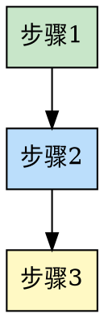

# [方法论名称]

## Overview

[1-2段核心概念说明。解释这个方法论是什么，核心价值是什么。]

## When to Use

**适用场景**：
- [适用场景1]
- [适用场景2]
- [适用场景3]

**不适用场景**：
- [不适用场景1]
- [不适用场景2]

## The Process

### 步骤详解

**步骤 1: [名称]**
- 说明
- 要点
- 注意事项

**步骤 2: [名称]**
...

## [定制化部分 - 可选]

根据方法论特点添加：

### 思维框架（表格形式）

| 维度 | 问题 | 提示 |
|------|------|------|
| 维度1 | ... | ... |
| 维度2 | ... | ... |

### 检查清单

- [ ] 检查项1
- [ ] 检查项2
...

### 工具表格

...

## Examples

### 案例 1: [标题]

**背景**: ...

**过程**: ...

**结果**: ...

### 案例 2: [标题]

...

## Common Pitfalls

### 误区 1: [标题]
- **表现**: ...
- **正确做法**: ...

### 误区 2: [标题]
...

## References

- [相关资源链接]
- [书籍、文章等]