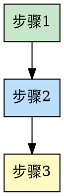

# [方法论名称]

## 前置协议

### 环境检测

```bash
PROJECT_ROOT=$(git rev-parse --show-toplevel 2>/dev/null || echo "unknown")
BRANCH=$(git branch --show-current 2>/dev/null || echo "unknown")
COMMIT=$(git rev-parse --short HEAD 2>/dev/null || echo "unknown")

echo "PROJECT: $PROJECT_ROOT"
echo "BRANCH: $BRANCH"
echo "COMMIT: $COMMIT"
```

### 工件目录初始化

```bash
mkdir -p memory/artifacts/your-methodology-name
```

## Overview

[1-2段核心概念说明。解释这个方法论是什么，核心价值是什么。]

## When to Use

**适用场景**：
- [适用场景1]
- [适用场景2]
- [适用场景3]

**不适用场景**：
- [不适用场景1]
- [不适用场景2]

## The Process


```dot
digraph process {
    rankdir=TB;

    "步骤1" [shape=box, style=filled, fillcolor="#c8e6c9"];
    "步骤2" [shape=box, style=filled, fillcolor="#bbdefb"];
    "步骤3" [shape=box, style=filled, fillcolor="#fff9c4"];

    "步骤1" -> "步骤2";
    "步骤2" -> "步骤3";
}
```

### 步骤详解

**步骤 1: [名称]**
- 说明
- 要点
- 注意事项

**步骤 2: [名称]**
...

## [定制化部分 - 可选]

根据方法论特点添加：

### 思维框架（表格形式）

| 维度 | 问题 | 提示 |
|------|------|------|
| 维度1 | ... | ... |
| 维度2 | ... | ... |

### 检查清单

- [ ] 检查项1
- [ ] 检查项2
...

### 工具表格

...

## Examples

### 案例 1: [标题]

**背景**: ...

**过程**: ...

**结果**: ...

### 案例 2: [标题]

...

## Common Pitfalls

### 误区 1: [标题]
- **表现**: ...
- **正确做法**: ...

### 误区 2: [标题]
...

## 后置协议

### 工件输出

保存执行结果到工件文件：

```bash
TIMESTAMP=$(date +%Y%m%d-%H%M%S)
ARTIFACT_FILE="memory/artifacts/your-methodology-name/result-$TIMESTAMP.json"

cat > "$ARTIFACT_FILE" <<EOF
{
  "skill": "your-methodology-name",
  "version": "1.0.0",
  "timestamp": "$(date -u +%Y-%m-%dT%H:%M:%SZ)",
  "input": { ... },
  "output": { ... },
  "next_skills": [...]
}
EOF

ln -sf "$ARTIFACT_FILE" memory/artifacts/your-methodology-name/latest.json
```

### 建议后续技能

根据执行结果，推荐后续技能。

## References

- [相关资源链接]
- [书籍、文章等]