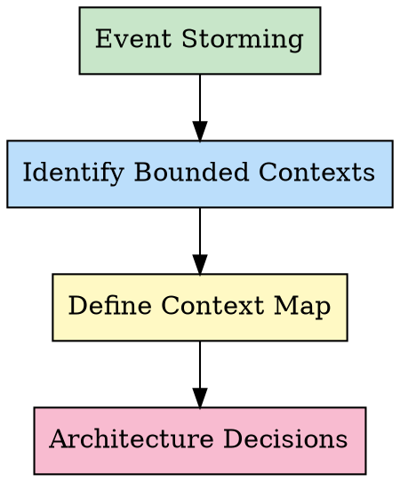

# Domain-Driven Design: Strategic Design

## Overview

Strategic design focuses on defining bounded contexts and their relationships. A bounded context is a boundary within which a domain model is defined and applicable. Inside the boundary, all terms, rules, and logic have a specific, consistent meaning. Different contexts may use the same terms with different meanings.

**Why it matters:** Without clear boundaries, teams talk past each other. "Customer" means something different to Sales vs Support vs Billing. Strategic design makes these boundaries explicit.

**Core principle:** Language consistency within a boundary, explicit translation between boundaries.

Tactical design happens within each bounded context. See `ddd-tactical-design` skill for implementation details.

## When to Use

**Applicable:**
- Starting a new project or system
- Decomposing a monolith into microservices
- Multiple teams working on the same domain
- Domain logic is complex and domain experts are available
- Language confusion across teams (same term, different meanings)

**Not applicable:**
- Simple CRUD operations with minimal logic
- Single-team small projects (< 3 developers)
- Technical-only domains (no business experts needed)
- Existing well-defined bounded contexts

## The Process

### Step 1: Event Storming

Gather domain experts and developers. Use sticky notes to explore the domain:

**Domain Events** (orange): Something that happened
- "Order Placed", "Payment Processed", "Inventory Reserved"
- Write in past tense

**Commands** (blue): What triggers events
- "Place Order", "Process Payment", "Reserve Inventory"
- Write in imperative mood

**Aggregates** (yellow): What handles commands and emits events
- "Order", "Payment", "Inventory"

**External Systems** (pink): Outside dependencies
- "Payment Gateway", "Email Service"

**Actors** (green): Who initiates commands
- "Customer", "Admin", "System"

Process: Start with events, work backward to commands, identify what's needed.

### Step 2: Identify Bounded Contexts

Group related events, commands, and aggregates into contexts:

**Principles:**
- **Semantic consistency**: Same term means same thing within a context
- **Independent evolution**: Each context can change independently
- **Team alignment**: One team owns one context (Conway's Law)

**Questions to ask:**
- Where does language change? (Customer in Sales vs Support)
- Where can we draw a clean boundary?
- What can be deployed independently?
- What team owns this capability?

**Start coarse, refine later.** Too many contexts = integration complexity. Too few = coupling.

### Step 3: Define Context Map

Document relationships between contexts:

| Pattern | Description | When to Use |
|---------|-------------|-------------|
| **Partnership** | Teams succeed or fail together | Tight coordination needed |
| **Customer-Supplier** | Downstream depends on upstream | Upstream serves downstream needs |
| **Conformist** | Downstream conforms to upstream | Upstream cannot be influenced |
| **Anti-Corruption Layer** | Downstream translates upstream model | Protect domain model purity |
| **Open Host Service** | Publish API for multiple consumers | Shared capability |
| **Shared Kernel** | Shared subset of model | Carefully controlled coupling |

**Draw the map:** Which contexts talk to each other? What patterns apply?

### Step 4: Architecture Decisions

Based on context map, decide:

- **Team structure**: One team per context (ideally)
- **Communication**: Synchronous (RPC) vs asynchronous (events)
- **Data ownership**: One context owns data, others subscribe
- **Deployment**: Monolith or microservices? Start monolith-first.

## Thinking Framework

Use this table during Event Storming:

| Question | What to Look For | Example |
|----------|------------------|---------|
| **What events?** | Business-critical things that happened | "OrderPlaced", "PaymentFailed" |
| **What triggers events?** | Commands from users or systems | "PlaceOrder", "RetryPayment" |
| **What boundaries?** | Where language changes | Sales "Customer" ≠ Support "Customer" |
| **Who owns what?** | Team responsibility boundaries | Team A: Orders, Team B: Inventory |
| **How do they communicate?** | Sync vs async, contracts | Events for loose coupling, RPC for tight |

**Bounded Context Checklist:**
- [ ] Language is consistent within the context
- [ ] Can evolve independently (deployable on own schedule)
- [ ] One team can own it (matches Conway's Law)
- [ ] Clear boundaries with other contexts
- [ ] Defined relationships on context map

## Examples

### Case 1: E-commerce System

**Event Storming reveals:**
- Events: OrderPlaced, InventoryReserved, PaymentProcessed, OrderShipped
- Commands: PlaceOrder, ReserveInventory, ProcessPayment, ShipOrder
- Aggregates: Order, Inventory, Payment, Shipment

**Bounded Contexts identified:**

1. **Order Context**
   - Language: Order, OrderItem, Customer (buyer), OrderStatus
   - Team: Order Management Team
   - Events: OrderPlaced, OrderCancelled

2. **Inventory Context**
   - Language: Product, Stock, Warehouse, Reservation
   - Team: Warehouse Team
   - Events: InventoryReserved, StockDepleted

3. **Payment Context**
   - Language: Payment, Transaction, PaymentMethod, Refund
   - Team: Finance Team
   - Events: PaymentProcessed, PaymentFailed

**Context Map:**
- Order → Inventory: Customer-Supplier (Order needs Inventory to reserve)
- Order → Payment: Customer-Supplier (Order needs Payment to process)
- Order publishes OrderPlaced event → Inventory subscribes (async)
- Payment publishes PaymentProcessed event → Order subscribes (async)

**Architecture:** Start as modular monolith. Deploy as microservices if teams scale.

### Case 2: Healthcare System

**Bounded Contexts:**

1. **Patient Management Context**
   - Language: Patient, MedicalRecord, Diagnosis
   - Team: Clinical Team

2. **Appointment Context**
   - Language: Appointment, Schedule, Availability, Slot
   - Team: Scheduling Team

3. **Billing Context**
   - Language: Invoice, Payment, Insurance, Claim
   - Team: Billing Team

**Context Map:**
- Patient Management → Appointment: Shared Kernel (Patient ID)
- Appointment → Billing: Customer-Supplier (Appointments trigger billing)
- Billing has Anti-Corruption Layer for Insurance Provider's external model

## Common Pitfalls

### Pitfall 1: Too Fine-Grained Contexts

**Mistake:** Creating a context for every aggregate or entity.

**Problem:** Excessive integration complexity. Every change touches multiple contexts.

**Solution:** Start with fewer, larger contexts. Split only when you feel coupling pain.

**Rule of thumb:** Can you deploy this independently without coordinating with 3+ other teams? If no, merge contexts.

### Pitfall 2: Ignoring Team Structure

**Mistake:** Designing contexts based on domain purity, ignoring Conway's Law.

**Problem:** One team owns multiple contexts → coupling. Multiple teams own one context → conflict.

**Solution:** Align context boundaries with team boundaries. One team, one context.

### Pitfall 3: Missing Anti-Corruption Layer

**Mistake:** Letting upstream context's model leak into downstream context.

**Problem:** Downstream model becomes polluted with concepts that don't fit its domain.

**Solution:** Add Anti-Corruption Layer. Translate upstream model to downstream model at the boundary.

**Example:** External "User" → ACL translates → Internal "AccountHolder" with different attributes.

## References

- **Domain-Driven Design** by Eric Evans - The original DDD book
- **Implementing Domain-Driven Design** by Vaughn Vernon - Practical implementation guide
- **Event Storming** by Alberto Brandolini - Collaborative domain exploration
- **Context Mapping** patterns: https://www.infoq.com/articles/ddd-contextmapping/