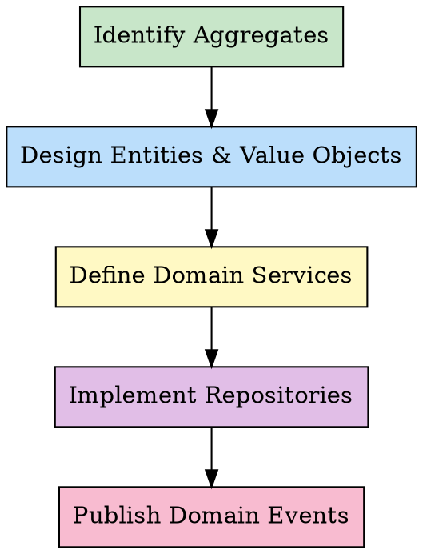

# Domain-Driven Design: Tactical Design

## 前置协议

### 环境检测

```bash
# 检测当前项目信息
PROJECT_ROOT=$(git rev-parse --show-toplevel 2>/dev/null || echo "unknown")
BRANCH=$(git branch --show-current 2>/dev/null || echo "unknown")
COMMIT=$(git rev-parse --short HEAD 2>/dev/null || echo "unknown")

echo "PROJECT: $PROJECT_ROOT"
echo "BRANCH: $BRANCH"
echo "COMMIT: $COMMIT"
```

### 前置技能检查

**benefits-from 检查**：

```bash
# 检查 ddd-strategic-design 工件
STRATEGIC_ARTIFACT="memory/artifacts/ddd-strategic/latest.json"

if [ -f "$STRATEGIC_ARTIFACT" ]; then
  echo "FOUND: ddd-strategic-design artifact"
  # 提取限界上下文信息，指导战术设计
else
  echo "INFO: No ddd-strategic-design artifact found"
  echo "Consider running /ddd-strategic-design first to identify bounded contexts"
fi
```

**工件目录初始化**：

```bash
mkdir -p memory/artifacts/ddd-tactical
```

# Domain-Driven Design: Tactical Design

## Overview

Tactical design provides building blocks for implementing domain models within a bounded context. These patterns help translate domain concepts into code that protects business rules and ensures data consistency.

**Core building blocks:**
- **Aggregate**: Consistency boundary with a root entity
- **Entity**: Object defined by identity, not attributes
- **Value Object**: Immutable object defined by attributes
- **Domain Service**: Operations that don't belong to entities
- **Repository**: Persistence abstraction (collection-like)
- **Domain Event**: Something happened in the domain

**Why it matters:** Without these patterns, business logic leaks into application services, databases, or UI. The domain model becomes anemic (just data holders).

**Core principle:** Protect invariants (business rules) and ensure consistency within aggregate boundaries.

Tactical design operates within bounded contexts defined by strategic design. If you haven't identified your bounded contexts yet, see `ddd-strategic-design` skill first.

## When to Use

**Applicable:**
- Implementing complex domain logic
- Business rules need to be protected from corruption
- Consistency boundaries matter (prevent invalid state)
- Domain experts validate the model

**Not applicable:**
- Simple CRUD operations (no business rules)
- Anemic domain model is acceptable (just data access)
- Business logic lives in stored procedures or services only

## The Process



### Step 1: Identify Aggregates

An aggregate is a cluster of domain objects that can be treated as a single unit. It has:

- **Aggregate Root**: The only entry point to the aggregate
- **Boundary**: What's inside vs outside
- **Invariant**: Business rule that must always be true

**Example:**
```
Aggregate: Order
├── Root: Order (entity)
├── Inside: OrderItems (entities), ShippingAddress (value object)
├── Outside: Customer (different aggregate), Product (different aggregate)
└── Invariant: Order total = sum of item prices (must always be true)
```

**Rules:**
1. Only aggregate root has global identity
2. Objects inside accessed only through root
3. Root ensures invariants are maintained
4. Delete root → delete everything inside

**How to find aggregates:**
- Look for "transactional consistency" boundaries
- What must be consistent after each operation?
- What can be eventually consistent?

**Keep aggregates small.** Large aggregates cause performance issues and limit scalability.

### Step 2: Design Entities & Value Objects

**Entity:**
- Has identity (ID) that persists through lifecycle
- Mutable: state changes over time
- Equality based on identity, not attributes

**Example:**
```typescript
class Order {
  private id: OrderId;          // Identity
  private items: OrderItem[];   // Mutable state
  private status: OrderStatus;

  constructor(id: OrderId) {
    this.id = id;
    this.items = [];
    this.status = OrderStatus.Draft;
  }

  addItem(product: Product, quantity: number): void {
    // Business rule: can't add to submitted order
    if (this.status !== OrderStatus.Draft) {
      throw new Error("Cannot modify submitted order");
    }
    this.items.push(new OrderItem(product, quantity));
  }

  // Equality by ID
  equals(other: Order): boolean {
    return this.id.equals(other.id);
  }
}
```

**Value Object:**
- No identity (defined entirely by attributes)
- Immutable: never changes after creation
- Equality based on attribute values

**Example:**
```typescript
class Money {
  constructor(
    readonly amount: number,
    readonly currency: string
  ) {
    if (amount < 0) throw new Error("Money cannot be negative");
    // No setters - immutable
  }

  add(other: Money): Money {
    if (this.currency !== other.currency) {
      throw new Error("Cannot add different currencies");
    }
    return new Money(this.amount + other.amount, this.currency);
  }

  // Equality by value
  equals(other: Money): boolean {
    return this.amount === other.amount &&
           this.currency === other.currency;
  }
}
```

**When to use which?**
- Entity: Identity matters (User, Order, Account)
- Value Object: Identity doesn't matter (Address, DateRange, Money)

**Prefer Value Objects.** They're simpler, immutable, and easier to test.

### Step 3: Define Domain Services

Some operations don't naturally fit in entities or value objects.

**Characteristics:**
- Involves multiple aggregates
- No state of its own (stateless)
- Named after domain activity (verb)

**Example:**
```typescript
class TransferService {
  // Transfers money between two accounts
  // Doesn't belong to Account entity (involves two)
  transfer(
    from: Account,
    to: Account,
    amount: Money
  ): void {
    if (from.balance().lessThan(amount)) {
      throw new Error("Insufficient funds");
    }
    from.debit(amount);
    to.credit(amount);
  }
}
```

**Avoid "Service" for everything.** Put logic in entities first. Service is a fallback.

### Step 4: Implement Repositories

A repository provides collection-like interface for retrieving and storing aggregates.

**Purpose:** Abstract away persistence details. Domain model shouldn't care about database.

**Example:**
```typescript
interface OrderRepository {
  // Collection-like operations
  findById(id: OrderId): Promise<Order | null>;
  save(order: Order): Promise<void>;
  delete(order: Order): Promise<void>;

  // Query methods specific to domain
  findByCustomer(customerId: CustomerId): Promise<Order[]>;
  findPendingOrders(): Promise<Order[]>;
}
```

**Rules:**
- One repository per aggregate root
- Repository works with aggregate roots only
- Implementation deals with database, domain model doesn't

### Step 5: Publish Domain Events

A domain event represents something that happened in the domain that other parts of the system care about.

**Characteristics:**
- Named in past tense: OrderPlaced, PaymentProcessed
- Immutable (it happened, can't change history)
- Carries data needed by subscribers

**Example:**
```typescript
class OrderPlaced {
  constructor(
    readonly orderId: OrderId,
    readonly customerId: CustomerId,
    readonly total: Money,
    readonly occurredAt: Date
  ) {}
}

// In Order aggregate:
place(): OrderPlaced {
  if (this.items.length === 0) {
    throw new Error("Cannot place empty order");
  }
  this.status = OrderStatus.Placed;
  return new OrderPlaced(this.id, this.customerId, this.total(), new Date());
}

// Other bounded contexts subscribe:
// Inventory reserves stock
// Payment processes payment
// Email sends confirmation
```

**Use events to decouple aggregates.** Aggregate A publishes event, Aggregate B subscribes. No direct coupling.

## Building Blocks Reference

| Building Block | Purpose | Key Characteristic |
|----------------|---------|-------------------|
| **Entity** | Identity-based object | Has ID, mutable, equality by ID |
| **Value Object** | Attribute-based object | No ID, immutable, equality by value |
| **Aggregate** | Consistency boundary | Root + entities + invariants |
| **Repository** | Persistence abstraction | Collection-like interface |
| **Domain Service** | Cross-aggregate operation | Stateless, verb-named |
| **Domain Event** | Something happened | Past tense, immutable, carries data |

## Examples

### Case 1: Order Aggregate

**Scenario:** E-commerce order with items and shipping address.

```typescript
// Value Object
class Money {
  constructor(readonly amount: number, readonly currency: string) {}

  add(other: Money): Money {
    if (this.currency !== other.currency) throw new Error("Currency mismatch");
    return new Money(this.amount + other.amount, this.currency);
  }
}

// Value Object
class Address {
  constructor(
    readonly street: string,
    readonly city: string,
    readonly zipCode: string
  ) {}
}

// Entity (inside aggregate)
class OrderItem {
  constructor(
    readonly productId: string,
    readonly productName: string,
    readonly price: Money,
    readonly quantity: number
  ) {}

  lineTotal(): Money {
    return new Money(
      this.price.amount * this.quantity,
      this.price.currency
    );
  }
}

// Aggregate Root (Entity)
class Order {
  private items: OrderItem[] = [];
  private status: OrderStatus = OrderStatus.Draft;

  constructor(
    readonly id: string,
    readonly customerId: string,
    private shippingAddress: Address
  ) {}

  addItem(product: Product, quantity: number): void {
    if (this.status !== OrderStatus.Draft) {
      throw new Error("Cannot modify placed order");
    }
    this.items.push(new OrderItem(
      product.id,
      product.name,
      product.price,
      quantity
    ));
  }

  placeOrder(): OrderPlaced {
    if (this.items.length === 0) {
      throw new Error("Cannot place empty order");
    }
    this.status = OrderStatus.Placed;
    return new OrderPlaced(this.id, this.customerId, this.total());
  }

  total(): Money {
    return this.items.reduce(
      (sum, item) => sum.add(item.lineTotal()),
      new Money(0, "USD")
    );
  }

  // Invariant: total always equals sum of items
}
```

### Case 2: Money Transfer

**Scenario:** Transfer money between two accounts.

```typescript
// Entity (Aggregate Root)
class Account {
  constructor(
    readonly id: string,
    private balance: Money
  ) {}

  debit(amount: Money): void {
    if (this.balance.lessThan(amount)) {
      throw new Error("Insufficient funds");
    }
    this.balance = this.balance.subtract(amount);
  }

  credit(amount: Money): void {
    this.balance = this.balance.add(amount);
  }

  currentBalance(): Money {
    return this.balance;
  }
}

// Domain Service
class TransferService {
  transfer(from: Account, to: Account, amount: Money): MoneyTransferred {
    from.debit(amount);
    to.credit(amount);
    return new MoneyTransferred(from.id, to.id, amount);
  }
}

// Domain Event
class MoneyTransferred {
  constructor(
    readonly fromAccountId: string,
    readonly toAccountId: string,
    readonly amount: Money,
    readonly occurredAt: Date = new Date()
  ) {}
}
```

## Common Pitfalls

### Pitfall 1: Large Aggregates

**Mistake:** Putting too much inside one aggregate.

**Example:** Order aggregate includes Customer, Product, Payment, Shipment.

**Problem:**
- Performance: Loading huge object graph
- Concurrency: Lock contention
- Scalability: Cannot scale parts independently

**Solution:** Keep aggregates small. Only include what must be transactionally consistent.

**Rule:** If you don't need to load it to enforce an invariant, it's outside the aggregate.

### Pitfall 2: Anemic Domain Model

**Mistake:** Entities are just data holders. Logic lives in services.

**Example:**
```typescript
// Anemic
class Order {
  id: string;
  items: OrderItem[];
  status: string;
  // No methods
}

class OrderService {
  addItem(order: Order, item: OrderItem): void {
    order.items.push(item); // Logic in service, not entity
  }
}
```

**Problem:** Business rules scattered, easy to bypass invariants.

**Solution:** Put logic in entities. Services coordinate, entities enforce rules.

```typescript
// Rich domain model
class Order {
  addItem(item: OrderItem): void {
    if (this.status !== "Draft") throw new Error("Cannot modify");
    this.items.push(item);
    this.recalculateTotal(); // Entity ensures invariant
  }
}
```

### Pitfall 3: Business Logic in Services

**Mistake:** Domain service becomes a god object with all business logic.

**Problem:** Entities become passive, invariants not protected, hard to test.

**Solution:**
1. Try entity or value object first
2. Try aggregate root
3. Only then use domain service
4. Keep service focused: one operation, clear purpose

## References

- **Domain-Driven Design** by Eric Evans - The original DDD book, Part II: Tactical Design
- **Implementing Domain-Driven Design** by Vaughn Vernon - Detailed patterns and examples
- **Domain-Driven Design Distilled** by Vaughn Vernon - Concise tactical patterns

## 后置协议

### 工件输出

保存战术设计结果到工件文件：

```bash
# 生成工件文件名
TIMESTAMP=$(date +%Y%m%d-%H%M%S)
ARTIFACT_FILE="memory/artifacts/ddd-tactical/result-$TIMESTAMP.json"

# 写入工件
cat > "$ARTIFACT_FILE" <<EOF
{
  "skill": "ddd-tactical-design",
  "version": "2.0.0",
  "timestamp": "$(date -u +%Y-%m-%dT%H:%M:%SZ)",
  "project": "$PROJECT_ROOT",
  "branch": "$BRANCH",
  "commit": "$COMMIT",
  "input": {
    "user_request": "用户的原始请求"
  },
  "output": {
    "aggregates": [
      {
        "name": "聚合名称",
        "root": "聚合根实体",
        "entities": ["Entity1", "Entity2"],
        "value_objects": ["VO1", "VO2"],
        "invariants": ["不变量1", "不变量2"]
      }
    ],
    "repositories": [
      {
        "name": "Repository名称",
        "aggregate": "对应的聚合",
        "methods": ["findById", "save", "delete"]
      }
    ],
    "domain_services": [
      {
        "name": "Domain Service名称",
        "responsibility": "职责说明"
      }
    ]
  },
  "next_skills": [
    "mvp-first",
    "pdca-cycle"
  ]
}
EOF

echo "ARTIFACT SAVED: $ARTIFACT_FILE"
ln -sf "$ARTIFACT_FILE" memory/artifacts/ddd-tactical/latest.json
```

### 目标文件更新

如果存在目标文件，记录战术设计完成。

### 建议后续技能

```markdown
## 后续建议

基于 DDD 战术设计结果，建议继续执行：

**推荐技能链**：
1. /mvp-first - 进行 MVP 功能筛选和优先级规划
2. /pdca-cycle - 进入 PDCA 循环实施阶段

是否继续执行？
- A) 执行推荐的技能链
- B) 只执行第一个技能
- C) 不继续，结束当前任务
```