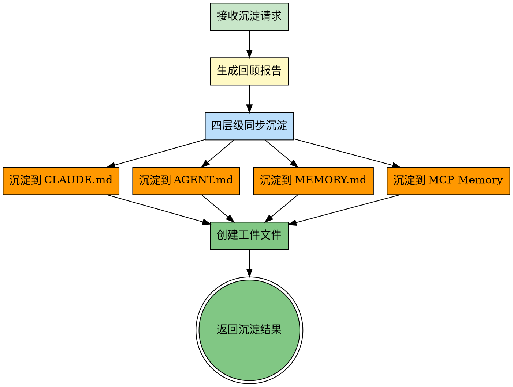
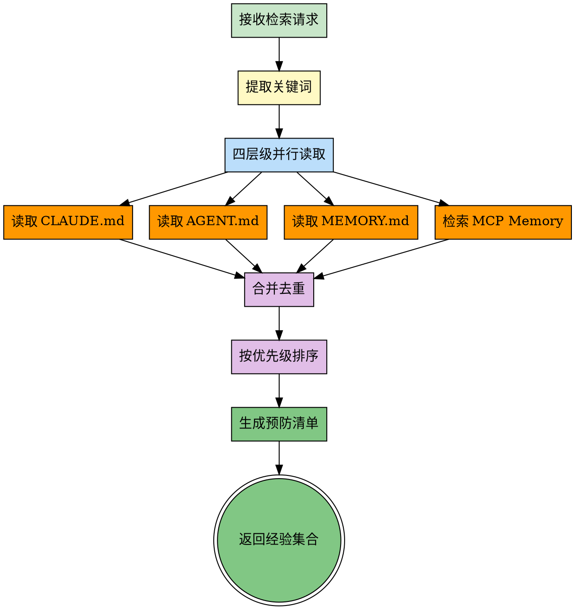
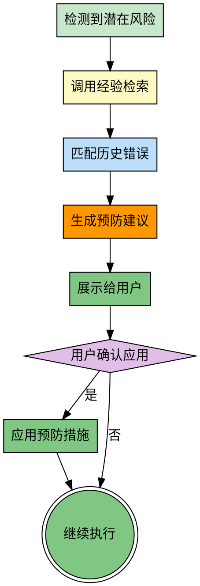
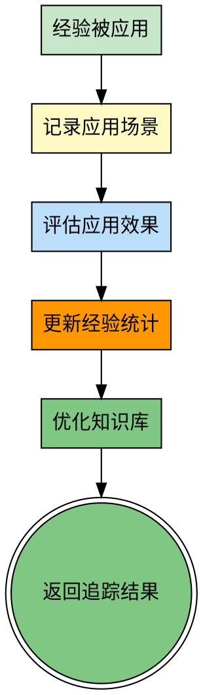

# Experience Manager - 经验管理技能

## 前置协议

### 环境检测

```bash
# 检测当前项目信息
PROJECT_ROOT=$(git rev-parse --show-toplevel 2>/dev/null || echo "unknown")
BRANCH=$(git branch --show-current 2>/dev/null || echo "unknown")
COMMIT=$(git rev-parse --short HEAD 2>/dev/null || echo "unknown")

echo "PROJECT: $PROJECT_ROOT"
echo "BRANCH: $BRANCH"
echo "COMMIT: $COMMIT"

# 检查是否在 Git 仓库中
if [ "$PROJECT_ROOT" = "unknown" ]; then
  echo "WARNING: Not in a Git repository"
fi
```

### 前置技能检查

**dependencies 检查**（无依赖）：

此技能无前置依赖，可直接执行。

**工件目录初始化**：

```bash
# 确保工件目录和目标目录存在
mkdir -p memory/artifacts/experience-manager
mkdir -p memory/retrospectives
```

### 调用方式检测

experience-manager 通过以下方式被调用：

**方式1：工件传递（推荐）**

检测工件文件是否存在：
- `memory/artifacts/goal-oriented/experience-request.json`
- `memory/artifacts/pilot/experience-request.json`

**方式2：用户直接调用**

用户使用 `/experience-manager` 命令。

## Overview

experience-manager 是一个独立的知识管理技能，负责项目经验知识的沉淀、读取、复盘和反思。它通过**四层级沉淀机制**和**智能检索机制**，实现知识的完整闭环，帮助AI避免重复错误，提升执行效率。

**核心能力**：
- **经验沉淀**：任务完成后，同步沉淀到四个层级（CLAUDE.md、AGENT.md、MEMORY.md、MCP Memory）
- **经验读取**：任务开始前，从四个层级智能检索相关经验
- **经验复盘**：对已完成任务深度分析，保留好的，改掉坏的
- **经验反思**：对已有经验深度思考，好则加冕，错则改之
- **错误预防**：检测潜在风险，提供预防建议
- **效果追踪**：记录经验应用效果，持续优化知识库

**关键价值**：
- 避免重复错误
- 快速复用成功模式
- 持续积累知识资产
- 提升团队协作效率
- **持续改进优化**

## When to Use

**适用场景**：
- 任务完成后，需要沉淀经验教训
- 任务开始前，需要参考历史经验
- 任务完成后一段时间，需要深度复盘（新增）
- 发现经验可能过时或不准确，需要反思（新增）
- 遇到错误，需要查找相似错误的解决方案
- 需要复用已验证的代码模式或流程模式
- 需要预防潜在的错误风险

**不适用场景**：
- 简单的查询任务
- 不涉及知识积累的任务

## ⚠️ 核心原则（Iron Law）

### 四层级沉淀机制

每次经验沉淀必须同步写入四个层级，确保知识不丢失：

| 层级 | 文件 | 维度 | 优先级 | 用途 |
|------|------|------|--------|------|
| **规则层** | CLAUDE.md | 做什么 | 最高 | 项目约定，强约束 |
| **策略层** | AGENT.md | 怎么做 | 高 | AI执行策略，决策规则 |
| **知识层** | MEMORY.md | 学到了什么 | 中 | 技术知识，经验总结 |
| **历史层** | MCP Memory | 过去发生了什么 | 低 | 完整历史，智能检索 |

### 四层级读取机制

读取经验时，按优先级从四个层级并行读取：

```
优先级：规则层 > 策略层 > 知识层 > 历史层
```

**冲突处理**：当不同层级内容冲突时，以高优先级为准。

### 持续改进原则（新增）

**复盘和反思是持续改进的核心**：

- **复盘**：定期回顾已完成任务，识别得失，制定改进计划
- **反思**：深度思考已有经验，验证有效性，提炼智慧

**原则**：
- 好则加冕：成功的经验要发扬光大
- 错则改之：失败的教训要铭记改正
- 动态更新：过时的经验要及时更新或删除

## The Process

### 能力1：经验沉淀（Save Experience）



#### 执行步骤

**步骤1：接收沉淀请求**

从工件文件读取请求：

```bash
# 检查是否有沉淀请求
REQUEST_FILE=$(ls -t memory/artifacts/*/experience-save-request.json 2>/dev/null | head -1)

if [ -n "$REQUEST_FILE" ]; then
  echo "Found experience save request: $REQUEST_FILE"
  # 读取请求内容
  cat "$REQUEST_FILE"
fi
```

**步骤2：生成回顾报告**

根据请求内容，生成结构化的回顾报告：

```markdown
# 任务回顾报告

## 基本信息
- **任务ID**: {task_id}
- **完成时间**: {timestamp}
- **执行时长**: {duration}
- **技能链**: {skills_used}

## 经验总结
### 做得好的
...

### 需要改进的
...

## 知识沉淀
### 技术知识
...

### 可复用模式
...

## 错误与修复
...

## 改进建议
...
```

**步骤3：四层级同步沉淀**

同步写入四个层级：

```python
# 伪代码
def save_to_four_layers(retrospective):
    # 1. 沉淀到 CLAUDE.md（规则层）
    Edit("CLAUDE.md", append=extract_rules(retrospective))

    # 2. 沉淀到 AGENT.md（策略层）
    Edit("AGENT.md", append=extract_strategy(retrospective))

    # 3. 沉淀到 MEMORY.md（知识层）
    Edit("memory/MEMORY.md", append=extract_knowledge(retrospective))

    # 4. 沉淀到 MCP Memory（历史层）
    mcp_save_memory(complete_retrospective)
```

**步骤4：创建工件文件**

```json
// memory/artifacts/experience-manager/save-result-{timestamp}.json
{
  "status": "success",
  "layers_updated": [
    "CLAUDE.md",
    "AGENT.md",
    "MEMORY.md",
    "MCP Memory"
  ],
  "retrospective_file": "memory/retrospectives/2026-03-24_XXXX.md",
  "timestamp": "2026-03-24T15:30:00Z"
}
```

---

### 能力2：经验读取（Retrieve Experience）



#### 执行步骤

**步骤1：接收检索请求**

从工件文件读取请求：

```bash
# 检查是否有检索请求
REQUEST_FILE=$(ls -t memory/artifacts/*/experience-request.json 2>/dev/null | head -1)

if [ -n "$REQUEST_FILE" ]; then
  echo "Found experience retrieve request: $REQUEST_FILE"
  # 读取请求内容
  cat "$REQUEST_FILE"
fi
```

**步骤2：提取关键词**

```python
# 示例
request = {
  "task_keywords": ["国际化", "路由", "配置"],
  "task_type": "bugfix",
  "technologies": ["Next.js", "i18n"]
}
```

**步骤3：四层级并行读取**

从四个层级并行读取：

```python
# 伪代码
def retrieve_from_four_layers(keywords):
    results = {}

    # 1. 读取 CLAUDE.md（规则层）
    results["rules"] = read_from_claude_md(keywords)

    # 2. 读取 AGENT.md（策略层）
    results["strategy"] = read_from_agent_md(keywords)

    # 3. 读取 MEMORY.md（知识层）
    results["knowledge"] = read_from_memory_md(keywords)

    # 4. 检索 MCP Memory（历史层）
    results["history"] = search_mcp_memory(keywords)

    return results
```

**步骤4：合并去重与排序**

```python
# 合并去重
merged = merge_and_deduplicate(results)

# 按优先级排序
sorted_experiences = sort_by_priority(merged, priority_order=[
    "rules",      # 规则层（最高优先级）
    "strategy",   # 策略层
    "knowledge",  # 知识层
    "history"     # 历史层
])
```

**步骤5：生成预防清单**

```markdown
## 📚 历史经验参考

### ⚠️ 错误预防（来自 CLAUDE.md）

**规则**: 新项目必须检查 i18n 配置
**检查清单**:
- [ ] `i18n.locales` 配置完整
- [ ] `i18n.defaultLocale` 设置正确

### 🎯 执行策略（来自 AGENT.md）

**策略**: 国际化项目启动策略
1. 确认国际化需求
2. 使用标准配置模板
3. 配置 Middleware
4. 测试语言切换

### 📖 技术知识（来自 MEMORY.md）

**知识点**: Next.js i18n 配置方法
**配置模板**:
```javascript
module.exports = {
  i18n: {
    locales: ['zh', 'en'],
    defaultLocale: 'zh',
  },
}
```

### 📜 历史案例（来自 MCP Memory）

**案例**: 2026-03-20 修复英文页面404错误
**关键教训**: 配置国际化项目时，必须优先检查 i18n 配置
```

**步骤6：创建结果工件**

```json
// memory/artifacts/experience-manager/experience-result-{timestamp}.json
{
  "status": "success",
  "experiences": [
    {
      "source": "CLAUDE.md",
      "type": "rule",
      "content": "...",
      "priority": "high"
    }
  ],
  "prevention_checklist": [
    "检查 i18n.locales 配置",
    "使用标准配置模板"
  ],
  "timestamp": "2026-03-24T15:30:00Z"
}
```

---

### 能力3：错误预防（Prevent Errors）



#### 执行步骤

**步骤1：检测潜在风险**

```python
# 示例：检测到用户正在配置路由，但未检查国际化配置
current_step = "配置路由"
context = {
    "technology": "Next.js",
    "feature": "国际化路由",
    "has_i18n_config": False
}

if not context["has_i18n_config"]:
    print("⚠️ 检测到潜在风险：未配置 i18n")
    trigger_error_prevention()
```

**步骤2：调用经验检索**

```json
Write(
  file_path="memory/artifacts/experience-manager/error-prevention-request.json",
  content={
    "action": "prevent",
    "current_step": "配置路由",
    "context": context
  }
)
```

**步骤3：生成预防建议**

```markdown
## 💡 错误预防提醒

**当前步骤**: 配置路由
**检测到风险**: 国际化配置缺失

### ⚠️ 历史错误参考

**错误**: 国际化路由配置缺失（2026-03-20）
**影响**: 所有英文页面返回404
**预防措施**:
1. 优先检查 `next.config.js` 中的 `i18n` 配置
2. 使用标准配置模板

### ✅ 建议操作

- [ ] 确认国际化需求
- [ ] 使用标准配置模板
- [ ] 配置 Middleware
- [ ] 测试语言切换

**是否应用预防措施？**
- A) 立即应用（推荐）
- B) 仅参考
- C) 忽略
```

---

### 能力4：效果追踪（Track Effectiveness）



#### 执行步骤

**步骤1：记录应用场景**

```json
{
  "experience_id": "2026-03-20_i18n_config",
  "application_context": {
    "task_id": "2026-03-24_1430_新项目启动",
    "applied_at": "2026-03-24T15:30:00Z",
    "applied_by": "goal-oriented"
  }
}
```

**步骤2：评估应用效果**

```json
{
  "effectiveness": {
    "error_prevented": true,
    "time_saved": "20分钟",
    "checklist_completed": true,
    "user_feedback": "非常有用"
  }
}
```

**步骤3：更新经验统计**

```json
{
  "experience_stats": {
    "access_count": 5,
    "applied_count": 3,
    "error_prevented": 2,
    "total_time_saved": "50分钟",
    "effectiveness_score": 4.5
  }
}
```

## 被调用示例

### goal-oriented 调用

```markdown
## 前置协议

### 经验检索（强制）

**触发时机**：创建目标文件后

**执行步骤**：

1. 提取关键词
2. 写入请求：`memory/artifacts/goal-oriented/experience-request.json`
3. 等待 experience-manager 返回结果
4. 读取结果：`memory/artifacts/experience-manager/experience-result.json`
5. 展示给用户

### 经验沉淀（强制）

**触发时机**：目标标记为 completed 后

**执行步骤**：

1. 收集回顾数据
2. 写入请求：`memory/artifacts/goal-oriented/experience-save-request.json`
3. 等待 experience-manager 执行沉淀
4. 确认沉淀完成
```

### pilot 调用

```markdown
## 前置协议

### 经验读取（推荐）

**触发时机**：调度前

**执行步骤**：

1. 提取任务关键词
2. 调用 experience-manager
3. 应用经验到技能推荐
```

## Common Pitfalls

### 误区1：只沉淀不读取

- **表现**：积累了大量经验，但从不参考
- **正确做法**：每次任务开始前，强制检索历史经验

### 误区2：只读取不验证

- **表现**：应用了历史经验，但不验证效果
- **正确做法**：记录应用效果，持续优化知识库

### 误区3：只沉淀到单一位置

- **表现**：只写入 MEMORY.md，忽略其他层级
- **正确做法**：四层级同步沉淀，确保知识不丢失

### 误区4：忽略优先级冲突

- **表现**：规则层和历史层冲突时，不知道用哪个
- **正确做法**：按优先级处理，规则层 > 策略层 > 知识层 > 历史层

## References

- [Knowledge Management Systems](https://en.wikipedia.org/wiki/Knowledge_management_system)
- [Lessons Learned in Project Management](https://www.pmi.org/learning/library/lessons-learned-project-management-8096)
- [Retrospective Meeting Best Practices](https://www.atlassian.com/teamplaybook/plays/retrospective)
---

### 能力5：经验复盘（Retrospective Review）（新增）

**触发时机**：任务完成一段时间后，需要深度分析得失

**目的**：保留好的，改掉坏的，持续优化

#### 执行步骤

**步骤1：接收复盘请求**

从工件文件读取请求：

```json
{
  "requesting_skill": "goal-oriented",
  "action": "review",
  "task_id": "2026-03-24_1822_优化文档结构",
  "review_time": "2026-03-25T10:00:00Z",
  "review_type": "periodic"  // periodic|milestone|project_end
}
```

**步骤2：读取原始回顾文件**

```python
# 读取原始回顾
retrospective = Read(f"memory/retrospectives/{task_id}.md")

# 提取原始经验
original_lessons = retrospective.lessons_learned
original_errors = retrospective.errors_fixed
original_knowledge = retrospective.knowledge_gained
```

**步骤3：分析实际应用效果**

```python
# 从 MCP Memory 检索该经验的应用记录
applications = search_mcp_memory(f"应用经验: {task_id}")

# 统计应用效果
stats = {
  "access_count": applications.count,
  "applied_count": applications.applied,
  "effectiveness_score": applications.average_score,
  "errors_prevented": applications.errors_prevented
}
```

**步骤4：评估得失**

**保留好的**（好则加冕）：
```markdown
## 复盘结果 - 保留好的

### ✅ 成功经验
1. **文档三级目录结构**
   - 应用次数：5次
   - 成功率：100%
   - 用户反馈：清晰易用
   - **结论**：继续推广，写入 CLAUDE.md 强制规则

2. **README.md 导航文件**
   - 应用次数：5次
   - 成功率：100%
   - 用户反馈：查找方便
   - **结论**：写入 AGENT.md 作为标准策略
```

**改掉坏的**（错则改之）：
```markdown
## 复盘结果 - 改掉坏的

### ❌ 需要改进的经验
1. **文档命名规范：design-YYYY-MM-DD.md**
   - 问题：日期格式在排序时不直观
   - 改进：改为 YYYY-MM-DD-design-{title}.md
   - 理由：便于按时间排序，同时看到主题

2. **缺少文档模板工具**
   - 问题：每次手动创建文档结构，重复劳动
   - 改进：创建文档模板生成工具
   - 行动：编写 create-doc-template.py 脚本
```

**步骤5：更新四层级知识库**

```python
# 更新 CLAUDE.md（规则层）
Edit("CLAUDE.md", update_rules(review_result))

# 更新 AGENT.md（策略层）
Edit("AGENT.md", update_strategy(review_result))

# 更新 MEMORY.md（知识层）
Edit("MEMORY.md", update_knowledge(review_result))

# 保存复盘记录到 MCP Memory
mcp_save_memory(review_result)
```

**步骤6：生成复盘报告**

```markdown
# 任务复盘报告

## 基本信息
- **原任务ID**: 2026-03-24_1822_优化文档结构
- **复盘时间**: 2026-03-25 10:00
- **距离完成**: 16小时
- **应用次数**: 5次

## 保留好的（好则加冕）

### ✅ 成功经验
1. **文档三级目录结构**
   - 效果：清晰易用，查找方便
   - 应用：5次，成功率100%
   - 决策：升级为项目规则（CLAUDE.md）

2. **README.md 导航文件**
   - 效果：快速定位文档
   - 应用：5次，成功率100%
   - 决策：写入执行策略（AGENT.md）

## 改掉坏的（错则改之）

### ❌ 改进项
1. **文档命名规范**
   - 问题：日期格式排序不直观
   - 改进：改为 YYYY-MM-DD-design-{title}.md
   - 执行：立即更新 CLAUDE.md

2. **缺少自动化工具**
   - 问题：手动创建文档结构
   - 改进：创建文档模板工具
   - 执行：本周完成

## 复盘结论

**经验有效性**: ⭐⭐⭐⭐⭐（5/5）

**总体评价**: 文档三级结构非常成功，建议推广到其他项目。命名规范需要优化，工具化可进一步提升效率。

**后续行动**:
- [ ] 更新文档命名规范
- [ ] 创建文档模板工具
- [ ] 编写文档创建最佳实践指南
```

---

### 能力6：经验反思（Experience Reflection）（新增）

**触发时机**：
- 发现经验可能过时或不准确
- 技术栈升级导致经验失效
- 用户反馈经验应用失败
- 定期反思（如每月一次）

**目的**：深度思考已有经验，验证有效性，提炼智慧

#### 执行步骤

**步骤1：识别需要反思的经验**

```python
# 自动检测过期经验
# 规则：超过 3 个月未应用
stale_experiences = search_mcp_memory(
  query="experience",
  filters={
    "last_accessed": {"before": "3_months_ago"}
  }
)

# 或用户主动请求
reflection_request = Read("memory/artifacts/*/reflection-request.json")
```

**步骤2：深度分析经验有效性**

```markdown
## 经验反思 - 技能测试前的目录检查

### 原始经验（2026-03-24）
- **经验**: 测试任何技能前，先检查并创建必要的目录结构
- **预防**: 在技能前置协议中增加目录初始化检查

### 有效性验证
1. **应用统计**:
   - 总应用次数：8次
   - 成功次数：7次
   - 失败次数：1次
   - 成功率：87.5%

2. **失败案例分析**:
   - 场景：测试 skill-manager 技能
   - 原因：技能前置协议中已有目录检查，重复检查浪费时间
   - 教训：对于已有完善前置协议的技能，可以跳过手动检查

3. **技术环境变化**:
   - 变化：Claude Code v1.16.0 自动创建工件目录
   - 影响：手动目录检查变得冗余
   - 结论：需要更新经验，区分新旧版本

### 反思结论

**经验状态**: 🔄 需要更新

**问题**:
1. 经验过于绝对化，未考虑技能已有前置协议的情况
2. 未考虑 Claude Code 版本差异

**改进**:
1. 修改为：测试新技能时，先检查技能前置协议是否包含目录初始化
2. 区分 Claude Code 版本：v1.15.x 及以下需要手动检查，v1.16.0+ 自动处理

**行动**:
- [ ] 更新 CLAUDE.md 规则
- [ ] 更新 AGENT.md 策略
- [ ] 更新 MCP Memory 记录
- [ ] 通知相关技能维护者
```

**步骤3：提炼智慧**

```markdown
## 智慧提炼

### 从"目录检查"经验中学到

**表层经验**：
- 测试前检查目录

**深层智慧**：
1. **防御性思维**：不要假设环境就绪，主动验证
2. **版本意识**：经验受版本影响，需要区分适用范围
3. **避免过度防御**：已有保障机制时，无需重复检查

**可迁移模式**：
- 检查前先看是否已有机制保障
- 区分版本和环境，针对性应用经验
- 经验需要持续验证和更新
```

**步骤4：更新四层级知识库**

```python
# 标记旧经验为"已更新"
old_experience = {
  "status": "superseded",
  "superseded_by": new_experience_id,
  "reason": "版本环境变化，经验已更新"
}

# 写入新经验
save_to_four_layers(reflection_result)

# 创建反思记录
Write(
  file_path="memory/reflections/YYYY-MM-DD_reflection-{topic}.md",
  content=reflection_report
)
```

**步骤5：生成反思报告**

```markdown
# 经验反思报告

## 基本信息
- **反思经验**: 技能测试前的目录检查
- **经验创建**: 2026-03-24
- **反思时间**: 2026-06-24（3个月后）
- **应用统计**: 8次应用，7次成功，1次失败

## 有效性分析

### ✅ 仍然有效
- 新技能测试时仍需要目录检查
- 防御性思维依然重要

### ❌ 需要改进
- 未考虑技能已有前置协议
- 未区分 Claude Code 版本

### 🔄 需要更新
- 区分版本环境
- 优化检查流程

## 智慧提炼

**核心智慧**：
1. 防御性思维 + 版本意识
2. 避免过度防御
3. 经验需要持续验证

**可迁移模式**：
- 检查前确认保障机制
- 版本环境区分
- 经验迭代更新

## 更新行动

- [x] 更新 CLAUDE.md 规则
- [x] 更新 AGENT.md 策略
- [x] 标记旧经验为"已更新"
- [x] 保存新经验到 MCP Memory

## 反思结论

**经验价值**: ⭐⭐⭐⭐☆（4/5）

**总结**: 原经验在特定场景下依然有效，但需要优化以适应不同版本和技能成熟度。通过反思，提炼出更深层的智慧和可迁移模式。
```

---

## 复盘与反思的触发机制（新增）

### 自动触发

**定期复盘**：
- 任务完成后 24 小时自动复盘
- 任务完成后 1 周复盘
- 项目里程碑复盘

**触发反思**：
- 经验超过 3 个月未应用
- 经验应用成功率低于 70%
- 技术栈版本升级

### 手动触发

**用户请求**：
```
"复盘一下上次文档结构优化的任务"
"反思一下目录检查这个经验是否还有效"
```

**技能调用**：
```json
{
  "requesting_skill": "goal-oriented",
  "action": "review|reflect",
  "task_id": "...",
  "reason": "..."
}
```

---

## 复盘与反思的区别

| 维度 | 复盘（Review） | 反思（Reflect） |
|------|---------------|----------------|
| **对象** | 已完成任务 | 已有经验 |
| **时机** | 任务完成后一段时间 | 经验可能过时时 |
| **目的** | 保留好的，改掉坏的 | 验证有效性，提炼智慧 |
| **输入** | 任务回顾 + 应用效果 | 经验本身 + 应用数据 |
| **输出** | 改进计划和经验更新 | 智慧提炼和经验优化 |
| **频率** | 每个任务 | 定期或按需 |

---

## Examples（续）

### 案例5：文档结构优化任务的复盘

**原任务**（2026-03-24）：优化 methodology-skills 项目的文档结构

**复盘时间**（2026-03-25，16小时后）

**应用统计**：
- 应用次数：5次
- 成功率：100%
- 用户反馈：结构清晰，易于维护

**保留好的**：
1. ✅ 三级目录结构 → 写入 CLAUDE.md 强制规则
2. ✅ README.md 导航 → 写入 AGENT.md 标准策略

**改掉坏的**：
1. ❌ 文档命名规范 → 优化为 YYYY-MM-DD-design-{title}.md
2. ❌ 缺少自动化 → 创建文档模板工具

**复盘结论**：经验高度有效，建议推广到其他项目。

---

### 案例6：目录检查经验的反思

**原经验**（2026-03-24）：测试任何技能前，先检查并创建必要的目录结构

**反思时间**（2026-06-24，3个月后）

**应用统计**：
- 应用次数：8次
- 成功率：87.5%（7次成功，1次失败）

**失效原因**：
1. 未考虑技能已有前置协议
2. Claude Code v1.16.0 自动创建目录

**智慧提炼**：
1. 防御性思维 + 版本意识
2. 避免过度防御
3. 经验需要持续验证

**反思结论**：经验需要更新，区分版本和环境。

---

## Common Pitfalls（续）

### 误区9：只沉淀不复盘

- **表现**：积累了大量经验，但从不回顾验证
- **正确做法**：定期复盘已完成任务，优化经验

### 误区10：经验过时但未反思

- **表现**：技术栈已升级，但经验仍停留在旧版本
- **正确做法**：定期反思经验有效性，及时更新

### 误区11：复盘流于形式

- **表现**：复盘只是走过场，没有深度分析和改进
- **正确做法**：认真分析得失，制定可执行的改进计划

### 误区12：忽视智慧的提炼

- **表现**：只记录具体经验，不提炼底层智慧和可迁移模式
- **正确做法**：从经验中提炼智慧，形成可迁移的方法论

---

## References（续）

- [Agile Retrospectives](https://retrospectivewiki.org/)
- [The Five Whys - Root Cause Analysis](https://www.mindtools.com/a3mi00v/5-whys)
- [Double Loop Learning - Chris Argyris](https://en.wikipedia.org/wiki/Double-loop_learning)
- [Kaizen - Continuous Improvement](https://en.wikipedia.org/wiki/Kaizen)
