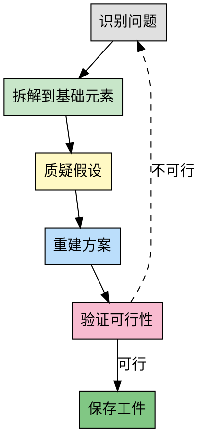

# 第一性原理思维

## 前置协议

### 环境检测

```bash
# 检测当前项目信息
PROJECT_ROOT=$(git rev-parse --show-toplevel 2>/dev/null || echo "unknown")
BRANCH=$(git branch --show-current 2>/dev/null || echo "unknown")
COMMIT=$(git rev-parse --short HEAD 2>/dev/null || echo "unknown")

echo "PROJECT: $PROJECT_ROOT"
echo "BRANCH: $BRANCH"
echo "COMMIT: $COMMIT"
```

### 前置技能检查

**benefits-from 检查**（推荐但非必须）：

```bash
# 检查 goal-oriented 工件
GOAL_ARTIFACT="memory/artifacts/goal-oriented/latest.json"

if [ -f "$GOAL_ARTIFACT" ]; then
  echo "FOUND: goal-oriented artifact"
  # 提取目标信息（使用 Read 工具读取）
  # 在分析中参考目标上下文
else
  echo "INFO: No goal-oriented artifact found"
  echo "Consider running /goal-oriented first for better context"
fi
```

**工件目录初始化**：

```bash
# 确保工件目录存在
mkdir -p memory/artifacts/first-principles
```

### 用户意图确认

根据用户消息判断：

**检查点**：
- [ ] 用户面临的问题是否需要创新方案
- [ ] 是否需要打破既有假设和惯例
- [ ] 问题复杂度是否适合第一性原理分析

**意图分类**：
1. **创新问题**：需要从本质重新构建解决方案
2. **性能优化**：找到瓶颈的根本原因
3. **技术选型**：从根本上分析需求
4. **架构设计**：从本质出发设计系统

## Overview

第一性原理是一种从最基础、最根本的真理或事实出发,重新构建问题解决方案的思维方式。它要求抛开现有假设、惯例或类比,直接追问"这件事的本质是什么?""最基本的构成要素是什么?",然后基于这些基础元素推导出新的可能性。

**核心区别**:
- **类比思维**: 基于现有方案改进("别人怎么做,我也能怎么做")
- **第一性原理**: 从本质重新构建("根本不需要这样做")

**典型例子**: 埃隆·马斯克思考火箭制造成本时,不是接受市场价,而是从原材料成本出发,得出自己制造更便宜的结论。

## When to Use

**适用场景**:
- 复杂问题需要创新方案
- 常规方法失效,需要突破
- 需要打破既有假设和惯例
- 成本/效率需要根本性突破
- 技术选型、架构设计等关键决策
- 用户明确要求"从本质思考"

**不适用场景**:
- 简单的、已解决的问题
- 标准化的、成熟的做法
- 时间紧急,需要快速复用现有方案

## The Process



### 步骤详解

**步骤 1: 识别问题**
- 清晰陈述当前面临的问题
- 区分"症状"和"根本问题"
- 明确问题的边界和约束
- 如果存在 goal-oriented 工件，参考目标上下文

**步骤 2: 拆解到基础元素**
- 将问题分解为最基础的组成部分
- 问"不能再拆分的是什么?"
- 识别物理定律、逻辑真理等不可动摇的基础

**步骤 3: 质疑假设**
- 列出所有"理所当然"的假设
- 问"这真的是必须的吗?"
- 问"如果这个假设不存在会怎样?"
- 区分"必须如此"和"习惯如此"

**步骤 4: 重建方案**
- 基于基础元素重新构建解决方案
- 不受现有方案的限制
- 探索多种可能性
- 记录每个方案的理由和权衡

**步骤 5: 验证可行性**
- 检查是否符合基础定律
- 评估实施成本和风险
- 如果不可行,回到步骤 1 重新审视问题
- 如果可行，进入工件保存阶段

**步骤 6: 保存工件**
- 生成工件 JSON 文件
- 记录分析过程和结果
- 推荐后续技能

## Thinking Framework

使用以下表格系统化地进行第一性原理思考:

| 层级 | 问题 | 提示 | 示例(火箭成本) |
|------|------|------|------------------|
| **表象** | 现在的问题是什么? | 描述症状和现象 | 火箭太贵,$65M/个 |
| **假设** | 我们认为的"必须如此"是什么? | 列出所有假设 | 必须买现成的、供应商定价合理 |
| **本质** | 最基础的构成要素是什么? | 物理定律、原材料、基本原理 | 铝、钛、碳纤维,材料成本$800K |
| **重建** | 如何从本质重新构建? | 忽略现有方案,从头设计 | 自己制造,成本降至$8M |

**思考提示**:
1. **表象层**: 不要把症状当成问题本身
2. **假设层**: 每个"必须"都要被质疑
3. **本质层**: 找到不可动摇的基础(物理、逻辑、数学)
4. **重建层**: 大胆假设,小心验证

## Examples

### 案例 1: 数据库查询性能优化

**问题**: 查询太慢,平均耗时 10 秒

**表象**: 查询慢,需要优化 SQL

**假设**:
- 索引已经够好了
- 数据量大是瓶颈
- 需要更快的硬件

**本质**:
- 磁盘 I/O 是真正的瓶颈(占比 70%)
- 大量不必要的全表扫描
- 查询逻辑冗余

**重建**:
- 从 I/O 优化入手,而非 SQL 调优
- 引入缓存层减少磁盘访问
- 重写查询逻辑,只查必要字段
- 结果: 查询时间降至 0.8 秒

### 案例 2: 软件架构技术选型

**问题**: 需要选择微服务框架

**表象**: Spring Cloud、Dubbo、gRPC 哪个更好?

**假设**:
- 必须用成熟的框架
- 功能越多越好
- 社区活跃度最重要

**本质**:
- 业务需求是"服务间通信"
- 当前团队规模 < 10 人
- 流量 < 1K QPS

**重建**:
- 不需要复杂的微服务框架
- 使用简单的 HTTP REST + 服务发现即可
- 后续可平滑迁移
- 结果: 降低复杂度,加快开发速度

## Common Pitfalls

### 误区 1: 过度拆解,忽视实用性
- **表现**: 为了拆解而拆解,陷入无休止的哲学讨论
- **正确做法**: 拆解到"可操作"的层级即可,平衡深度与效率

### 误区 2: 忽视现有知识积累
- **表现**: 从零开始造轮子,重复发明
- **正确做法**: 第一性原理是质疑假设,不是否定一切。已验证的知识要继承

### 误区 3: 混淆"本质"与"表象"
- **表现**: 把表面现象当成根本原因
- **正确做法**: 连续追问"为什么"至少 5 次(5 Whys 方法)

### 误区 4: 缺乏验证环节
- **表现**: 提出理论方案后直接实施
- **正确做法**: 必须进行可行性验证,小范围试点

## 后置协议

### 工件输出

保存第一性原理分析结果到工件文件：

```bash
# 生成工件文件名
TIMESTAMP=$(date +%Y%m%d-%H%M%S)
ARTIFACT_FILE="memory/artifacts/first-principles/result-$TIMESTAMP.json"

# 写入工件
cat > "$ARTIFACT_FILE" <<EOF
{
  "skill": "first-principles",
  "version": "2.0.0",
  "timestamp": "$(date -u +%Y-%m-%dT%H:%M:%SZ)",
  "project": "$PROJECT_ROOT",
  "branch": "$BRANCH",
  "commit": "$COMMIT",
  "input": {
    "user_request": "用户的原始请求"
  },
  "output": {
    "problem": "识别的问题",
    "assumptions": [
      "假设1",
      "假设2"
    ],
    "fundamentals": [
      "基础元素1",
      "基础元素2"
    ],
    "solution": "重建的解决方案",
    "validation": "可行性验证结果"
  },
  "next_skills": [
    "ddd-strategic-design",
    "mvp-first",
    "pdca-cycle"
  ]
}
EOF

echo "ARTIFACT SAVED: $ARTIFACT_FILE"

# 创建 latest.json 符号链接
ln -sf "$ARTIFACT_FILE" memory/artifacts/first-principles/latest.json
```

### 目标文件更新

如果存在目标文件，记录分析完成：

```bash
# 检查是否有 pending 目标
GOAL_FILE=$(ls -t memory/goals/*.md 2>/dev/null | head -1)

if [ -n "$GOAL_FILE" ]; then
  GOAL_STATUS=$(grep "状态：" "$GOAL_FILE" | awk '{print $2}')

  if [ "$GOAL_STATUS" = "pending" ]; then
    echo "GOAL STATUS: $GOAL_STATUS"
    echo "Adding milestone: 第一性原理分析完成"

    # 使用 Edit 工具添加里程碑
    # 例如："第一性原理分析完成 - {时间}"
  fi
fi
```

### 建议后续技能

根据分析结果，推荐后续技能：

**推荐格式**：
```markdown
## 后续建议

基于第一性原理分析结果，建议继续执行：

**推荐技能链**：
1. /ddd-strategic-design - 如果涉及系统架构设计
2. /mvp-first - 如果是新系统或新功能
3. /pdca-cycle - 进入迭代执行阶段

**根据解决方案类型选择**：
- **架构设计类** → /ddd-strategic-design → /ddd-tactical-design
- **新系统开发** → /mvp-first → /pdca-cycle
- **性能优化类** → /pdca-cycle
- **技术选型类** → 直接进入实施

是否继续执行？
- A) 执行推荐的技能链
- B) 只执行第一个技能
- C) 不继续，结束当前任务
```

## References

- 《第一性原理》- 亚里士多德哲学基础
- Elon Musk on First Principles Thinking - TED Talk
- Zero to One - Peter Thiel
- [第一性原理思维导图](https://example.com/first-principles-mindmap)