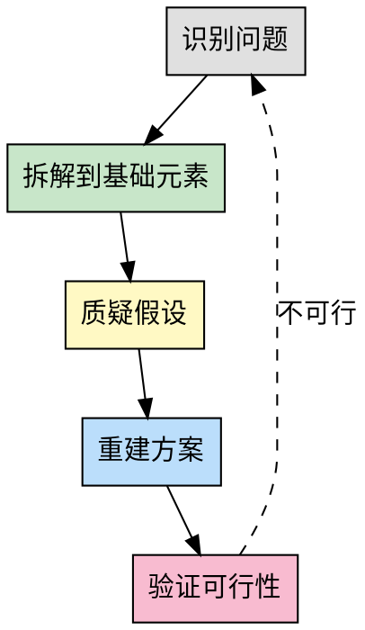

# 第一性原理思维

## Overview

第一性原理是一种从最基础、最根本的真理或事实出发,重新构建问题解决方案的思维方式。它要求抛开现有假设、惯例或类比,直接追问"这件事的本质是什么?""最基本的构成要素是什么?",然后基于这些基础元素推导出新的可能性。

**核心区别**:
- **类比思维**: 基于现有方案改进("别人怎么做,我也能怎么做")
- **第一性原理**: 从本质重新构建("根本不需要这样做")

**典型例子**: 埃隆·马斯克思考火箭制造成本时,不是接受市场价,而是从原材料成本出发,得出自己制造更便宜的结论。

## When to Use

**适用场景**:
- 复杂问题需要创新方案
- 常规方法失效,需要突破
- 需要打破既有假设和惯例
- 成本/效率需要根本性突破
- 技术选型、架构设计等关键决策
- 用户明确要求"从本质思考"

**不适用场景**:
- 简单的、已解决的问题
- 标准化的、成熟的做法
- 时间紧急,需要快速复用现有方案

## The Process

### 步骤详解

**步骤 1: 识别问题**
- 清晰陈述当前面临的问题
- 区分"症状"和"根本问题"
- 明确问题的边界和约束

**步骤 2: 拆解到基础元素**
- 将问题分解为最基础的组成部分
- 问"不能再拆分的是什么?"
- 识别物理定律、逻辑真理等不可动摇的基础

**步骤 3: 质疑假设**
- 列出所有"理所当然"的假设
- 问"这真的是必须的吗?"
- 问"如果这个假设不存在会怎样?"
- 区分"必须如此"和"习惯如此"

**步骤 4: 重建方案**
- 基于基础元素重新构建解决方案
- 不受现有方案的限制
- 探索多种可能性

**步骤 5: 验证可行性**
- 检查是否符合基础定律
- 评估实施成本和风险
- 如果不可行,回到步骤 1 重新审视问题

## Thinking Framework

使用以下表格系统化地进行第一性原理思考:

| 层级 | 问题 | 提示 | 示例(火箭成本) |
|------|------|------|------------------|
| **表象** | 现在的问题是什么? | 描述症状和现象 | 火箭太贵,$65M/个 |
| **假设** | 我们认为的"必须如此"是什么? | 列出所有假设 | 必须买现成的、供应商定价合理 |
| **本质** | 最基础的构成要素是什么? | 物理定律、原材料、基本原理 | 铝、钛、碳纤维,材料成本$800K |
| **重建** | 如何从本质重新构建? | 忽略现有方案,从头设计 | 自己制造,成本降至$8M |

**思考提示**:
1. **表象层**: 不要把症状当成问题本身
2. **假设层**: 每个"必须"都要被质疑
3. **本质层**: 找到不可动摇的基础(物理、逻辑、数学)
4. **重建层**: 大胆假设,小心验证

## The Process

### 步骤详解

**步骤 1: 识别问题**
- 清晰陈述当前面临的问题
- 区分"症状"和"根本问题"
- 明确问题的边界和约束

**步骤 2: 拆解到基础元素**
- 将问题分解为最基础的组成部分
- 问"不能再拆分的是什么?"
- 识别物理定律、逻辑真理等不可动摇的基础

**步骤 3: 质疑假设**
- 列出所有"理所当然"的假设
- 问"这真的是必须的吗?"
- 问"如果这个假设不存在会怎样?"
- 区分"必须如此"和"习惯如此"

**步骤 4: 重建方案**
- 基于基础元素重新构建解决方案
- 不受现有方案的限制
- 探索多种可能性

**步骤 5: 验证可行性**
- 检查是否符合基础定律
- 评估实施成本和风险
- 如果不可行,回到步骤 1 重新审视问题

## Thinking Framework

使用以下表格系统化地进行第一性原理思考:

| 层级 | 问题 | 提示 | 示例(火箭成本) |
|------|------|------|------------------|
| **表象** | 现在的问题是什么? | 描述症状和现象 | 火箭太贵,$65M/个 |
| **假设** | 我们认为的"必须如此"是什么? | 列出所有假设 | 必须买现成的、供应商定价合理 |
| **本质** | 最基础的构成要素是什么? | 物理定律、原材料、基本原理 | 铝、钛、碳纤维,材料成本$800K |
| **重建** | 如何从本质重新构建? | 忽略现有方案,从头设计 | 自己制造,成本降至$8M |

**思考提示**:
1. **表象层**: 不要把症状当成问题本身
2. **假设层**: 每个"必须"都要被质疑
3. **本质层**: 找到不可动摇的基础(物理、逻辑、数学)
4. **重建层**: 大胆假设,小心验证