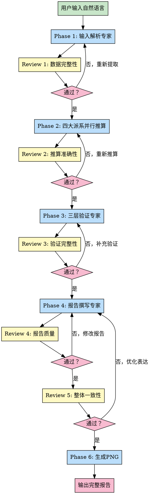

# FortuneTeller 多代理版 v2.4.0

> 融合紫微斗数、生辰八字、盲派、南北派四大派系的综合命理推算系统

## 版本说明

**v2.4.0（2026-03-19）- 多代理协作版**
- ✅ 重构为多代理协作架构（7个专业子代理）
- ✅ 三层验证机制（计算验证→LLM验证→交叉验证）
- ✅ 三层Review流程（准确性→一致性→可读性）
- ✅ 充分利用LLM推理能力，减少JavaScript计算负担
- ✅ 输出更专业更深入的命理分析报告

**v2.3.0（2026-03-17）- 一键生成版**
- ✅ 自动生成PNG信息图（横版1920x1080 + 竖版1080x1920）
- ✅ 支持中文数字日期解析（农历十月初六、正月初一等）
- ✅ 完全自动化流程，无需用户中途干预
- ✅ 文字报告 + 图片可视化，双输出模式

## 核心架构

### 从单脚本到多代理协作

**v2.3.0 架构**:
```
JavaScript计算引擎 → AI主对话分析 → 输出报告
```

**v2.4.0 多代理架构**:
```
Phase 1: 输入解析专家 → Review 1（数据完整性）
Phase 2: 三大派系推算（并行）→ Review 2（推算准确性）
   ├─ 八字专家 → 四柱推算
   ├─ 紫微专家 → 斗数分析
   └─ 盲派专家 → 口诀推演
Phase 3: 三层验证专家 → Review 3（验证完整性）
Phase 4: 报告撰写专家 → Review 4（报告质量）
Phase 5: 最终Review（整体一致性）
Phase 6: 生成PNG → 输出完整报告
```

**核心优化**：每个子代理完成后立即Review，确保质量关卡前置，问题早发现早解决。

**注**：南北派专家暂时屏蔽，待后续优化后再启用。

### 子代理配置

系统包含6个专业子代理，配置文件位于 `agents/` 目录：

1. **输入解析专家** (`input-parser-specialist.md`)
   - 从自然语言中提取姓名、性别、日期、时辰、地点
   - 支持多种日期格式（公历、农历、干支）
   - 支持12时辰表达方式
   - 支持40+主要城市坐标匹配

2. **八字专家** (`bazi-specialist.md`)
   - 四柱排盘（年柱、月柱、日柱、时柱）
   - 五行分析（强弱、缺失、流通）
   - 十神配置（性格、关系、事业）
   - 格局判断（正格、从格、化格）
   - 大运计算（起运年龄、大运排列）

3. **紫微专家** (`ziwei-specialist.md`)
   - 十二宫位配置
   - 十四主星分析
   - 四化飞星推演
   - 大限流年预测

4. **盲派专家** (`mengpai-specialist.md`)
   - 三维定位法（格局-流通-调候）
   - 墓库能量开关理论
   - 十神精析系统
   - 传统口诀应用
   - 神煞计算
   - 流年应期
   - 趋吉避凶建议

5. **验证专家** (`validation-specialist.md`)
   - 第一层：计算验证（排盘准确性）
   - 第二层：LLM逻辑验证（因果一致性）
   - 第三层：派系交叉验证（结论一致性）

6. **报告撰写专家** (`report-writer-specialist.md`)
   - 整合所有推演结果
   - 生成结构化Markdown报告
   - 专业术语通俗化
   - 包含置信度评估

**注**：南北派专家暂时屏蔽，待后续优化。

### Review流程（关键优化）

**核心理念**：每个子代理完成后立即Review，质量关卡前置，问题早发现早解决。

**Review 1**（Phase 1完成后）：输入数据完整性检查
- 检查姓名、性别、日期、时辰、地点是否完整提取
- 验证日期格式转换是否正确（农历→公历）
- 验证时辰解析是否准确（12时辰→24小时制）
- 验证地点坐标匹配是否正确
- **不通过**：返回重新提取，不允许进入Phase 2

**Review 2**（Phase 2完成后）：推算准确性检查
- 检查八字四柱排盘是否正确
- 检查五行统计是否准确
- 检查紫微宫位配置是否合理
- 检查各派系理论应用是否得当
- 验证计算结果与理论是否一致
- **不通过**：指出错误，要求重新推算

**Review 3**（Phase 3完成后）：验证完整性检查
- 检查三层验证是否全部完成
- 检查验证逻辑是否清晰
- 检查问题发现是否充分
- 检查置信度评估是否合理
- **不通过**：要求补充验证内容

**Review 4**（Phase 4完成后）：报告质量检查
- 检查报告结构是否完整
- 检查内容是否全面覆盖所有派系
- 检查专业术语是否准确
- 检查逻辑是否连贯
- 检查是否有遗漏或错误
- **不通过**：要求修改报告内容

**Review 5**（最终Review）：整体一致性与可读性
- 检查整个报告的一致性
- 检查派系结论是否矛盾
- 检查语言表达是否自然流畅
- 检查是否有AI痕迹
- 检查置信度标注是否准确
- **不通过**：要求优化表达

**Review专家配置**：
- 可由主代理兼任，或调用独立的Review子代理
- 每次Review输出结构化结果：`{"status": "pass/fail", "issues": [], "suggestions": []}`

## 使用说明

### 用户输入

用户用自然语言输入基本信息，例如：

```
帮我算命，张三 男 2025年3月15日 下午2点 北京
```

**必需信息（全部必填，不得省略）：**
- 姓名
- 性别（男/女）
- 出生日期（2025年3月15日 或 农历十月初六）
- 出生时辰（X点 或 上午X点、下午X点、晚上X点）
- 出生地点（北京、上海、广州等）

**⚠️ 重要：所有信息必须由用户提供，不允许使用默认值！**
如果用户没有提供任何一项，应反复询问，直到获取所有信息。

### AI工具执行流程



**详细步骤**：

**步骤1**: AI工具识别意图
- 用户: "帮我算命，张三 男 2025年3月15日 下午2点 北京"
- AI识别: 这是算命请求，触发 fortune-teller skill

**步骤2**: Phase 1 - 输入解析 + Review 1
- 调用输入解析专家子代理
- 提取结构化数据（姓名、性别、日期、时辰、地点）
- **立即Review 1**：检查数据完整性
  - 姓名是否提取？性别是否识别？
  - 日期格式转换是否正确？
  - 时辰解析是否准确？
  - 地点坐标是否匹配？
- 如果Review不通过：返回重新提取，不允许进入Phase 2

**步骤3**: Phase 2 - 四大派系推算 + Review 2
- 并行调用4个子代理：
  - 八字专家 → 生成八字分析
  - 紫微专家 → 生成紫微分析
  - 盲派专家 → 生成盲派分析
  - 南北派专家 → 生成南北派对比
- **立即Review 2**：检查推算准确性
  - 八字四柱是否正确？
  - 五行统计是否准确？
  - 理论应用是否得当？
  - 计算结果是否一致？
- 如果Review不通过：指出错误，要求重新推算

**步骤4**: Phase 3 - 三层验证 + Review 3
- 调用验证专家子代理
- 第一层：计算验证
- 第二层：LLM逻辑验证
- 第三层：派系交叉验证
- 生成置信度评分
- **立即Review 3**：检查验证完整性
  - 三层验证是否全部完成？
  - 验证逻辑是否清晰？
  - 问题发现是否充分？
  - 置信度评估是否合理？
- 如果Review不通过：要求补充验证内容

**步骤5**: Phase 4 - 报告撰写 + Review 4
- 调用报告撰写专家子代理
- 整合所有推演结果
- 生成结构化Markdown报告
- **立即Review 4**：检查报告质量
  - 报告结构是否完整？
  - 内容是否全面覆盖？
  - 术语是否准确？
  - 逻辑是否连贯？
- 如果Review不通过：要求修改报告内容

**步骤6**: Review 5 - 整体一致性与可读性
- 检查整个报告的一致性
- 检查派系结论是否矛盾
- 检查语言表达是否自然流畅
- 检查是否有AI痕迹
- 检查置信度标注是否准确
- 如果Review不通过：要求优化表达

**步骤7**: Phase 6 - 生成PNG
- 自动调用 `/infographic-generator`
- 生成横版（1920x1080）和竖版（1080x1920）信息图

**步骤8**: 输出最终报告
- Markdown报告（8000-12000字）
- PNG信息图（横版+竖版）

### 输出内容

**完整命理分析报告**（Markdown格式）：

1. **基本信息** - 姓名、性别、出生日期、真太阳时
2. **八字排盘** - 四柱、五行、十神、神煞
3. **紫微斗数** - 十二宫、主星、四化、大限
4. **综合分析** - 性格、事业、财运、感情、健康
5. **大运流年** - 大运走势、流年提醒
6. **趋吉避凶** - 有利因素、注意事项
7. **验证与置信度** - 三层验证结果、置信度评分
8. **免责声明** - 仅供参考，娱乐而已

**PNG信息图**：
- 横版（1920x1080）：适合博客、报告
- 竖版（1080x1920）：适合手机分享、小红书

## 文件输出规范

**⚠️ 重要规则：所有文件输出必须严格遵守以下目录规范**

### 目录结构

```
fortune-teller/
├── agents/         # 子代理配置目录（新增）
│   ├── input-parser-specialist.md
│   ├── bazi-specialist.md
│   ├── ziwei-specialist.md
│   ├── mengpai-specialist.md
│   ├── nanbeipai-specialist.md
│   ├── validation-specialist.md
│   └── report-writer-specialist.md
│
├── lib/            # 计算引擎库（保留）
│   ├── bazi-calculator.js
│   ├── ziwei-calculator.js
│   └── ...
│
├── prompts/        # 提示词模板（保留）
│   ├── ziwei-analysis.md
│   ├── bazi-analysis.md
│   └── ...
│
├── output/         # 正式输出目录
│   ├── [姓名]_命盘数据.json
│   ├── [姓名]_完整命理报告.md
│   ├── [姓名]_命盘信息图_横版.png
│   └── [姓名]_命盘信息图_竖版.png
│
├── test/           # 测试输出目录
└── backup/         # 备份目录
```

## 三层验证机制

### 第一层：计算验证

**目标**: 确保排盘计算的准确性

**验证内容**：
- 八字四柱准确性（年柱、月柱、日柱、时柱）
- 五行统计准确性（数量、缺失）
- 神煞计算准确性（天乙贵人、桃花、驿马等）
- 紫微宫位配置准确性（十二宫、主星）

**方法**：调用计算引擎验证

### 第二层：LLM逻辑验证

**目标**: 确保分析推理的合理性

**验证内容**：
- 因果关系验证（五行生克逻辑链）
- 结论依据验证（判断是否有理论支撑）
- 矛盾检测（不同分析之间是否矛盾）
- 过度推断检测（是否有超出依据的结论）

**方法**：LLM分析推理

### 第三层：派系交叉验证

**目标**: 确保多派系结论的一致性

**验证内容**：
- 八字 vs 紫微（结论是否一致）
- 八字 vs 盲派（口诀是否支持）
- 南派 vs 北派（差异是否可解释）
- 置信度评估（综合评分）

**方法**：派系对比分析

## 技术架构

### 计算引擎（lib/）

保留现有的JavaScript计算引擎，用于：

1. **精确计算**
   - 真太阳时计算
   - 八字排盘计算
   - 紫微斗数排盘
   - 大运流年计算

2. **被Agent调用**
   - 子代理可以通过Bash工具调用计算引擎
   - 例如：`node lib/bazi-calculator.js --date "2025-03-15" --time 14`

3. **验证基准**
   - 为验证专家提供计算基准
   - 确保LLM推理不偏离理论

### 提示词库（prompts/）

保留现有的提示词模板，用于：

1. **子代理参考**
   - 提供专业知识库
   - 提供分析方法论

2. **动态加载**
   - 子代理可以读取prompts/*.md
   - 作为背景知识参考

### 子代理系统（agents/）

新增的子代理配置文件，定义：

1. **角色定位** - 每个子代理的专业领域
2. **核心能力** - 擅长的分析维度
3. **输入输出** - 结构化的JSON格式
4. **工作流程** - 分析步骤
5. **质量标准** - 输出要求

## Token消耗与时间预估

**总Token消耗**: ~28,000 tokens（含5次Review）

**各阶段消耗**：
- Phase 1（输入解析）: ~2,000 tokens
- Review 1: ~500 tokens
- Phase 2（四大派系）: ~10,000 tokens（并行）
- Review 2: ~1,500 tokens
- Phase 3（验证）: ~3,000 tokens
- Review 3: ~800 tokens
- Phase 4（报告撰写）: ~4,000 tokens
- Review 4: ~1,000 tokens
- Review 5（最终）: ~1,200 tokens
- Phase 6（生成PNG）: ~500 tokens
- 其他开销: ~3,500 tokens

**总时间预估**: 3-5分钟

**Review时间占比**：约20-25%的时间用于Review，但可以避免后期返工，整体效率更高。

## 核心优势

### 1. 专业化分工
- 每个派系有专门的Agent
- 充分利用LLM推理能力
- 输出更专业更深入

### 2. 质量保证
- 三层验证机制
- 三层Review流程
- 置信度评分
- 八字验证

### 3. 可扩展性
- 新增派系只需添加配置文件
- 无需修改JavaScript代码
- 易于维护和优化

### 4. 参考wechat-article-writer成功模式
- 相同的多代理架构
- 相同的自然语言指导
- 相同的Review机制

## 注意事项

1. **日期格式**：支持农历和阳历，系统会自动转换并验证
2. **真太阳时**：提供出生地可以获得更准确的时辰
3. **验证机制**：系统会进行三层验证确保准确
4. **大运流年**：分析会考虑对应的时代背景
5. **置信度**：报告会明确标注置信度评分

## 更新日志

- v2.4.0: 多代理协作版，7个子代理，三层验证，三层Review
- v2.3.0: 一键生成版，自动生成PNG信息图
- v2.2.0: 重大改进版，文件输出规范，优化提示词
- v2.1.0: 完整增强版，三层验证，增强报告生成器
- v1.0.0: 初始版本，包含四大派系排盘和基本分析