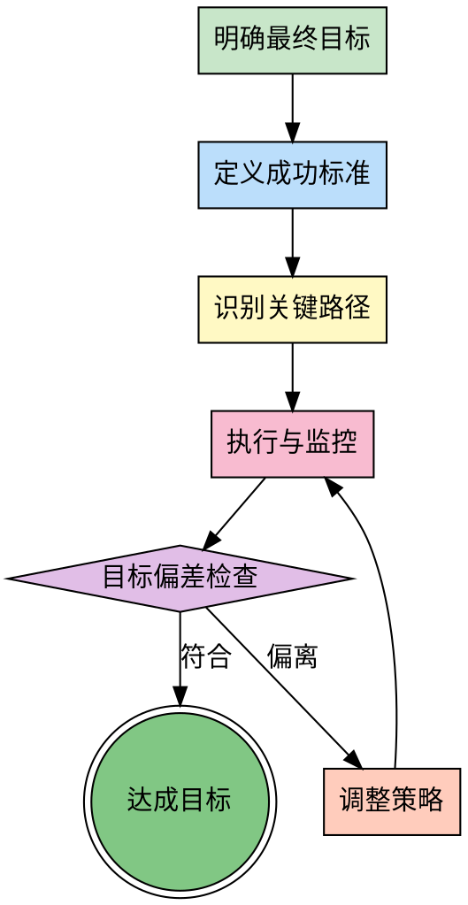

# 目标导向思维

## Overview

目标导向思维强调以最终目标为指引，所有行动、决策都服务于达成这个目标。它关注的是"我要达到什么结果？"，并确保过程中不偏离方向。

**核心原则**：以终为始（Begin with the End in Mind）

**关键价值**：
- 避免任务偏离目标（Scope Creep）
- 确保资源投入在关键路径上
- 快速识别无关工作
- 保持团队方向一致

## When to Use

**适用场景**：
- 执行长期任务（周期 > 1周）
- 项目规划和管理
- 容易偏离目标的复杂任务
- 多任务并行，需要优先级判断
- 资源受限，需要聚焦
- 用户明确要求"目标导向地执行"

**不适用场景**：
- 简单的、明确的小任务
- 探索性工作，目标本身不明确

## The Process



### 步骤详解

**步骤 1: 明确最终目标**
- 用一句话陈述最终目标
- 确保目标符合 SMART 原则
- 区分"目标"和"手段"

**步骤 2: 定义成功标准**
- 如何判断目标达成？
- 设置可衡量的指标
- 明确验收条件

**步骤 3: 识别关键路径**
- 找出达成目标的必经之路
- 识别阻塞任务和依赖关系
- 确定优先级

**步骤 4: 执行与监控**
- 按照关键路径执行
- 持续监控进度
- 记录偏差和问题

**步骤 5: 目标偏差检查**
- 定期（每日/每周）检查是否偏离
- 问"现在的行动是否服务于最终目标？"
- 评估优先级变化

**步骤 6: 调整策略**
- 发现偏离立即调整
- 不要因为投入成本而继续错误方向（沉没成本谬误）
- 重新规划关键路径

## Goal Decomposition Tool

使用以下清单确保目标清晰且可执行：

- [ ] **目标陈述**: 用一句话清晰描述最终目标
- [ ] **成功标准（SMART）**:
  - Specific（具体的）: 明确要达成什么
  - Measurable（可衡量）: 有量化指标
  - Achievable（可实现）: 资源和能力可行
  - Relevant（相关性）: 与大局目标一致
  - Time-bound（时限）: 有明确的截止时间
- [ ] **关键里程碑**: 分解为 3-5 个关键节点
- [ ] **潜在干扰因素**: 识别可能偏离目标的风险
- [ ] **偏离预警信号**: 设置触发调整的阈值

**目标分解示例**：

```
目标: 重构用户认证模块，提升安全性

成功标准:
- [x] Specific: 重构认证模块，消除安全隐患
- [x] Measurable: 测试覆盖率 > 90%，无高危漏洞
- [x] Achievable: 2人周，技术栈不变
- [x] Relevant: 降低安全事故风险
- [x] Time-bound: 2周内完成

关键里程碑:
- M1: 完成现有代码审计（Day 3）
- M2: 实现核心重构（Day 7）
- M3: 测试通过并上线（Day 10）

潜在干扰因素:
- 新需求插入
- 依赖服务变更
- 团队成员抽调

偏离预警信号:
- 里程碑延期 > 20%
- 新增非核心功能
- 讨论偏离认证安全主题
```

## Examples

### 案例 1: 产品开发项目的目标管理

**目标**: 在 3 个月内上线一个 MVP

**成功标准**:
- 核心功能完整
- 用户测试满意度 > 4.0/5.0
- 无 P0 级 Bug
- DAU > 1000

**关键路径**:
1. 需求确认（Week 1）
2. 核心功能开发（Week 2-8）
3. 测试与优化（Week 9-10）
4. 上线与推广（Week 11-12）

**执行与监控**:
- 每周五检查进度
- 发现 Week 6 偏离：团队在优化非核心功能
- **立即调整**: 移除非核心功能，聚焦 MVP

**结果**: 按时上线，达成目标

### 案例 2: 技术债务清理的目标导向执行

**目标**: 降低代码复杂度 30%

**成功标准**:
- 圈复杂度 < 15（原 22）
- 测试覆盖率 > 70%（原 45%）
- 文档完整

**执行过程**:
- 每天检查: "这次重构是否降低复杂度？"
- 发现偏离: 团队在优化性能（非目标）
- **调整**: 提醒聚焦复杂度，性能优化后续专项处理

**结果**: 复杂度降至 13，覆盖率 75%

## Common Pitfalls

### 误区 1: 目标模糊，无法衡量
- **表现**: "把代码写好一点"、"提升用户体验"
- **正确做法**: 使用 SMART 原则，明确量化指标

### 误区 2: 过度关注手段，忘记目的
- **表现**: 纠结技术选型 2 周，忘记目标只是"快速上线"
- **正确做法**: 定期问"这个手段是否必要？"

### 误区 3: 忽视环境变化，僵化执行
- **表现**: 目标已不现实，但仍然按原计划执行
- **正确做法**: 定期重新评估目标的合理性

### 误区 4: 沉没成本谬误
- **表现**: "已经做了 3 周，不能放弃"
- **正确做法**: 如果方向错误，立即调整，不考虑沉没成本

## References

- 《高效能人士的七个习惯》- 以终为始
- SMART Goals - Peter Drucker
- OKR 工作法 - John Doerr
- [目标管理最佳实践](https://example.com/goal-management)