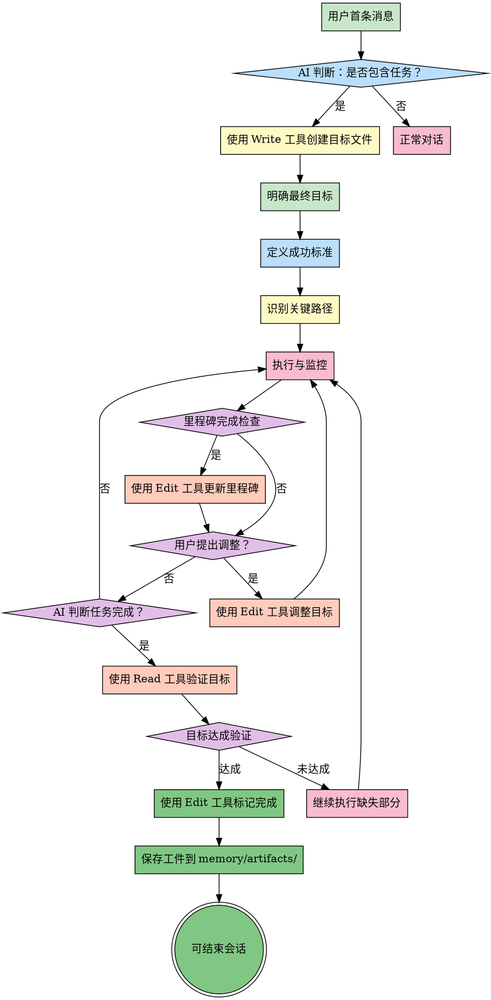

# 目标导向思维

## 前置协议

### 环境检测

```bash
# 检测当前项目信息
PROJECT_ROOT=$(git rev-parse --show-toplevel 2>/dev/null || echo "unknown")
BRANCH=$(git branch --show-current 2>/dev/null || echo "unknown")
COMMIT=$(git rev-parse --short HEAD 2>/dev/null || echo "unknown")

echo "PROJECT: $PROJECT_ROOT"
echo "BRANCH: $BRANCH"
echo "COMMIT: $COMMIT"

# 检查是否在 Git 仓库中
if [ "$PROJECT_ROOT" = "unknown" ]; then
  echo "WARNING: Not in a Git repository"
fi
```

### 前置技能检查

**dependencies 检查**（无依赖）：

此技能无前置依赖，可直接执行。

**工件目录初始化**：

```bash
# 确保工件目录和目标目录存在
mkdir -p memory/artifacts/goal-oriented
mkdir -p memory/goals
```

### 用户意图确认

根据用户消息判断：

**检查点**：
- [ ] 用户请求是否包含任务特征（行动指令、多步骤需求）
- [ ] 是否需要创建新目标、更新现有目标或验证目标
- [ ] 确定是纯信息查询还是需要执行的任务

**意图分类**：
1. **创建目标**：用户提出新任务，当前无 pending 目标
2. **调整目标**：用户修改需求，当前有 pending 目标
3. **验证目标**：AI 认为完成，需要验证目标达成情况
4. **查询/对话**：纯信息查询或简单问答，无需创建目标

## Overview

目标导向思维强调以最终目标为指引，所有行动、决策都服务于达成这个目标。它关注的是"我要达到什么结果？"，并确保过程中不偏离方向。

**核心原则**：以终为始（Begin with the End in Mind）

**关键价值**：
- 避免任务偏离目标（Scope Creep）
- 确保资源投入在关键路径上
- 快速识别无关工作
- 保持团队方向一致

## When to Use

**适用场景**：
- 需要实现新需求、新想法、新任务
- 执行中长期任务（周期 > 1分钟 或者 步骤>1）
- 项目规划和管理
- 容易偏离目标的复杂任务
- 多任务并行，需要优先级判断
- 资源受限，需要聚焦
- 用户明确要求"目标导向地执行"

**不适用场景**：
- 简单的、明确的小任务，比如计算1+1=？
- 探索性工作，目标本身不明确

## ⚠️ 强制执行规则（Iron Law）

### ⚡ 核心原则：持续触发

**每个用户消息都必须触发 goal-oriented 检查**，无论之前是否已创建目标。

触发后，根据当前状态执行相应动作：
- 无目标 → 创建目标
- 有 pending 目标 → 检查用户意图（补充/调整/重新开始）
- 有 completed 目标 → 检查是否新任务

---

### 任务开始时（强制创建目标）

**检测标准**：
- 用户消息包含行动指令（实现、修复、重构、优化、分析、设计、review等）
- 多步骤需求（需要 1+ 步骤完成）
- 涉及代码编写、文件修改、系统设计、代码审查
- **当前无 pending 目标**

**强制动作**：使用 Write 工具创建目标文件（见"目标文件操作指南"）

**无需询问用户**，立即执行。

**例外情况**：
- 纯信息查询（"什么是XXX"、"XXX怎么用"）
- 简单问答（是/否问题、知识咨询）
- 用户明确表示"只是问问"、"随便聊聊"
- **已存在 pending 目标**（转到"任务执行中"规则）

如果对话中途演变成任务，必须补创建目标。

---

### 任务执行中（强制调整目标）

**触发条件**：
- **已存在 pending 目标**
- 用户继续提供需求细节
- 用户明确修改需求（"算了"、"改成"、"加一个"、"另外还要"）
- 用户补充新的要求或约束
- 环境变化导致目标不可行

**强制动作**：使用 Edit 工具调整目标文件（见"目标文件操作指南"）

**调整原则**：
- 立即同步用户的新意图
- 保留完整的调整历史（版本记录）
- 后续验证使用最新版本目标

**用户说"重新实现"、"从头开始"时的处理**：
1. 检查现有目标的进展
2. 如果目标未开始执行（无代码、无进度）→ 直接调整现有目标
3. 如果目标已开始执行 → 询问用户：
   - "现有目标已有进展，是创建新目标还是调整现有目标？"
   - 提供：创建新目标 / 调整现有目标 / 取消两个选项

---

### 任务完成时（强制验证目标）

**触发时机**：
- AI 认为"完成了"、"做好了"、"实现了"
- 准备提交代码、创建 PR
- 准备结束会话

**强制动作**：使用 Read 工具读取目标文件并验证（见"目标文件操作指南"）

**验证结果处理**：
- ✅ 目标达成 → 可标记完成，准备结束会话
- ❌ 目标未达成 → 必须继续执行缺失部分，不得声称"基本完成"

---

### 违规行为（不可接受）

- ❌ 执行任务但未创建目标
- ❌ 用户调整需求但未更新目标
- ❌ 自称"完成"但未验证
- ❌ 验证失败但声称"基本完成"

**任何违反上述规则的行为都是不可接受的。**

## The Process



### 步骤详解

**步骤 1: AI 判断是否包含任务**
- 分析用户首条消息
- 检测任务特征（行动指令、多步骤需求）
- 决定是否触发目标追踪

**步骤 2: 使用 Write 工具创建目标文件（强制）**
- 自动创建目标文件
- 记录用户原始需求
- 提取 SMART 目标

**步骤 3: 明确最终目标**
- 用一句话陈述最终目标
- 确保目标符合 SMART 原则
- 区分"目标"和"手段"

**步骤 4: 定义成功标准**
- 如何判断目标达成？
- 设置可衡量的指标
- 明确验收条件

**步骤 5: 识别关键路径**
- 找出达成目标的必经之路
- 识别阻塞任务和依赖关系
- 确定优先级

**步骤 6: 执行与监控**
- 按照关键路径执行
- 持续监控进度
- 记录偏差和问题

**步骤 7: 里程碑完成检查**
- 识别阶段性成果
- 触发里程碑更新

**步骤 8: 使用 Edit 工具更新里程碑（可选）**
- 更新里程碑进展
- 保持进度透明

**步骤 9: 用户提出调整？（强制）**
- 监听用户需求变更
- 立即调整目标

**步骤 10: 使用 Edit 工具调整目标（强制）**
- 更新 SMART 目标
- 保留历史版本
- 同步新意图

**步骤 11: AI 判断任务完成？**
- AI 自我评估
- 触发强制验证

**步骤 12: 使用 Read 工具验证目标（强制）**
- 对比原始目标 vs 实际完成
- 识别缺失项
- 输出验证结果

**步骤 13: 目标达成验证**
- 判断是否完全达成
- 决定后续行动

**步骤 14: 继续执行缺失部分（如果未达成）**
- 补充缺失功能
- 不得声称"基本完成"

**步骤 15: 使用 Edit 工具标记完成**
- 更新目标文件状态
- 记录完成时间
- 准备结束会话

**步骤 16: 保存工件到 memory/artifacts/**
- 生成工件 JSON 文件
- 创建 latest.json 符号链接
- 记录后续建议技能

## Goal Decomposition Tool

使用以下清单确保目标清晰且可执行：

- [ ] **目标陈述**: 用一句话清晰描述最终目标
- [ ] **成功标准（SMART）**:
  - Specific（具体的）: 明确要达成什么
  - Measurable（可衡量）: 有量化指标
  - Achievable（可实现）: 资源和能力可行
  - Relevant（相关性）: 与大局目标一致
  - Time-bound（时限）: 有明确的截止时间
- [ ] **关键里程碑**: 分解为 3-5 个关键节点
- [ ] **潜在干扰因素**: 识别可能偏离目标的风险
- [ ] **偏离预警信号**: 设置触发调整的阈值

**目标分解示例**：

```
目标: 重构用户认证模块，提升安全性

成功标准:
- [x] Specific: 重构认证模块，消除安全隐患
- [x] Measurable: 测试覆盖率 > 90%，无高危漏洞
- [x] Achievable: 2人周，技术栈不变
- [x] Relevant: 降低安全事故风险
- [x] Time-bound: 2周内完成

关键里程碑:
- M1: 完成现有代码审计（Day 3）
- M2: 实现核心重构（Day 7）
- M3: 测试通过并上线（Day 10）

潜在干扰因素:
- 新需求插入
- 依赖服务变更
- 团队成员抽调

偏离预警信号:
- 里程碑延期 > 20%
- 新增非核心功能
- 讨论偏离认证安全主题
```

## 目标文件操作指南

### 目标文件位置

**存储路径**：`memory/goals/YYYY-MM-DD_HHMM_目标关键词.md`

**关键词提取规则**：从 `smart_specific` 中提取前20个非空格字符作为文件名

**目录创建**：如果 `memory/goals/` 目录不存在，需先创建

---

### 操作1：创建目标（create）

**触发时机**：任务开始时（强制）

**执行步骤**：

1. **提取时间戳**
   ```
   timestamp = "2026-03-23_2005"  # 格式：YYYY-MM-DD_HHMM
   ```

2. **提取关键词**
   ```
   keywords = smart_specific.replace(" ", "")[:20]
   # 示例："修复英文页面404错误，确保路由正常工作" → "修复英文页面404错误，确保路由"
   ```

3. **组装文件路径**
   ```
   file_path = f"memory/goals/{timestamp}_{keywords}.md"
   ```

4. **使用 Write 工具创建文件**，填充以下模板：

```markdown
# 目标追踪记录

## 原始需求
{用户原始表述}

## 目标提取（SMART）
- **Specific（具体）**: {具体目标}
- **Measurable（可衡量）**: {衡量标准}
- **Achievable（可实现）**: 待评估
- **Relevant（相关）**: 待说明
- **Time-bound（时限）**: 本次会话

## 创建信息
- 创建时间：{YYYY-MM-DD HH:MM}
- 会话ID：当前会话
- 当前版本：1

## 目标调整历史

### 版本 1（{时间}）
- **SMART-Specific**: {具体目标}
- **SMART-Measurable**: {衡量标准}

## 验证记录
（待填写）

## 最终状态
- 状态：pending
- 完成时间：-
- 备注：-
```

**完整示例**：

```
用户消息："现在在中文时候跳转一切正常，但是英文时候全是404，和最开始中文的bug一样"

AI 执行：
1. 提取时间戳："2026-03-23_2005"
2. 提取关键词："修复英文页面404错误，确保路由"
3. 文件路径："memory/goals/2026-03-23_2005_修复英文页面404错误，确保路由.md"

Write(
  file_path="memory/goals/2026-03-23_2005_修复英文页面404错误，确保路由.md",
  content="""
# 目标追踪记录

## 原始需求
现在在中文时候跳转一切正常，但是英文时候全是404，和最开始中文的bug一样

## 目标提取（SMART）
- **Specific（具体）**: 修复英文页面的404错误，确保路由正常工作
- **Measurable（可衡量）**: 所有英文页面可正常访问，无404错误
- **Achievable（可实现）**: 待评估
- **Relevant（相关）**: 待说明
- **Time-bound（时限）**: 本次会话

## 创建信息
- 创建时间：2026-03-23 20:05
- 会话ID：当前会话
- 当前版本：1

## 目标调整历史

### 版本 1（2026-03-23 20:05）
- **SMART-Specific**: 修复英文页面的404错误，确保路由正常工作
- **SMART-Measurable**: 所有英文页面可正常访问，无404错误

## 验证记录
（待填写）

## 最终状态
- 状态：pending
- 完成时间：-
- 备注：-
"""
)

✅ 输出："目标已创建：memory/goals/2026-03-23_2005_修复英文页面404错误，确保路由.md"
```

---

### 操作2：更新里程碑（update）

**触发时机**：阶段性完成时

**执行步骤**：

1. **使用 Read 工具读取目标文件**（可选，确认当前内容）

2. **使用 Edit 工具追加里程碑内容**，在 `## 验证记录` 前插入：

```
Edit(
  file_path="memory/goals/2026-03-23_2005_修复英文页面404错误，确保路由.md",
  old_string="## 验证记录",
  new_string="""### 里程碑：{里程碑描述}
更新时间：{YYYY-MM-DD HH:MM}

## 验证记录"""
)
```

**完整示例**：

```
里程碑描述："诊断完成，发现英文路由配置问题"
时间："2026-03-23 20:10"

Edit(
  file_path="memory/goals/2026-03-23_2005_修复英文页面404错误，确保路由.md",
  old_string="## 验证记录",
  new_string="""### 里程碑：诊断完成，发现英文路由配置问题
更新时间：2026-03-23 20:10

## 验证记录"""
)

✅ 输出："已更新里程碑：诊断完成，发现英文路由配置问题"
```

---

### 操作3：调整目标（adjust）

**触发时机**：用户修改需求时（强制）

**执行步骤**：

1. **使用 Read 工具读取目标文件**，提取当前版本号

2. **使用 Edit 工具依次更新**：
   - 更新版本号
   - 更新 SMART 目标
   - 追加调整历史

**完整示例**：

```
用户消息："对了，还要优化路由架构，不只是修复404"

AI 执行：

# 步骤1：读取文件，当前版本号为 1
Read(file_path="memory/goals/2026-03-23_2005_修复英文页面404错误，确保路由.md")

# 步骤2：更新版本号（1 → 2）
Edit(
  file_path="memory/goals/2026-03-23_2005_修复英文页面404错误，确保路由.md",
  old_string="当前版本：1",
  new_string="当前版本：2"
)

# 步骤3：更新 SMART-Specific
Edit(
  file_path="memory/goals/2026-03-23_2005_修复英文页面404错误，确保路由.md",
  old_string="- **Specific（具体）**: 修复英文页面的404错误，确保路由正常工作",
  new_string="- **Specific（具体）**: 修复英文页面404错误，并优化路由架构"
)

# 步骤4：更新 SMART-Measurable
Edit(
  file_path="memory/goals/2026-03-23_2005_修复英文页面404错误，确保路由.md",
  old_string="- **Measurable（可衡量）**: 所有英文页面可正常访问，无404错误",
  new_string="- **Measurable（可衡量）**: 所有英文页面正常访问，路由架构清晰，无冗余路由"
)

# 步骤5：追加调整历史
Edit(
  file_path="memory/goals/2026-03-23_2005_修复英文页面404错误，确保路由.md",
  old_string="## 验证记录",
  new_string="""### 版本 2（2026-03-23 20:15）
- **调整原因**: 用户要求优化路由架构
- **SMART-Specific**: 修复英文页面404错误，并优化路由架构
- **SMART-Measurable**: 所有英文页面正常访问，路由架构清晰，无冗余路由

## 验证记录"""
)

✅ 输出：
"目标已调整"
"调整原因：用户要求优化路由架构"
"新版本：2"
```

---

### 操作4：验证目标（verify）

**触发时机**：AI 认为任务完成时（强制）

**执行步骤**：

1. **使用 Read 工具读取目标文件**

2. **提取 SMART 目标**：
   - Specific（具体）
   - Measurable（可衡量）

3. **对比 AI 自评完成情况**

4. **输出验证结果**：
   - ✅ 目标达成
   - ❌ 目标未达成 + 缺失项列表

**完整示例**：

```
AI 自评："已修复英文路由配置，优化了路由架构，所有测试通过"

AI 执行：

Read(file_path="memory/goals/2026-03-23_2005_修复英文页面404错误，确保路由.md")

提取目标：
- Specific: 修复英文页面404错误，并优化路由架构
- Measurable: 所有英文页面正常访问，路由架构清晰，无冗余路由

对比分析：
✅ 修复了英文页面404错误
✅ 优化了路由架构
✅ 所有测试通过

验证结果：
📋 原始目标：修复英文页面404错误，并优化路由架构
🔍 实际完成情况：已修复英文路由配置，优化了路由架构，所有测试通过
✅ 目标达成验证通过
```

---

### 操作5：标记完成（complete）

**触发时机**：目标验证通过后

**执行步骤**：

使用 Edit 工具更新状态和完成时间：

**完整示例**：

```
完成时间："2026-03-23 20:20"

# 步骤1：更新状态
Edit(
  file_path="memory/goals/2026-03-23_2005_修复英文页面404错误，确保路由.md",
  old_string="状态：pending",
  new_string="状态：completed"
)

# 步骤2：更新完成时间
Edit(
  file_path="memory/goals/2026-03-23_2005_修复英文页面404错误，确保路由.md",
  old_string="完成时间：-",
  new_string="完成时间：2026-03-23 20:20"
)

✅ 输出：
"目标已完成"
"完成时间：2026-03-23 20:20"
```

---

### 操作6：列出所有目标（list）

**触发时机**：查看项目所有目标时

**执行步骤**：

1. 使用 Glob 工具查找 `memory/goals/*.md` 文件
2. 使用 Read 工具读取每个文件的状态和目标
3. 按状态过滤（可选）

**完整示例**：

```
查看所有 pending 状态的目标：

Glob(pattern="memory/goals/*.md")

输出：
1. memory/goals/2026-03-23_2005_修复英文页面404错误，确保路由.md (pending)
2. memory/goals/2026-03-22_1015_重构用户认证模块.md (completed)
```

## Examples

### 案例 1: 完善 goal-oriented 的完整流程

**用户消息**：
"完善 goal-oriented 的触发条件；只要用户下达了什么任务，这个 goal-oriented skills 就要记录..."

**步骤 1: AI 检测到任务，使用 Write 工具创建目标**

```
Write(
  file_path="memory/goals/2026-03-18_0930_完善goal-oriented触发条件.md",
  content="""
# 目标追踪记录

## 原始需求
完善 goal-oriented 的触发条件；只要用户下达了什么任务，这个 goal-oriented skills 就要记录...

## 目标提取（SMART）
- **Specific（具体）**: 实现自动目标追踪和验证机制
- **Measurable（可衡量）**: 任务记录,会话结束前验证,未达成继续执行
- **Achievable（可实现）**: 待评估
- **Relevant（相关）**: 待说明
- **Time-bound（时限）**: 本次会话

## 创建信息
- 创建时间：2026-03-18 09:30
- 会话ID：当前会话
- 当前版本：1

## 目标调整历史

### 版本 1（2026-03-18 09:30）
- **SMART-Specific**: 实现自动目标追踪和验证机制
- **SMART-Measurable**: 任务记录,会话结束前验证,未达成继续执行

## 验证记录
（待填写）

## 最终状态
- 状态：pending
- 完成时间：-
- 备注：-
"""
)
```

✅ 输出：`目标已创建：memory/goals/2026-03-18_0930_完善goal-oriented触发条件.md`

**步骤 2: AI 执行任务，使用 Edit 工具更新里程碑**

```
Edit(
  file_path="memory/goals/2026-03-18_0930_完善goal-oriented触发条件.md",
  old_string="## 验证记录",
  new_string="""### 里程碑：goal-tracker.py 脚本开发完成
更新时间：2026-03-18 10:00

## 验证记录"""
)
```

✅ 输出：`已更新里程碑：goal-tracker.py 脚本开发完成`

**步骤 3: 用户补充需求，使用 Edit 工具调整目标**

**用户消息**：
"对了，还要支持实时调整目标，防止用户在后续会话中改变主意"

```
# 更新版本号
Edit(
  file_path="memory/goals/2026-03-18_0930_完善goal-oriented触发条件.md",
  old_string="当前版本：1",
  new_string="当前版本：2"
)

# 更新 SMART 目标
Edit(
  file_path="memory/goals/2026-03-18_0930_完善goal-oriented触发条件.md",
  old_string="- **Specific（具体）**: 实现自动目标追踪和验证机制",
  new_string="- **Specific（具体）**: 实现自动目标追踪、验证和动态调整机制"
)

# 追加调整历史
Edit(
  file_path="memory/goals/2026-03-18_0930_完善goal-oriented触发条件.md",
  old_string="## 验证记录",
  new_string="""### 版本 2（2026-03-18 10:15）
- **调整原因**: 用户补充：需要实时调整目标
- **SMART-Specific**: 实现自动目标追踪、验证和动态调整机制
- **SMART-Measurable**: 任务记录,会话结束前验证,未达成继续执行,实时调整目标

## 验证记录"""
)
```

✅ 输出：`目标已调整，新版本：2`

**步骤 4: AI 认为完成，使用 Read 工具验证目标**

```
Read(file_path="memory/goals/2026-03-18_0930_完善goal-oriented触发条件.md")

提取目标：
- Specific: 实现自动目标追踪、验证和动态调整机制
- Measurable: 任务记录,会话结束前验证,未达成继续执行,实时调整目标

AI 自评："已完成脚本开发、文档更新、支持动态调整"

验证结果：
📋 原始目标：实现自动目标追踪、验证和动态调整机制
🔍 实际完成情况：所有功能已实现并测试通过
✅ 目标达成验证通过
```

**步骤 5: 使用 Edit 工具标记完成**

```
Edit(
  file_path="memory/goals/2026-03-18_0930_完善goal-oriented触发条件.md",
  old_string="状态：pending",
  new_string="状态：completed"
)

Edit(
  file_path="memory/goals/2026-03-18_0930_完善goal-oriented触发条件.md",
  old_string="完成时间：-",
  new_string="完成时间：2026-03-18 11:00"
)
```

✅ 输出：`目标已完成`

**结果**：最终交付与最初承诺完全一致，无目标偏离。

### 案例 2: 产品开发项目的目标管理

**目标**: 在 3 个月内上线一个 MVP

**成功标准**:
- 核心功能完整
- 用户测试满意度 > 4.0/5.0
- 无 P0 级 Bug
- DAU > 1000

**关键路径**:
1. 需求确认（Week 1）
2. 核心功能开发（Week 2-8）
3. 测试与优化（Week 9-10）
4. 上线与推广（Week 11-12）

**执行与监控**:
- 每周五检查进度
- 发现 Week 6 偏离：团队在优化非核心功能
- **立即调整**: 移除非核心功能，聚焦 MVP

**结果**: 按时上线，达成目标

### 案例 3: 技术债务清理的目标导向执行

**目标**: 降低代码复杂度 30%

**成功标准**:
- 圈复杂度 < 15（原 22）
- 测试覆盖率 > 70%（原 45%）
- 文档完整

**执行过程**:
- 每天检查: "这次重构是否降低复杂度？"
- 发现偏离: 团队在优化性能（非目标）
- **调整**: 提醒聚焦复杂度，性能优化后续专项处理

**结果**: 复杂度降至 13，覆盖率 75%

## Common Pitfalls

### 误区 1: 目标模糊，无法衡量
- **表现**: "把代码写好一点"、"提升用户体验"
- **正确做法**: 使用 SMART 原则，明确量化指标

### 误区 2: 过度关注手段，忘记目的
- **表现**: 纠结技术选型 2 周，忘记目标只是"快速上线"
- **正确做法**: 定期问"这个手段是否必要？"

### 误区 3: 忽视环境变化，僵化执行
- **表现**: 目标已不现实，但仍然按原计划执行
- **正确做法**: 定期重新评估目标的合理性

### 误区 4: 沉没成本谬误
- **表现**: "已经做了 3 周，不能放弃"
- **正确做法**: 如果方向错误，立即调整，不考虑沉没成本

### 误区 5: 未验证就声称完成
- **表现**: AI 说"完成了"、"做好了"，但没有使用 Read 工具验证目标
- **正确做法**: AI 认为完成时，必须使用 Read 工具读取目标文件并验证

### 误区 6: 验证失败但跳过缺失项
- **表现**: 验证发现目标未完全达成，但 AI 说"基本完成"、"核心功能都有了"
- **正确做法**: 必须继续执行缺失部分，直到目标完全达成

### 误区 7: 用户调整需求但未更新目标
- **表现**: 用户说"算了，改成 XXX"，AI 继续按原目标执行
- **正确做法**: 立即使用 Edit 工具调整目标文件，同步用户新意图

### 误区 8: 执行任务但未创建目标
- **表现**: AI 开始执行多步骤任务，但没有在开始时创建目标文件
- **正确做法**: 会话开始时检测到任务，立即使用 Write 工具创建目标文件

## 后置协议

### 工件输出

保存目标创建/调整结果到工件文件：

```bash
# 生成工件文件名
TIMESTAMP=$(date +%Y%m%d-%H%M%S)
ARTIFACT_FILE="memory/artifacts/goal-oriented/result-$TIMESTAMP.json"

# 读取目标文件信息
GOAL_FILE=$(ls -t memory/goals/*.md 2>/dev/null | head -1)

if [ -n "$GOAL_FILE" ]; then
  # 提取目标信息
  SMART_SPECIFIC=$(grep "^\*\*Specific" "$GOAL_FILE" | sed 's/.*: *//')
  SMART_MEASURABLE=$(grep "^\*\*Measurable" "$GOAL_FILE" | sed 's/.*: *//')
  GOAL_STATUS=$(grep "状态：" "$GOAL_FILE" | awk '{print $2}')

  # 写入工件
  cat > "$ARTIFACT_FILE" <<EOF
{
  "skill": "goal-oriented",
  "version": "2.0.0",
  "timestamp": "$(date -u +%Y-%m-%dT%H:%M:%SZ)",
  "project": "$PROJECT_ROOT",
  "branch": "$BRANCH",
  "commit": "$COMMIT",
  "input": {
    "user_request": "用户的原始请求"
  },
  "output": {
    "goal_file": "$GOAL_FILE",
    "smart_specific": "$SMART_SPECIFIC",
    "smart_measurable": "$SMART_MEASURABLE",
    "status": "$GOAL_STATUS"
  },
  "next_skills": [
    "first-principles",
    "mvp-first",
    "pdca-cycle"
  ]
}
EOF

  echo "ARTIFACT SAVED: $ARTIFACT_FILE"

  # 创建 latest.json 符号链接
  ln -sf "$ARTIFACT_FILE" memory/artifacts/goal-oriented/latest.json
else
  echo "No goal file found, skipping artifact generation"
fi
```

### 目标文件更新

如果目标文件存在，记录技能执行：

```bash
# 检查是否有 pending 目标
GOAL_FILE=$(ls -t memory/goals/*.md 2>/dev/null | head -1)

if [ -n "$GOAL_FILE" ]; then
  # 检查目标状态
  GOAL_STATUS=$(grep "状态：" "$GOAL_FILE" | awk '{print $2}')

  if [ "$GOAL_STATUS" = "pending" ]; then
    echo "GOAL STATUS: $GOAL_STATUS"
    echo "GOAL FILE: $GOAL_FILE"

    # 可选：使用 Edit 工具添加里程碑记录
    # 例如："goal-oriented 技能执行完成 - {时间}"
  fi
fi
```

### 建议后续技能

根据目标类型，推荐后续技能：

**推荐格式**：
```markdown
## 后续建议

基于当前目标，建议继续执行：

**推荐技能链**：
1. /first-principles - 从本质思考问题，找到最优解
2. /mvp-first - 如果是复杂系统，进行 MVP 规划
3. /pdca-cycle - 进入 PDCA 循环执行阶段

**根据目标类型选择**：
- **创新问题** → /first-principles
- **复杂系统** → /ddd-strategic-design → /ddd-tactical-design → /mvp-first
- **优化任务** → /pdca-cycle
- **战略分析** → /swot-analysis

是否继续执行？
- A) 执行推荐的技能链
- B) 只执行第一个技能
- C) 不继续，结束当前任务
```

## References

- 《高效能人士的七个习惯》- 以终为始，不忘初心，方得始终
- SMART Goals - Peter Drucker
- OKR 工作法 - John Doerr