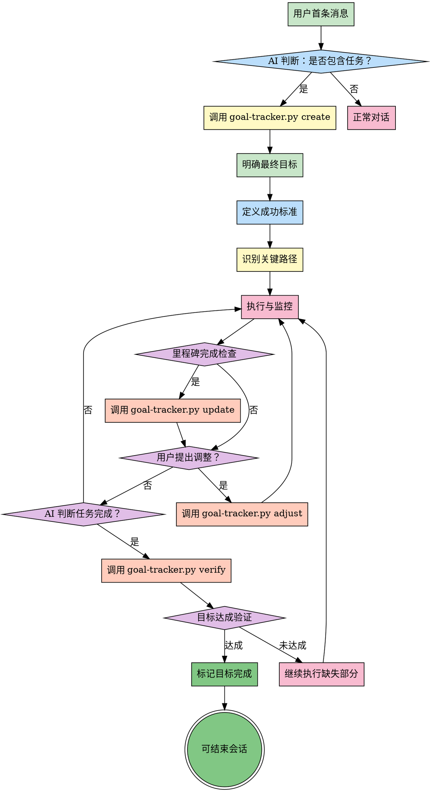

# 目标导向思维

## Overview

目标导向思维强调以最终目标为指引，所有行动、决策都服务于达成这个目标。它关注的是"我要达到什么结果？"，并确保过程中不偏离方向。

**核心原则**：以终为始（Begin with the End in Mind）

**关键价值**：
- 避免任务偏离目标（Scope Creep）
- 确保资源投入在关键路径上
- 快速识别无关工作
- 保持团队方向一致

## When to Use

**适用场景**：
- 执行长期任务（周期 > 1分钟 或者 步骤>2）
- 项目规划和管理
- 容易偏离目标的复杂任务
- 多任务并行，需要优先级判断
- 资源受限，需要聚焦
- 用户明确要求"目标导向地执行"

**不适用场景**：
- 简单的、明确的小任务
- 探索性工作，目标本身不明确

## ⚠️ 强制执行规则（Iron Law）

### ⚡ 核心原则：持续触发

**每个用户消息都必须触发 goal-oriented 检查**，无论之前是否已创建目标。

触发后，根据当前状态执行相应动作：
- 无目标 → 创建目标
- 有 pending 目标 → 检查用户意图（补充/调整/重新开始）
- 有 completed 目标 → 检查是否新任务

---

### 任务开始时（强制创建目标）

**检测标准**：
- 用户消息包含行动指令（实现、修复、重构、优化、分析、设计等）
- 多步骤需求（需要 2+ 步骤完成）
- 涉及代码编写、文件修改、系统设计
- **当前无 pending 目标**

**强制动作**：
```bash
python tools/goal-tracker.py create \
  --raw "{用户原始表述}" \
  --smart-specific "{提取的具体目标}" \
  --smart-measurable "{可衡量的成功标准}"
```

**无需询问用户**，立即执行。

**例外情况**：
- 纯信息查询（"什么是XXX"、"XXX怎么用"）
- 简单问答（是/否问题、知识咨询）
- 用户明确表示"只是问问"、"随便聊聊"
- **已存在 pending 目标**（转到"任务执行中"规则）

如果对话中途演变成任务，必须补创建目标。

---

### 任务执行中（强制调整目标）

**触发条件**：
- **已存在 pending 目标**
- 用户继续提供需求细节
- 用户明确修改需求（"算了"、"改成"、"加一个"、"另外还要"）
- 用户补充新的要求或约束
- 环境变化导致目标不可行

**强制动作**：
```bash
python tools/goal-tracker.py adjust \
  --file "{目标文件路径}" \
  --reason "{调整原因}" \
  --new-specific "{新的具体目标}" \
  --new-measurable "{新的衡量标准}"
```

**调整原则**：
- 立即同步用户的新意图
- 保留完整的调整历史（版本记录）
- 后续验证使用最新版本目标

**用户说"重新实现"、"从头开始"时的处理**：
1. 检查现有目标的进展
2. 如果目标未开始执行（无代码、无进度）→ 直接调整现有目标
3. 如果目标已开始执行 → 询问用户：
   - "现有目标已有进展，是创建新目标还是调整现有目标？"
   - 提供：创建新目标 / 调整现有目标 / 取消两个选项

---

### 任务完成时（强制验证目标）

**触发时机**：
- AI 认为"完成了"、"做好了"、"实现了"
- 准备提交代码、创建 PR
- 准备结束会话

**强制动作**：
```bash
python tools/goal-tracker.py verify \
  --file "{目标文件路径}" \
  --ai-assessment "{AI 自评完成情况}"
```

**验证结果处理**：
- ✅ 目标达成 → 可标记完成，准备结束会话
- ❌ 目标未达成 → 必须继续执行缺失部分，不得声称"基本完成"

---

### 违规行为（不可接受）

- ❌ 执行任务但未创建目标
- ❌ 用户调整需求但未更新目标
- ❌ 自称"完成"但未验证
- ❌ 验证失败但声称"基本完成"

**任何违反上述规则的行为都是不可接受的。**

## The Process



### 步骤详解

**步骤 1: AI 判断是否包含任务**
- 分析用户首条消息
- 检测任务特征（行动指令、多步骤需求）
- 决定是否触发目标追踪

**步骤 2: 调用 goal-tracker.py create（强制）**
- 自动创建目标文件
- 记录用户原始需求
- 提取 SMART 目标

**步骤 3: 明确最终目标**
- 用一句话陈述最终目标
- 确保目标符合 SMART 原则
- 区分"目标"和"手段"

**步骤 4: 定义成功标准**
- 如何判断目标达成？
- 设置可衡量的指标
- 明确验收条件

**步骤 5: 识别关键路径**
- 找出达成目标的必经之路
- 识别阻塞任务和依赖关系
- 确定优先级

**步骤 6: 执行与监控**
- 按照关键路径执行
- 持续监控进度
- 记录偏差和问题

**步骤 7: 里程碑完成检查**
- 识别阶段性成果
- 触发里程碑更新

**步骤 8: 调用 goal-tracker.py update（可选）**
- 更新里程碑进展
- 保持进度透明

**步骤 9: 用户提出调整？（强制）**
- 监听用户需求变更
- 立即调整目标

**步骤 10: 调用 goal-tracker.py adjust（强制）**
- 更新 SMART 目标
- 保留历史版本
- 同步新意图

**步骤 11: AI 判断任务完成？**
- AI 自我评估
- 触发强制验证

**步骤 12: 调用 goal-tracker.py verify（强制）**
- 对比原始目标 vs 实际完成
- 识别缺失项
- 输出验证结果

**步骤 13: 目标达成验证**
- 判断是否完全达成
- 决定后续行动

**步骤 14: 继续执行缺失部分（如果未达成）**
- 补充缺失功能
- 不得声称"基本完成"

**步骤 15: 标记目标完成**
- 更新目标文件状态
- 记录完成时间
- 准备结束会话

## Goal Decomposition Tool

使用以下清单确保目标清晰且可执行：

- [ ] **目标陈述**: 用一句话清晰描述最终目标
- [ ] **成功标准（SMART）**:
  - Specific（具体的）: 明确要达成什么
  - Measurable（可衡量）: 有量化指标
  - Achievable（可实现）: 资源和能力可行
  - Relevant（相关性）: 与大局目标一致
  - Time-bound（时限）: 有明确的截止时间
- [ ] **关键里程碑**: 分解为 3-5 个关键节点
- [ ] **潜在干扰因素**: 识别可能偏离目标的风险
- [ ] **偏离预警信号**: 设置触发调整的阈值

**目标分解示例**：

```
目标: 重构用户认证模块，提升安全性

成功标准:
- [x] Specific: 重构认证模块，消除安全隐患
- [x] Measurable: 测试覆盖率 > 90%，无高危漏洞
- [x] Achievable: 2人周，技术栈不变
- [x] Relevant: 降低安全事故风险
- [x] Time-bound: 2周内完成

关键里程碑:
- M1: 完成现有代码审计（Day 3）
- M2: 实现核心重构（Day 7）
- M3: 测试通过并上线（Day 10）

潜在干扰因素:
- 新需求插入
- 依赖服务变更
- 团队成员抽调

偏离预警信号:
- 里程碑延期 > 20%
- 新增非核心功能
- 讨论偏离认证安全主题
```

## 目标追踪工具使用指南

### 工具位置

`skills/goal-oriented/tools/goal-tracker.py`

**⚠️ 重要：脚本使用当前工作目录作为项目根目录，目标文件会存在 `<当前目录>/memory/goals/`。**

**AI 工具执行方式**（推荐）：
```bash
# AI 工具会自动从项目根目录执行
python skills/goal-oriented/tools/goal-tracker.py create \
  --raw "用户原始表述" \
  --smart-specific "具体目标" \
  --smart-measurable "衡量标准"
```

**手动执行方式**：
```bash
# 方式1: 从项目根目录执行（如果项目中有 skills/ 目录）
cd /path/to/your/project
python skills/goal-oriented/tools/goal-tracker.py create ...

# 方式2: 使用全局安装的 skill
cd /path/to/your/project
python ~/.agents/skills/goal-oriented/tools/goal-tracker.py create ...
```

**⚠️ 注意**：必须在项目根目录执行，否则目标文件会存错位置！

### 常用命令

**1. 创建目标**（会话开始时强制）
```bash
python skills/goal-oriented/tools/goal-tracker.py create \
  --raw "用户原始表述" \
  --smart-specific "具体目标" \
  --smart-measurable "衡量标准"
```

**2. 更新里程碑**（阶段性完成时）
```bash
python skills/goal-oriented/tools/goal-tracker.py update \
  --file "memory/goals/2026-03-18_0930_目标关键词.md" \
  --milestone "里程碑描述"
```

**3. 调整目标**（用户修改需求时强制）
```bash
python skills/goal-oriented/tools/goal-tracker.py adjust \
  --file "memory/goals/2026-03-18_0930_目标关键词.md" \
  --reason "调整原因" \
  --new-specific "新目标" \
  --new-measurable "新标准"
```

**4. 验证目标**（任务完成时强制）
```bash
python skills/goal-oriented/tools/goal-tracker.py verify \
  --file "memory/goals/2026-03-18_0930_目标关键词.md" \
  --ai-assessment "AI自评完成情况"
```

**5. 查看所有目标**
```bash
python skills/goal-oriented/tools/goal-tracker.py list --status pending
```

**6. 标记完成**
```bash
python skills/goal-oriented/tools/goal-tracker.py complete \
  --file "memory/goals/2026-03-18_0930_目标关键词.md" \
  --summary "完成总结"
```

### 目标文件位置

所有目标文件存储在项目根目录的 `memory/goals/` 目录下。

文件命名格式：`YYYY-MM-DD_HHMM_目标关键词.md`

### 目标文件结构

每个目标文件包含：
- 原始需求（用户原文）
- SMART 目标提取
- 创建信息（时间、会话ID、版本）
- 目标调整历史（支持版本追溯）
- 验证记录（每次验证的结果）
- 最终状态（pending/completed/abandoned）

详见：`skills/goal-oriented/templates/goal-template.md`

## Examples

### 案例 1: 完善 goal-oriented 触发条件的完整流程

**用户消息**：
"完善 goal-oriented 的触发条件；只要用户下达了什么任务，这个 goal-oriented skills 就要记录..."

**步骤 1: AI 检测到任务，强制创建目标**

```bash
python skills/goal-oriented/tools/goal-tracker.py create \
  --raw "完善 goal-oriented 的触发条件..." \
  --smart-specific "实现自动目标追踪和验证机制" \
  --smart-measurable "任务记录,会话结束前验证,未达成继续执行"
```

✅ 输出：`目标已创建：memory/goals/2026-03-18_0930_完善goal-oriented触发条件.md`

**步骤 2: AI 执行任务（开发脚本、更新文档）**

AI 开始执行任务，中途完成脚本开发里程碑：

```bash
python skills/goal-oriented/tools/goal-tracker.py update \
  --file "memory/goals/2026-03-18_0930_完善goal-oriented触发条件.md" \
  --milestone "goal-tracker.py 脚本开发完成"
```

✅ 输出：`已更新里程碑：goal-tracker.py 脚本开发完成`

**步骤 3: 用户补充需求，AI 强制调整目标**

**用户消息**：
"对了，还要支持实时调整目标，防止用户在后续会话中改变主意"

```bash
python skills/goal-oriented/tools/goal-tracker.py adjust \
  --file "memory/goals/2026-03-18_0930_完善goal-oriented触发条件.md" \
  --reason "用户补充：需要实时调整目标" \
  --new-specific "实现自动目标追踪、验证和动态调整机制" \
  --new-measurable "任务记录,会话结束前验证,未达成继续执行,实时调整目标"
```

✅ 输出：`目标已调整，新版本：2`

**步骤 4: AI 认为完成，强制验证目标**

AI 完成所有开发和测试：

```bash
python skills/goal-oriented/tools/goal-tracker.py verify \
  --file "memory/goals/2026-03-18_0930_完善goal-oriented触发条件.md" \
  --ai-assessment "已完成脚本开发、文档更新、支持动态调整"
```

✅ 输出：
```
📋 原始目标：实现自动目标追踪、验证和动态调整机制
🔍 实际完成情况：所有功能已实现并测试通过
✅ 目标达成验证通过
```

**步骤 5: 标记完成**

```bash
python skills/goal-oriented/tools/goal-tracker.py complete \
  --file "memory/goals/2026-03-18_0930_完善goal-oriented触发条件.md" \
  --summary "所有目标已达成"
```

✅ 输出：`目标已完成`

**结果**：最终交付与最初承诺完全一致，无目标偏离。

### 案例 2: 产品开发项目的目标管理

**目标**: 在 3 个月内上线一个 MVP

**成功标准**:
- 核心功能完整
- 用户测试满意度 > 4.0/5.0
- 无 P0 级 Bug
- DAU > 1000

**关键路径**:
1. 需求确认（Week 1）
2. 核心功能开发（Week 2-8）
3. 测试与优化（Week 9-10）
4. 上线与推广（Week 11-12）

**执行与监控**:
- 每周五检查进度
- 发现 Week 6 偏离：团队在优化非核心功能
- **立即调整**: 移除非核心功能，聚焦 MVP

**结果**: 按时上线，达成目标

### 案例 2: 技术债务清理的目标导向执行

**目标**: 降低代码复杂度 30%

**成功标准**:
- 圈复杂度 < 15（原 22）
- 测试覆盖率 > 70%（原 45%）
- 文档完整

**执行过程**:
- 每天检查: "这次重构是否降低复杂度？"
- 发现偏离: 团队在优化性能（非目标）
- **调整**: 提醒聚焦复杂度，性能优化后续专项处理

**结果**: 复杂度降至 13，覆盖率 75%

## Common Pitfalls

### 误区 1: 目标模糊，无法衡量
- **表现**: "把代码写好一点"、"提升用户体验"
- **正确做法**: 使用 SMART 原则，明确量化指标

### 误区 2: 过度关注手段，忘记目的
- **表现**: 纠结技术选型 2 周，忘记目标只是"快速上线"
- **正确做法**: 定期问"这个手段是否必要？"

### 误区 3: 忽视环境变化，僵化执行
- **表现**: 目标已不现实，但仍然按原计划执行
- **正确做法**: 定期重新评估目标的合理性

### 误区 4: 沉没成本谬误
- **表现**: "已经做了 3 周，不能放弃"
- **正确做法**: 如果方向错误，立即调整，不考虑沉没成本

### 误区 5: 未验证就声称完成
- **表现**: AI 说"完成了"、"做好了"，但没有调用 goal-tracker.py verify
- **正确做法**: AI 认为完成时，必须强制调用 verify 命令，对比原始目标

### 误区 6: 验证失败但跳过缺失项
- **表现**: 验证发现目标未完全达成，但 AI 说"基本完成"、"核心功能都有了"
- **正确做法**: 必须继续执行缺失部分，直到目标完全达成

### 误区 7: 用户调整需求但未更新目标
- **表现**: 用户说"算了，改成 XXX"，AI 继续按原目标执行
- **正确做法**: 立即调用 adjust 命令更新目标，同步用户新意图

### 误区 8: 执行任务但未创建目标
- **表现**: AI 开始执行多步骤任务，但没有在开始时创建目标文件
- **正确做法**: 会话开始时检测到任务，立即调用 create 命令

## References

- 《高效能人士的七个习惯》- 以终为始，不忘初心，方得始终
- SMART Goals - Peter Drucker
- OKR 工作法 - John Doerr