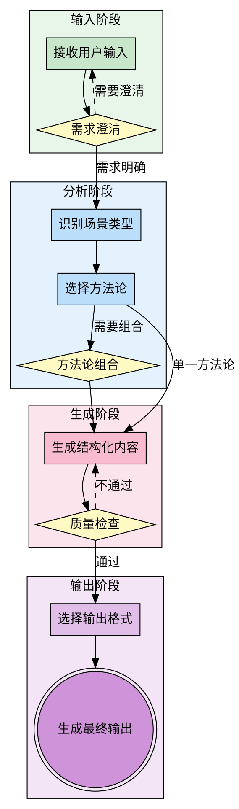
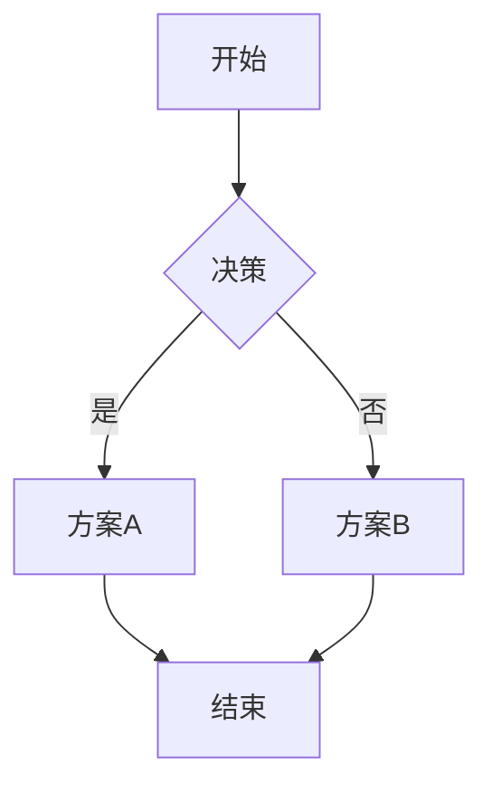
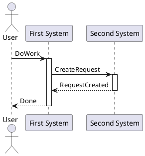
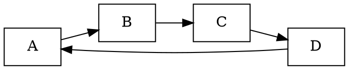
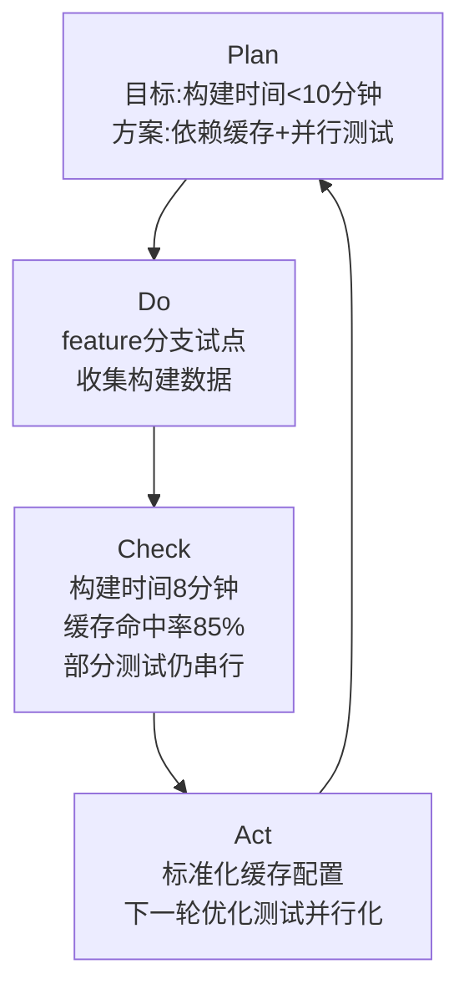
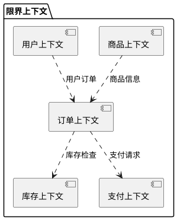
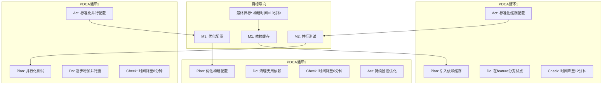

# 信息图生成器

## Overview

信息图生成器是一个根据用户输入的话题、主题和要求,自动生成结构化信息图内容框架的技能。它集成了SWOT、PDCA、第一性原理、目标导向、DDD战略设计等多种方法论,能够根据不同场景生成适合信息图展示的内容。

> ⚠️ **重要说明**：
> - 本技能生成的是信息图的**配置数据**（JSON格式），而不是最终的PNG图片
> - 配置数据包含完整的布局、样式、颜色、图标等信息
> - 要得到PNG图片，需要将配置数据提供给前端开发者或使用在线渲染工具
> - 本技能提供五种使用方式，适合不同需求的用户

**五种使用方式**：

### 方式一：技能渲染（最新，最简单）🆕

直接通过自然语言生成PNG图片，无需手动创建配置文件，提供统一的技能接口：

1. **使用自然语言描述**：用自然语言向AI描述你的需求
2. **自动生成配置**：AI自动生成JSON配置
3. **自动渲染**：自动渲染PNG图片

**命令示例**：

```bash
# 基本用法
node skill-render.js "请帮我生成一个关于Python编程语言的信息图"

# 指定输出路径
node skill-render.js "请帮我生成一个关于Python编程语言的信息图" --output output/python.png

# 不保存配置文件
node skill-render.js "请帮我生成一个关于Python编程语言的信息图" --no-save-config

# 指定配置文件路径
node skill-render.js "请帮我生成一个关于Python编程语言的信息图" --config config/python.json

# 使用特定模板和风格
node skill-render.js "请帮我生成一个关于Python编程语言的信息图，使用知识科普模板，包含4个核心特点：语法简洁、应用广泛、生态丰富、跨平台，使用极简风格"
```

**优势**：
- ✅ 最简单：只需一条命令
- ✅ 统一技能接口
- ✅ 无需手动创建配置文件
- ✅ 直接生成PNG图片
- ✅ 支持批量生成
- ✅ 提供编程接口

详细指南：[技能渲染指南](./SKILL_RENDER_GUIDE.md)

### 方式二：AI驱动渲染（推荐，最佳体验）

直接通过自然语言生成PNG图片，无需手动创建配置文件：

1. **使用自然语言描述**：用自然语言向AI描述你的需求
2. **自动生成配置**：AI自动生成JSON配置
3. **自动渲染**：自动渲染PNG图片

**示例**：
```bash
node ai-render.js "请帮我生成一个关于Python编程语言的信息图，使用知识科普模板，包含4个核心特点：语法简洁、应用广泛、生态丰富、跨平台，使用极简风格"
```

**优势**：
- ✅ 简单：只需一条命令
- ✅ 无需手动创建配置文件
- ✅ 直接生成PNG图片

详细指南：[AI驱动渲染指南](./assets/AI_RENDER_GUIDE.md)

### 方式三：自动化渲染（推荐，最佳体验）

结合自然语言和自动化，无需写代码，自动生成PNG图片：

1. **准备内容**：整理你想要展示的文本内容
2. **使用技能**：用自然语言向AI描述你的需求，获取JSON配置
3. **保存配置**：将JSON配置保存为文件
4. **自动渲染**：运行`npm run render config.json`自动生成PNG

**示例**：
```
请帮我生成一个关于Python编程语言的信息图，使用知识科普模板，
包含4个核心特点：语法简洁、应用广泛、生态丰富、跨平台，
使用极简风格。
```

**优势**：
- ✅ 无需写代码
- ✅ 只需自然语言描述
- ✅ 自动生成PNG图片
- ✅ 支持批量生成

详细指南：[自动化渲染指南](./assets/AUTO_RENDER_GUIDE.md)

### 方式四：自然语言使用（无需写代码）

适合所有用户，特别是不会写代码的用户：

> ⚠️ **注意**：这种方式生成的是**配置数据**（JSON格式），不是最终的PNG图片。要得到PNG图片，需要将配置数据提供给前端开发者或使用在线渲染工具。

1. **准备内容**：整理你想要展示的文本内容
2. **使用技能**：用自然语言向AI描述你的需求
3. **获取配置数据**：技能会生成JSON格式的配置数据
4. **生成PNG**：将配置数据提供给前端开发者，或使用在线渲染工具生成PNG

**示例**：
```
请帮我生成一个关于Python编程语言的信息图，使用知识科普模板，
包含4个核心特点：语法简洁、应用广泛、生态丰富、跨平台，
使用极简风格。
```

**优势**：
- ✅ 无需写代码
- ✅ 只需自然语言描述
- ✅ 快速生成配置数据
- ✅ 灵活调整内容

**局限性**：
- ⚠️ 生成的是配置数据，不是最终的PNG图片
- ⚠️ 需要前端开发者或在线工具才能生成PNG图片
- ⚠️ 无法直接在本地生成PNG图片

### 方式五：代码使用（适合开发者）

适合会写代码的开发者，可以完全自定义渲染过程并直接生成PNG图片：

> ✅ **优势**：这种方式可以直接在本地生成PNG图片，无需依赖其他工具或开发者。

1. **安装依赖**：安装Node.js和Canvas
2. **运行示例**：使用提供的示例脚本
3. **自定义内容**：修改代码中的内容
4. **生成PNG**：运行脚本生成PNG图片

详细教程请查看：[assets/TUTORIAL.md](./assets/TUTORIAL.md)

**优势**：
- ✅ 完全自定义
- ✅ 批量生成
- ✅ 集成到现有项目
- ✅ 高度灵活
- ✅ 直接生成PNG图片，无需其他工具

**核心价值**：
- **快速生成**：从输入到输出,快速生成结构化信息图内容框架
- **方法论支撑**：复用成熟方法论,保证内容质量和逻辑性
- **多格式支持**：JSON、Markdown、Mermaid、PlantUML、Graphviz DOT
- **灵活适配**：支持不同场景、不同受众、不同深度的需求
- **易于集成**：生成的结构化数据可直接用于前端可视化
- **文字变图**：将文本内容自动转换为视觉化信息图,提升信息传达效率

**工作原理**：
1. 接收用户输入的话题、主题和要求
2. 解析需求并识别场景类型
3. 选择合适的方法论或方法论组合
4. 基于方法论生成结构化内容
5. 输出适合信息图展示的格式

**文字变信息图的核心能力**：
- **文本结构化**：将自由文本转换为结构化内容框架
- **视觉映射**：为文本内容匹配合适的视觉元素(图标、颜色、布局)
- **信息分层**：自动识别信息层级,建立清晰的视觉层次
- **样式适配**：根据内容类型自动选择合适的视觉风格
- **格式转换**：支持多种输出格式,适应不同使用场景
- **模板系统**：预设多种模板风格,快速生成精美信息图
- **PNG生成**：生成PNG配置数据,配合前端渲染工具生成高质量PNG图片
- **智能排版**：自动计算布局,确保视觉美观
- **关键词提取**：自动识别文本中的关键信息点
- **智能配图**：为关键信息匹配合适的图标和插图
- **自动配色**：根据内容类型自动生成和谐的配色方案
- **一键生成**：从文本到配置数据,全程自动化处理,配合渲染工具生成PNG
- **批量处理**：支持批量生成多个信息图配置数据

**关键区别**：
- **普通文本生成**：只生成文本内容,缺乏结构
- **信息图生成器**：生成结构化内容,包含元数据、样式信息、层级关系,可直接用于可视化
- **文字变信息图**：专注于将文本内容转换为视觉化呈现,提升信息传达效率和吸引力

**重要说明**：
- 本技能生成的是信息图的**结构化数据**(JSON、Markdown、Mermaid、PlantUML、Graphviz DOT等)
- 对于PNG和SVG格式，生成的是**配置数据**，需要配合前端渲染工具才能生成实际图片
- 生成的配置数据包含完整的布局、样式、颜色、图标等信息
- 前端工具(如canvas、svg-to-image、Mermaid.js等)可根据配置数据渲染出高质量的图片
- 这种设计使得技能专注于内容生成和结构化，而将渲染交给专业的前端工具

**Assets资源**：
- 本技能提供了完整的assets目录，包含模板、图标、配色方案等资源
- 模板配置位于`assets/templates/`目录，包含知识科普、小红书爆款等模板
- 渲染工具配置位于`assets/renderer-config.json`，定义了渲染引擎和输出配置
- 示例渲染脚本位于`assets/example-render.js`，展示如何使用模板生成PNG图片
- 使用教程位于`assets/TUTORIAL.md`，详细说明如何从文本内容最终得到PNG格式的图片
- 所有资源均可直接使用，支持自定义和扩展

## 小红书爆款信息图特性

小红书爆款信息图的核心特征：**视觉冲击力强 + 高密度干货 + 易于传播**

### 8种视觉风格

| 风格 | 特点 | 适用场景 | 配色方案 |
|------|------|---------|---------|
| **极简风** | 线条简洁,留白充足 | 知识科普、概念解释 | 黑白灰+单色强调 |
| **马卡龙风** | 柔和色调,可爱元素 | 生活技巧、美妆美食 | 粉色系、浅蓝、薄荷绿 |
| **赛博朋克** | 霓虹色彩,未来感 | 科技产品、AI工具 | 霓虹粉、电光蓝、紫色 |
| **莫兰迪风** | 低饱和度,高级感 | 职场技能、学习方法 | 灰蓝、灰粉、米色 |
| **国潮风** | 传统元素,现代设计 | 文化内容、历史知识 | 中国红、金、墨黑 |
| **商务风** | 专业严谨,数据导向 | 行业分析、市场报告 | 深蓝、灰色、白色 |
| **手绘风** | 亲切自然,温度感 | 生活分享、经验总结 | 暖色系、手绘图标 |
| **扁平化** | 简洁现代,信息清晰 | 流程说明、步骤指南 | 鲜艳对比色、几何图形 |

### 高密度干货内容

**内容组织原则**：
1. **信息密度高**：每屏包含3-5个核心知识点
2. **结构清晰**：使用编号、图标、色块区分层级
3. **重点突出**：用颜色、大小、位置强调关键信息
4. **数据支撑**：关键结论要有数据或案例支撑
5. **可操作性强**：提供具体步骤或方法,而非空泛建议

**内容模板**：
```
标题区：吸睛标题 + 一句话总结
├─ 核心观点区：3-5个核心观点(带图标)
├─ 详细说明区：每个观点的详细解释
├─ 案例数据区：实际案例或数据支撑
└─ 行动建议区：具体可执行的建议
```

**爆款标题公式**：
- 数字型："5个XX技巧"
- 对比型："XX前vs XX后"
- 痛点型："XX的3个常见误区"
- 利益型："掌握XX,效率提升10倍"
- 悬念型："为什么你的XX总是失败?"

### 视觉设计要点

1. **首屏冲击**：
   - 标题大而醒目(占首屏30%)
   - 使用对比色或渐变
   - 添加吸引眼球的图标或插图

2. **信息分层**：
   - 一级信息：标题、核心观点
   - 二级信息：详细说明、案例
   - 三级信息：补充说明、注意事项

3. **视觉引导**：
   - 使用箭头、线条引导视线
   - 用颜色区分不同类型信息
   - 重要信息放在视觉热点区

4. **互动元素**：
   - 添加二维码引导关注
   - 使用"收藏""点赞"等提示
   - 设置悬念引导查看下一张

### 科研图特性

**科研信息图的特点**：**严谨准确 + 数据可视化 + 专业规范**

**内容要求**：
- 数据准确：所有数据有明确来源
- 逻辑严谨：论证过程完整
- 专业术语：使用行业标准术语
- 引用规范：标注参考文献

**视觉规范**：
- 图表标准：使用标准的科研图表类型
- 坐标标注：完整的坐标轴说明
- 图例清晰：明确的图例和标注
- 分辨率足够：适合学术发表

**推荐图表类型**：
- 数据对比：柱状图、折线图
- 比例关系：饼图、环形图
- 分布情况：散点图、箱线图
- 相关性：散点图、热力图
- 流程关系：流程图、网络图

## When to Use

**适用场景**：
- 需要创建信息图或信息图表
- 需要可视化展示复杂信息
- 需要结构化展示分析结果
- 用户明确要求生成信息图、流程图、架构图、思维导图
- 需要将分析结果可视化呈现
- 需要向不同受众展示复杂概念
- 需要制作演示文稿或报告的可视化部分

**不适用场景**：
- 简单的文本输出即可满足需求
- 不需要可视化展示
- 纯代码实现任务
- 快速临时笔记
- 纯粹的文字沟通

### 快速判断是否使用信息图生成器

```
是否需要可视化展示？
├─ 否 → 不使用信息图生成器
└─ 是
   └─ 信息是否复杂多层级？
      ├─ 否 → 考虑简单图表或列表
      └─ 是
         └─ 是否需要结构化框架？
            ├─ 否 → 考虑其他可视化工具
            └─ 是 → ✅ 适合使用信息图生成器
```

## The Process



### 步骤详解

#### 输入阶段

**步骤 1: 接收用户输入**
- **话题(Topic)**: 要分析或展示的对象
  - 产品、流程、项目、概念、系统等
- **主题(Theme)**: 分析的角度或维度
  - 市场分析、流程优化、技术架构、战略规划等
- **要求(Requirements)**: 具体需求和约束
  - 输出格式、详细程度、方法论偏好等

**步骤 2: 需求澄清**
- 使用输入澄清模板(见下文)
- 确认必填信息
- 识别可选信息
- 处理模糊需求

#### 分析阶段

**步骤 3: 识别场景类型**
- 分析型信息图:SWOT、PESTEL等
- 流程型信息图:PDCA、流程图等
- 层级型信息图:目标导向、组织结构等
- 关系型信息图:DDD、系统架构等
- 深度型信息图:第一性原理、根因分析等
- 文字变信息图:文本转视觉、小红书爆款、科研图表

**步骤 4: 选择方法论**
- 根据场景类型自动选择
- 支持用户指定方法论
- 参考方法论映射表

**步骤 5: 方法论组合(可选)**
- 判断是否需要组合多个方法论
- 确定组合顺序和权重
- 确保方法论之间的兼容性

#### 生成阶段

**步骤 6: 生成结构化内容**
- 基于方法论生成内容框架
- 提取关键信息点
- 组织信息层级
- 添加元数据和样式信息

**步骤 7: 质量检查**
- 检查内容完整性
- 检查逻辑连贯性
- 检查层级合理性
- 不通过则返回步骤6优化

#### 输出阶段

**步骤 8: 选择输出格式**
- 根据用途选择合适格式
- 考虑目标受众
- 考虑集成需求

**步骤 9: 生成最终输出**
- JSON格式(默认)
- Markdown格式
- Mermaid图表
- PlantUML图表
- Graphviz DOT

## Methodology Mapping

### 信息图类型与方法论映射

| 信息图类型 | 推荐方法论 | 适用场景 | 输出格式推荐 |
|-----------|-----------|---------|------------|
| 对比分析 | SWOT | 产品对比、竞品分析、方案评估 | JSON、Mermaid |
| 流程展示 | PDCA | 流程优化、迭代改进、工作流设计 | Mermaid、PlantUML |
| 层级结构 | 目标导向 | 目标拆解、任务分解、组织架构 | Mermaid、Graphviz DOT |
| 关系网络 | DDD战略设计 | 架构设计、领域建模、系统集成 | PlantUML、Graphviz DOT |
| 深度分析 | 第一性原理 | 问题诊断、创新方案、根因分析 | Markdown、JSON |
| 文字变图 | 视觉映射+信息分层 | 文本转视觉、知识科普、内容营销 | JSON、PNG、SVG |

### 方法论详细说明

#### 1. SWOT分析(对比分析型)

**适用场景**：
- 产品对比分析
- 竞品分析
- 方案评估
- 市场进入策略
- 技术选型决策

**输出特点**：
- 四象限结构
- 每个维度3-7个要点
- 支持TOWS策略生成
- 颜色编码:优势(绿)、劣势(橙)、机会(蓝)、威胁(红)

#### 2. PDCA循环(流程展示型)

**适用场景**：
- 流程优化
- 迭代改进
- 质量管理
- 持续改进项目
- 工作流设计

**输出特点**：
- 循环流程结构
- 每个阶段包含目标和行动
- 支持多轮迭代展示
- 清晰的改进路径

#### 3. 目标导向(层级结构型)

**适用场景**：
- 目标拆解
- 任务分解
- 项目规划
- 里程碑设计
- 组织架构

**输出特点**：
- 树状层级结构
- 目标→里程碑→任务三级
- 支持关键路径标注
- 清晰的时间线

#### 4. DDD战略设计(关系网络型)

**适用场景**：
- 系统架构设计
- 领域建模
- 微服务拆分
- 上下文映射
- 系统集成

**输出特点**：
- 限界上下文节点
- 上下文关系连线
- 支持多种关系类型
- 清晰的架构视图

#### 5. 第一性原理(深度分析型)

**适用场景**：
- 问题诊断
- 创新方案设计
- 根因分析
- 技术选型
- 成本优化

**输出特点**：
- 表象→假设→本质→重建四层
- 每层包含关键问题和答案
- 支持多级追问
- 清晰的逻辑链条

#### 6. 文字变信息图(视觉转换型)

**适用场景**：
- 文本转视觉
- 知识科普
- 内容营销
- 社交媒体分享
- 快速信息传达

**输出特点**：
- 文本结构化：自动识别关键信息点
- 视觉映射：为文本匹配合适的视觉元素
- 信息分层：建立清晰的视觉层次
- 样式适配：根据内容类型自动选择风格
- 多格式输出：JSON、PNG、SVG等

**核心能力**：
- 关键词提取：自动识别文本中的关键词
- 图标匹配：为关键词匹配合适的图标
- 布局生成：自动生成合理的视觉布局
- 颜色配置：自动配置和谐的配色方案
- 格式转换：支持多种输出格式

### 模板系统

**预设模板类型**：
1. **知识科普模板**
   - 标题区：大标题+副标题
   - 内容区：3-5个知识点,带图标
   - 说明区：每个知识点的详细解释
   - 总结区：关键要点回顾

2. **对比分析模板**
   - 对比区：左右或上下对比
   - 要点区：每侧3-5个要点
   - 结论区：对比结果和建议

3. **流程说明模板**
   - 流程区：步骤流程图
   - 要点区：每个步骤的关键点
   - 注意区：注意事项和提示

4. **数据展示模板**
   - 图表区：柱状图/折线图/饼图
   - 数据区：关键数据说明
   - 结论区：数据解读和建议

5. **小红书爆款模板**
   - 标题区：吸睛标题+一句话总结
   - 核心区：3-5个核心观点(带图标)
   - 数据区：数据支撑和案例
   - 行动区：具体可执行建议
   - 互动区：二维码、收藏提示等

**模板特性**：
- 自动适配：根据内容类型自动选择模板
- 智能填充：自动填充内容到模板
- 样式预设：预设多种配色和风格
- 布局优化：自动计算最佳布局
- 一键生成：快速生成完整信息图

### 智能处理流程

**步骤1：文本分析**
- 提取关键信息点
- 识别信息层级
- 分析内容类型
- 检测关键词

**步骤2：模板匹配**
- 根据内容类型选择模板
- 匹配合适的视觉风格
- 配置配色方案
- 选择图标集

**步骤3：内容填充**
- 将关键信息填充到模板
- 自动生成标题和副标题
- 匹配图标和插图
- 优化文本布局

**步骤4：视觉优化**
- 调整间距和对齐
- 优化颜色对比度
- 确保视觉平衡
- 生成预览图

**步骤5：PNG生成**
- 设置输出分辨率
- 选择色彩模式
- 生成最终PNG
- 质量检查

### 批量处理能力

**批量生成场景**：
- 系列知识科普：同一主题的多个知识点
- 系列教程：多步骤的教程系列
- 数据报告：多个数据图表
- 营销素材：不同风格的同一内容

**批量处理特性**：
- 统一风格：保持系列一致性
- 批量导出：一次生成多个PNG
- 自动编号：自动添加序号
- 批量命名：统一命名规则

**模板选择逻辑**：
```
输入内容分析
├─ 包含对比? → 对比分析模板
├─ 包含流程? → 流程说明模板
├─ 包含数据? → 数据展示模板
├─ 小红书爆款? → 小红书爆款模板
└─ 纯知识科普? → 知识科普模板
```

### 方法论组合建议

| 组合 | 适用场景 | 组合逻辑 | 输出格式推荐 |
|------|----------|---------|------------|
| SWOT + 第一性原理 | 深度战略分析 | SWOT分析现状,第一性原理深挖本质 | JSON、Markdown |
| PDCA + 目标导向 | 持续改进项目 | 目标导向设定里程碑,PDCA执行迭代 | Mermaid、PlantUML |
| SWOT + DDD战略设计 | 系统架构决策 | SWOT评估方案,DDD设计架构 | PlantUML、Graphviz DOT |
| 第一性原理 + PDCA | 流程根本性优化 | 第一性原理找根因,PDCA实施改进 | Mermaid、Markdown |
| SWOT + 目标导向 | 战略规划与执行 | SWOT分析现状,目标导向规划执行 | JSON、Mermaid |
| DDD + 目标导向 | 领域建模与实施 | DDD设计领域模型,目标导向规划实施 | PlantUML、Mermaid |

### 方法论组合示例

#### 示例1: SWOT + 第一性原理(深度战略分析)

**场景**: AI产品市场进入策略

**组合逻辑**:
1. SWOT分析市场现状
2. 第一性原理深挖机会本质
3. 生成基于本质的策略

**输出结构**:
```json
{
  "type": "infographic",
  "methodologies": ["swot", "first-principles"],
  "swot_analysis": { ... },
  "first_principles_analysis": { ... },
  "strategies": [ ... ]
}
```

#### 示例2: PDCA + 目标导向(持续改进项目)

**场景**: CI/CD流程优化

**组合逻辑**:
1. 目标导向设定优化目标和里程碑
2. PDCA在每个里程碑内迭代
3. 持续改进直至达成目标

**输出结构**:
```json
{
  "type": "infographic",
  "methodologies": ["goal-oriented", "pdca"],
  "goals": [ ... ],
  "milestones": [
    {
      "name": "M1",
      "pdca_cycles": [ ... ]
    }
  ]
}
```

## Output Formats

### 1. JSON格式

结构化数据,便于程序处理和进一步可视化。

**特点**：
- 完整的结构化数据
- 包含元数据和样式信息
- 易于程序解析和处理
- 支持前端直接渲染

**适用场景**：
- 程序集成
- 前端可视化
- 数据存储
- API响应

**示例结构**：
```json
{
  "type": "infographic",
  "version": "1.0",
  "metadata": {
    "title": "信息图标题",
    "description": "信息图描述",
    "created_at": "2024-01-01",
    "methodology": "swot"
  },
  "content": {
    "sections": [ ... ]
  },
  "style": {
    "theme": "default",
    "colors": { ... }
  }
}
```

### 2. Markdown格式

便于文档展示和快速预览。

**特点**：
- 易读性强
- 支持直接渲染
- 适合文档集成
- 易于版本控制

**适用场景**：
- 文档展示
- 快速预览
- 技术文档
- 博客文章

**示例结构**：
```markdown
# 信息图标题

## 概述
信息图描述...

## 主要内容
### 第一部分
- 要点1
- 要点2

### 第二部分
- 要点1
- 要点2
```

### 3. Mermaid图表

支持流程图、关系图等多种图表类型。

**特点**：
- 文本描述图形
- 支持多种图表类型
- 易于版本控制
- 广泛的工具支持

**适用场景**：
- 流程展示
- 关系图
- 时序图
- 甘特图

**支持的图表类型**：
- 流程图 (Flowchart)
- 序列图 (Sequence Diagram)
- 类图 (Class Diagram)
- 状态图 (State Diagram)
- 甘特图 (Gantt Chart)
- 饼图 (Pie Chart)
- 关系图 (Relationship Diagram)

**示例**：


### 4. PlantUML

支持UML类图、时序图等。

**特点**：
- 专业的UML支持
- 丰富的图表类型
- 适合技术文档
- 生成高质量图片

**适用场景**：
- 技术文档
- 系统设计
- API文档
- 架构文档

**支持的图表类型**：
- 用例图 (Use Case Diagram)
- 类图 (Class Diagram)
- 时序图 (Sequence Diagram)
- 活动图 (Activity Diagram)
- 组件图 (Component Diagram)
- 部署图 (Deployment Diagram)

**示例**：


### 5. Graphviz DOT

自定义图形,高度灵活。

**特点**：
- 高度可定制
- 支持复杂布局
- 适合专业图形
- 强大的布局引擎

**适用场景**：
- 自定义图形
- 复杂网络图
- 数据可视化
- 学术论文

**支持的图形类型**：
- 有向图 (Digraph)
- 无向图 (Graph)
- 子图 (Subgraph)
- 集群图 (Cluster)

**示例**：


### 6. PNG格式配置

位图格式配置数据,适合前端渲染工具生成PNG图片。

**特点**：
- 广泛兼容性：所有设备都能查看
- 高质量输出：支持高分辨率导出
- 配置灵活：易于集成到前端渲染流程

**重要说明**：
- 本技能生成的是PNG格式的**配置数据**(JSON)
- 需要配合前端渲染工具(如canvas、svg-to-image等)才能生成实际PNG图片
- 生成的配置数据包含完整的布局、样式、颜色等信息
- 前端工具可根据配置数据渲染出高质量的PNG图片

**适用场景**：
- 社交媒体分享
- 演示文稿
- 快速预览
- 打印输出

**生成建议**：
- 分辨率：至少1080px宽度
- 色彩模式：RGB或CMYK
- 压缩：平衡质量和文件大小

### 7. SVG格式配置

矢量格式配置数据,适合前端渲染工具生成SVG图片。

**特点**：
- 无限缩放：保持清晰度
- 文件体积小：适合网络传输
- 可编辑：支持后续修改
- 矢量特性：适合打印

**重要说明**：
- 本技能生成的是SVG格式的**配置数据**(JSON或SVG代码)
- 可直接生成SVG代码，或生成配置数据供前端工具渲染
- 生成的配置数据包含完整的矢量路径、样式、颜色等信息
- 前端工具可直接使用SVG代码或根据配置数据生成SVG图片

**适用场景**：
- 网页展示
- 专业文档
- 品牌素材
- 需要缩放的场合

**生成建议**：
- 使用标准元素：确保兼容性
- 优化路径：减少节点数量
- 保持简洁：避免过度复杂

## Assets资源使用指南

### Assets目录结构

```
assets/
├── README.md              # Assets使用说明
├── renderer-config.json   # 渲染工具配置
├── example-render.js      # 示例渲染脚本
├── templates/            # 模板配置
│   ├── knowledge/       # 知识科普模板
│   │   └── template.json
│   ├── comparison/      # 对比分析模板
│   ├── process/         # 流程说明模板
│   ├── data/           # 数据展示模板
│   └── xiaohongshu/    # 小红书爆款模板
│       └── template.json
├── icons/              # 图标资源
│   ├── emoji/         # Emoji图标
│   ├── outline/       # 线框图标
│   └── filled/        # 实心图标
├── colors/            # 配色方案
│   ├── minimal/      # 极简风配色
│   ├── macaron/      # 马卡龙风配色
│   ├── cyberpunk/    # 赛博朋克配色
│   ├── morandi/      # 莫兰迪风配色
│   ├── guochao/      # 国潮风配色
│   ├── business/     # 商务风配色
│   ├── handdrawn/    # 手绘风配色
│   └── flat/         # 扁平化配色
└── fonts/           # 字体资源
    ├── cn/          # 中文字体
    └── en/          # 英文字体
```

### 使用模板生成PNG

**步骤1：选择模板**
```json
{
  "template_id": "knowledge_intro",
  "template_name": "知识科普模板"
}
```

**步骤2：准备内容数据**
```json
{
  "title": "Python编程语言",
  "subtitle": "简洁优雅，功能强大",
  "items": [
    {
      "icon": "📝",
      "title": "语法简洁",
      "description": "清晰易读，适合初学者"
    }
  ]
}
```

**步骤3：选择样式**
```json
{
  "primary_color": "#3776AB",
  "secondary_color": "#FFD43B",
  "background_color": "#FFFFFF"
}
```

**步骤4：渲染生成**
```javascript
const { renderInfographic, loadTemplate } = require('./assets/example-render.js');

// 加载模板
const template = loadTemplate('./assets/templates/knowledge/template.json');

// 渲染信息图
const canvas = await renderInfographic(template, content, style);

// 保存为PNG
const buffer = canvas.toBuffer('image/png');
fs.writeFileSync('output.png', buffer);
```

### 渲染引擎选择

**Canvas API**
- 适合：知识科普、小红书爆款、数据可视化
- 优点：高性能、广泛支持、适合复杂图形
- 输出：PNG

**SVG Renderer**
- 适合：技术文档、流程图、架构图
- 优点：无限缩放、文件体积小、可编辑
- 输出：SVG、PNG

**Mermaid.js**
- 适合：流程展示、架构设计、系统关系图
- 优点：专业流程图、语法简洁、易于维护
- 输出：SVG、PNG

**PlantUML**
- 适合：技术文档、系统设计、类图、时序图
- 优点：标准UML支持、丰富的图表类型、专业规范
- 输出：SVG、PNG

### 批量渲染

```javascript
// 批量渲染配置
const batchConfig = {
  unified_style: true,
  auto_numbering: true,
  naming_pattern: "{template_name}_{index}.png"
};

// 批量渲染
for (let i = 0; i < items.length; i++) {
  const canvas = await renderInfographic(template, items[i], style);
  const filename = batchConfig.naming_pattern
    .replace('{template_name}', template.template_name)
    .replace('{index}', i + 1);
  fs.writeFileSync(filename, canvas.toBuffer('image/png'));
}
```

### 自定义模板

**步骤1：创建模板配置**
```json
{
  "template_id": "my_template",
  "template_name": "我的模板",
  "layout": {
    "type": "vertical",
    "sections": [...]
  }
}
```

**步骤2：定义布局结构**
```json
{
  "sections": [
    {
      "id": "title_area",
      "type": "title",
      "height": "20%"
    },
    {
      "id": "content_area",
      "type": "content",
      "height": "60%"
    },
    {
      "id": "summary_area",
      "type": "summary",
      "height": "20%"
    }
  ]
}
```

**步骤3：定义样式配置**
```json
{
  "style": {
    "default": {
      "primary_color": "#333333",
      "secondary_color": "#666666",
      "background_color": "#FFFFFF"
    }
  }
}
```

**步骤4：实现渲染逻辑**
```javascript
function renderMyTemplate(ctx, template, content, style, width) {
  // 实现自定义渲染逻辑
}
```

## Input Clarification Template

当用户请求创建信息图时,使用以下模板澄清需求：

### 必问问题

```
1. **主题/话题**: 
   - 要分析或展示的对象是什么?
   - 例如:产品、流程、项目、概念等

2. **内容类型**:
   - 信息图类型是什么?
   - 小红书爆款/科研图表/商业分析/技术文档/流程说明

3. **分析角度**: 
   - 从哪个维度进行分析?
   - 例如:市场分析、流程优化、技术架构等

4. **视觉风格** (可选):
   - 期望的视觉风格是什么?
   - 极简风/马卡龙风/赛博朋克/莫兰迪风/国潮风/商务风/手绘风/扁平化(自动选择)

5. **目标受众**: 
   - 信息图的目标受众是谁?
   - 例如:决策者、技术团队、客户等

4. **输出格式**: 
   - 需要什么格式的输出?
   - JSON/Markdown/Mermaid/PlantUML/DOT(默认JSON)

5. **方法论偏好** (可选):
   - 是否有特定方法论要求?
   - SWOT/PDCA/第一性原理/目标导向/DDD(自动选择)

6. **详细程度**:
   - 简洁版还是详细版?
   - 简洁:核心要点,详细:包含策略和行动建议

7. **批量处理** (可选):
   - 是否需要批量生成多个信息图?
   - 是:提供批量配置,否:单个生成

8. **系列管理** (可选):
   - 是否属于系列内容?
   - 是:统一风格和命名,否:独立生成
```

### 小红书爆款信息图专用问题

当用户选择"小红书爆款"类型时,额外询问：

```
1. **目标平台**:
   - 主要发布在哪个平台?
   - 小红书/抖音/微博/朋友圈

2. **内容主题**:
   - 内容属于哪个领域?
   - 知识科普/生活技巧/职场技能/美妆美食/旅行攻略/学习方法

3. **爆款要素**:
   - 希望突出哪些爆款要素?
   - 数字型标题/对比型/痛点型/利益型/悬念型

4. **互动设计**:
   - 是否需要互动元素?
   - 二维码/收藏提示/点赞引导/悬念引导
```

### 科研图表专用问题

当用户选择"科研图表"类型时,额外询问：

```
1. **研究领域**:
   - 属于哪个学科领域?
   - 计算机/生物/医学/物理/化学/社会科学等

2. **图表类型**:
   - 需要什么类型的图表?
   - 柱状图/折线图/饼图/散点图/箱线图/热力图/流程图

3. **数据来源**:
   - 数据来源是什么?
   - 实验数据/调查数据/文献数据/公开数据集

4. **发表要求**:
   - 是否需要符合特定期刊要求?
   - 期刊名称/格式要求/分辨率要求
```

## Examples

### 案例1: 产品市场分析(SWOT)

**输入**：
```
话题：AI客服产品
主题：市场分析
要求：使用SWOT框架
```

**输出**(JSON格式)：
```json
{
  "type": "infographic",
  "methodology": "swot",
  "title": "AI客服产品市场分析",
  "sections": [
    {
      "type": "strengths",
      "title": "优势",
      "color": "#4CAF50",
      "items": [
        {"text": "NLP技术领先", "detail": "准确率95%"},
        {"text": "研发团队经验丰富"},
        {"text": "已有种子用户验证"}
      ]
    },
    {
      "type": "weaknesses",
      "title": "劣势",
      "color": "#FF9800",
      "items": [
        {"text": "品牌知名度低"},
        {"text": "销售团队规模小"},
        {"text": "客服场景覆盖有限"}
      ]
    },
    {
      "type": "opportunities",
      "title": "机会",
      "color": "#2196F3",
      "items": [
        {"text": "企业数字化转型需求激增"},
        {"text": "竞品价格高昂"},
        {"text": "政策支持AI应用"}
      ]
    },
    {
      "type": "threats",
      "title": "威胁",
      "color": "#F44336",
      "items": [
        {"text": "大厂快速跟进"},
        {"text": "客户数据安全顾虑"},
        {"text": "经济下行企业削减预算"}
      ]
    }
  ],
  "strategies": [
    {
      "type": "SO",
      "title": "增长型策略",
      "items": [
        {"text": "技术优势+市场需求", "action": "快速拓展中小企业市场,主打性价比"},
        {"text": "种子用户+政策支持", "action": "申请政府项目,获取背书和资源"}
      ]
    }
  ]
}
```

### 案例2: 流程优化(PDCA)

**输入**：
```
话题：CI/CD流程
主题：性能优化
要求：使用PDCA框架,输出Mermaid流程图
```

**输出**(Mermaid格式)：


### 案例3: 目标拆解(目标导向)

**输入**：
```
话题：产品上线计划
主题：3个月MVP开发
要求：使用目标导向,输出Markdown
```

**输出**(Markdown格式)：
```markdown
# 产品上线计划 - 3个月MVP开发

## 最终目标
3个月内上线MVP,验证市场

## 成功标准
- 核心功能完整
- 用户测试满意度 > 4.0/5.0
- DAU > 1000

## 关键里程碑

### M1: 需求确认和原型设计 (Week 1-4)
- 完成用户调研(20位目标用户)
- 确定核心功能清单
- 制作交互原型
- 获得用户反馈

### M2: 核心功能开发 (Week 5-8)
- 开发Top 5核心功能
- 完成API对接
- 实现基础UI

### M3: 测试、优化、上线 (Week 9-12)
- 功能测试
- 性能优化
- 用户验收测试
- 正式上线
```

### 案例4: 架构设计(DDD战略设计)

**输入**：
```
话题：电商系统
主题：领域建模
要求：使用DDD战略设计,输出PlantUML
```

**输出**(PlantUML格式)：


### 案例5: 问题诊断(第一性原理)

**输入**：
```
话题：数据库查询性能优化
主题：根因分析
要求：使用第一性原理,输出Markdown
```

**输出**(Markdown格式)：
```markdown
# 数据库查询性能优化 - 根因分析

## 表象层
- **问题**: 查询耗时10秒,影响用户体验
- **症状**: 页面加载慢,用户投诉增多

## 假设层
- 假设1: 数据量太大导致查询慢
- 假设2: 索引已经足够好
- 假设3: 需要升级硬件

## 本质层
- **根本原因**: 磁盘I/O是瓶颈(占70%时间)
- **次要原因**: 大量不必要的全表扫描
- **技术原因**: 查询逻辑冗余,未利用缓存

## 重建层
- **方案1**: 引入缓存层,减少磁盘访问
- **方案2**: 重写查询逻辑,只查必要字段
- **方案3**: 优化索引,支持常用查询模式

## 预期效果
- 查询时间从10秒降至0.8秒
- I/O时间从7秒降至2秒
- 缓存命中率提升至85%
```

### 案例6: 深度战略分析(SWOT + 第一性原理)

**输入**：
```
话题：AI产品市场进入策略
主题：深度战略分析
要求：使用SWOT + 第一性原理,输出JSON
```

**输出**(JSON格式)：
```json
{
  "type": "infographic",
  "methodologies": ["swot", "first-principles"],
  "title": "AI产品市场进入策略",
  "swot_analysis": {
    "strengths": [
      {"text": "技术领先", "detail": "准确率95%"},
      {"text": "团队经验丰富"}
    ],
    "weaknesses": [
      {"text": "品牌知名度低"},
      {"text": "资源有限"}
    ],
    "opportunities": [
      {"text": "市场需求激增"},
      {"text": "政策支持"}
    ],
    "threats": [
      {"text": "大厂跟进"},
      {"text": "竞争加剧"}
    ]
  },
  "first_principles_analysis": {
    "phenomenon": "市场机会存在但竞争激烈",
    "assumptions": [
      "必须与大厂正面竞争",
      "需要大量资源才能成功"
    ],
    "essence": "企业需要解决具体问题,而非追求技术领先",
    "reconstruction": "聚焦垂直细分领域,提供深度解决方案"
  },
  "strategies": [
    {
      "type": "SO",
      "title": "增长型策略",
      "items": [
        {"text": "技术优势+市场需求", "action": "快速拓展中小企业市场"},
        {"text": "垂直细分", "action": "聚焦特定行业,提供深度解决方案"}
      ]
    }
  ]
}
```

### 案例7: 持续改进项目(PDCA + 目标导向)

**输入**：
```
话题：CI/CD流程优化
主题：持续改进
要求：使用PDCA + 目标导向,输出Mermaid
```

**输出**(Mermaid格式)：


### 案例8: 小红书爆款-学习方法

**输入**：
```
话题：高效学习方法
主题：小红书爆款
要求：马卡龙风，数字型标题，包含互动元素
```

**输出**(JSON格式)：
```json
{
  "type": "infographic",
  "content_type": "xiaohongshu_viral",
  "visual_style": "macaron",
  "title": "5个高效学习方法，效率提升10倍",
  "subtitle": "告别无效努力，掌握这些方法",
  "sections": [
    {
      "type": "core_points",
      "title": "核心观点",
      "items": [
        {
          "icon": "📚",
          "text": "费曼学习法",
          "detail": "以教代学，输出倒逼输入"
        },
        {
          "icon": "⏰",
          "text": "番茄工作法",
          "detail": "25分钟专注+5分钟休息"
        },
        {
          "icon": "🎯",
          "text": "SMART目标法",
          "detail": "具体、可衡量、可达成、相关、有时限"
        },
        {
          "icon": "🔄",
          "text": "间隔重复法",
          "detail": "科学复习曲线，长期记忆"
        },
        {
          "icon": "📝",
          "text": "思维导图法",
          "detail": "可视化知识，建立关联"
        }
      ]
    },
    {
      "type": "data_support",
      "title": "数据支撑",
      "items": [
        "费曼学习法：学习效率提升80%",
        "番茄工作法：专注度提升60%",
        "间隔重复：记忆保持率提升90%"
      ]
    },
    {
      "type": "action_guide",
      "title": "行动建议",
      "items": [
        "选择1-2个方法开始实践",
        "坚持21天形成习惯",
        "每周复盘优化方法"
      ]
    }
  ],
  "interactive_elements": {
    "qrcode": "关注获取更多学习方法",
    "collect_hint": "收藏起来慢慢看",
    "next_hint": "下期分享时间管理技巧"
  },
  "style": {
    "primary_color": "#FFB6C1",
    "secondary_color": "#87CEEB",
    "accent_color": "#98FB98",
    "background": "#FFF5EE"
  }
}
```

### 案例9: 科研图表-实验数据

**输入**：
```
话题：机器学习模型性能对比
主题：科研图表
要求：柱状图，符合IEEE期刊要求
```

**输出**(JSON格式)：
```json
{
  "type": "infographic",
  "content_type": "scientific",
  "chart_type": "bar_chart",
  "title": "不同机器学习模型性能对比",
  "metadata": {
    "journal": "IEEE Transactions on Pattern Analysis and Machine Intelligence",
    "resolution": "300dpi",
    "format": "vector"
  },
  "chart": {
    "type": "bar",
    "x_axis": {
      "label": "模型类型",
      "categories": [
        "CNN",
        "RNN",
        "Transformer",
        "Proposed Method"
      ]
    },
    "y_axis": {
      "label": "准确率 (%)",
      "range": [0, 100]
    },
    "series": [
      {
        "name": "准确率",
        "data": [92.5, 88.3, 94.7, 96.2],
        "color": "#4CAF50"
      },
      {
        "name": "召回率",
        "data": [89.2, 85.6, 93.1, 95.8],
        "color": "#2196F3"
      }
    ]
  },
  "annotations": [
    {
      "position": "above",
      "target": "Proposed Method",
      "text": "最佳性能"
    }
  ],
  "legend": {
    "position": "top-right",
    "items": [
      {"label": "准确率", "color": "#4CAF50"},
      {"label": "召回率", "color": "#2196F3"}
    ]
  },
  "references": [
    "数据来源：ImageNet数据集",
    "实验环境：NVIDIA RTX 3090",
    "超参数：详见附录A"
  ]
}
```

### 案例10: 文字变信息图-知识科普

**输入**：
```
文本内容：
Python是一种高级编程语言，由Guido van Rossum于1991年创建。Python语法简洁清晰，易于学习。Python广泛应用于数据分析、人工智能、Web开发等领域。Python拥有丰富的第三方库，如NumPy、Pandas、TensorFlow等。

要求：使用知识科普模板，生成PNG配置数据（配合前端渲染工具可生成PNG图片）
```

**输出**(JSON格式)：
```json
{
  "type": "infographic",
  "content_type": "text_to_visual",
  "template": "knowledge_intro",
  "visual_style": "minimalist",
  "title": "Python编程语言",
  "subtitle": "简洁优雅，功能强大",
  "sections": [
    {
      "type": "title_area",
      "content": {
        "main_title": "Python",
        "subtitle": "高级编程语言",
        "year": "1991年创建",
        "author": "Guido van Rossum"
      }
    },
    {
      "type": "content_area",
      "items": [
        {
          "icon": "📝",
          "title": "语法简洁",
          "description": "清晰易读，适合初学者"
        },
        {
          "icon": "🚀",
          "title": "应用广泛",
          "description": "数据分析、AI、Web开发"
        },
        {
          "icon": "📦",
          "title": "生态丰富",
          "description": "NumPy、Pandas、TensorFlow"
        },
        {
          "icon": "🌐",
          "title": "跨平台",
          "description": "Windows、Mac、Linux"
        },
        {
          "icon": "⚡",
          "title": "高效开发",
          "description": "代码简洁，开发快速"
        }
      ]
    },
    {
      "type": "summary_area",
      "points": [
        "适合初学者的入门语言",
        "广泛应用于多个领域",
        "拥有丰富的第三方库"
      ]
    }
  ],
  "style": {
    "primary_color": "#3776AB",
    "secondary_color": "#FFD43B",
    "background": "#FFFFFF",
    "font": {
      "title": "bold",
      "subtitle": "normal",
      "content": "regular"
    },
    "layout": {
      "type": "vertical",
      "spacing": "balanced",
      "alignment": "center"
    }
  },
  "output": {
    "format": "PNG",
    "width": 1080,
    "height": 1920,
    "dpi": 300
  }
}
```

### 案例11: 批量处理-系列知识科普

**输入**：
```
文本内容：
1. Python是一种高级编程语言，由Guido van Rossum于1991年创建。Python语法简洁清晰，易于学习。
2. JavaScript是一种脚本语言，由Brendan Eich于1995年创建。JavaScript主要用于Web开发。
3. Java是一种面向对象语言，由James Gosling于1995年创建。Java广泛应用于企业开发。

要求：批量生成知识科普系列，保持统一风格
```

**输出**(JSON格式)：
```json
{
  "type": "infographic",
  "content_type": "text_to_visual",
  "mode": "batch",
  "template": "knowledge_intro",
  "visual_style": "minimalist",
  "batch_config": {
    "unified_style": true,
    "auto_numbering": true,
    "naming_pattern": "programming_languages_{index}.png"
  },
  "items": [
    {
      "index": 1,
      "title": "Python编程语言",
      "subtitle": "简洁优雅，功能强大",
      "year": "1991年创建",
      "author": "Guido van Rossum",
      "key_points": [
        {
          "icon": "📝",
          "text": "语法简洁",
          "detail": "清晰易读，适合初学者"
        },
        {
          "icon": "🚀",
          "text": "易于学习",
          "detail": "语法简单，上手快速"
        }
      ]
    },
    {
      "index": 2,
      "title": "JavaScript编程语言",
      "subtitle": "Web开发首选",
      "year": "1995年创建",
      "author": "Brendan Eich",
      "key_points": [
        {
          "icon": "🌐",
          "text": "Web开发",
          "detail": "前端开发的核心语言"
        },
        {
          "icon": "⚡",
          "text": "脚本语言",
          "detail": "解释执行，开发快速"
        }
      ]
    },
    {
      "index": 3,
      "title": "Java编程语言",
      "subtitle": "企业级应用",
      "year": "1995年创建",
      "author": "James Gosling",
      "key_points": [
        {
          "icon": "🏢",
          "text": "面向对象",
          "detail": "完整的OOP特性"
        },
        {
          "icon": "💼",
          "text": "企业应用",
          "detail": "广泛应用于企业开发"
        }
      ]
    }
  ],
  "style": {
    "primary_color": "#3776AB",
    "secondary_color": "#FFD43B",
    "background": "#FFFFFF",
    "unified": true
  },
  "output": {
    "format": "PNG",
    "width": 1080,
    "height": 1920,
    "dpi": 300,
    "batch": true,
    "count": 3
  }
}
```

## Quality Checklist

### 内容质量检查

- [ ] **主题明确**：信息图有清晰的主题和目标
- [ ] **结构完整**：包含所有必要部分(标题、概述、主要内容等)
- [ ] **逻辑连贯**：各部分之间逻辑清晰,关联明确
- [ ] **层次清晰**：不超过3-4层,每层5-7个要点
- [ ] **要点精炼**：每点不超过20字,简洁明了
- [ ] **信息准确**：内容准确无误,有数据支撑
- [ ] **重点突出**：关键信息突出,不被淹没

### 方法论质量检查

- [ ] **方法论适配**：选择的方法论适合当前场景
- [ ] **方法论正确**：方法论应用符合其原理和规范
- [ ] **组合合理**：方法论组合逻辑清晰,兼容性好
- [ ] **深度适中**：分析深度适中,不过度也不不足

### 输出格式质量检查

- [ ] **格式正确**：输出格式语法正确,可正常渲染
- [ ] **格式适配**：输出格式适合目标场景和受众
- [ ] **样式一致**：颜色、字体、间距等样式一致
- [ ] **可读性强**：内容易于理解,视觉层次清晰

### 视觉设计质量检查

- [ ] **颜色合理**：颜色使用合理,有明确含义
- [ ] **层级分明**：通过大小、位置、颜色区分层级
- [ ] **间距适当**：元素间距和组间距适当
- [ ] **风格统一**：整体视觉风格统一协调

### 完整性检查

- [ ] **元数据完整**：包含标题、描述、创建时间等元数据
- [ ] **引用完整**：引用来源完整,可追溯
- [ ] **版本信息**：包含版本号,便于管理
- [ ] **作者信息**：包含作者信息(如需要)

## Common Pitfalls

### 误区1: 过度复杂化

**表现**：
- 生成过多层级和细节
- 导致信息图难以理解
- 关键信息被淹没

**正确做法**：
- 保持简洁,每层不超过5-7个要点
- 突出核心信息
- 使用视觉层次区分重要程度

### 误区2: 方法论选择不当

**表现**：
- 使用不适合场景的方法论
- 导致内容结构不合理
- 信息图表达效果差

**正确做法**：
- 根据信息图类型选择合适的方法论
- 参考方法论映射表
- 不确定时先询问用户

### 误区3: 忽视视觉层次

**表现**：
- 所有信息平铺,缺乏重点
- 颜色使用混乱
- 图标使用不当

**正确做法**：
- 使用颜色区分不同类型
- 使用大小和位置区分重要程度
- 保持一致的视觉风格
- 每个颜色代表明确的含义

### 误区4: 缺乏上下文信息

**表现**：
- 直接生成信息图,不澄清需求
- 输出不符合用户期望
- 需要反复修改

**正确做法**：
- 使用输入澄清模板
- 明确目标、受众、格式等关键信息
- 确认方法论偏好

## Integration with Other Skills

### 与SWOT技能结合

- 使用SWOT技能进行深度分析
- 信息图生成器负责可视化呈现
- 输出完整的SWOT矩阵和策略建议

### 与PDCA技能结合

- 使用PDCA技能规划改进循环
- 信息图生成器生成流程图
- 可视化展示迭代过程

### 与第一性原理技能结合

- 使用第一性原理进行深度分析
- 信息图生成器展示分析层级
- 从表象到本质的递进关系

### 与目标导向技能结合

- 使用目标导向技能拆解目标
- 信息图生成器展示目标层级
- 可视化里程碑和关键路径

## Best Practices

### 内容组织原则

1. **层级清晰**：不超过3-4层
   - 示例：标题→章节→要点→细节
   - 避免：标题→章节→子章节→小节→要点→细节(太深)

2. **要点精炼**：每点不超过20字
   - 示例："NLP技术领先,准确率95%"
   - 避免："我们的NLP技术在行业内处于领先地位,准确率可以达到95%以上"(太长)

3. **数量适中**：每层5-7个要点
   - 示例：SWOT每个维度3-7个要点
   - 避免：列出15个优势(信息过载)

4. **逻辑连贯**：各部分之间有明确关联
   - 示例：SWOT→策略→行动计划
   - 避免：各部分孤立,无逻辑连接

### 视觉设计原则

1. **颜色系统**：
   - 优势:绿色(#4CAF50)
   - 劣势:橙色(#FF9800)
   - 机会:蓝色(#2196F3)
   - 威胁:红色(#F44336)
   - 中性:灰色(#9E9E9E)

   **使用建议**：
   - 保持一致性：相同类型使用相同颜色
   - 考虑色盲友好：避免仅用颜色区分
   - 对比度足够：确保文字清晰可读

2. **字体大小**：
   - 标题:24-32pt
   - 副标题:18-24pt
   - 正文:12-16pt
   - 注释:10-12pt

   **使用建议**：
   - 层级分明：标题大小差异明显
   - 避免过多：不超过4个字号级别
   - 保持一致：相同级别使用相同字号

3. **间距**：
   - 元素间距:至少20px
   - 组间距:至少40px
   - 边距:至少40px

   **使用建议**：
   - 留白充足：避免信息拥挤
   - 对齐一致：保持视觉秩序
   - 分组清晰：相关元素靠近

4. **图标使用**：
   - 简洁明了：避免复杂图标
   - 风格统一：使用同一套图标
   - 语义明确：图标含义清晰

### 输出格式选择指南

| 场景 | 推荐格式 | 原因 | 注意事项 |
|------|---------|------|---------|
| 程序集成 | JSON | 易于解析和处理 | 包含完整元数据 |
| 文档展示 | Markdown | 易读性强,支持渲染 | 保持简洁 |
| 流程展示 | Mermaid | 专业的流程图 | 使用标准语法 |
| 技术文档 | PlantUML | 标准UML支持 | 遵循UML规范 |
| 自定义图形 | Graphviz DOT | 高度灵活 | 测试不同布局算法 |
| 快速原型 | Markdown | 快速迭代 | 使用简单结构 |
| 最终交付 | JSON | 完整信息 | 包含样式信息 |
| 社交分享 | PNG | 广泛兼容性 | 至少1080px宽度 |
| 网页展示 | SVG | 无限缩放 | 使用标准元素 |
| 打印输出 | SVG/PNG | 高质量输出 | CMYK色彩模式 |

### 内容生成技巧

1. **从大到小**：先确定整体框架,再填充细节
   - 示例：先确定SWOT四个维度,再填充每个要点的细节

2. **突出重点**：使用视觉元素强调关键信息
   - 示例：用颜色、大小、位置突出核心要点

3. **保持简洁**：删除冗余信息,保留核心内容
   - 示例：删除"我们计划"、"我们考虑"等冗余词

4. **数据支撑**：关键论点要有数据支撑
   - 示例："市场份额增长30%"比"市场份额大幅增长"更有说服力

5. **用户视角**：从目标受众的角度组织内容
   - 示例：决策者关注结果,技术人员关注实现

### 质量保证

1. **自我检查**：生成后使用质量检查清单验证
2. **用户反馈**：收集用户反馈并持续改进
3. **迭代优化**：根据反馈不断优化内容和格式
4. **版本管理**：保留版本历史,便于追溯和回滚

### 常见问题处理

1. **信息过多**：
   - 解决方案：拆分为多个信息图
   - 示例：将完整SWOT分析拆分为现状分析和策略建议两个信息图

2. **信息过少**：
   - 解决方案：补充背景信息和上下文
   - 示例：在SWOT分析前添加行业背景

3. **逻辑不清**：
   - 解决方案：添加流程图或关系图
   - 示例：在PDCA循环前添加流程图

4. **格式不兼容**：
   - 解决方案：提供多种格式输出
   - 示例：同时提供JSON和Markdown格式

## LLM执行指南

当用户请求生成信息图时，LLM应该按照以下步骤执行：

### 步骤1：识别用户需求

检查用户请求是否包含以下关键词：
- 信息图
- 可视化
- 图表
- 信息图表
- 可视化展示
- 流程图
- 架构图
- 思维导图

如果包含，则继续执行下一步。

### 步骤2：选择使用方式

根据用户需求选择合适的使用方式：

1. **技能渲染（推荐）**：如果用户希望直接生成PNG图片
2. **AI驱动渲染**：如果用户希望使用AI自动生成配置
3. **自动化渲染**：如果用户希望使用JSON配置
4. **自然语言使用**：如果用户只需要JSON配置
5. **代码使用**：如果用户是开发者

### 步骤3：执行渲染命令

#### 技能渲染（推荐）

**方式1：使用自然语言**

```bash
# 直接使用node命令
node skill-render.js "请帮我生成一个关于[主题]的信息图"

# 使用npm脚本（推荐）
cd assets
npm run skill-render "请帮我生成一个关于[主题]的信息图"

# 指定输出路径
node skill-render.js "请帮我生成一个关于[主题]的信息图" --output output/[文件名].png

# 不保存配置文件
node skill-render.js "请帮我生成一个关于[主题]的信息图" --no-save-config

# 使用特定模板和风格
node skill-render.js "请帮我生成一个关于[主题]的信息图，使用[模板名称]模板，包含[内容要点]，使用[风格名称]风格"
```

**方式2：使用JSON配置文件（推荐）**

```bash
# 直接使用JSON配置文件
node skill-render.js config/[文件名].json

# 指定输出路径
node skill-render.js config/[文件名].json --output output/[文件名].png

# 强制使用JSON配置
node skill-render.js config/[文件名].json --use-config
```

**工作流程**：
1. LLM根据用户需求生成JSON配置
2. LLM将JSON配置保存为文件（如config/python.json）
3. LLM执行命令：`node skill-render.js config/python.json`
4. skill-render.js直接使用JSON配置，不再解析自然语言
5. 渲染PNG图片

#### AI驱动渲染

```bash
# 方式1：直接使用node命令
node ai-render.js "请帮我生成一个关于[主题]的信息图"

# 方式2：使用npm脚本（推荐）
cd assets
npm run ai-render "请帮我生成一个关于[主题]的信息图"
```

#### 自动化渲染

```bash
cd assets
npm run render config/[配置文件名].json
```

### 步骤4：验证输出

检查以下内容：
1. PNG图片是否成功生成
2. 图片内容是否符合用户需求
3. 图片质量是否满足要求

### 步骤5：反馈结果

向用户报告以下信息：
1. 生成的PNG图片路径
2. 使用的模板和风格
3. 生成的内容概要
4. 如果需要，提供修改建议

### 示例对话

**用户**：请帮我生成一个关于Python编程语言的信息图

**LLM**：
1. 识别需求：用户请求生成信息图
2. 选择方式：使用技能渲染方式
3. 生成JSON配置：
```json
{
  "template": "knowledge",
  "output": "output/python-infographic.png",
  "content": {
    "title": "Python编程语言",
    "subtitle": "Python编程语言的详细介绍",
    "meta_info": "创建于2024-03-12 | 主题：Python编程语言",
    "items": [
      {
        "icon": "📌",
        "title": "语法简洁",
        "description": "Python的语法简洁明了，易于学习和使用"
      },
      {
        "icon": "📌",
        "title": "应用广泛",
        "description": "Python在Web开发、数据分析、人工智能等领域广泛应用"
      },
      {
        "icon": "📌",
        "title": "生态丰富",
        "description": "Python拥有丰富的第三方库和工具"
      },
      {
        "icon": "📌",
        "title": "跨平台",
        "description": "Python可以在Windows、Linux、macOS等多个平台上运行"
      }
    ],
    "summary": [
      "Python是一个重要的编程语言",
      "了解Python对个人发展很有帮助",
      "Python在未来有广阔的发展前景"
    ]
  },
  "style": {
    "background_color": "#F8F9FA",
    "primary_color": "#306998",
    "secondary_color": "#FFD43B",
    "text_color": "#212529",
    "gray_color": "#6C757D"
  }
}
```
4. 保存JSON配置文件：`config/python.json`
5. 执行命令：
```bash
node skill-render.js config/python.json
```
6. 验证输出：检查生成的PNG图片
7. 反馈结果：
```
✅ 已成功生成Python编程语言信息图！
📄 输出文件：output/python-infographic.png
📋 使用模板：知识科普模板
🎨 使用风格：默认风格
📝 内容概要：包含Python编程语言的4个核心特点
```

## References

**信息图设计**：
- 信息图设计原则 - [资源链接]
- 数据可视化最佳实践 - [资源链接]

**工具文档**：
- Mermaid文档 - https://mermaid.js.org/
- PlantUML文档 - https://plantuml.com/
- Graphviz文档 - https://graphviz.org/

**相关方法论**：
- SWOT分析技能 - /skills/swot-analysis/SKILL.md
- PDCA循环技能 - /skills/pdca-cycle/SKILL.md
- 第一性原理技能 - /skills/first-principles/SKILL.md
- 目标导向技能 - /skills/goal-oriented/SKILL.md
- DDD战略设计技能 - /skills/ddd-strategic-design/SKILL.md
