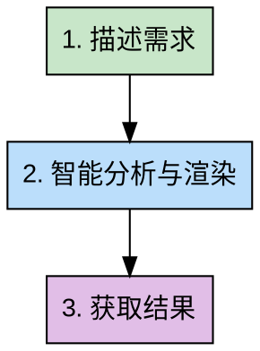

# 信息图生成器

## Overview

一站式信息图生成工具：根据用户需求描述，自动生成PNG格式的信息图和科研绘图。

**🆕 无需API key - 智能本地生成！**

**核心能力**：
- 📊 **6大模板**：知识科普、对比分析、流程说明、数据展示、小红书爆款、科研图表
- 🎨 **8种风格**：极简、马卡龙、赛博朋克、莫兰迪、国潮、商务、手绘、扁平化
- ⚡ **一键生成**：从自然语言描述到PNG图片，无需手动配置
- 🎯 **智能理解**：自动提取关键信息点，识别数量和内容
- 🤖 **无需外部API**：完全本地运行，无密钥依赖

**使用场景**：
- 快速生成知识科普信息图
- 创建小红书爆款视觉内容
- 制作学术科研图表
- 数据可视化展示

**输入 → 输出**：
```
用户需求描述 → PNG信息图 + JSON配置文件（可选）
```

**一键生成示例**：
```bash
# 一句话生成PNG，无需任何配置
node skill-render.js "生成Python编程语言的信息图，包含语法简洁、应用广泛、生态丰富、跨平台4个特点，使用极简风格"

# 输出：python-infographic.png
```

## When to Use

**适用场景**：
- 需要将文本内容可视化展示
- 需要制作知识科普信息图
- 需要创建小红书视觉内容
- 需要生成学术科研图表
- 需要数据可视化展示
- 需要制作对比分析图表

**不适用场景**：
- 纯文本输出即可满足需求
- 不需要可视化展示
- 需要深度分析（请先用对应方法论skill）

**需要分析方法时**：
- 先使用对应的方法论skill（swot-analysis、pdca-cycle、first-principles等）
- 再将分析结果提供给本skill生成信息图
- 示例：`"请用swot-analysis分析XX产品，然后将结果生成信息图"`

## Workflow



### 步骤详解

**Step 1: 描述需求**

用户用自然语言描述要生成什么信息图：

```
"生成Python编程语言的信息图，包含4个核心特点：语法简洁、应用广泛、生态丰富、跨平台"
"创建一份关于AI趋势的小红书爆款图，马卡龙风格，包含5个关键趋势"
"制作论文用的数据对比图表，科研风格，对比3种算法的性能"
```

**Step 2: 智能分析与渲染**（自动化，无需用户参与）

Skill自动完成：
- 识别内容类型（知识科普、对比分析、流程说明、数据展示、小红书内容、科研图表）
- 提取关键信息点和数量（支持"包含3个要点：A、B、C"格式）
- 智能选择最合适的模板和风格
- 自动生成JSON配置
- 调用Remotion渲染引擎（主要方案）
- 如果Remotion失败，自动降级到HTML+Puppeteer渲染
- 生成高质量PNG图片

**支持的输入格式**：
- `包含N个要点：要点1、要点2、要点3`
- `包含要点1、要点2、要点3等N个特点`
- 任意列举式描述

**渲染引擎优先级**：
1. **Remotion**（主要）：基于React的高质量渲染，适合复杂布局
2. **HTML+Puppeteer**（降级）：当Remotion不可用时的备选方案

**Step 3: 获取结果**

输出给用户：
- PNG文件路径
- JSON配置文件（可选，供后续修改）
- 使用建议

示例输出：
```
✅ 信息图已生成！

📁 文件位置：
- PNG图片：infographic/python-infographic.png
- 配置文件：infographic/python-infographic.json（可选）

💡 使用建议：
- 适合用于技术博客、知识分享
- 推荐尺寸：1920x1080（横版）
- 如需调整，可修改JSON配置后重新渲染
```

## Templates & Styles

### 6大模板

| 模板 | 适用场景 | 特点 | 默认风格 |
|------|---------|------|---------|
| **知识科普** | 概念解释、知识分享、技术介绍 | 标题+核心观点+详细说明+总结 | 极简风 |
| **对比分析** | 产品对比、方案评估、优劣分析 | 左右/上下对比，要点清晰 | 商务风 |
| **流程说明** | 步骤指南、操作流程、工作流 | 流程图+关键点+注意事项 | 扁平化 |
| **数据展示** | 数据报告、统计结果、调研分析 | 图表+数据解读+结论 | 商务风 |
| **小红书爆款** | 社交媒体分享、内容营销 | 吸睛标题+核心观点+互动元素 | 马卡龙风 |
| **科研图表** | 学术论文、研究报告、实验数据 | 学术规范+数据准确+引用完整 | 极简风 |

### 8种风格

| 风格 | 配色 | 适用内容 | 视觉特点 |
|------|------|---------|---------|
| **极简风** | 黑白灰+单色强调 | 知识科普、概念解释、技术内容 | 线条简洁、留白充足、专业感强 |
| **马卡龙风** | 粉色系、浅蓝、薄荷绿 | 生活技巧、美妆美食、小红书内容 | 柔和色调、可爱元素、亲切感 |
| **赛博朋克** | 霓虹粉、电光蓝、紫色 | 科技产品、AI工具、未来趋势 | 霓虹色彩、未来感、视觉冲击 |
| **莫兰迪风** | 灰蓝、灰粉、米色 | 职场技能、学习方法、高端内容 | 低饱和度、高级感、优雅 |
| **国潮风** | 中国红、金、墨黑 | 文化内容、历史知识、传统元素 | 传统元素、现代设计、大气 |
| **商务风** | 深蓝、灰色、白色 | 行业分析、市场报告、商业内容 | 专业严谨、数据导向、信任感 |
| **手绘风** | 暖色系、手绘图标 | 生活分享、经验总结、故事叙述 | 亲切自然、温度感、个性化 |
| **扁平化** | 鲜艳对比色、几何图形 | 流程说明、步骤指南、操作教程 | 简洁现代、信息清晰、易读 |

**风格选择优先级**：

系统按照以下优先级选择风格：

1. **用户明确指定**（最高优先级）
   - 用户可在描述中直接指定风格
   - 示例：`"生成Python信息图，使用手绘风格"`
   - 支持：科技风、可爱风、手绘风、简约风、教学风、笔记风、漫画风、Bento风

2. **LLM智能选择**
   - 根据内容语义，自动选择最合适的风格
   - 示例：`"生成AI工具推荐信息图"` → 自动选择科技风
   - 示例：`"生成美食教程信息图"` → 自动选择可爱风或教学风

3. **可爱风格兜底**（默认）
   - 当无法识别内容类型时，使用可爱风格
   - 示例：`"生成一个信息图"`（内容模糊）→ 使用可爱风

**示例用法**：

```bash
# 用户指定风格
node skill-render.js "生成Python信息图，使用手绘风格"

# LLM智能选择
node skill-render.js "生成AI工具推荐信息图"

# 兜底机制
node skill-render.js "生成一个信息图"
```

**自动推荐规则**：

Skill会根据内容类型自动推荐：
- 技术内容 → 极简风 / 商务风
- 生活内容 → 马卡龙风 / 手绘风
- 科技趋势 → 赛博朋克
- 职场技能 → 莫兰迪风 / 商务风
- 文化内容 → 国潮风
- 流程教程 → 扁平化

用户也可明确指定风格偏好。

## Examples

### 示例1：知识科普信息图

**输入**：
```
生成Python编程语言的信息图，包含4个核心特点：
1. 语法简洁 - 易学易用
2. 应用广泛 - Web、AI、数据分析
3. 生态丰富 - 海量库和框架
4. 跨平台 - Windows、Mac、Linux
```

**输出**：
- **模板**：知识科普
- **风格**：极简风
- **文件**：python-infographic.png
- **尺寸**：1920x1080（横版）

**结构**：
```
标题：Python编程语言
├─ 核心特点1：语法简洁
│   └─ 说明：易学易用，代码可读性强
├─ 核心特点2：应用广泛
│   └─ 说明：Web开发、AI、数据分析等领域
├─ 核心特点3：生态丰富
│   └─ 说明：海量第三方库和框架
└─ 核心特点4：跨平台
    └─ 说明：支持Windows、Mac、Linux
```

### 示例2：小红书爆款信息图

**输入**：
```
生成小红书爆款信息图，主题是"5个AI工具提升工作效率10倍"，
马卡龙风格，每个工具要包含：名称、用途、效果
```

**输出**：
- **模板**：小红书爆款
- **风格**：马卡龙风
- **文件**：ai-tools-xiaohongshu.png
- **尺寸**：1080x1920（竖版，适合小红书）

**结构**：
```
标题：5个AI工具提升工作效率10倍 🔥
├─ 工具1：ChatGPT - 文案创作 - 效率↑300%
├─ 工具2：Midjourney - 图片生成 - 效率↑500%
├─ 工具3：Notion AI - 文档整理 - 效率↑200%
├─ 工具4：GitHub Copilot - 代码编写 - 效率↑400%
└─ 工具5：Runway - 视频制作 - 效率↑600%

底部互动：👍 点赞收藏，分享更多干货！
```

### 示例3：科研图表

**输入**：
```
制作论文用的算法性能对比图表，科研风格，
对比3种排序算法（快速排序、归并排序、堆排序）的时间复杂度
```

**输出**：
- **模板**：科研图表（数据展示）
- **风格**：极简风（学术风格）
- **文件**：algorithm-comparison.png
- **尺寸**：1200x800

**结构**：
```
标题：三种排序算法时间复杂度对比
├─ 快速排序：平均O(n log n)，最坏O(n²)
├─ 归并排序：O(n log n)
└─ 堆排序：O(n log n)

包含：柱状图、性能曲线、引用标注
```

## Advanced Usage

### 自定义模板和风格

用户可以指定：
```
"生成XX信息图，使用对比分析模板，赛博朋克风格"
"制作数据图表，科研风格，使用数据展示模板"
```

### 自定义风格

用户可以在描述中明确指定风格：

```
"生成XX信息图，使用科技风"
"制作教程信息图，手绘风格"
"创建数据分析图表，简约风"
```

**支持的风格**：
- `科技风` / `tech` - 适合AI、编程、技术内容
- `可爱风` / `cute` - 适合生活、美食、宠物内容
- `手绘风` / `notebook` - 适合学习、笔记、教程内容
- `简约风` / `minimal` - 适合商务、职场内容
- `教学风` / `tutorial` - 适合教程、指南内容
- `泥塑风` / `clay` - 适合创意、艺术内容
- `漫画风` / `comics` - 适合动漫、游戏内容
- `Bento风` / `bento` - 适合模块化、架构内容

如果不指定风格，系统会根据内容自动选择最合适的风格。如果无法识别内容类型，将使用可爱风格作为默认风格。

### 批量生成

一次生成多个信息图：
```
"批量生成5个编程语言的信息图：Python、Java、JavaScript、Go、Rust"
```

### 指定尺寸

用户可以指定输出尺寸：
```
"生成信息图，尺寸1080x1920（竖版）"
"制作横版信息图，16:9比例"
"生成方形信息图，1:1比例"
```

### 获取JSON配置

用户可以获取JSON配置文件进行二次修改：
```
"生成信息图，同时输出JSON配置文件"
```

JSON配置可用于：
- 后续微调样式
- 批量生成相似内容
- 集成到自动化流程

### 结合方法论使用

对于需要深度分析的内容：
```
第一步："请用swot-analysis分析XX产品"
第二步：获得分析结果
第三步："根据上面的SWOT分析结果，生成信息图"
```

## Common Pitfalls

**❌ 错误用法**：

1. **期望skill做深度分析**
   ```
   错误："生成XX产品的SWOT分析信息图"
   正确：先用swot-analysis skill分析，再生成信息图
   ```

2. **信息过于简单，不需要可视化**
   ```
   错误："生成一个包含1个要点的信息图"
   正确：简单内容用文本列表即可
   ```

3. **要求不明确**
   ```
   错误："生成一个信息图"
   正确："生成关于XX的信息图，包含A、B、C三个要点"
   ```

**✅ 正确用法**：

1. **提供清晰的需求描述**
   ```
   "生成Python编程语言的信息图，包含语法简洁、应用广泛、生态丰富、跨平台4个特点，极简风格"
   ```

2. **指定目标受众和场景**
   ```
   "生成适合小红书分享的AI工具推荐信息图，马卡龙风格，面向初学者"
   ```

3. **提供结构化内容**
   ```
   "生成XX信息图，包含以下内容：
   1. 标题：XXX
   2. 核心观点：A、B、C
   3. 数据：XXX
   4. 结论：XXX"
   ```

## References

- [API集成说明](./API_INTEGRATION.md) - Claude API配置、一键生成指南
- [技术细节文档](./docs/TECHNICAL_DETAILS.md) - JSON schema、渲染引擎、性能优化
- [模板详细说明](TEMPLATES.md) - 6个模板的详细说明和自定义方法
- [高级用法](./docs/ADVANCED_USAGE.md) - 批量生成、API调用、自定义风格
- [使用示例](./examples/) - 完整使用示例和最佳实践

## Technical Notes

**内部实现**（对用户透明）：

1. **JSON配置生成**：Skill会自动生成结构化JSON配置
2. **渲染引擎**：
   - **主要方案**：Remotion（基于React的高质量渲染）
   - **降级方案**：HTML+Puppeteer（当Remotion不可用时）
3. **模板系统**：基于React组件的模板，支持动态配置
4. **输出位置**：`infographic/{topic-slug}/` 目录

**文件结构**：
```
infographic/{topic-slug}/
├── {topic-slug}.png          # 最终PNG图片
├── {topic-slug}.json         # JSON配置文件（可选）
└── {topic-slug}-backup.png   # 备份文件（如重新生成）
```

**性能优化**：
- 支持批量生成
- 自动缓存模板配置
- 异步渲染大尺寸图片