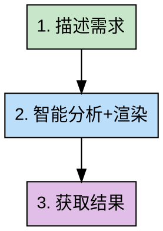

# 信息图生成器

## Overview

一站式信息图生成工具：根据用户需求描述，自动生成PNG格式信息图和科研绘图。无需外部API，完全本地运行。

**核心能力**：
- **6大模板**：知识科普、对比分析、流程说明、数据展示、小红书爆款、科研图表
- **8种风格**：科技风、可爱风、简约风、教学风、笔记风、泥塑风、漫画风、Bento风
- **4级质量**：草稿(1x/72DPI) → 标准(1x/150DPI) → 专业(2x/300DPI) → Retina(3x/300DPI)
- **一键生成**：自然语言描述 → PNG图片，无需手动配置
- **自动降级**：Remotion → HTML+Puppeteer，渲染失败自动重试

## When to Use

**适用**：知识科普可视化、小红书视觉内容、学术科研图表、数据可视化、对比分析图表
**不适用**：纯文本即可的场景；需要深度分析（先用对应的skill分析，再生成信息图）

## Quick Start

```bash
node skill-render.js "生成Python编程语言的信息图，包含语法简洁、应用广泛、生态丰富、跨平台4个特点"
# 智能选择布局，输出 output-infographic-landscape.png / portrait.png
```

## Workflow


```dot
digraph infographic_workflow {
    rankdir=TB;
    node [shape=box, style=filled, fontname="Arial"];
    "1. 描述需求" [fillcolor="#c8e6c9"];
    "2. 智能分析+渲染" [fillcolor="#bbdefb"];
    "3. 获取结果" [fillcolor="#e1bee7"];
    "1. 描述需求" -> "2. 智能分析+渲染" -> "3. 获取结果";
}
```

**Step 1**: 自然语言描述需求，可指定模板、风格、要点数量
**Step 2**: 自动识别内容类型 → 提取关键点 → 选择模板/风格 → 渲染PNG（Remotion → HTML降级）
**Step 3**: 输出PNG文件路径 + JSON配置文件（可选）

## Templates & Styles

### 6大模板

| 模板 | 适用场景 | 默认风格 |
|------|---------|---------|
| **知识科普** | 概念解释、技术介绍 | 科技风 |
| **对比分析** | 产品对比、方案评估 | 简约风 |
| **流程说明** | 步骤指南、操作流程 | 教学风 |
| **数据展示** | 数据报告、统计结果 | 科技风 |
| **小红书爆款** | 社交媒体分享 | 可爱风 |
| **科研图表** | 学术论文、实验数据 | 简约风 |

### 8种风格

| 风格 | 关键词 | 视觉特点 |
|------|--------|---------|
| **科技风** | AI/编程/技术/数据 | 深色背景、霓虹蓝紫、科技网格 |
| **可爱风** | 生活/美食/宠物/美妆 | 暖色背景、粉嫩色调、柔和圆润 |
| **简约风** | 商务/职场/专业/报告 | 黑白灰、大量留白、线条简洁 |
| **教学风** | 教程/指南/学习/入门 | 浅蓝背景、网格底纹、清晰分级 |
| **笔记风** | 笔记/总结/读书/知识 | 暖黄底色、笔记本横线、手写感 |
| **泥塑风** | 创意/艺术/设计/手工 | 陶土暖色、3D圆润质感 |
| **漫画风** | 动漫/游戏/二次元 | 橙红主色、速度线、对话框元素 |
| **Bento风** | 模块化/架构/系统 | 网格布局、模块化卡片、信息密度高 |

**风格选择优先级**：用户明确指定 → 内容关键词匹配 → 可爱风兜底

**示例**：
```bash
# 指定风格
node skill-render.js "Python信息图，使用科技风"
# 自动选择（AI/编程内容 → 科技风）
node skill-render.js "生成AI工具推荐信息图"
```

### 质量预设

| 预设 | 缩放 | DPI | 场景 |
|------|------|-----|------|
| draft | 1x | 72 | 快速预览 |
| normal | 1x | 150 | 日常（默认） |
| professional | 2x | 300 | 高清打印 |
| retina | 3x | 300 | 超清输出 |

```bash
node skill-render.js "Python信息图" --quality professional
```

## Advanced Usage

- **批量生成**：`批量生成5个编程语言的信息图：Python、Java、JavaScript、Go、Rust`
- **指定尺寸**：`生成信息图，尺寸1080x1920`（竖版）
- **JSON配置**：生成时自动保存配置文件，可修改后重新渲染
- **结合方法论**：先用swot-analysis分析，再将结果生成为信息图

## Common Pitfalls

- ❌ 期望skill做深度分析 → 先分析再可视化
- ❌ 信息过于简单（1个要点）→ 文本列表即可
- ❌ 描述模糊 → 提供结构化内容：标题、要点、说明
- ✅ 正确：`"生成XX信息图，包含A、B、C三个特点，科技风"`

## References

- [模板数据结构规范](./docs/TEMPLATE_DATA_STRUCTURE.md) - JSON配置格式和字段说明
- [示例](./examples/) - 使用示例

## Technical Notes

**渲染引擎**：
1. Remotion（React，主要方案）
2. HTML+Puppeteer（降级，Remotion不可用时自动切换）

**输出结构**：
```
infographic/{topic-slug}/
├── {topic-slug}-landscape.png   # 横版（1920x1080，默认）
├── {topic-slug}-portrait.png    # 竖版（1080x1920，小红书/要点>5时）
└── {topic-slug}.json            # 配置文件（可选）
```

**方向选择规则**：
- 小红书模板 → 竖版
- 要点 > 5个 → 竖版
- 其他 → 横版
- 指定 `--render-both` 同时输出两个版本