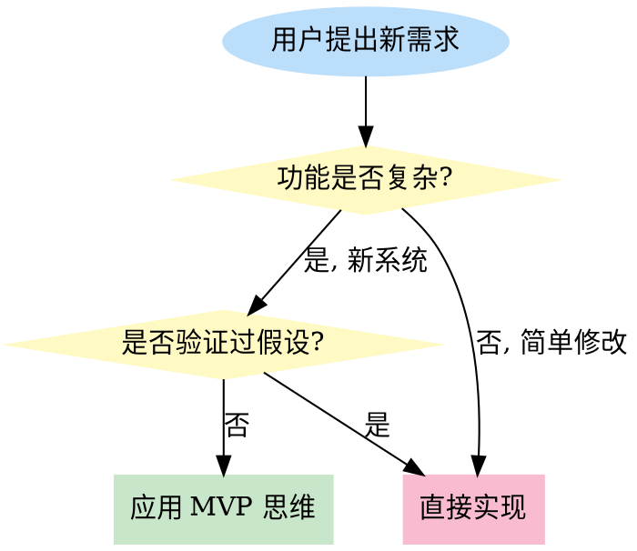
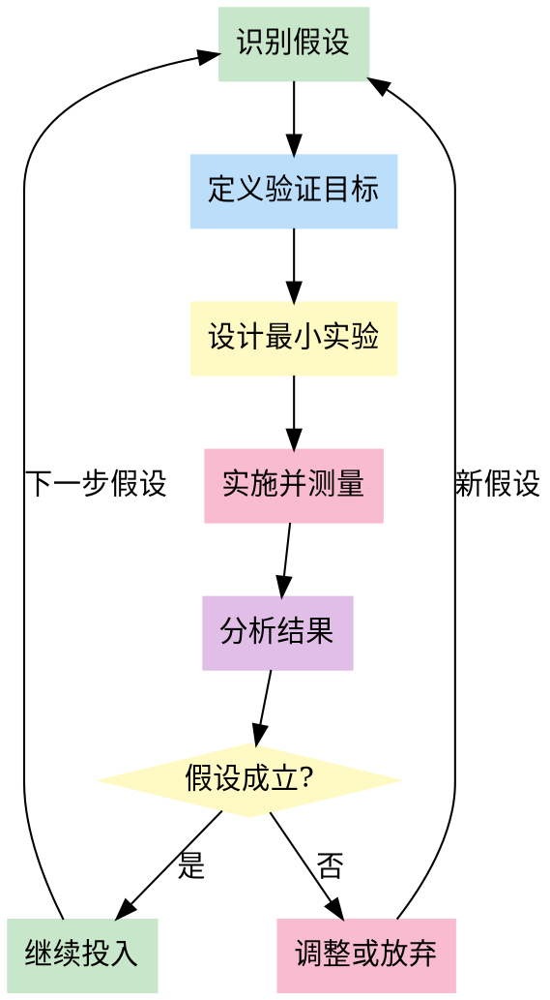

# MVP First

## 前置协议

### 环境检测

```bash
PROJECT_ROOT=$(git rev-parse --show-toplevel 2>/dev/null || echo "unknown")
BRANCH=$(git branch --show-current 2>/dev/null || echo "unknown")
COMMIT=$(git rev-parse --short HEAD 2>/dev/null || echo "unknown")

echo "PROJECT: $PROJECT_ROOT"
echo "BRANCH: $BRANCH"
echo "COMMIT: $COMMIT"
```

### 前置技能检查

```bash
# 检查前置工件
GOAL_ARTIFACT="memory/artifacts/goal-oriented/latest.json"
DDD_ARTIFACT="memory/artifacts/ddd-strategic/latest.json"

if [ -f "$GOAL_ARTIFACT" ]; then
  echo "FOUND: goal-oriented artifact"
fi

if [ -f "$DDD_ARTIFACT" ]; then
  echo "FOUND: ddd-strategic-design artifact"
fi

mkdir -p memory/artifacts/mvp-first
```

# MVP First

## Overview

**MVP（Minimum Viable Product）不是"最小可用产品"，而是"最小可验证产品"。**

核心目的：**用最小成本验证关键假设**，避免基于未经验证的假设投入大量资源。

MVP 的目标是学习，不是交付产品。每一次 MVP 都是在回答一个关键问题：用户真的需要这个吗？

## When to Use



**触发场景：**
- 用户说"我想做一个XX功能"、"帮我规划这个项目"
- 功能涉及多个子系统或复杂架构
- 用户未验证过需求假设

**不适用场景：**
- 简单的 bug 修复或配置修改
- 用户明确要求完整方案
- 已经验证过需求的项目迭代

## The MVP Mindset

### Core Questions (Must Ask Before Implementation)

**在给出任何实现方案前，必须回答：**

1. **核心假设是什么？**
   - 用户真的需要这个功能吗？
   - 用户会使用这个功能吗？
   - 这个功能能解决用户的问题吗？

2. **最小验证成本是什么？**
   - 如何用最少的时间和资源验证假设？
   - 能不能先手动做一遍？
   - 能不能用现成工具代替开发？

3. **验证成功的标准是什么？**
   - 多少用户使用算成功？
   - 什么数据证明假设成立？
   - 多久能得到结论？

### MVP is NOT

```markdown
❌ MVP 不是"功能简化版"
   - "保留核心功能，砍掉次要功能" → 这是产品规划，不是 MVP
   - MVP 的目标不是交付产品，而是验证假设

❌ MVP 不是"上线最小可用版本"
   - "先上线再迭代" → 可能浪费数周开发用户不需要的功能
   - MVP 可以不上线，甚至不需要写代码

❌ MVP 不是"快速交付"
   - "1周上线" → 如果方向错误，1周也是浪费
   - MVP 的目标是学习方向，不是交付速度
```

## The Process



### Step 1: 识别关键假设

**用户需求通常包含多个隐含假设，识别风险最高的那个。**

**示例：用户想要"评论系统"**
- 假设1: 用户愿意在平台上发表评论
- 假设2: 用户关心其他人评论
- 假设3: 评论会增加用户粘性
- 假设4: 需要审核和过滤机制

**风险最高的假设：假设1** - 如果用户根本不评论，其他假设都不成立。

### Step 2: 定义验证目标

**用数字定义成功标准。**

**示例：验证用户是否会评论**
- 成功标准：1周内至少 50 位用户发表评论
- 验证周期：7 天
- 失败标准：< 10 位用户评论，或评论内容质量过低

### Step 3: 设计最小实验

**找到验证假设的最小成本方式。**

**常见 MVP 模式（按成本从低到高）：**

| 模式 | 成本 | 适用场景 | 示例 |
|------|------|----------|------|
| **手动服务** | 极低 | 验证需求是否存在 | 用 Google Form 收集评论需求，手动回复 |
| **着陆页** | 低 | 验证用户意愿 | 做一个"评论功能即将上线"页面，收集邮箱订阅 |
| **假门** | 低 | 验证用户兴趣 | 放一个"评论"按钮，点击后显示"功能开发中" |
| **向导式** | 中 | 验证用户体验 | 人工在后台处理评论，前端看起来像真实功能 |
| **单功能** | 中 | 验证核心价值 | 只能发表评论 + 查看评论，无其他功能 |

### Step 4: 实施并测量

**只开发验证假设必需的功能。**

**代码示例：假门 MVP（验证用户是否想要评论功能）**

```html
<!-- 评论按钮 - 假门 MVP -->
<button id="comment-btn" class="btn-primary">
  发表评论
</button>

<div id="feedback-modal" style="display:none;">
  <p>评论功能正在开发中！</p>
  <p>留下您的邮箱，功能上线第一时间通知您：</p>
  <input type="email" id="user-email" placeholder="your@email.com">
  <button onclick="submitEmail()">提交</button>
</div>

<script>
document.getElementById('comment-btn').addEventListener('click', function() {
  // 记录点击次数 - 这是最重要的数据
  trackEvent('comment_button_clicked');

  // 显示收集邮箱的模态框
  document.getElementById('feedback-modal').style.display = 'block';
});

function submitEmail() {
  const email = document.getElementById('user-email').value;
  // 发送到后端记录
  saveEmail(email);
  alert('感谢您的关注！');
}
</script>
```

**成本**: 30 分钟开发 + 1 周观察
**学习**: 点击率 > 5% → 用户真的想要评论功能

### Step 5: 分析并决策

**基于数据而非直觉做决策。**

**三种结果：**
- **假设成立**（数据达标）→ 继续投入下一层功能
- **假设失败**（数据不达标）→ 放弃或调整方向
- **数据不足** → 延长验证周期或改进实验设计

## MVP Layers（分层验证）

**不要一次开发完整系统，按层次逐步验证：**

```markdown
【示例：评论系统的 MVP 分层】

Layer 0: 验证需求是否存在
- 方式：假门按钮（点击后显示"功能开发中"）
- 成本：30 分钟
- 目标：点击率 > 5%

Layer 1: 验证用户会使用功能
- 方式：只能发表评论 + 显示评论（无审核、无过滤、无回复）
- 成本：1 天开发
- 目标：1 周内 50+ 用户发表评论

Layer 2: 验证用户需要内容质量控制
- 方式：加审核功能（发现垃圾评论时再加）
- 成本：1 天开发
- 目标：审核通过率 > 80%

Layer 3: 验证用户需要互动
- 方式：加点赞功能（观察用户是否想要互动）
- 成本：0.5 天开发
- 目标：点赞率 > 10%

Layer 4: 验证用户需要复杂互动
- 方式：加回复功能（观察单层评论是否不够）
- 成本：1 天开发
- 目标：评论中 @他人 的比例 > 5%
```

**关键原则：每一层都是独立的 MVP，验证一个假设后才进入下一层。**

## Common Mistakes

### 1. ❌ "保留核心功能" 不是 MVP

```markdown
用户需求：评论系统（评论、回复、点赞、审核、过滤）

❌ 错误的 MVP 思维：
"保留核心功能：评论、回复、点赞、审核、敏感词过滤"
→ 这仍然是完整系统，只是去掉了积分等次要功能
→ 开发成本：1 周

✅ 正确的 MVP 思维：
"Layer 0: 假门按钮，验证用户是否想要评论功能"
→ 成本：30 分钟
→ 如果点击率 < 5%，直接省下 1 周开发时间
```

### 2. ❌ "上线后再迭代" 不是 MVP

```markdown
用户需求：用户等级系统

❌ 错误的 MVP 思维：
"先上线基础等级系统（5个等级、积分规则、权限控制），后续再加徽章、排行榜"
→ 开发成本：3 天
→ 问题：可能用户根本不在乎等级

✅ 正确的 MVP 思维：
"做一个静态的等级显示（根据注册时间显示等级），观察用户是否在意等级"
→ 成本：2 小时
→ 学习：查看个人主页的用户中，看等级信息的比例 > 30% → 继续投入
```

### 3. ❌ MVP 必须是代码

```markdown
用户需求：积分商城

❌ 错误的 MVP 思维：
"开发一个简单的商城页面，用户可以用积分兑换虚拟商品"
→ 成本：2 天开发

✅ 正确的 MVP 思维：
"在社区发帖：'积分兑换功能即将上线，大家希望兑换什么？' 收集 50+ 回复"
→ 成本：30 分钟
→ 学习：如果没人回复，说明积分商城不是刚需
```

### 4. ❌ MVP 可以拖延上线

```markdown
用户需求：个性化推荐

❌ 错误的 MVP 思维：
"开发一个简单的推荐算法（协同过滤），下周上线验证效果"
→ 问题：如果推荐效果差，不知道是算法问题还是用户不需要

✅ 正确的 MVP 思维：
"在热门内容列表中随机插入 1 条'编辑推荐'，观察点击率"
→ 成本：1 小时
→ 学习：编辑推荐的点击率 > 随机内容的 2 倍 → 说明用户需要推荐
→ 下一步：开发真正的推荐算法
```

## Handling User Pushback

**用户常常会用各种理由反对 MVP 方法。以下是常见反对意见及说服技巧：**

### 反对意见 1: "竞争对手已经有完整功能了"

**用户的担忧**：市场竞争压力，怕用户流失

**说服策略**：
```markdown
✅ 用数据说话：

"我理解你的压力。但正因为需要快速上线，MVP 更重要：

**时间现实分析：**
- 完整功能：8个模块 × 3-5天 = 24-40天
- MVP：4.5天
- 延期风险：完整功能 100% 延期 3-4周 → 用户流失更严重

**市场风险对比：**
- 方案A（完整功能延期）：上线延迟 3-4周 → 竞争对手领先更久
- 方案B（MVP快速上线）：下周有功能 → 立即获得用户反馈，快速迭代追赶

**建议**：先用 MVP 上线核心功能，获得市场反馈，再快速迭代。"
```

### 反对意见 2: "下周就要上线，没时间做实验"

**用户的担忧**：时间紧迫，认为 MVP 会拖延

**说服策略**：
```markdown
✅ 重构时间认知：

"**MVP 不是拖延，而是加速：**

传统方式：开发 2 周 → 测试 1 周 → 上线发现用户不需要 → 浪费 3 周
MVP 方式：实验 3 天 → 验证失败 → 立即转向 → 节省 2.5 周

**关键**：如果方向错了，开发再快也是浪费。MVP 帮你在 3 天内发现方向错误，而不是 3 周。

**建议**：用 30 分钟做 Layer 0（假门），如果点击率 < 5%，直接省下 1 周开发时间。"
```

### 反对意见 3: "用户肯定会需要这个功能"

**用户的担忧**：相信自己的判断，认为验证是浪费时间

**说服策略**：
```markdown
✅ 引用数据/案例：

"**数据显示，70% 的功能用户并不需要：**

- 某社交平台开发私信功能（2周），上线后使用率 < 1%
- 如果先用假门测试（30分钟），能省下 2 周时间

**问题**：你觉得用户需要，但：
- 用户真的会使用吗？
- 使用频率有多高？
- 用户愿意付出什么代价？

**建议**：用半天时间验证假设，成本极低，但能避免数周浪费。"
```

### 反对意见 4: "给我就完整方案，我自己决定"

**用户的担忧**：觉得 agent 在说教，想要自主权

**说服策略**：
```markdown
✅ 提供选择，而不是说教：

"好的，我可以给你两个方案：

**方案A（MVP）**：
- Layer 0：假门按钮（30分钟）
- Layer 1：基础评论（1天）
- 总成本：1.5天
- 风险：极低，随时可以停止

**方案B（完整功能）**：
- 数据库设计：7张表
- 接口开发：15个接口
- 功能开发：8个模块
- 总成本：4-6周
- 风险：高，可能开发用户不需要的功能

我建议方案A，但最终由你决定。你希望我先提供哪个方案的详细设计？"
```

### 反对意见 5: "MVP 太简陋，用户体验会很差"

**用户的担忧**：担心 MVP 影响品牌形象

**说服策略**：
```markdown
✅ 区分"简陋"和"聚焦"：

"**MVP 不是粗制滥造，而是功能聚焦：**

❌ 粗糙的 MVP：Bug 多、界面丑、性能差
✅ 正确的 MVP：功能少、但质量高、体验好

**案例**：
- Dropbox MVP：只是一个演示视频，没有真实产品
- 结果：7万人排队等候，验证了需求
- 成本：3 天制作视频

**建议**：做一个小但精致的 MVP，核心功能打磨到位，比大而粗糙的产品更有价值。"
```

### 说服技巧总结

| 技巧 | 说明 | 示例 |
|------|------|------|
| **用数据说话** | 展示时间成本对比 | "完整功能 4-6周，MVP 1.5天" |
| **重构认知** | MVP 是加速，不是拖延 | "3天发现错误 vs 3周发现错误" |
| **引用案例** | 真实失败案例 | "70%的功能用户不需要" |
| **提供选择** | 让用户感到自主 | "给你两个方案，你来决定" |
| **区分概念** | MVP ≠ 粗糙 | "小而精致 vs 大而粗糙" |

**核心原则**：理解用户的真实担忧（竞争压力、时间压力、品牌形象），用数据和逻辑说服，而不是说教。

### 常见理性化借口识别表

**当用户用以下理由拒绝 MVP 时，识别背后的思维模式：**

| 用户说 | 背后的理性化 | 本质问题 | MVP 应对方法 |
|--------|------------|---------|-------------|
| "这个功能很简单" | 低估复杂度 | 未考虑子系统、边界情况 | 列出所有子系统（数据库、接口、前端、测试），展示真实成本 |
| "竞品都有了" | FOMO（错失恐惧） | 模仿 ≠ 验证 | 竞品的用户和我们的用户一样吗？先验证我们的用户是否需要 |
| "用户肯定需要" | 假设替代数据 | 直觉 ≠ 事实 | 设计最小实验（半天成本），用数据说话 |
| "时间很紧迫" | 紧迫感掩盖风险 | 快 ≠ 对 | MVP 是加速不是拖延：3天发现错误 vs 3周发现错误 |
| "先上线再迭代" | 推迟验证 | 上线 ≠ 验证 | 如果方向错，上线就是浪费。先用假门验证方向 |
| "我知道用户想要" | 过度自信 | 幸存者偏差 | 你问的是活跃用户，那沉默的用户呢？用假门测试所有人 |
| "这只是个小功能" | 忽视累积成本 | 小功能 × N = 大系统 | 小功能也需要验证。用静态实现测试用户是否真的会点 |
| "我们已经规划好了" | 沉没成本谬误 | 规划成本高 ≠ 必须实现 | 规划是假设，不是事实。用最小成本验证假设 |

**使用方法：**
1. 识别用户的理性化类型（看表格第2列）
2. 理解本质问题（第3列）
3. 应用对应的应对方法（第4列）
4. 用数据和逻辑说服，而不是情绪化争论

## Real-World Impact

**案例：某社交平台要开发"私信功能"**

**传统方式（无 MVP 思维）：**
- 开发成本：2 周（消息存储、实时推送、已读状态、消息列表、发送界面）
- 上线后：日活用户中使用率 < 1%
- 浪费：2 周开发时间 + 服务器资源

**MVP 方式：**
- Layer 0（假门）：在个人主页放一个"私信"按钮，点击后显示"功能开发中"（成本：30 分钟）
- 观察 3 天：点击率 0.3% → 放弃开发
- 节省：2 周开发时间

**结果对比：**
| 指标 | 传统方式 | MVP 方式 |
|------|----------|----------|
| 开发成本 | 2 周 | 30 分钟 |
| 学习周期 | 2 周 + 1 周 | 3 天 |
| 资源浪费 | 高 | 极低 |

## Quick Reference

| 用户说... | MVP 思维回应 |
|-----------|-------------|
| "我想做一个XX功能" | "先做个假门，看用户是否真的想要" |
| "这个功能很着急" | "最快的验证方式是：先做个最简单版本，验证方向对不对" |
| "先实现核心功能" | "核心功能也是假设。哪个假设风险最高？先验证那个" |
| "用户肯定需要" | "用数据验证。设计一个最小实验，成本不超过半天" |
| "竞品都有这个功能" | "竞品的用户和我们的用户一样吗？先验证我们的用户是否需要" |

## Red Flags - You're NOT Doing MVP

- 你在"砍功能"，但没有问"最核心的假设是什么"
- 你的 MVP 需要 > 2 天开发时间
- 你在规划数据库表结构，而不是规划验证实验
- 你在说"先上线再迭代"，而不是"先验证再投入"
- 你的 MVP 包含审核、过滤、权限等"基础设施"
- 你没有定义验证成功的数字标准

**看到这些信号 → 停下来，重新思考：我在验证什么假设？**

## References

- **The Lean Startup** - Eric Ries（MVP 概念起源）
- **Running Lean** - Ash Maurya（MVP 实战方法）
- **The Mom Test** - Rob Fitzpatrick（如何验证需求）
## 后置协议

### 工件输出

保存 MVP 规划结果到工件文件：

```bash
TIMESTAMP=$(date +%Y%m%d-%H%M%S)
ARTIFACT_FILE="memory/artifacts/mvp-first/result-$TIMESTAMP.json"

cat > "$ARTIFACT_FILE" <<EOFJSON
{
  "skill": "mvp-first",
  "version": "2.0.0",
  "timestamp": "$(date -u +%Y-%m-%dT%H:%M:%SZ)",
  "project": "$PROJECT_ROOT",
  "branch": "$BRANCH",
  "commit": "$COMMIT",
  "input": {
    "user_request": "用户的原始请求"
  },
  "output": {
    "mvp_features": [],
    "non_mvp_features": [],
    "mvp_timeline": "",
    "key_assumptions": [],
    "validation_metrics": []
  },
  "next_skills": [
    "pdca-cycle"
  ]
}
EOFJSON

echo "ARTIFACT SAVED: $ARTIFACT_FILE"
ln -sf "$ARTIFACT_FILE" memory/artifacts/mvp-first/latest.json
```

### 目标文件更新

如果存在目标文件，记录 MVP 规划完成。

### 建议后续技能

```markdown
## 后续建议

基于 MVP 规划结果，建议继续执行：

**推荐技能链**：
1. /pdca-cycle - 进入 PDCA 循环实施阶段

是否继续执行？
- A) 执行推荐的技能链
- B) 不继续，结束当前任务
```
