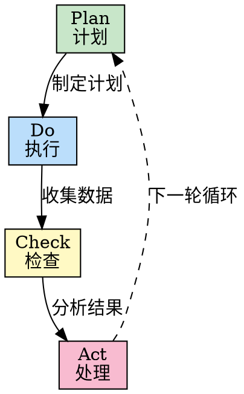

# PDCA 循环

## Overview

PDCA 循环（Plan-Do-Check-Act）是一种持续改进的方法论，通过计划、执行、检查、处理四个阶段的循环，不断优化流程和结果。

**核心价值**：
- 数据驱动决策
- 小步快跑，快速迭代
- 持续改进，螺旋上升
- 降低试错成本

**起源**: 戴明环（Deming Cycle），由 W. Edwards Deming 推广

## When to Use

**适用场景**：
- 迭代任务，需要持续改进
- 质量保障和流程优化
- 新方案试点验证
- 数据驱动的决策
- 性能优化、成本降低
- 用户满意度提升

**不适用场景**：
- 一次性、无需改进的任务
- 紧急情况，需要立即行动

## The Process

### 四阶段详解

**Plan（计划）**
- 明确目标和指标
- 分析现状与差距
- 制定具体行动计划
- 预估风险和应对方案

**Do（执行）**
- 小范围试点
- 严格按照计划执行
- 收集执行过程中的数据
- 记录问题和观察

**Check（检查）**
- 对比预期与实际结果
- 分析偏差原因
- 提取经验教训
- 数据可视化呈现

**Act（处理）**
- 标准化成功做法
- 改进不足之处
- 规划下一个循环
- 扩大应用范围

## Cycle Checklist

使用以下检查清单确保每个阶段完整执行：

### Plan 阶段
- [ ] 明确目标和衡量指标
- [ ] 收集现状数据
- [ ] 分析根本原因（可用鱼骨图、5 Whys）
- [ ] 制定具体行动计划
- [ ] 确定责任人和时间节点
- [ ] 预估风险和应对措施

### Do 阶段
- [ ] 选择小范围试点区域
- [ ] 准备所需资源
- [ ] 严格按照计划执行
- [ ] 收集过程数据（时间、成本、质量）
- [ ] 记录遇到的问题和异常
- [ ] 保持试点环境可控

### Check 阶段
- [ ] 对比实际结果与预期目标
- [ ] 分析差异原因
- [ ] 验证方案有效性
- [ ] 提取成功经验和失败教训
- [ ] 数据可视化（图表、报告）
- [ ] 团队讨论并达成共识

### Act 阶段
- [ ] 将成功做法标准化
- [ ] 文档化最佳实践
- [ ] 改进不足之处
- [ ] 规划下一个循环的目标
- [ ] 扩大应用范围（如适用）
- [ ] 分享经验给相关团队

## Examples

### 案例 1: 代码质量改进的 PDCA 应用

**Plan**:
- 目标：Bug 密度降低 50%（从 15 个/千行 → 7.5 个/千行）
- 现状分析：主要问题是边界检查不足和异常处理缺失
- 行动计划：
  1. 引入静态代码分析工具
  2. 强制 Code Review
  3. 编写单元测试模板

**Do**:
- 在项目 A 试点（1 个月）
- 引入 SonarQube
- 每周 Code Review 会议
- 收集数据：Bug 数量、发现阶段

**Check**:
- Bug 密度降至 8 个/千行（接近目标）
- 静态分析发现 120 个问题，修复后无新增 Bug
- Code Review 发现 35 个潜在问题
- 但开发时间增加 15%

**Act**:
- 标准化：SonarQube 集成到 CI/CD
- 改进：优化 Code Review 流程，减少时间
- 下一轮目标：保持 Bug 密度，缩短开发时间

### 案例 2: 用户满意度提升的迭代优化

**Plan**:
- 目标：用户满意度从 3.2 提升至 4.0
- 现状：响应慢、功能不完善
- 计划：
  1. 缩短响应时间（< 2 小时）
  2. 增加高频需求功能

**Do**:
- 试点 2 周
- 增加客服人员
- 开发 Top 3 需求功能
- 收集反馈数据

**Check**:
- 满意度提升至 3.8（未达 4.0）
- 响应时间达标
- 新功能使用率高
- 但部分功能易用性不足

**Act**:
- 标准化：响应时间要求写入 SLA
- 改进：优化新功能的 UI/UX
- 下一轮目标：满意度 > 4.0

## Common Pitfalls

### 误区 1: 跳过 Check 阶段，直接进入下一轮
- **表现**: 执行完就进入下一轮，不检查效果
- **正确做法**: 必须用数据验证效果，避免凭感觉判断

### 误区 2: 只有 Plan 和 Do，没有持续改进
- **表现**: 计划并执行后就结束，不进行 Check 和 Act
- **正确做法**: PDCA 是循环，不是线性流程

### 误区 3: 忽视数据收集，凭感觉判断
- **表现**: Check 阶段没有量化数据，主观判断"效果不错"
- **正确做法**: Plan 阶段就明确数据收集方案

### 误区 4: 试点范围过大，风险失控
- **表现**: 第一次就全量推行
- **正确做法**: Do 阶段小范围试点，验证成功后再扩大

### 误区 5: Act 阶段不标准化，经验流失
- **表现**: 改进后就结束，没有文档化
- **正确做法**: 将成功做法写入标准流程

## References

- 《戴明管理思想精要》- W. Edwards Deming
- Lean Six Sigma - 持续改进方法论
- Toyota Production System - 精益生产
- [PDCA 循环实战指南](https://example.com/pdca-guide)