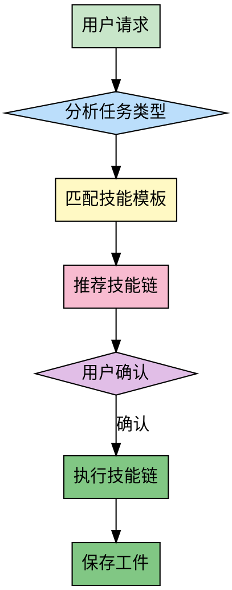

# Pilot - 技能领航员

## 前置协议

### 环境检测

```bash
PROJECT_ROOT=$(git rev-parse --show-toplevel 2>/dev/null || echo "unknown")
BRANCH=$(git branch --show-current 2>/dev/null || echo "unknown")
COMMIT=$(git rev-parse --short HEAD 2>/dev/null || echo "unknown")

echo "PROJECT: $PROJECT_ROOT"
echo "BRANCH: $BRANCH"
echo "COMMIT: $COMMIT"
```

### 工件目录初始化

```bash
mkdir -p memory/artifacts/pilot
```

## Overview

智能分析用户请求，推荐最佳的方法论技能组合，实现技能协同工作。

**核心价值**：
- 自动识别任务类型
- 推荐最优技能链
- 提供执行上下文
- 减少决策负担

**核心原则**：让技能协同工作，发挥 1+1>2 的效果。

## When to Use

**适用场景**：
- 用户发起任何任务请求
- 用户不确定应该使用哪个技能
- 用户希望获得技能推荐
- 复杂任务需要多个技能配合

**不适用场景**：
- 用户明确指定了要使用的技能
- 简单的问答或信息查询

## The Process



### 步骤详解

**步骤 1: 分析任务类型**

识别任务类型：
- 🎯 **目标明确** → `goal-oriented`
- 💡 **需要创新** → `first-principles`
- 🏗️ **架构设计** → `ddd-strategic-design`
- 🔧 **实现细节** → `ddd-tactical-design`
- 📦 **复杂系统** → `mvp-first`
- 🔄 **持续改进** → `pdca-cycle`
- 📊 **战略分析** → `swot-analysis`

**步骤 2: 匹配技能模板**

根据任务类型，匹配预设的技能模板：

**模板 1: 新系统设计**
```
goal-oriented → first-principles → ddd-strategic-design → ddd-tactical-design → mvp-first → pdca-cycle
```

**模板 2: 性能优化**
```
goal-oriented → first-principles → pdca-cycle
```

**模板 3: 技术选型**
```
goal-oriented → first-principles → swot-analysis
```

**模板 4: 架构重构**
```
goal-oriented → first-principles → ddd-strategic-design → pdca-cycle
```

**步骤 3: 推荐技能链**

根据用户请求和任务类型，推荐技能执行顺序。

**步骤 4: 用户确认**

使用 AskUserQuestion 让用户确认推荐的技能链。

**步骤 5: 执行技能链**

按顺序内联执行技能（跳过重复的前置协议）。

**步骤 6: 保存工件**

保存编排结果和执行记录。

## 技能模板库

### 模板 1: 新系统设计（完整流程）

**适用**：用户说"设计一个XX系统"、"从零开始做一个XX"

```
1. /goal-oriented
   - 明确系统目标和成功标准

2. /first-principles
   - 从本质思考系统设计

3. /ddd-strategic-design
   - 识别限界上下文
   - 设计上下文关系

4. /ddd-tactical-design
   - 设计聚合、实体、值对象
   - 实现领域模型

5. /mvp-first
   - 筛选 MVP 功能
   - 优先级规划

6. /pdca-cycle
   - 迭代实施
```

### 模板 2: 性能优化

**适用**：用户说"优化XX性能"、"提升XX速度"

```
1. /goal-oriented
   - 明确优化目标（响应时间 < 100ms）

2. /first-principles
   - 找到性能瓶颈的本质原因

3. /pdca-cycle
   - Plan: 制定优化方案
   - Do: 实施优化
   - Check: 验证性能提升
   - Act: 标准化成功做法
```

### 模板 3: 技术选型

**适用**：用户说"选择XX技术"、"XX vs YY 哪个更好"

```
1. /goal-oriented
   - 明确选型目标和约束条件

2. /first-principles
   - 从本质分析需求

3. /swot-analysis
   - 分析各方案的优劣势
   - 生成决策建议
```

### 模板 4: 架构重构

**适用**：用户说"重构XX架构"、"优化系统结构"

```
1. /goal-oriented
   - 明确重构目标

2. /first-principles
   - 找到当前架构的根本问题

3. /ddd-strategic-design
   - 重新设计限界上下文
   - 优化上下文关系

4. /pdca-cycle
   - 逐步迁移
   - 持续验证
```

### 模板 5: 功能开发（快速路径）

**适用**：用户说"实现XX功能"、"添加XX"

```
1. /goal-oriented
   - 明确功能目标

2. /mvp-first
   - 确定核心功能
   - 削减非必要特性

3. /pdca-cycle
   - 迭代开发
```

### 模板 6: 问题诊断

**适用**：用户说"XX出问题了"、"排查XX bug"

```
1. /goal-oriented
   - 明确问题解决目标

2. /first-principles
   - 找到问题的根本原因

3. /pdca-cycle
   - 实施修复
   - 验证解决方案
```

## 技能协作规则

### 内联执行协议

当编排器执行技能链时：

1. **Read** 工具读取技能文件
   ```
   skills/{skill-name}/SKILL.md
   ```

2. **跳过以下部分**（避免重复初始化）：
   - 前置协议（环境检测、前置技能检查）
   - Overview
   - When to Use

3. **执行核心流程**：
   - The Process
   - Thinking Framework
   - 必要的交互和决策

4. **工件输出**：
   - 保存工件到 `memory/artifacts/{skill-name}/`
   - 继续下一个技能

### 工件传递机制

每个技能执行完成后，工件会被下一个技能读取：

```bash
# 当前技能读取前置技能的工件
PREV_ARTIFACT="memory/artifacts/{previous-skill}/latest.json"

if [ -f "$PREV_ARTIFACT" ]; then
  # 提取上下文信息
  # 在当前技能中使用
fi
```

## Examples

### 案例 1: 从零开始设计新系统

```
用户："设计一个电商平台"

编排器分析：
- 任务类型：新系统设计
- 推荐模板：模板 1（完整流程）

推荐技能链：
1. /goal-oriented - 明确系统目标
2. /first-principles - 从本质思考电商
3. /ddd-strategic-design - 战略设计
4. /ddd-tactical-design - 战术设计
5. /mvp-first - MVP 规划

是否开始执行？
- A) 按推荐顺序执行
- B) 我自己选择技能
- C) 只运行第一个技能
```

### 案例 2: 性能优化

```
用户："数据库查询太慢，帮我优化"

编排器分析：
- 任务类型：性能优化
- 推荐模板：模板 2（性能优化）

推荐技能链：
1. /goal-oriented - 明确优化目标（响应时间 < 100ms）
2. /first-principles - 找到慢查询的本质原因
3. /pdca-cycle - PDCA 循环优化

是否开始执行？
- A) 按推荐顺序执行
- B) 我自己选择技能
- C) 只运行第一个技能
```

### 案例 3: 技术选型

```
用户："选择微服务框架，Spring Cloud 还是 Dubbo？"

编排器分析：
- 任务类型：技术选型
- 推荐模板：模板 3（技术选型）

推荐技能链：
1. /goal-oriented - 明确选型目标
2. /first-principles - 从本质分析需求
3. /swot-analysis - 分析各方案优劣势

是否开始执行？
- A) 按推荐顺序执行
- B) 我自己选择技能
- C) 只运行第一个技能
```

## 后置协议

### 工件输出

保存编排结果到工件文件：

```bash
TIMESTAMP=$(date +%Y%m%d-%H%M%S)
ARTIFACT_FILE="memory/artifacts/pilot/result-$TIMESTAMP.json"

cat > "$ARTIFACT_FILE" <<EOF
{
  "skill": "pilot",
  "version": "1.0.0",
  "timestamp": "$(date -u +%Y-%m-%dT%H:%M:%SZ)",
  "project": "$PROJECT_ROOT",
  "branch": "$BRANCH",
  "commit": "$COMMIT",
  "input": {
    "user_request": "用户的原始请求"
  },
  "output": {
    "task_type": "识别的任务类型",
    "recommended_skills": [
      "skill-1",
      "skill-2"
    ],
    "execution_result": "success"
  }
}
EOF

echo "ARTIFACT SAVED: $ARTIFACT_FILE"
ln -sf "$ARTIFACT_FILE" memory/artifacts/pilot/latest.json
```

### 目标文件更新

如果存在目标文件，记录编排完成。

### 建议后续技能

编排器完成后，技能链已执行完毕，通常无需推荐后续技能。

## Common Pitfalls

### 误区 1: 过度编排

**表现**：为简单任务推荐复杂的技能链

**正确做法**：
- 简单任务 → 简短技能链（1-2 个技能）
- 复杂任务 → 完整技能链（5-6 个技能）

### 误区 2: 忽略用户意图

**表现**：机械地推荐模板，不考虑用户的具体需求

**正确做法**：
- 分析用户请求的细节
- 根据具体需求调整推荐的技能链

### 误区 3: 强制执行

**表现**：不给用户选择的机会，直接执行技能链

**正确做法**：
- 使用 AskUserQuestion 让用户确认
- 提供自定义选项

## References

- gstack 技能编排架构
- superpowers 技能协作模式
- methodolog-skills 技能依赖关系图