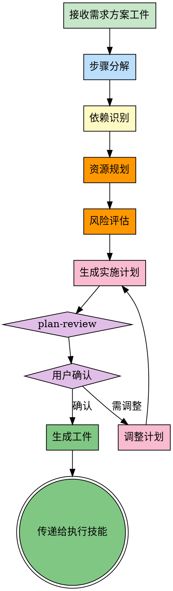

# Planning - 实施规划与步骤分解

## 前置协议

### 强制触发规则

**触发时机**：prompt-enhancer 完成需求细化后（强制）

**触发条件**：
- ✅ 已有明确的需求和方案
- ✅ 需要实施规划和步骤分解
- ✅ 复杂任务（需要多个步骤完成）

**例外情况**：
- 简单任务（单步即可完成）
- 用户明确表示"直接开始"

---

### 依赖检查

**前置依赖**：prompt-enhancer

**检查内容**：
- 检查工件文件：`memory/artifacts/prompt-enhancer/`
- 确认已有明确的需求和选定方案
- 如果无前置工件，需先执行 prompt-enhancer

---

### 与 goal-oriented 的协作

**触发来源**：goal-oriented skill 强制调用

**触发流程**:
```
goal-oriented 创建目标
    ↓
调用 prompt-enhancer（需求细化）
    ↓
生成需求方案工件
    ↓
调用 planning（实施规划）
    ↓
读取需求方案工件 → 生成实施计划 → plan-review
    ↓
生成实施计划工件
    ↓
传递给 execution 阶段
    ↓
任务完成后 → experience-manager 经验沉淀
```

**工件接收**:
- goal-oriented 会写入工件到 `memory/artifacts/prompt-enhancer/`
- planning 自动检测并读取最新工件

---

### 工件传递机制

#### 输入工件（来自 prompt-enhancer）

**工件路径**: `memory/artifacts/prompt-enhancer/result-{timestamp}.json`

**工件格式**:
```json
{
  "skill": "prompt-enhancer",
  "version": "2.0.0",
  "requirement": {
    "original": "用户原始需求",
    "refined": {
      "type": "功能开发|重构|优化",
      "core_features": ["功能1", "功能2"],
      "target_users": "目标用户",
      "platform": "平台",
      "tech_stack": ["技术1", "技术2"],
      "success_criteria": ["标准1", "标准2"],
      "timeline": "时间线"
    }
  },
  "solution": {
    "selected": "选定方案",
    "reasons": ["理由1", "理由2"],
    "alternatives": [
      {
        "name": "备选方案1",
        "pros": ["优势"],
        "cons": ["劣势"]
      }
    ]
  }
}
```

**读取方式**:
```bash
# 自动检测最新的 prompt-enhancer 工件
PROMPT_ENHANCER_ARTIFACT=$(ls -t memory/artifacts/prompt-enhancer/*.json | grep -v latest.json | head -1)

if [ -n "$PROMPT_ENHANCER_ARTIFACT" ]; then
  echo "✅ Found prompt-enhancer artifact: $PROMPT_ENHANCER_ARTIFACT"
  # Read artifact content using Read tool
else
  echo "❌ No prompt-enhancer artifact found"
  echo "⚠️ Must execute prompt-enhancer before planning"
fi
```

---

#### 输出工件（传递给后续技能）

**工件路径**: `memory/artifacts/planning/result-{timestamp}.json`

**工件格式**: 见 "步骤8：生成工件"

**传递机制**:
- 创建工件文件
- 创建 latest.json 符号链接
- 后续技能可自动检测 latest.json

---

## Overview

planning 是强制前置技能，负责**实施规划**和**步骤分解**。将明确的需求和方案转化为可执行的实施计划，通过 plan-review 确保计划可行，降低执行风险。

**核心能力**：
1. **步骤分解**：将需求分解为可执行步骤
2. **依赖识别**：识别步骤间的依赖关系
3. **资源规划**：明确所需资源和时间
4. **风险评估**：识别潜在风险和应对措施
5. **plan-review**：用户确认实施计划

**核心原则**：谋定后动，规划先行。好的计划是成功的一半。

**关键价值**：
- 明确执行路径，避免盲目行动
- 识别依赖关系，合理安排顺序
- 提前评估风险，准备应对措施
- 用户确认计划，确保理解一致

---

## When to Use

**强制使用场景**：
- prompt-enhancer 完成后
- 需求已明确，方案已选定
- 任务需要多个步骤完成

**不使用场景**：
- 简单任务（单步即可完成）
- 用户明确表示"直接开始"
- 已有详细的实施计划

---

## The Process



---

### 步骤1：接收需求方案工件

从前置技能 prompt-enhancer 读取工件：

```json
// memory/artifacts/prompt-enhancer/result-{timestamp}.json
{
  "requirement": {
    "original": "做一个用户认证功能",
    "refined": { ... }
  },
  "solution": {
    "selected": "方案2：微信云开发",
    "reasons": [ ... ]
  }
}
```

---

### 步骤2：步骤分解

将需求分解为可执行的实施步骤

#### 分解原则

**MECE原则**：相互独立，完全穷尽
- 每个步骤独立，不重叠
- 所有步骤加起来覆盖完整需求

**粒度控制**：
- 每个步骤可在 0.5-2 天内完成
- 步骤不过细（避免过度规划）
- 步骤不过粗（避免模糊不清）

#### 分解方法

**方法1：按功能模块分解**
```
用户认证功能
├─ 注册模块
│   ├─ 步骤1：实现手机验证码发送
│   └─ 步骤2：实现注册流程
├─ 登录模块
│   ├─ 步骤3：实现手机验证码登录
│   └─ 步骤4：实现微信OAuth
└─ 找回密码模块
    └─ 步骤5：实现找回密码流程
```

**方法2：按时间顺序分解**
```
Week 1: 基础功能
├─ Day 1-2：环境配置 + 验证码发送
├─ Day 3-4：注册登录流程
└─ Day 5：找回密码

Week 2: 优化测试
├─ Day 1-2：测试与Bug修复
├─ Day 3-4：性能优化
└─ Day 5：上线准备
```

**方法3：按技术层次分解**
```
前端
├─ 步骤1：登录UI组件
├─ 步骤2：表单验证
└─ 步骤3：API对接

后端
├─ 步骤4：云函数开发
├─ 步骤5：数据库设计
└─ 步骤6：第三方集成
```

---

### 步骤3：依赖识别

识别步骤间的依赖关系

#### 依赖类型

| 依赖类型 | 说明 | 示例 |
|---------|------|------|
| **强依赖** | 必须先完成前置步骤 | 注册 → 登录 |
| **弱依赖** | 最好先完成，但可并行 | UI设计 ↔ API设计 |
| **无依赖** | 可独立执行 | 文档编写 |

#### 依赖图示例

```
步骤1：环境配置
    ↓
步骤2：验证码发送
    ↓
┌─────────┴─────────┐
↓                   ↓
步骤3：注册流程    步骤4：登录流程
    ↓                   ↓
    └─────────┬─────────┘
              ↓
        步骤5：找回密码
              ↓
        步骤6：测试上线
```

---

### 步骤4：资源规划

明确每个步骤所需的资源

#### 资源维度

**人力资源**：
- 谁来执行？（前端、后端、测试）
- 需要多少人？
- 是否需要协作？

**时间资源**：
- 每个步骤预计多久？
- 总体时间线？
- 关键时间节点？

**技术资源**：
- 需要什么技术栈？
- 是否需要第三方服务？
- 是否需要新工具？

**资金资源**：
- 是否有成本？（云服务、短信服务）
- 预算限制？

#### 资源规划表

| 步骤 | 人员 | 时间 | 技术 | 成本 |
|------|------|------|------|------|
| 环境配置 | 1人 | 0.5天 | 微信开发者工具 | 无 |
| 验证码发送 | 1人 | 1天 | 阿里云短信服务 | ~¥0.05/条 |
| 注册流程 | 1人 | 2天 | 云开发、云函数 | 无 |
| 登录流程 | 1人 | 2天 | OAuth、JWT | 无 |
| 找回密码 | 1人 | 1天 | - | 无 |
| 测试上线 | 1人 | 1.5天 | - | 无 |

---

### 步骤5：风险评估

识别潜在风险和应对措施

#### 风险类型

| 风险类型 | 风险描述 | 概率 | 影响 | 应对措施 |
|---------|---------|------|------|---------|
| **技术风险** | 微信OAuth集成复杂度 | 中 | 高 | 提前研究文档，预留buffer |
| **时间风险** | 短信服务审核时间 | 高 | 中 | 提前申请，准备备选方案 |
| **成本风险** | 短信费用超预算 | 低 | 低 | 设置发送频率限制 |
| **集成风险** | 现有系统对接困难 | 中 | 高 | 优先调研现有系统接口 |

#### 风险矩阵

```
影响 ↑
高  │  [OAuth集成]     [系统对接]
    │      中风险        高风险
中  │  [审核时间]      [成本超支]
    │      中风险        低风险
低  │
    └──────────────────────→ 概率
         低        中        高
```

---

### 步骤6：生成实施计划

整合所有内容，生成完整的实施计划

#### 实施计划模板

```markdown
# 实施计划

## 基本信息
- **项目名称**: 用户认证系统
- **目标**: 实现注册、登录、找回密码功能
- **时间线**: 2周（10个工作日）
- **团队**: 1人（全栈）

---

## 实施步骤

### Phase 1: 环境准备（Day 1）

#### 步骤1：环境配置
**目标**: 搭建开发环境

**任务**:
- [ ] 创建微信小程序项目
- [ ] 配置云开发环境
- [ ] 初始化云数据库
- [ ] 配置项目目录结构

**产出**:
- 可运行的云开发项目框架
- 数据库表结构

**依赖**: 无

**风险**: 无

---

### Phase 2: 核心功能（Day 2-6）

#### 步骤2：验证码发送（Day 2）
**目标**: 实现手机验证码发送功能

**任务**:
- [ ] 申请阿里云短信服务
- [ ] 开发云函数：send-code
- [ ] 前端调用接口
- [ ] 测试验证码发送

**产出**:
- send-code 云函数
- 前端调用封装

**依赖**: 步骤1

**风险**: 短信服务审核（应对：提前申请）

---

#### 步骤3：注册流程（Day 3-4）
**目标**: 实现用户注册功能

**任务**:
- [ ] 设计注册UI（手机号、验证码、密码）
- [ ] 开发云函数：register
- [ ] 表单验证逻辑
- [ ] 数据存储
- [ ] 测试注册流程

**产出**:
- 注册页面
- register 云函数
- 用户数据表

**依赖**: 步骤2

**风险**: 无

---

#### 步骤4：登录流程（Day 5-6）
**目标**: 实现手机验证码和微信OAuth登录

**任务**:
- [ ] 设计登录UI
- [ ] 开发云函数：login（验证码登录）
- [ ] 开发云函数：wechat-login（OAuth）
- [ ] Token生成与存储
- [ ] 测试登录流程

**产出**:
- 登录页面
- login 和 wechat-login 云函数
- Token管理

**依赖**: 步骤3

**风险**: 微信OAuth集成复杂度（应对：预留buffer）

---

### Phase 3: 补充功能（Day 7-8）

#### 步骤5：找回密码（Day 7-8）
**目标**: 实现找回密码功能

**任务**:
- [ ] 设计找回密码UI
- [ ] 开发云函数：reset-password
- [ ] 验证码验证
- [ ] 密码重置逻辑
- [ ] 测试找回密码流程

**产出**:
- 找回密码页面
- reset-password 云函数

**依赖**: 步骤2

**风险**: 无

---

### Phase 4: 测试上线（Day 9-10）

#### 步骤6：测试与优化（Day 9）
**目标**: 全面测试，修复Bug

**任务**:
- [ ] 功能测试（注册、登录、找回密码）
- [ ] 边界测试（验证码过期、错误处理）
- [ ] 性能测试（响应时间、并发）
- [ ] Bug修复

**产出**:
- 测试报告
- Bug修复清单

**依赖**: 步骤5

**风险**: 发现重大Bug（应对：预留1天buffer）

---

#### 步骤7：上线准备（Day 10）
**目标**: 准备上线，文档完善

**任务**:
- [ ] 代码审查
- [ ] 性能优化
- [ ] 文档编写
- [ ] 提交审核

**产出**:
- 完整代码
- 技术文档
- 用户手册

**依赖**: 步骤6

**风险**: 审核不通过（应对：提前了解审核规范）

---

## 依赖关系图

```
步骤1: 环境配置
    ↓
步骤2: 验证码发送
    ↓
┌─────────┴─────────┐
↓                   ↓
步骤3: 注册流程    步骤4: 登录流程
    ↓                   ↓
    └─────────┬─────────┘
              ↓
        步骤5: 找回密码
              ↓
        步骤6: 测试
              ↓
        步骤7: 上线
```

---

## 资源规划

| 步骤 | 人员 | 时间 | 关键技术 |
|------|------|------|---------|
| 环境配置 | 1人 | 0.5天 | 微信开发者工具 |
| 验证码发送 | 1人 | 1天 | 阿里云短信 |
| 注册流程 | 1人 | 2天 | 云开发 |
| 登录流程 | 1人 | 2天 | OAuth、JWT |
| 找回密码 | 1人 | 1天 | - |
| 测试 | 1人 | 1天 | - |
| 上线 | 1人 | 0.5天 | - |

**总计**: 1人 × 10天

---

## 风险与应对

| 风险 | 概率 | 影响 | 应对措施 |
|------|------|------|---------|
| 短信服务审核 | 高 | 中 | 提前申请，准备备选方案 |
| OAuth集成复杂 | 中 | 高 | 提前研究文档，预留buffer |
| 系统对接困难 | 中 | 高 | 优先调研现有系统 |
| 发现重大Bug | 低 | 高 | 预留1天buffer |

---

## 关键里程碑

- **Day 1**: 环境准备完成
- **Day 4**: 注册功能完成
- **Day 6**: 登录功能完成
- **Day 8**: 所有功能开发完成
- **Day 10**: 测试通过，提交审核

---

## 成功标准

- ✅ 注册、登录、找回密码功能完整
- ✅ 登录响应时间 < 2秒
- ✅ 无P0/P1级Bug
- ✅ 通过微信审核
```

---

### 步骤7：plan-review（强制）

**plan-review** 是强制步骤，确保实施计划经过用户确认

#### plan-review 流程

**展示计划**：
```markdown
## 📋 实施计划已完成

### 核心内容
- **总时长**: 10个工作日
- **步骤数**: 7个步骤
- **关键里程碑**: 4个
- **风险点**: 4个

### 关键步骤
1. 环境配置（Day 1）
2. 验证码发送（Day 2）
3. 注册流程（Day 3-4）
4. 登录流程（Day 5-6）
5. 找回密码（Day 7-8）
6. 测试（Day 9）
7. 上线（Day 10）

### 潜在风险
⚠️ 短信服务审核时间
⚠️ 微信OAuth集成复杂度

---

**请确认实施计划：**
- A) ✅ 确认，开始执行
- B) 需要调整（请说明具体问题）
- C) 需要重新规划
```

**用户确认后**：
- ✅ 用户确认 → 生成工件，传递给后续技能
- ❌ 用户要求调整 → 根据反馈调整计划
- ❌ 用户要求重规划 → 重新执行 planning

---

#### plan-review 工具调用（AskUserQuestion）

使用 AskUserQuestion 工具展示计划并获取用户确认：

```python
AskUserQuestion(
  questions=[
    {
      "question": "实施计划已完成，请确认是否开始执行？",
      "header": "计划确认",
      "options": [
        {
          "label": "✅ 确认，开始执行",
          "description": "同意实施计划，生成工件并传递给后续技能"
        },
        {
          "label": "需要调整",
          "description": "对部分步骤有疑问，需要修改计划（请说明具体问题）"
        },
        {
          "label": "重新规划",
          "description": "对整体方案不满意，需要重新分解步骤"
        }
      ],
      "multiSelect": false
    }
  ]
)
```

**用户响应处理**:
- 用户选择 "✅ 确认" → 生成工件，传递给后续技能
- 用户选择 "需要调整" → 根据用户反馈修改计划
- 用户选择 "重新规划" → 重新执行 planning 流程

---

### 步骤8：生成工件

创建工件文件，传递给后续技能：

```json
{
  "skill": "planning",
  "version": "1.0.0",
  "timestamp": "2026-03-25T10:30:00Z",
  "project": {
    "name": "用户认证系统",
    "goal": "实现注册、登录、找回密码功能",
    "timeline": "2周（10个工作日）",
    "team": "1人（全栈）"
  },
  "implementation_plan": {
    "phases": [
      {
        "name": "Phase 1: 环境准备",
        "steps": [
          {
            "id": 1,
            "name": "环境配置",
            "duration": "0.5天",
            "tasks": ["创建小程序项目", "配置云开发", "初始化数据库"],
            "dependencies": [],
            "risks": []
          }
        ]
      },
      {
        "name": "Phase 2: 核心功能",
        "steps": [
          {
            "id": 2,
            "name": "验证码发送",
            "duration": "1天",
            "tasks": ["申请短信服务", "开发send-code云函数", "前端调用"],
            "dependencies": [1],
            "risks": ["短信服务审核"]
          },
          {
            "id": 3,
            "name": "注册流程",
            "duration": "2天",
            "tasks": ["设计UI", "开发register云函数", "表单验证"],
            "dependencies": [2],
            "risks": []
          }
        ]
      }
    ],
    "dependencies_graph": {
      "1": [],
      "2": [1],
      "3": [2],
      "4": [2, 3],
      "5": [2],
      "6": [5],
      "7": [6]
    },
    "total_steps": 7,
    "total_duration": "10天"
  },
  "resource_plan": {
    "human": {
      "team_size": 1,
      "roles": ["全栈开发"]
    },
    "time": {
      "total_days": 10,
      "start_date": "2026-03-25",
      "end_date": "2026-04-07"
    },
    "technology": [
      "微信小程序",
      "云开发",
      "阿里云短信",
      "OAuth",
      "JWT"
    ],
    "cost": {
      "短信服务": "~¥0.05/条",
      "云开发": "免费额度"
    }
  },
  "risk_assessment": [
    {
      "risk": "短信服务审核时间",
      "probability": "high",
      "impact": "medium",
      "mitigation": "提前申请，准备备选方案"
    },
    {
      "risk": "微信OAuth集成复杂度",
      "probability": "medium",
      "impact": "high",
      "mitigation": "提前研究文档，预留buffer"
    }
  ],
  "milestones": [
    {"day": 1, "name": "环境准备完成"},
    {"day": 4, "name": "注册功能完成"},
    {"day": 6, "name": "登录功能完成"},
    {"day": 8, "name": "所有功能开发完成"},
    {"day": 10, "name": "测试通过，提交审核"}
  ],
  "review_status": "confirmed",
  "next_skills": ["experience-manager"]
}
```

---

## 规划方法论

### WBS工作分解结构

**Work Breakdown Structure**：
```
项目
├─ 阶段1
│   ├─ 任务1.1
│   ├─ 任务1.2
│   └─ 任务1.3
├─ 阶段2
│   ├─ 任务2.1
│   └─ 任务2.2
└─ 阶段3
    ├─ 任务3.1
    └─ 任务3.2
```

---

### 关键路径法（CPM）

识别影响总工期的关键路径：

```
环境配置(0.5天) → 验证码(1天) → 注册(2天) → 登录(2天) → 测试(1天) → 上线(0.5天)
                     ↓
                 找回密码(1天)
```

**关键路径**: 环境 → 验证码 → 注册 → 登录 → 测试 → 上线 = 7天

---

### 风险管理框架

**识别 → 评估 → 应对 → 监控**

1. **识别**: 列出所有潜在风险
2. **评估**: 概率 × 影响
3. **应对**: 避免、转移、减轻、接受
4. **监控**: 定期检查风险状态

---

## Examples

### 案例1：功能开发规划（完整工具调用流程）

**用户需求**: 实现搜索功能

**完整执行流程**:

#### 步骤1：读取 prompt-enhancer 工件

```bash
# 使用 Bash 检测最新工件
ls -t memory/artifacts/prompt-enhancer/*.json | grep -v latest.json | head -1
# 输出：memory/artifacts/prompt-enhancer/result-20260325-103000.json

# 使用 Read 工具读取工件
Read(
  file_path="memory/artifacts/prompt-enhancer/result-20260325-103000.json"
)

# 提取需求信息
{
  "skill": "prompt-enhancer",
  "version": "2.0.0",
  "requirement": {
    "original": "实现搜索功能",
    "refined": {
      "type": "功能开发",
      "core_features": ["关键词搜索", "结果排序", "搜索历史"],
      "target_users": "普通用户",
      "platform": "小程序",
      "tech_stack": ["云开发", "云函数"],
      "success_criteria": ["搜索响应<2秒", "结果准确率>90%"],
      "timeline": "1周"
    }
  },
  "solution": {
    "selected": "方案2：云开发数据库搜索",
    "reasons": ["成本低", "维护简单", "数据量适中"],
    "alternatives": [
      {
        "name": "方案1：数据库LIKE查询",
        "pros": ["实现简单"],
        "cons": ["性能差，适合<1万条"]
      },
      {
        "name": "方案3：Algolia托管服务",
        "pros": ["功能强大", "响应快"],
        "cons": ["成本高", "需要集成"]
      }
    ]
  }
}
```

---

#### 步骤2：步骤分解（MECE原则）

分解为可执行的实施步骤：

```markdown
# 实施计划

## 基本信息
- **项目名称**: 搜索功能
- **目标**: 实现关键词搜索、结果排序、搜索历史
- **时间线**: 1周（5个工作日）
- **团队**: 1人（全栈）

---

## 实施步骤

### Phase 1: 需求确认（Day 1）

#### 步骤1: 需求确认与技术选型
**目标**: 确认搜索范围和技术方案

**任务**:
- [ ] 确认搜索范围（标题、内容、标签）
- [ ] 确认搜索方式（模糊、精确）
- [ ] 确认数据量（预计多少条记录）
- [ ] 最终确认技术方案（云开发数据库搜索）

**产出**:
- 需求确认文档
- 技术选型确认

**依赖**: 无

**风险**: 数据量未知（应对：先调研现有数据量）

---

### Phase 2: 后端开发（Day 2-3）

#### 步骤2: 后端API开发
**目标**: 实现搜索API

**任务**:
- [ ] 开发云函数：search
- [ ] 实现搜索逻辑（模糊匹配、排序）
- [ ] 实现搜索历史记录
- [ ] 测试搜索API

**产出**:
- search 云函数
- API文档

**依赖**: 步骤1

**风险**: 搜索性能不达标（应对：提前测试性能）

---

### Phase 3: 前端开发（Day 3-4）

#### 步骤3: 前端UI开发
**目标**: 实现搜索界面

**任务**:
- [ ] 设计搜索框UI
- [ ] 实现搜索结果列表
- [ ] 实现加载状态和空状态
- [ ] 实现搜索历史展示
- [ ] API对接

**产出**:
- 搜索页面
- 搜索历史组件

**依赖**: 步骤2

**风险**: 无

---

### Phase 4: 测试上线（Day 5）

#### 步骤4: 测试与优化
**目标**: 全面测试，修复Bug

**任务**:
- [ ] 功能测试（搜索、排序、历史）
- [ ] 性能测试（响应时间）
- [ ] 边界测试（空搜索、特殊字符）
- [ ] Bug修复
- [ ] 上线准备

**产出**:
- 测试报告
- 上线代码

**依赖**: 步骤3

**风险**: 发现重大Bug（应对：预留buffer）

---

## 依赖关系图

```
步骤1: 需求确认
    ↓
步骤2: 后端开发
    ↓
步骤3: 前端开发
    ↓
步骤4: 测试上线
```

---

## 资源规划

| 步骤 | 人员 | 时间 | 关键技术 |
|------|------|------|---------|
| 需求确认 | 1人 | 1天 | - |
| 后端开发 | 1人 | 2天 | 云开发、云函数 |
| 前端开发 | 1人 | 2天 | 小程序UI |
| 测试上线 | 1人 | 1天 | - |

**总计**: 1人 × 5天

---

## 风险与应对

| 风险 | 概率 | 影响 | 应对措施 |
|------|------|------|---------|
| 数据量未知 | 高 | 中 | 先调研现有数据量 |
| 搜索性能不达标 | 中 | 高 | 提前测试性能 |
| 发现重大Bug | 低 | 高 | 预留buffer |

---

## 关键里程碑

- **Day 1**: 需求确认完成
- **Day 3**: 后端API完成
- **Day 4**: 前端UI完成
- **Day 5**: 测试通过，准备上线

---

## 成功标准

- ✅ 搜索响应时间 < 2秒
- ✅ 搜索结果准确率 > 90%
- ✅ 搜索历史功能正常
- ✅ 无P0/P1级Bug
```

---

#### 步骤3：plan-review（使用 AskUserQuestion）

```python
AskUserQuestion(
  questions=[
    {
      "question": "实施计划已完成，请确认是否开始执行？",
      "header": "计划确认",
      "options": [
        {
          "label": "✅ 确认，开始执行",
          "description": "同意实施计划，生成工件并传递给后续技能"
        },
        {
          "label": "需要调整",
          "description": "对部分步骤有疑问，需要修改计划"
        },
        {
          "label": "重新规划",
          "description": "对整体方案不满意，需要重新分解"
        }
      ],
      "multiSelect": false
    }
  ]
)

# 用户选择：✅ 确认，开始执行
```

---

#### 步骤4：生成工件（使用 Write）

```python
Write(
  file_path="memory/artifacts/planning/result-20260325-104500.json",
  content={
    "skill": "planning",
    "version": "2.0.0",
    "timestamp": "2026-03-25T10:45:00Z",
    "project": {
      "name": "搜索功能",
      "goal": "实现关键词搜索、结果排序、搜索历史",
      "timeline": "1周（5个工作日）",
      "team": "1人（全栈）"
    },
    "implementation_plan": {
      "phases": [
        {
          "name": "Phase 1: 需求确认",
          "steps": [
            {
              "id": 1,
              "name": "需求确认与技术选型",
              "duration": "1天",
              "tasks": ["确认搜索范围", "确认搜索方式", "确认数据量", "确认技术方案"],
              "dependencies": [],
              "risks": ["数据量未知"]
            }
          ]
        },
        {
          "name": "Phase 2: 后端开发",
          "steps": [
            {
              "id": 2,
              "name": "后端API开发",
              "duration": "2天",
              "tasks": ["开发search云函数", "实现搜索逻辑", "实现搜索历史", "测试API"],
              "dependencies": [1],
              "risks": ["搜索性能不达标"]
            }
          ]
        },
        {
          "name": "Phase 3: 前端开发",
          "steps": [
            {
              "id": 3,
              "name": "前端UI开发",
              "duration": "2天",
              "tasks": ["设计搜索框UI", "实现搜索结果列表", "实现搜索历史展示", "API对接"],
              "dependencies": [2],
              "risks": []
            }
          ]
        },
        {
          "name": "Phase 4: 测试上线",
          "steps": [
            {
              "id": 4,
              "name": "测试与优化",
              "duration": "1天",
              "tasks": ["功能测试", "性能测试", "边界测试", "Bug修复", "上线准备"],
              "dependencies": [3],
              "risks": ["发现重大Bug"]
            }
          ]
        }
      ],
      "dependencies_graph": {
        "1": [],
        "2": [1],
        "3": [2],
        "4": [3]
      },
      "total_steps": 4,
      "total_duration": "5天"
    },
    "resource_plan": {
      "human": {
        "team_size": 1,
        "roles": ["全栈开发"]
      },
      "time": {
        "total_days": 5,
        "start_date": "2026-03-25",
        "end_date": "2026-03-29"
      },
      "technology": ["小程序", "云开发", "云函数"],
      "cost": {
        "云开发": "免费额度"
      }
    },
    "risk_assessment": [
      {
        "risk": "数据量未知",
        "probability": "high",
        "impact": "medium",
        "mitigation": "先调研现有数据量"
      },
      {
        "risk": "搜索性能不达标",
        "probability": "medium",
        "impact": "high",
        "mitigation": "提前测试性能"
      },
      {
        "risk": "发现重大Bug",
        "probability": "low",
        "impact": "high",
        "mitigation": "预留buffer"
      }
    ],
    "milestones": [
      {"day": 1, "name": "需求确认完成"},
      {"day": 3, "name": "后端API完成"},
      {"day": 4, "name": "前端UI完成"},
      {"day": 5, "name": "测试通过，准备上线"}
    ],
    "success_criteria": [
      "搜索响应时间 < 2秒",
      "搜索结果准确率 > 90%",
      "搜索历史功能正常",
      "无P0/P1级Bug"
    ],
    "review_status": "confirmed",
    "next_skills": ["experience-manager"]
  }
)

# 创建 latest.json 符号链接
ln -sf memory/artifacts/planning/result-20260325-104500.json memory/artifacts/planning/latest.json
```

**结果**：完整的工具调用流程，从读取工件到生成工件，展示 planning skill 的实际执行过程。

---

### 案例2：架构重构规划

**需求**: 实现搜索功能

**规划结果**：

```markdown
## 实施计划

### 步骤分解
1. 需求确认（0.5天）
   - 确认搜索范围（标题、内容、标签？）
   - 确认搜索方式（模糊、精确？）

2. 技术选型（0.5天）
   - 方案1：数据库LIKE查询（适合<1万条）
   - 方案2：Elasticsearch（适合>10万条）
   - 方案3：Algolia（托管服务，快速集成）

3. 后端开发（2天）
   - 搭建搜索API
   - 实现搜索逻辑
   - 性能优化

4. 前端开发（2天）
   - 搜索框UI
   - 结果展示
   - 交互优化

5. 测试上线（1天）
   - 功能测试
   - 性能测试
   - Bug修复

**总时长**: 6天
**风险**: 数据量未知（应对：先调研数据量）
```

---

### 案例2：架构重构规划

**需求**: 微服务拆分

**规划结果**：

```markdown
## 实施计划

### Phase 1: 调研设计（Week 1）
- 服务边界划分
- API设计
- 数据库拆分方案

### Phase 2: 基础设施（Week 2）
- 容器化
- 服务注册发现
- 配置中心

### Phase 3: 核心服务拆分（Week 3-4）
- 用户服务
- 订单服务
- 商品服务

### Phase 4: 测试迁移（Week 5）
- 集成测试
- 性能测试
- 灰度迁移

**总时长**: 5周
**风险**: 数据迁移（应对：制定详细迁移方案）
```

---

## Common Pitfalls

### 误区1：跳过planning直接执行

**表现**：需求明确后就直接开始写代码
**正确做法**：强制执行planning，生成实施计划

---

### 误区2：计划过于粗略

**表现**：计划只有"开发"、"测试"两个步骤
**正确做法**：分解到0.5-2天的粒度

---

### 误区3：忽略依赖关系

**表现**：并行执行有依赖的任务，导致返工
**正确做法**：明确依赖关系，合理安排顺序

---

### 误区4：不识别风险

**表现**：计划中没有风险评估
**正确做法**：每个步骤都要识别潜在风险

---

### 误区5：跳过plan-review

**表现**：生成计划后直接执行，不与用户确认
**正确做法**：强制执行plan-review，用户确认后再执行

---

## References

- 《项目管理知识体系指南（PMBOK）》
- 《人月神话》- Frederick Brooks
- WBS工作分解结构
- 关键路径法（CPM）
- 风险管理框架