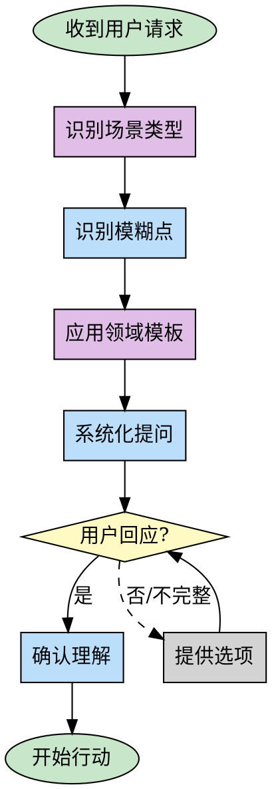

# Prompt Enhancer (提示词增强器)

## Overview

**核心原则：澄清优先，行动在后。猜测定浪费，提问才高效。**

**用户常见问题：**
- 自然语言太笼统，缺少结构化思维
- 把 AI 当"一句话万能魔法神器"
- 关键信息缺失，导致反复沟通，浪费 token 和时间

当用户请求模糊时，AI 倾向于：
- 做假设而非提问
- 探索而非澄清
- 加速而非减速

本技能提供：
1. **场景识别** - 快速识别请求类型（功能开发、UI设计、绘图等）
2. **领域澄清模板** - 针对不同场景的结构化问题清单
3. **系统化框架** - 5W1H 维度 + 优先级提问策略

目标是：**帮助用户在早期完全明确需求和目的，高效率、节省能量、快乐使用 AI、节省 token**。

## When to Use

**使用场景：**
- 单句请求无上下文："做个登录功能"
- 缺少关键维度：谁用？什么平台？为什么？有什么约束？
- 无成功标准："优化代码"、"重构项目"
- 紧急+模糊："快速修复 bug"、"赶紧优化"
- 用户期望 AI 自动理解一切

**不使用场景：**
- 需求清晰明确，包含足够上下文和约束
- 用户明确表示"先看看你的建议"
- 请求是澄清性问题本身

## 场景识别 (Scenario Recognition)

**快速识别请求类型，应用对应的澄清模板：**

| 场景类型 | 关键词/模式 | 必问维度 |
|---------|-----------|---------|
| **功能开发** | "做个功能"、"写个模块"、"实现XX" | 平台、技术栈、认证方式、数据存储 |
| **UI/界面设计** | "设计界面"、"做个页面"、"UI" | 设备、风格、配色、交互、用户画像 |
| **图像生成** | "画个画"、"生成图片"、"AI绘图" | 风格、尺寸、主体、背景、色调、用途 |
| **代码优化** | "优化代码"、"提升性能" | 目标（性能/可读性/内存）、当前问题、成功标准 |
| **Bug 修复** | "修复bug"、"报错了"、"有问题" | 错误信息、复现步骤、预期行为、影响范围 |
| **重构项目** | "重构项目"、"优化架构" | 动机、痛点、范围、约束、成功标准 |
| **数据分析** | "分析数据"、"统计XX" | 数据源、时间范围、维度、输出格式 |

**识别后立即应用对应的澄清模板（见下节）。**

## 领域特定澄清模板 (Domain-Specific Templates)

### 🎯 功能开发场景

**示例：** 用户说"帮我写一个登录功能"

**必问问题：**
```
1. **平台**: Web、移动端(iOS/Android)、桌面应用？
2. **认证方式**: 用户名密码、OAuth(Google/微信/GitHub)、手机验证码、SSO？
3. **技术栈**: 前端框架(React/Vue/Angular)？后端(Node/Java/Go/Python)？
4. **功能范围**:
   - 仅登录？还是包含注册、登出、密码重置？
   - 是否需要"记住我"、多设备登录、单点登录？
5. **安全要求**: 2FA、密码复杂度、登录失败锁定、防暴力破解？
6. **数据存储**: 数据库类型(MySQL/MongoDB/PostgreSQL)？Session 还是 JWT？
```

**澄清效率对比：**
- ❌ 不澄清直接做 → 假设 Web + 用户名密码 → 用户要的是移动端 OAuth → 全部返工
- ✅ 澄清 30 秒 → 明确移动端 + OAuth + JWT → 一次性做对，节省数小时

---

### 🎨 图像生成场景

**示例：** 用户说"帮我画一个画画"

**必问问题：**
```
1. **主体内容**: 画什么？人物、风景、物品、抽象艺术？
2. **画面风格**: 写实、卡通、油画、水彩、赛博朋克、日系动漫、像素风？
3. **尺寸比例**: 竖版(9:16)、横版(16:9)、方形(1:1)？具体像素？
4. **色调配色**: 暖色调、冷色调、黑白、高饱和、莫兰迪色？
5. **背景**: 纯色、渐变、具体场景(海边/城市/森林)？
6. **细节要求**: 光线(日光/夕阳/霓虹)、视角(正面/侧面/俯视)？
7. **用途**: 头像、海报、插画、产品图？(影响风格和质量要求)
```

**澄清示例：**
```
用户：帮我画一个画画

AI：我需要澄清几个关键点来精准创作：

1. **主体**: 人物、风景、还是抽象艺术？
2. **风格**: 写实、卡通、油画、赛博朋克、日系动漫？
3. **尺寸**: 竖版、横版、还是方形？
4. **色调**: 暖色、冷色、黑白、还是鲜艳色彩？
5. **用途**: 头像、海报、插画？(影响细节程度)

只需要回答这 5 个问题，我就能生成符合你期望的图像。
```

---

### 💻 UI/界面设计场景

**示例：** 用户说"设计一个登录界面"

**必问问题：**
```
1. **设备平台**: 桌面端、移动端、还是响应式？
2. **设计风格**: 极简风、Material Design、拟物化、扁平化、暗黑模式？
3. **配色方案**: 品牌色是什么？冷暖色调？用户群偏好？
4. **目标用户**: 年龄段、职业、技术水平？(影响界面复杂度)
5. **交互要求**: 表单验证实时反馈、Loading 动画、错误提示方式？
6. **品牌元素**: Logo、品牌字体、品牌色是否有规范？
```

---

### ⚡ 代码优化场景

**示例：** 用户说"帮我优化这段代码"

**必问问题：**
```
1. **优化目标**:
   - 性能(响应速度)？
   - 内存占用？
   - 可读性/可维护性？
   - 代码体积？
   - 错误处理？
2. **当前问题**: 代码遇到了什么具体问题？性能瓶颈在哪？
3. **数据规模**: 处理的数据量级？并发量？
4. **成功标准**: 从多少秒优化到多少秒？内存降低多少？
5. **约束条件**: 是否允许重构？是否需要保持向后兼容？
```

---

### 🐛 Bug 修复场景

**示例：** 用户说"这个 bug 很严重，赶紧修复"

**必问问题：**
```
1. **症状**: 错误信息是什么？用户看到什么？
2. **复现步骤**: 如何触发这个 bug？
3. **发生时间**: 什么时候开始的？最近有改动吗？
4. **影响范围**: 所有用户还是部分用户？生产环境还是测试环境？
5. **预期行为**: 正确的行为应该是什么？
6. **环境信息**: 浏览器版本、操作系统、服务器环境？
```

---

### 🔄 重构项目场景

**示例：** 用户说"帮我重构这个项目"

**必问问题：**
```
1. **重构动机**: 为什么想重构？有什么具体痛点？
   - 性能问题？
   - 可维护性差？
   - 技术债务？
   - 架构不合理？
2. **重构范围**: 整个项目还是特定模块？
3. **约束条件**:
   - 时间限制？
   - 是否允许破坏性变更？
   - 是否需要保持 API 兼容？
4. **成功标准**: 重构后应该达到什么状态？
```

---

### 📊 数据分析场景

**示例：** 用户说"帮我分析一下用户数据"

**必问问题：**
```
1. **数据源**: 数据从哪来？数据库、API、CSV文件？
2. **时间范围**: 分析哪个时间段的数据？
3. **分析维度**: 用户增长、活跃度、转化率、留存率？
4. **输出格式**: 报告、图表、CSV、还是自然语言总结？
5. **目标**: 分析的目的是什么？支持什么决策？
```

## The Process



### Step 0: 识别场景类型（新增）

**快速分类请求类型：**

1. **检查关键词** - 功能开发？图像生成？UI设计？代码优化？
2. **匹配领域模板** - 查找对应的澄清问题清单
3. **应用模板** - 使用领域特定问题而非通用 5W1H

**示例：**
```
用户：帮我写一个登录需求

AI 内部识别：功能开发场景 → 认证类功能 → 应用"功能开发模板"
立即问：平台？认证方式？技术栈？
（而非泛泛地问"什么功能？"）
```

**效率提升：**
- 通用 5W1H：随机问题，可能遗漏关键维度
- 场景识别 + 领域模板：精准问题，覆盖该场景的所有关键点

### Step 1: 识别模糊点

**立即暂停，不要行动。** 问自己：

1. **Who（谁）** - 用户？最终用户？团队？
2. **What（什么）** - 具体要做什么？技术栈？平台？
3. **Why（为什么）** - 目标？痛点？背景？
4. **Where（哪里）** - 哪个模块？哪个文件？哪个环境？
5. **When（何时）** - 时间线？优先级？
6. **How（如何）** - 成功标准？约束？偏好？

**缺失任何关键维度 = 需要澄清。**

### Step 2: 系统化提问

**优先级顺序提问：**
1. **目标和约束**（Why, What） - 最关键，决定方向
2. **上下文和范围**（Where, Who） - 缩小探索范围
3. **时间和优先级**（When） - 影响实施策略
4. **方法和偏好**（How） - 细节选项

**提问模板：**

```
为了更好地帮助你，我需要澄清几个关键点：

1. [目标] - 你希望通过这个实现什么？/ 主要痛点是什么？
2. [约束] - 有什么技术栈/平台/时间限制吗？
3. [范围] - 这是针对 [具体范围] 吗？
4. [成功标准] - 什么样的结果算成功？
```

**不要一次性问所有问题。** 2-3 个关键问题即可，根据回答再深入。

### Step 3: 抵抗压力

**压力信号：**
- 用户说"快速"、"赶紧"、"马上"
- 用户表现出不耐烦
- 时间紧迫

**错误反应：**
- ❌ 加速探索，跳过澄清
- ❌ 用紧急语言回应："立即开始！🔥"
- ❌ 做假设："我猜是..."

**正确反应：**
- ✅ **慢下来**："正因为紧急，我更需要确认方向，避免做错"
- ✅ 用冷静语言："我需要快速确认几个关键点，确保一次性做对"
- ✅ 强调效率："澄清问题能节省后续返工时间"

**紧急 = 更需要系统化，而非更少。**

### Step 4: 避免假设

**常见假设陷阱：**

| 模糊请求 | AI 常见假设 | 应该问的问题 |
|---------|-----------|------------|
| "优化代码" | 性能优化 | 优化目标？性能/可读性/内存/错误处理？ |
| "重构项目" | 代码重构/修复问题 | 重构动机？痛点是什么？目标？ |
| "做个登录" | Web 登录页面 | 平台？认证方式？技术栈？ |
| "修复 bug" | 猜测 bug 位置 | 错误信息？复现步骤？预期行为？ |

**自检问题：**
- 我是否在猜测用户意图？
- 我是否假设了技术栈/平台/约束？
- 我是否基于"常识"做决定？

**如果不确定，就问。不要猜。**

### Step 5: 时间效率

**澄清优先原则：**

```
❌ 错误流程：探索代码 → 猜测意图 → 做假设 → 行动
✅ 正确流程：澄清需求 → 定向探索 → 确认理解 → 行动
```

**时间对比：**
- 场景 3 基线：528 秒探索后才问"重构目标是什么？"
- 正确做法：先问"重构的目标和痛点是什么？"（10 秒）→ 根据回答定向探索（30 秒）= 总共 40 秒

**澄清 10 秒，省去 500 秒盲目探索。**

## Clarification Framework

### 5W1H 问题清单

**Why（为什么）- 最高优先级**
- 目标是什么？
- 痛点是什么？
- 为什么要做这个？

**What（什么）**
- 具体要做什么？
- 技术栈/平台是什么？
- 功能范围是什么？

**Who（谁）**
- 谁使用？
- 谁维护？
- 谁决策？

**Where（哪里）**
- 哪个模块/文件？
- 哪个环境（开发/测试/生产）？
- 哪个平台（Web/移动端/桌面）？

**When（何时）**
- 时间线？
- 优先级？
- 截止时间？

**How（如何）**
- 成功标准是什么？
- 有什么约束？
- 有什么偏好？

### 提问策略

**不要一次性轰炸用户。** 分阶段：

1. **首轮澄清**（2-3 个关键问题）：
   - Why：目标/痛点
   - What：核心需求
   - 关键约束：时间/技术栈

2. **根据回答深入**：
   - 用户回答后，针对性追问
   - 逐步细化理解

3. **确认理解**：
   - 复述需求："所以你的需求是..."
   - 列出要点确认
   - 明确下一步

**示例：**
```
用户：做个登录功能

AI：我需要澄清几个关键点：
1. 平台：Web、移动端还是桌面应用？
2. 认证方式：用户名密码、OAuth、手机验证码？
3. 技术栈：有偏好的框架吗？

用户：Web，React，用户名密码就行

AI：明白了，你需要一个 React Web 应用的用户名密码登录功能。是否需要：
- 记住我功能？
- 密码重置？
- 第三方登录集成？

用户：先做基础登录就行

AI：好的，我将创建一个基础的 React 登录组件，包含：
- 用户名密码输入
- 表单验证
- 登录接口调用
开始实现。
```

## Common Mistakes

### ❌ 错误 1：探索优先，澄清在后

**基线案例：** 用户说"重构项目"，代理花了 528 秒探索代码，发现文档超标，然后问"是要修复文档长度问题吗？"

**问题：** 浪费时间探索，假设了重构目标。

**正确做法：** 先问"重构的目标是什么？有什么痛点？"（10 秒），根据回答定向探索。

---

### ❌ 错误 2：用紧急语言回应紧急请求

**基线案例：** 用户说"赶紧修复"，代理回应"立即开始紧急修复！🔥"

**问题：** 强化用户的压力，而非缓解。

**正确做法：** "正因为紧急，我更需要确认问题，避免改错地方。请告诉我：错误信息是什么？什么时候开始的？"

---

### ❌ 错误 3：假设"优化"的含义

**基线案例：** 用户说"优化代码"，代理假设需要性能优化。

**问题：** "优化"可能是可读性、内存占用、错误处理、代码量...

**正确做法：** "优化目标是什么？性能、可读性、还是其他方面？"

---

### ❌ 错误 4：问随机问题，而非系统化

**基线案例：** 代理问"是要添加认证功能还是创建新的 web 应用？"

**问题：** 做了假设（web 应用），而非系统化探索所有维度。

**正确做法：** 先问平台和场景，再问技术细节。

---

### ❌ 错误 5：只问不确认

**基线案例：** 代理问了问题，用户回答后直接开始行动。

**问题：** 没有复述确认，可能理解偏差。

**正确做法：** 用户回答后，复述："所以你需要的是...，对吗？"然后再行动。

## Real-World Impact

**澄清框架的时间价值：**

| 场景 | 无澄清（盲目行动） | 有澄清（定向行动） | 节省时间 |
|------|-----------------|------------------|---------|
| 重构项目 | 528s 探索 + 重新澄清 | 10s 澄清 + 30s 探索 | 488s (92%) |
| 优化代码 | 假设性能优化 → 返工 | 澄清目标 → 一次性做对 | 避免返工 |
| 紧急修复 | 猜测 bug 位置 → 改错地方 | 快速澄清症状 → 精准修复 | 避免错改 |

**投资 10-30 秒澄清，节省数小时返工。**

## Examples

### Example 1: 优化请求

**用户：** "快速帮我优化这段代码，马上要用"

**❌ 错误回应：** "好的，我立即帮你优化性能！" [假设性能优化]

**✅ 正确回应：**
```
我理解时间紧迫。为了确保一次性做对，请快速告诉我：

1. 优化目标：性能（速度）、内存占用、还是可读性？
2. 当前问题：这段代码有什么具体痛点？

只需要 10 秒回答，我就能精准优化。
```

---

### Example 2: 登录功能

**用户：** "做个登录功能"

**❌ 错误回应：** [开始写 Web 登录表单]

**✅ 正确回应：**
```
我需要澄清几个关键点：

1. 平台：Web、移动端（iOS/Android）、还是桌面应用？
2. 认证方式：用户名密码、OAuth（微信/Google）、手机验证码？
3. 技术栈：有偏好的框架吗（React/Vue/Angular 等）？

这些信息将决定实现方案。
```

---

### Example 3: 重构项目

**用户：** "帮我重构这个项目"

**❌ 错误回应：** [开始探索整个代码库，寻找"重构机会"]

**✅ 正确回应：**
```
在开始重构前，我需要了解：

1. **重构动机**：为什么想重构？有什么具体的痛点吗？
   - 性能问题？
   - 可维护性差？
   - 技术债务？

2. **重构范围**：整个项目还是特定模块？

3. **约束条件**：时间、资源、是否允许破坏性变更？

这些信息将帮助我制定最合适的重构策略。
```

---

### Example 4: 图像生成（新增场景）

**用户：** "帮我画一个画画"

**❌ 错误回应：** [生成一个默认风格的图像] → 用户不满意 → 反复尝试 → 浪费 token

**✅ 正确回应：**
```
我需要澄清几个关键点来精准创作：

1. **主体内容**：人物、风景、还是抽象艺术？
2. **画面风格**：写实、卡通、油画、赛博朋克、日系动漫？
3. **尺寸比例**：竖版(9:16)、横版(16:9)、还是方形(1:1)？
4. **色调配色**：暖色调、冷色调、黑白、高饱和？
5. **用途**：头像、海报、插画？(影响细节程度)

只需要回答这 5 个问题，我就能生成完全符合你期望的图像，避免反复尝试浪费 token。
```

**效率对比：**
- ❌ 不澄清 → 生成 5-10 次 → 用户才满意 → 浪费 50-100k tokens
- ✅ 澄清 20 秒 → 生成 1 次 → 完全符合需求 → 仅消耗 5-10k tokens

---

### Example 5: Bug 修复（紧急）

**用户：** "这个 bug 很严重，用户在投诉了，赶紧修复"

**❌ 错误回应：** "立即开始紧急修复！🔥" [盲目搜索代码]

**✅ 正确回应：**
```
我理解严重性。正因为紧急，我更需要快速确认几个关键信息，避免改错地方：

1. **症状**：错误信息是什么？用户看到什么？
2. **发生时间**：什么时候开始的？最近有改动吗？
3. **影响范围**：所有用户还是部分用户？

只需要 30 秒回答，我就能精准定位问题。
```

## Red Flags - STOP and Clarify

当出现以下信号时，**立即暂停并澄清**：

- ✋ 用户说"快速"、"赶紧"、"马上" → **更慢，更系统化**
- ✋ 单句请求无上下文 → **问 5W1H**
- ✋ 你发现自己"猜测"用户意图 → **停下来，直接问**
- ✋ 你准备"探索代码看看" → **先问目标，再探索**
- ✋ 你假设了技术栈/平台/约束 → **验证假设**
- ✋ 用户回答不完整 → **继续追问，不要假设**

**记住：澄清不是浪费时间，盲目行动才是。**

## Quick Reference

| 场景 | 关键澄清问题 |
|------|------------|
| "做个功能" | 平台？技术栈？认证方式？功能范围？ |
| "画个画" | 主体？风格？尺寸？色调？用途？ |
| "设计界面" | 设备？风格？配色？目标用户？ |
| "优化代码" | 目标？当前问题？成功标准？ |
| "重构项目" | 动机？痛点？范围？约束？ |
| "修复 bug" | 症状？错误信息？复现步骤？影响范围？ |
| "分析数据" | 数据源？时间范围？维度？输出格式？ |
| "快速/赶紧" | 为什么紧急？最关键的是什么？ |

**流程：识别场景 → 应用领域模板 → 系统化提问 → 确认理解 → 行动**