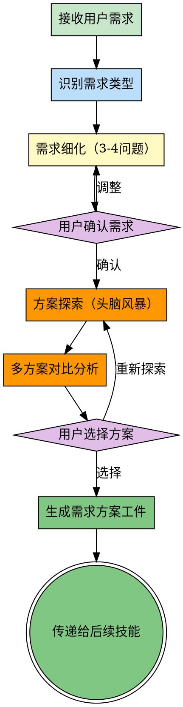

# Prompt Enhancer - 需求细化与方案探索

## 前置协议

### 强制触发规则

**触发时机**：goal-oriented 创建目标后（强制）

**触发条件**（满足任一即触发）：
- ✅ 用户需求模糊（单句请求、缺少上下文）
- ✅ 用户需求不完整（缺少关键维度）
- ✅ 用户需求有歧义（多种理解可能）
- ✅ 用户需求缺少成功标准
- ✅ 复杂任务（涉及多个模块/系统）

**例外情况**：
- 用户明确表示"按你的理解执行"
- 需求已经非常清晰明确
- 用户在调整已有目标

---

## Overview

prompt-enhancer 是强制前置技能，负责**需求细化**和**方案探索**。通过结构化提问，确保充分理解用户需求，探索多种可行方案，避免理解偏差和执行返工。

**核心能力**：
1. **需求细化**：澄清模糊点、发现隐藏需求、明确范围边界
2. **方案探索**：头脑风暴多种方案、分析优劣势、风险评估
3. **确认机制**：每个关键点问用户3-4个问题确认理解

**核心原则**：澄清优先，行动在后。猜测定浪费，提问才高效。

**关键价值**：
- 避免理解偏差，减少返工
- 充分论证方案，选择最优解
- 发现隐藏需求，避免遗漏
- 节省 token 和时间

---

## When to Use

**强制使用场景**：
- 用户需求模糊或不完整
- 复杂任务（涉及多个模块/系统）
- 需求有歧义或多种理解可能
- 缺少成功标准或约束条件

**不使用场景**：
- 用户明确表示"按你的理解执行"
- 需求已经非常清晰明确
- 用户在调整已有明确目标
- 简单的澄清性问题本身

---

## The Process



---

### 步骤1：识别需求类型

快速识别请求类型，应用对应的细化框架：

| 需求类型 | 关键词 | 必问维度 |
|---------|--------|---------|
| **功能开发** | "做个功能"、"实现XX" | 平台、技术栈、用户、数据、认证 |
| **架构设计** | "设计系统"、"重构架构" | 规模、性能、可扩展性、技术选型 |
| **性能优化** | "优化性能"、"提升速度" | 目标指标、优化范围、优先级 |
| **Bug修复** | "修复bug"、"解决错误" | 复现步骤、影响范围、优先级 |
| **UI/界面** | "设计界面"、"做个页面" | 设备、风格、用户、交互 |
| **数据分析** | "分析数据"、"生成报告" | 数据源、分析维度、输出格式 |

---

### 步骤2：需求细化（3-4问题确认）

**核心原则**：每个关键点问3-4个问题，确保充分理解

#### 示例：功能开发需求细化

**用户需求**："做一个用户认证功能"

**问题组1：用户与场景**
```
Q1: 谁会使用这个认证功能？（用户类型）
Q2: 在什么场景下使用？（使用场景）
Q3: 期望的用户体验是什么？（体验目标）
Q4: 有多少用户量级？（规模预估）
```

**问题组2：技术约束**
```
Q1: 需要支持哪些认证方式？（密码、OAuth、SSO？）
Q2: 部署在什么平台？（Web、移动端、小程序？）
Q3: 使用什么技术栈？（前端、后端框架？）
Q4: 有现成的用户系统吗？（是否需要集成）
```

**问题组3：功能范围**
```
Q1: 需要哪些核心功能？（注册、登录、找回密码？）
Q2: 是否需要权限管理？（角色、权限控制？）
Q3: 是否需要记住登录状态？（Token、Session？）
Q4: 是否需要多设备登录？（单点登录？）
```

**问题组4：成功标准**
```
Q1: 如何判断功能完成？（验收标准）
Q2: 有性能要求吗？（响应时间、并发量？）
Q3: 有安全要求吗？（加密、防护？）
Q4: 什么时候需要完成？（时间约束）
```

---

### 步骤3：用户确认需求

展示细化的需求摘要，用户确认或调整：

```markdown
## 📋 需求确认

### 核心需求
- 功能：用户认证系统
- 用户：普通用户（移动端）
- 认证方式：手机号+验证码、微信OAuth
- 核心功能：注册、登录、找回密码、记住登录

### 技术约束
- 平台：微信小程序
- 技术栈：小程序原生 + Node.js + MySQL
- 集成：需要对接现有用户系统

### 成功标准
- 功能完整：注册、登录、找回密码流程完整
- 性能：登录响应 < 2秒
- 安全：密码加密、Token 7天有效
- 时间：2周内完成

### 范围边界
- ✅ 包含：注册、登录、找回密码
- ✅ 包含：微信OAuth
- ❌ 不包含：权限管理、多角色
- ❌ 不包含：单点登录

---

**是否确认这个需求？**
- A) 确认，继续方案探索
- B) 需要调整（请说明）
```

---

### 步骤4：方案探索（头脑风暴）

**核心原则**：探索3-5种方案，充分论证

#### 方案探索模板

```markdown
## 🎨 方案探索

### 方案1：自定义认证系统
**实现方式**：
- 后端：Node.js + JWT
- 数据库：MySQL存储用户信息
- 认证：手机验证码（阿里云短信服务）

**优势**：
- ✅ 完全可控，灵活定制
- ✅ 无第三方依赖

**劣势**：
- ❌ 开发周期长（2周）
- ❌ 需要购买短信服务
- ❌ 需要自己维护安全性

**风险**：
- ⚠️ 短信服务可能被滥用
- ⚠️ 需要处理验证码过期、重发等问题

---

### 方案2：使用云开发（推荐）
**实现方式**：
- 微信云开发
- 云函数处理认证逻辑
- 云数据库存储用户信息

**优势**：
- ✅ 快速开发（1周）
- ✅ 微信原生集成
- ✅ 无需服务器维护

**劣势**：
- ❌ 依赖微信生态
- ❌ 扩展性受限

**风险**：
- ⚠️ 云开发限制（并发、存储）

---

### 方案3：第三方认证服务
**实现方式**：
- Authing、Firebase Auth
- SDK集成

**优势**：
- ✅ 最快上线（3天）
- ✅ 功能完整
- ✅ 安全性高

**劣势**：
- ❌ 有成本（按用户数收费）
- ❌ 数据不在自己手中

**风险**：
- ⚠️ 服务稳定性依赖第三方

---

### 方案对比

| 维度 | 方案1 自定义 | 方案2 云开发 | 方案3 第三方 |
|------|-------------|-------------|-------------|
| 开发周期 | 2周 | 1周 | 3天 |
| 灵活性 | ⭐⭐⭐⭐⭐ | ⭐⭐⭐ | ⭐⭐ |
| 成本 | 低 | 中 | 中-高 |
| 维护成本 | 高 | 低 | 低 |
| 安全性 | 需自己保证 | 中 | 高 |

---

### 推荐方案

**推荐方案2：云开发**

理由：
1. 时间紧迫（2周），云开发最快
2. 小程序原生支持，集成方便
3. 无需服务器维护，降低运维成本
4. 微信生态，用户体验最佳
```

---

### 步骤5：用户选择方案

用户确认方案，或重新探索：

```markdown
## ✅ 方案确认

**选定方案**：微信云开发

**实施步骤预览**：
1. 配置云开发环境
2. 实现手机验证码登录
3. 实现微信OAuth
4. 实现找回密码
5. 测试与优化

**是否确认此方案？**
- A) 确认，继续实施规划
- B) 选择其他方案
- C) 重新探索方案
```

---

### 步骤6：生成需求方案工件

创建工件文件，传递给后续技能：

```json
{
  "skill": "prompt-enhancer",
  "version": "2.0.0",
  "timestamp": "2026-03-25T10:00:00Z",
  "requirement": {
    "original": "做一个用户认证功能",
    "refined": {
      "type": "功能开发",
      "core_features": ["注册", "登录", "找回密码"],
      "target_users": "普通用户（移动端）",
      "auth_methods": ["手机号+验证码", "微信OAuth"],
      "platform": "微信小程序",
      "tech_stack": ["小程序原生", "Node.js", "MySQL"],
      "success_criteria": [
        "功能完整：注册、登录、找回密码流程完整",
        "性能：登录响应 < 2秒",
        "安全：密码加密、Token 7天有效"
      ],
      "timeline": "2周"
    }
  },
  "solution": {
    "selected": "方案2：微信云开发",
    "reasons": [
      "时间紧迫（2周），云开发最快",
      "小程序原生支持，集成方便",
      "无需服务器维护，降低运维成本"
    ],
    "alternatives": [
      {
        "name": "方案1：自定义认证系统",
        "pros": ["完全可控", "无第三方依赖"],
        "cons": ["开发周期长", "需要自己维护安全性"]
      },
      {
        "name": "方案3：第三方认证服务",
        "pros": ["最快上线", "功能完整"],
        "cons": ["有成本", "数据不在自己手中"]
      }
    ]
  },
  "next_skills": [
    "planning"
  ]
}
```

---

## 需求细化问题模板库

### 功能开发类

**用户场景**（3-4问题）：
- 谁会使用？用户类型、量级
- 在什么场景使用？使用频率
- 期望的体验？用户旅程
- 有什么痛点？解决问题

**技术约束**（3-4问题）：
- 部署平台？Web/移动端/小程序
- 技术栈？前后端框架
- 数据存储？数据库类型
- 第三方集成？现有系统

**功能范围**（3-4问题）：
- 核心功能？必须有哪些
- 扩展功能？可以有哪些
- 不包含？明确边界
- 优先级？MVP vs 完整版

**成功标准**（3-4问题）：
- 验收标准？如何判断完成
- 性能要求？响应时间、并发量
- 安全要求？加密、权限
- 时间约束？什么时候完成

---

### 架构设计类

**系统规模**（3-4问题）：
- 用户量级？当前、未来
- 数据量级？存储、增长速度
- 并发要求？峰值、平均
- 可扩展性？未来规划

**技术选型**（3-4问题）：
- 架构风格？微服务/单体/Serverless
- 技术偏好？团队熟悉的技术
- 第三方依赖？是否需要引入
- 技术债务？现有系统限制

**非功能需求**（3-4问题）：
- 性能指标？响应时间、吞吐量
- 可用性？SLA要求
- 安全性？合规要求
- 可维护性？文档、监控

---

### 性能优化类

**优化目标**（3-4问题）：
- 具体指标？加载时间、响应速度
- 目标值？从多少提升到多少
- 优先级？哪些最重要
- 用户体验？核心场景

**优化范围**（3-4问题）：
- 哪些模块？前端/后端/数据库
- 瓶颈在哪？已知问题
- 监控数据？现状分析
- 约束条件？不能改动的部分

**权衡取舍**（3-4问题）：
- 成本预算？资源限制
- 时间限制？多久完成
- 风险容忍？稳定性要求
- 可逆性？是否可以回退

---

## Examples

### 案例1：模糊需求细化

**用户需求**："优化性能"

**细化过程**：

**问题组1：优化目标**
```
Q1: 哪方面需要优化？
A: 首页加载速度太慢

Q2: 当前状态如何？
A: 现在加载要5秒，太慢了

Q3: 期望达到什么效果？
A: 希望能到2秒以内

Q4: 用户量多大？
A: 日活1万左右
```

**问题组2：优化范围**
```
Q1: 首页包含哪些内容？
A: 轮播图、推荐列表、广告位

Q2: 哪些部分最慢？
A: 轮播图加载特别慢

Q3: 图片多大？
A: 每张2-3MB

Q4: 有CDN吗？
A: 没有，都从服务器加载
```

**细化结果**：
```markdown
需求：优化首页加载速度
当前：5秒
目标：< 2秒
瓶颈：轮播图过大（2-3MB/张）
方案：图片压缩 + CDN加速
```

---

### 案例2：方案探索对比

**用户需求**："实现搜索功能"

**方案探索**：

**方案1：数据库 LIKE 查询**
- 优势：简单快速
- 劣势：性能差、不支持复杂搜索
- 适用：小数据量（< 1万条）

**方案2：Elasticsearch**
- 优势：强大、快速、支持复杂搜索
- 劣势：需要部署、学习成本
- 适用：大数据量（> 10万条）

**方案3：Algolia**
- 优势：托管服务、快速集成
- 劣势：有成本、数据需上传
- 适用：快速上线、中小数据量

**推荐**：根据数据量选择
- < 1万条：方案1
- 1-10万条：方案3
- > 10万条：方案2

---

## Common Pitfalls

### 误区1：跳过需求细化直接执行

**表现**：用户说"做个登录"，直接实现
**正确做法**：先问3-4个问题确认需求

---

### 误区2：只问一个问题就行动

**表现**：问"什么平台？"就结束
**正确做法**：每个关键点问3-4个问题

---

### 误区3：假设用户需求

**表现**："我觉得用户想要..."
**正确做法**：向用户确认，不要假设

---

### 误区4：只探索一个方案

**表现**：想到一个方案就用
**正确做法**：至少探索3个方案对比

---

### 误区5：不生成工件直接传递

**表现**：细化后不记录
**正确做法**：生成工件文件，传递给后续技能

---

## References

- 《需求工程》- Karl Wiegers
- 《用户故事地图》- Jeff Patton
- 《设计思维》- IDEO
- "5 Whys" - Root Cause Analysis
- "Six Thinking Hats" - Edward de Bono