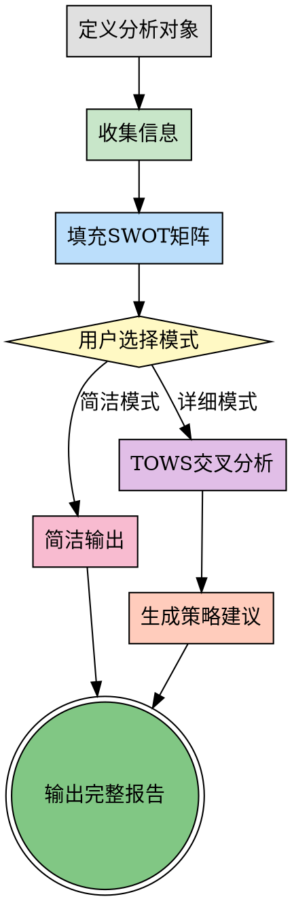

## 前置协议

### 环境检测

```bash
PROJECT_ROOT=$(git rev-parse --show-toplevel 2>/dev/null || echo "unknown")
BRANCH=$(git branch --show-current 2>/dev/null || echo "unknown")
COMMIT=$(git rev-parse --short HEAD 2>/dev/null || echo "unknown")

echo "PROJECT: $PROJECT_ROOT"
echo "BRANCH: $BRANCH"
echo "COMMIT: $COMMIT"
```

### 前置技能检查

```bash
# 检查前置工件
GOAL_ARTIFACT="memory/artifacts/goal-oriented/latest.json"
FP_ARTIFACT="memory/artifacts/first-principles/latest.json"

if [ -f "$GOAL_ARTIFACT" ]; then
  echo "FOUND: goal-oriented artifact"
fi

if [ -f "$FP_ARTIFACT" ]; then
  echo "FOUND: first-principles artifact"
fi

mkdir -p memory/artifacts/swot-analysis
```

## Overview

SWOT分析是一种战略规划工具，通过系统性地分析对象的**内部优势**和**劣势**，外部**机会**和**威胁**，帮助做出更明智的决策。

**核心价值**：
- 提供全景式现状评估，避免片面判断
- 内外因素结合，平衡客观与主观
- 从分析到策略，直接产出可执行方案
- 适用广泛，从产品规划到技术选型均可使用

**两阶段模式**：
1. **分析阶段**：识别并填充S、W、O、T四个维度
2. **策略阶段**：通过TOWS矩阵交叉分析，生成SO/WO/ST/WT四类策略

**关键区别**：
- 简单列表式SWOT：只列出四个象限，无后续行动
- 战略式SWOT：分析→策略→行动，形成闭环

## When to Use

**适用场景**：
- 项目立项或新功能规划（评估可行性和风险）
- 技术选型和架构决策（对比多个方案）
- 竞品分析和市场进入策略
- 问题诊断和瓶颈突破
- 资源分配和优先级排序
- 战略规划和业务决策
- 用户明确要求"SWOT分析"或"优劣势分析"

**不适用场景**：
- 简单明确的小决策（杀鸡用牛刀）
- 纯技术问题调试（需要debugging skill）
- 已有明确最优方案的选择
- 数据驱动的A/B测试（SWOT是定性分析）

### 快速判断是否使用SWOT

```
是否需要决策？
├─ 否 → 不需要SWOT
└─ 是
   └─ 问题是否复杂多因素？
      ├─ 否 → 简单决策框架即可
      └─ 是
         └─ 是否涉及内外部因素？
            ├─ 仅内部 → 考虑根因分析/5Whys
            ├─ 仅外部 → 考虑PESTEL/波特五力
            └─ 内外都有 → ✅ 适合SWOT
```

## The Process



### 阶段一：分析现状

**Step 1：定义分析对象**
- 明确分析目标（产品、项目、技术方案、竞品等）
- 确定分析范围和边界
- 明确分析目的和决策背景

**Step 2：收集信息**
- 内部信息：团队、资源、技术栈、流程等
- 外部信息：市场、竞争、趋势、政策等
- 数据来源：文档、访谈、用户反馈、行业报告

**Step 3：填充SWOT矩阵**
- **Strengths（优势）**：内部有利因素（如技术领先、团队强、资源充足）
- **Weaknesses（劣势）**：内部不利因素（如经验不足、资源受限、技术债）
- **Opportunities（机会）**：外部有利因素（如市场需求增长、政策支持）
- **Threats（威胁）**：外部不利因素（如竞争加剧、技术变革、政策限制）

**质量标准**：
- 每个维度3-7个要点
- 具体而非笼统（"技术栈现代化"而非"技术好"）
- 可验证而非主观臆断

**质量检查清单**：
- [ ] 每个维度3-7个要点
- [ ] S/W都是内部因素（团队、资源、能力、流程）
- [ ] O/T都是外部因素（市场、竞争、政策、技术趋势）
- [ ] 要点具体可验证（有数据支撑或明确标准）
- [ ] 避免重复（同一因素不出现两次）
- [ ] 考虑时间维度（短期/长期因素）

### 阶段二：生成策略（详细模式）

**Step 4：TOWS矩阵交叉分析**

将内部因素与外部因素交叉匹配，生成四类策略：

**SO策略（增长型）** - 优势+机会
- 利用内部优势抓住外部机会
- 示例：技术领先（S）+ 市场需求增长（O）→ 快速扩张市场份额

**WO策略（扭转型）** - 劣势+机会
- 利用外部机会弥补内部劣势
- 示例：市场需求增长（O）+ 资源受限（W）→ 寻求外部合作或融资

**ST策略（多元化型）** - 优势+威胁
- 利用内部优势抵御或规避外部威胁，寻求多元化发展
- 示例：技术领先（S）+ 竞争加剧（T）→ 构建技术壁垒或拓展新市场

**WT策略（防御型）** - 劣势+威胁
- 减少劣势、规避威胁，核心是生存和防守
- 示例：资源受限（W）+ 竞争加剧（T）→ 聚焦细分市场避免正面竞争

**Step 5：生成策略建议**
- 优先级排序（基于影响力和可行性）
- 具体行动计划（what, who, when）
- 资源需求和风险评估
- 关键成功指标

**输出格式**：
```markdown
## SWOT分析报告

### 基本信息
- **分析对象**：[目标]
- **分析时间**：[日期]
- **分析目的**：[决策背景]

### SWOT矩阵

| 维度 | 内部因素 | 外部因素 |
|------|---------|---------|
| **有利** | **Strengths 优势**<br>• 要点1<br>• 要点2 | **Opportunities 机会**<br>• 要点1<br>• 要点2 |
| **不利** | **Weaknesses 劣势**<br>• 要点1<br>• 要点2 | **Threats 威胁**<br>• 要点1<br>• 要点2 |

### 策略建议（详细模式）

#### SO策略（增长型）
1. **[策略名称]**
   - 组合因素：[S? + O?]
   - 行动计划：[具体步骤]
   - 优先级：[高/中/低]
   - 资源需求：[人力/预算/时间]
   - 关键指标：[如何衡量成功]

[WO/ST/WT策略同上]

### 决策建议
**优先执行**：[哪类策略]
**关键风险**：[主要风险]
**下一步行动**：[立即要做的事]
```

## 与其他工具结合使用

### 与其他分析工具组合

**SWOT + 波特五力** - 竞争战略分析
- 用波特五力深入分析"Threats"中的竞争格局
- 适用：市场进入、竞品分析
- 流程：先用波特五力分析行业竞争态势，再整合到SWOT的T维度

**SWOT + PEST/PESTEL** - 宏观环境分析
- 用PESTEL系统识别"Opportunities"和"Threats"
- 适用：战略规划、长期决策
- 流程：PESTEL分析宏观环境 → 提取关键因素填充O和T象限

**SWOT + VRIO** - 资源能力评估
- 用VRIO深入分析"Strengths"中的核心竞争力
- 适用：资源盘点、竞争优势分析
- 流程：VRIO筛选有价值的资源 → 填充S象限

**TOWS矩阵** - SWOT的战略延伸
- 内置于详细模式中，从分析到策略的桥梁
- 四象限策略输出，确保分析的实用性

### 与其他方法论skills组合

**SWOT + first-principles** - 深度诊断
- 用第一性原理质疑SWOT中的假设和表象
- 适用：复杂问题诊断、突破性方案设计
- 场景：SWOT列出"技术落后"（W），用第一性原理追问"落后的本质是什么？是否真的落后？"

**SWOT + goal-oriented** - 战略执行
- SWOT提供现状评估，goal-oriented确保策略执行不偏离目标
- 适用：战略规划后的落地执行
- 场景：SWOT产出SO策略后，用goal-oriented拆解里程碑和关键路径

**SWOT + PDCA** - 持续优化
- PDCA循环验证和优化SWOT策略
- 适用：策略执行和迭代
- 场景：执行SWOT策略后，用PDCA Check效果，Act调整下一轮SWOT

### 工具组合推荐顺序

**战略规划场景**：
1. PESTEL（宏观环境）→ 2. 波特五力（行业竞争）→ 3. SWOT（综合分析）→ 4. VRIO（资源验证）

**产品决策场景**：
1. SWOT（快速评估）→ 2. TOWS（策略生成）→ 3. goal-oriented（落地执行）

**技术选型场景**：
1. SWOT（方案对比）→ 2. first-principles（深度质疑）→ 3. PDCA（验证迭代）

## Examples

### 案例1：新产品上线决策（商业场景）

**分析对象**：AI客服产品上线计划

**背景**：公司研发了AI客服产品，需评估是否大规模推广

#### SWOT矩阵

| 维度 | 关键因素 |
|------|---------|
| **Strengths** | • NLP技术领先，准确率95%<br>• 研发团队经验丰富<br>• 已有种子用户验证 |
| **Weaknesses** | • 品牌知名度低<br>• 销售团队规模小<br>• 客服场景覆盖有限 |
| **Opportunities** | • 企业数字化转型需求激增<br>• 竞品价格高昂<br>• 政策支持AI应用 |
| **Threats** | • 大厂快速跟进<br>• 客户数据安全顾虑<br>• 经济下行企业削减预算 |

#### 策略建议（详细模式）

**SO策略（增长型）**
1. **技术优势+市场需求** → 快速拓展中小企业市场，主打性价比
2. **种子用户+政策支持** → 申请政府项目，获取背书和资源

**WO策略（扭转型）**
1. **品牌弱+市场机会** → 与行业头部企业合作，借势建立品牌
2. **销售弱+需求激增** → 发展代理商渠道，快速覆盖市场

**ST策略（多元化型）**
1. **技术领先+大厂跟进** → 构建专利壁垒，保持技术代差
2. **场景有限+安全顾虑** → 聚焦客服场景，建立数据安全认证

**WT策略（防御型）**
1. **销售弱+经济下行** → 提供免费试用，降低客户决策门槛
2. **品牌弱+大厂竞争** → 避免正面竞争，深耕垂直细分领域

**推荐策略**：优先执行SO策略，快速抢占中小企业市场，同时布局ST策略构建护城河。

**预期效果**：
- 市场份额：目标6个月内中小企业市场占有率达15%
- 收入增长：预计Q3营收增长30%
- 品牌认知：行业知名度提升至前5

---

### 案例2：技术选型决策（技术场景）

**分析对象**：选择Web框架（React vs Vue vs Svelte）

**背景**：新项目启动，需选择前端框架

#### SWOT矩阵（以Svelte为例）

| 维度 | 关键因素 |
|------|---------|
| **Strengths** | • 编译时优化，运行时性能最佳<br>• 学习曲线平缓，代码量少<br>• Bundle体积小 |
| **Weaknesses** | • 生态较小，第三方库少<br>• 社区规模小，问题解决慢<br>• 大型项目案例少 |
| **Opportunities** | • 项目性能要求高<br>• 团队愿意学习新技术<br>• 项目规模中等，生态够用 |
| **Threats** | • 后续维护人员招聘难<br>• 技术栈小众影响团队扩张<br>• 框架演进方向不确定 |

#### 策略建议

**SO策略**：利用性能优势+团队意愿 → 采用Svelte，快速交付高性能产品

**WT策略**：生态小+招聘难 → 在关键模块预留React迁移接口，降低长期风险

**决策建议**：短期采用Svelte享受性能红利，中期培养团队Svelte能力，长期关注生态发展决定是否持续投入。

**风险预案**：
- 如果Svelte生态1年内未显著改善 → 启动React迁移计划
- 如果Svelte团队扩张困难 → 考虑混合栈方案（核心模块React + 新功能Svelte）

## Common Pitfalls

### Pitfall 1：因素过于笼统

**错误示例**：
```
Strengths：技术好、团队强
Weaknesses：资源少、时间紧
```

**问题**：缺乏具体信息，无法指导决策。"技术好"好在哪里？"资源少"少多少？

**正确做法**：
```
Strengths：
• 技术栈现代化（React 18 + TypeScript），代码可维护性高
• 团队有3名资深工程师，平均5年前端经验

Weaknesses：
• 预算限制50万，无法招聘额外开发人员
• 项目周期仅2个月，时间紧张
```

**原则**：具体、可验证、可量化。

---

### Pitfall 2：内外因素混淆

**错误示例**：
```
Strengths：市场需求增长快
Opportunities：团队执行力强
```

**问题**：市场需求是外部机会（O），团队执行力是内部优势（S），位置颠倒。

**正确做法**：
```
Strengths（内部）：团队执行力强、技术领先
Weaknesses（内部）：资源受限、经验不足
Opportunities（外部）：市场需求增长、政策支持
Threats（外部）：竞争加剧、技术变革
```

**原则**：S/W是内部可控因素，O/T是外部环境因素。

---

### Pitfall 3：只分析无策略

**错误示例**：
```
分析完成，SWOT矩阵如下：
S：...
W：...
O：...
T：...
[结束]
```

**问题**：停留在现状描述，未转化为可执行策略，SWOT分析的价值未发挥。

**正确做法**：
```
[SWOT矩阵]

基于SWOT分析，制定以下策略：
SO策略：...
WO策略：...
ST策略：...
WT策略：...

优先级排序：...
行动计划：...
```

**原则**：SWOT是手段，策略和行动才是目的。默认提供简洁输出，但必须支持详细模式生成策略。

---

### Pitfall 4：静态分析忽视动态

**错误示例**：
```
Threats：竞争对手A推出新产品
[不考虑时间维度和变化趋势]
```

**问题**：SWOT是快照，但市场是动态的。忽视因素的变化趋势会导致策略失效。

**正确做法**：
```
Threats：
• 竞争对手A推出新产品（短期威胁，3-6个月）
• 技术栈老化风险（长期威胁，1-2年）

策略建议：
短期：快速迭代保持竞争力
长期：规划技术升级路线
```

**原则**：标注时间维度，区分短期和长期因素，动态调整策略。

## References

**经典著作**：
- **Learning to Learn** by Laurence J. Peter - SWOT分析的理论基础
- **Strategic Management：A Stakeholder Approach** by R. Edward Freeman - 战略分析框架
- **The TOWS Matrix：A Tool for Situational Analysis** by Heinz Weihrich - TOWS策略矩阵的原始论文

**实践指南**：
- **SWOT Analysis：A Guide to Using the Tool** - Mind Tools实践指南
- **The Essential Guide to SWOT Analysis** by Justin G. Long - 从分析到策略的完整流程

**组合工具**：
- **Porter's Five Forces** - 迈克尔·波特的竞争分析框架
- **PESTEL Analysis** - 宏观环境分析工具
- **VRIO Framework** - 资源基础观的战略分析工具
- **TOWS Matrix** - SWOT的战略延伸，由Heinz Weihrich提出

**在线资源**：
- Mind Tools SWOT Analysis：https://www.mindtools.com/pages/article/newTMC_05.htm

**中文资源**：
- MBA智库：SWOT分析模型
- 知乎：SWOT分析实战案例集
## 后置协议

### 工件输出

保存 SWOT 分析结果到工件文件：

```bash
TIMESTAMP=$(date +%Y%m%d-%H%M%S)
ARTIFACT_FILE="memory/artifacts/swot-analysis/result-$TIMESTAMP.json"

cat > "$ARTIFACT_FILE" <<EOFJSON
{
  "skill": "swot-analysis",
  "version": "2.0.0",
  "timestamp": "$(date -u +%Y-%m-%dT%H:%M:%SZ)",
  "project": "$PROJECT_ROOT",
  "branch": "$BRANCH",
  "commit": "$COMMIT",
  "input": {
    "user_request": "用户的原始请求"
  },
  "output": {
    "strengths": [],
    "weaknesses": [],
    "opportunities": [],
    "threats": [],
    "strategies": [
      {
        "type": "SO",
        "action": ""
      },
      {
        "type": "WO",
        "action": ""
      },
      {
        "type": "ST",
        "action": ""
      },
      {
        "type": "WT",
        "action": ""
      }
    ]
  },
  "next_skills": [
    "mvp-first",
    "pdca-cycle"
  ]
}
EOFJSON

echo "ARTIFACT SAVED: $ARTIFACT_FILE"
ln -sf "$ARTIFACT_FILE" memory/artifacts/swot-analysis/latest.json
```

### 目标文件更新

如果存在目标文件，记录 SWOT 分析完成。

### 建议后续技能

```markdown
## 后续建议

基于 SWOT 分析结果，建议继续执行：

**推荐技能链**：
1. /mvp-first - 进行 MVP 功能筛选
2. /pdca-cycle - 进入 PDCA 循环实施阶段

是否继续执行？
- A) 执行推荐的技能链
- B) 只执行第一个技能
- C) 不继续，结束当前任务
```
